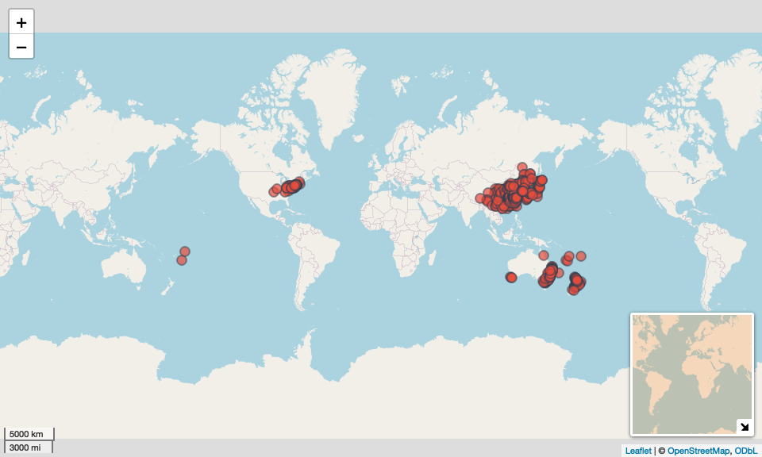

# Get H. longicornis occurrence data
Alexander W. Gofton
11 February 2026

- [Phase 1: Foundation & Data
  Collection](#phase-1-foundation--data-collection)
  - [Step 1: Gather Occurrence Data](#step-1-gather-occurrence-data)
- [Getting and wrangling occurence
  data](#getting-and-wrangling-occurence-data)
- [Spatial filtering](#spatial-filtering)
- [Session Information](#session-information)

## Phase 1: Foundation & Data Collection

### Step 1: Gather Occurrence Data

**Goal:** Get a dataset of where H. longicornis has been found in
Australia **Why:** SDMs need real locations where the species exists.
Think of it like teaching a computer “this tick lives in places that
look like this” **What you’ll do:** Download occurrence records from
GBIF (Global Biodiversity Information Facility), filter for Australia
only, clean up duplicates and dodgy coordinates

``` r
library(tidyverse)
```

## Getting and wrangling occurence data

``` r
data_dir <- "~/Library/CloudStorage/OneDrive-CSIRO/OneDrive - Docs/01_Projects/Hlongicornis_SDM/data/"

ala_records <- read.csv(paste0(data_dir, "ALA_occurence/records-2026-02-04.csv")) %>%
    select(dataResourceName, basisOfRecord, recordedBy, occurrenceStatus,
            year, month, day, stateProvince, locality, decimalLatitude,
            decimalLongitude, geodeticDatum, catalogNumber) %>%
    filter(
        dataResourceName != "Western Australian Museum provider for OZCAM"
        )

# Sort by data completeness before removing duplicates
ala_records <- ala_records %>%
  arrange(!is.na(year), !is.na(month), !is.na(day), desc(year)) %>%
  distinct(decimalLatitude, decimalLongitude, .keep_all = TRUE)

ala_records <- ala_records%>%
    select(
        ID = catalogNumber,
        year,
        month,
        day,
        lat = decimalLatitude,
        lon = decimalLongitude
    ) %>%
    mutate(ID = as.character(ID)) %>%
    filter(ID != "J9160")

glimpse(ala_records)
```

    Rows: 41
    Columns: 6
    $ ID    <chr> "ASCT00046212", "ASCT00046218", "ASCT00046204", "ASCT00046215", …
    $ year  <int> NA, NA, NA, NA, NA, NA, NA, NA, NA, NA, NA, NA, 2019, 1980, 1949…
    $ month <int> NA, NA, NA, NA, NA, NA, NA, NA, NA, NA, NA, NA, 9, 2, 12, 11, 12…
    $ day   <int> NA, NA, NA, NA, NA, NA, NA, NA, NA, NA, NA, NA, NA, NA, NA, NA, …
    $ lat   <dbl> -31.08333, NA, -30.71667, -34.66667, -32.00000, -34.55670, -29.2…
    $ lon   <dbl> 152.8333, NA, 152.9167, 150.8500, 149.9833, 150.3715, 152.6043, …

``` r
gbif_records <- read.csv(paste0(data_dir, "gbif_data_0012653-260129131611470.csv"), sep = "\t") %>%
    select(gbifID, year, month, day, decimalLatitude, decimalLongitude)

# Sort by data completeness before removing duplicates
gbif_records <- gbif_records %>%
  arrange(!is.na(year), !is.na(month), !is.na(day), desc(year)) %>%
  distinct(decimalLatitude, decimalLongitude, .keep_all = TRUE)

gbif_records <- gbif_records %>%
    select(
        ID = gbifID,
        year,
        month,
        day,
        lat = decimalLatitude,
        lon = decimalLongitude
    ) %>%
    mutate(ID = as.character(ID)) %>%
    filter(
        ID != "2249229809",
        ID != "5196344805",
        ID != "1632554489"
        )

glimpse(gbif_records)
```

    Rows: 209
    Columns: 6
    $ ID    <chr> "732531018", "5276672913", "4893164036", "4893143728", "48931067…
    $ year  <int> NA, NA, NA, NA, NA, NA, NA, NA, NA, NA, NA, NA, NA, NA, NA, NA, …
    $ month <int> NA, NA, NA, NA, NA, NA, NA, NA, NA, NA, NA, NA, NA, NA, NA, NA, …
    $ day   <int> NA, NA, NA, NA, NA, NA, NA, NA, NA, NA, NA, NA, NA, NA, NA, NA, …
    $ lat   <dbl> NA, -31.54917, -29.22047, -31.08333, -30.71667, -34.66667, -34.5…
    $ lon   <dbl> NA, 159.07445, 152.60428, 152.83330, 152.91670, 150.85000, 150.3…

``` r
rochlin_records <- read.csv(paste0(data_dir, "Rochlin_et_al_2018_tjy210_suppl_supplemental_table-s2.csv")) %>%
  rename(
    lat = latitude,
    lon = longitude
  ) %>%
  mutate(ID = as.character(ID))

glimpse(rochlin_records)
```

    Rows: 260
    Columns: 3
    $ ID  <chr> "1", "2", "3", "4", "5", "6", "7", "8", "9", "10", "11", "12", "13…
    $ lon <dbl> -175.1757, -172.4694, 102.8542, 103.1426, 103.3029, 103.7113, 105.…
    $ lat <dbl> -21.21056, -13.62571, 24.88480, 24.93732, 35.96514, 27.34232, 35.5…

``` r
zhang_records <- read.csv(paste0(data_dir, "Zhang_et_al_2019_ms_dataset_v1.csv")) %>%
  filter(tick_sp == "Haemaphysalis longicornis") %>%
  select(ID, lon, lat) %>%
  mutate(ID = as.character(ID))

glimpse(zhang_records)
```

    Rows: 461
    Columns: 3
    $ ID  <chr> "2391", "2392", "2393", "2394", "2395", "2396", "2397", "2398", "2…
    $ lon <dbl> 116.3038, 118.0031, 118.0031, 118.0031, 117.5264, 118.4097, 117.52…
    $ lat <dbl> 30.45662, 32.34421, 32.34421, 32.34421, 32.87731, 29.86249, 32.877…

``` r
# Combine datasets and remove coordinate duplicates
final_records <- bind_rows(ala_records, gbif_records, zhang_records, rochlin_records) %>%
    filter(!is.na(lat), !is.na(lon)) %>%
  arrange(!is.na(year), !is.na(month), !is.na(day), desc(year)) %>%
  distinct(lat, lon, .keep_all = TRUE)

# Check the results
cat("ALA records:", nrow(ala_records), "\n")
```

    ALA records: 41 

``` r
cat("GBIF records:", nrow(gbif_records), "\n")
```

    GBIF records: 209 

``` r
cat("Rochlin records:", nrow(rochlin_records), "\n")
```

    Rochlin records: 260 

``` r
cat("Zhang records:", nrow(zhang_records), "\n")
```

    Zhang records: 461 

``` r
cat("Combined total:", nrow(bind_rows(ala_records, gbif_records)), "\n")
```

    Combined total: 250 

``` r
cat("After removing coordinate duplicates:", nrow(final_records), "\n")
```

    After removing coordinate duplicates: 747 

``` r
cat("Duplicates removed:", nrow(bind_rows(ala_records, gbif_records)) - nrow(final_records), "\n")
```

    Duplicates removed: -497 

``` r
library(leaflet)

leaflet(final_records) %>%
  addTiles() %>%
  addCircleMarkers(
    lng = ~lon,
    lat = ~lat,
    radius = 6,
    color = "#2C3E50",
    fillColor = "#E74C3C",
    fillOpacity = 0.7,
    weight = 2,
    popup = ~paste(
      "<strong>ID:</strong>", ID, "<br>",
      "<strong>Date:</strong>", paste(day, month, year, sep = "/"), "<br>",
      "<strong>Coordinates:</strong>", round(lat, 4), ",", round(lon, 4), "<br>"
    )
  ) %>%
  addScaleBar(position = "bottomleft") %>%
  addMiniMap(toggleDisplay = TRUE, position = "bottomright")
```


## Spatial filtering

Thins the data points to avoid biases of over-samples regions

``` r
library(spThin)

# Thin your occurrence data to 10km minimum distance
# Add a species column
final_records_with_species <- final_records %>%
  mutate(species = "H_longicornis")

# Thin the data
thinned_records <- thin(
  loc.data = final_records_with_species,
  lat.col = "lat",
  long.col = "lon",
  spec.col = "species",
  thin.par = 10,
  reps = 10,
  write.files = TRUE,
  out.dir = "~/Library/CloudStorage/OneDrive-CSIRO/OneDrive - Docs/01_Projects/Hlongicornis_SDM/processed_data/",
  write.log.file = FALSE
)
```

    ********************************************** 
     Beginning Spatial Thinning.
     Script Started at: Wed Feb 11 10:05:04 2026
    lat.long.thin.count
    614 
     10 
    [1] "Maximum number of records after thinning: 614"
    [1] "Number of data.frames with max records: 10"
    [1] "Writing new *.csv files"

    [1] "Writing file: ~/Library/CloudStorage/OneDrive-CSIRO/OneDrive - Docs/01_Projects/Hlongicornis_SDM/processed_data/thinned_data_thin1_new_new_new.csv"

    [1] "Writing file: ~/Library/CloudStorage/OneDrive-CSIRO/OneDrive - Docs/01_Projects/Hlongicornis_SDM/processed_data/thinned_data_thin2_new_new_new.csv"

    [1] "Writing file: ~/Library/CloudStorage/OneDrive-CSIRO/OneDrive - Docs/01_Projects/Hlongicornis_SDM/processed_data/thinned_data_thin3_new_new_new.csv"

    [1] "Writing file: ~/Library/CloudStorage/OneDrive-CSIRO/OneDrive - Docs/01_Projects/Hlongicornis_SDM/processed_data/thinned_data_thin4_new_new_new.csv"

    [1] "Writing file: ~/Library/CloudStorage/OneDrive-CSIRO/OneDrive - Docs/01_Projects/Hlongicornis_SDM/processed_data/thinned_data_thin5_new_new_new.csv"

``` r
thinned <- read.csv("~/Library/CloudStorage/OneDrive-CSIRO/OneDrive - Docs/01_Projects/Hlongicornis_SDM/processed_data/thinned_data_thin1.csv")

leaflet(thinned) %>%
  addTiles() %>%
  addCircleMarkers(
    lng = ~lon,
    lat = ~lat,
    radius = 6,
    color = "#2C3E50",
    fillColor = "#E74C3C",
    fillOpacity = 0.7,
    weight = 2,
    popup = ~paste(
      "<strong>ID:</strong>", species, "<br>",
      "<strong>Coordinates:</strong>", round(lat, 4), ",", round(lon, 4), "<br>"
    )
  ) %>%
  addScaleBar(position = "bottomleft") %>%
  addMiniMap(toggleDisplay = TRUE, position = "bottomright")
```



# Session Information

``` r
sessionInfo()
```

    R version 4.4.1 (2024-06-14)
    Platform: aarch64-apple-darwin20
    Running under: macOS 26.2

    Matrix products: default
    BLAS:   /Library/Frameworks/R.framework/Versions/4.4-arm64/Resources/lib/libRblas.0.dylib 
    LAPACK: /Library/Frameworks/R.framework/Versions/4.4-arm64/Resources/lib/libRlapack.dylib;  LAPACK version 3.12.0

    locale:
    [1] en_US.UTF-8/en_US.UTF-8/en_US.UTF-8/C/en_US.UTF-8/en_US.UTF-8

    time zone: Australia/Brisbane
    tzcode source: internal

    attached base packages:
    [1] grid      stats     graphics  grDevices utils     datasets  methods  
    [8] base     

    other attached packages:
     [1] spThin_0.2.0       knitr_1.50         fields_17.1        RColorBrewer_1.1-3
     [5] viridisLite_0.4.2  spam_2.11-3        leaflet_2.2.3      lubridate_1.9.4   
     [9] forcats_1.0.0      stringr_1.5.1      dplyr_1.1.4        purrr_1.1.0       
    [13] readr_2.1.5        tidyr_1.3.1        tibble_3.3.0       ggplot2_4.0.0     
    [17] tidyverse_2.0.0   

    loaded via a namespace (and not attached):
     [1] generics_0.1.4    stringi_1.8.7     hms_1.1.3         digest_0.6.37    
     [5] magrittr_2.0.3    evaluate_1.0.5    timechange_0.3.0  maps_3.4.3       
     [9] fastmap_1.2.0     jsonlite_2.0.0    processx_3.8.6    ps_1.9.1         
    [13] crosstalk_1.2.2   scales_1.4.0      jquerylib_0.1.4   cli_3.6.5        
    [17] rlang_1.1.6       withr_3.0.2       yaml_2.3.10       tools_4.4.1      
    [21] tzdb_0.5.0        webshot_0.5.5     vctrs_0.6.5       R6_2.6.1         
    [25] lifecycle_1.0.4   htmlwidgets_1.6.4 pkgconfig_2.0.3   callr_3.7.6      
    [29] pillar_1.11.0     gtable_0.3.6      glue_1.8.0        Rcpp_1.1.0       
    [33] xfun_0.53         tidyselect_1.2.1  farver_2.1.2      htmltools_0.5.8.1
    [37] rmarkdown_2.29    dotCall64_1.2     compiler_4.4.1    S7_0.2.0         
