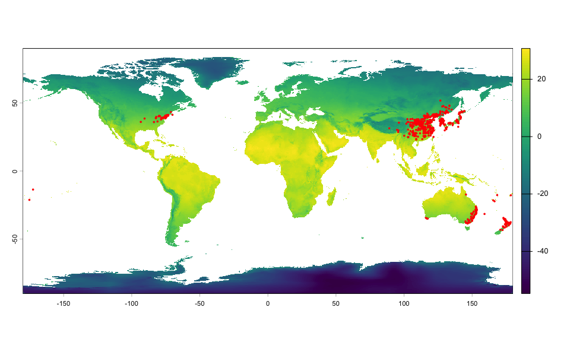
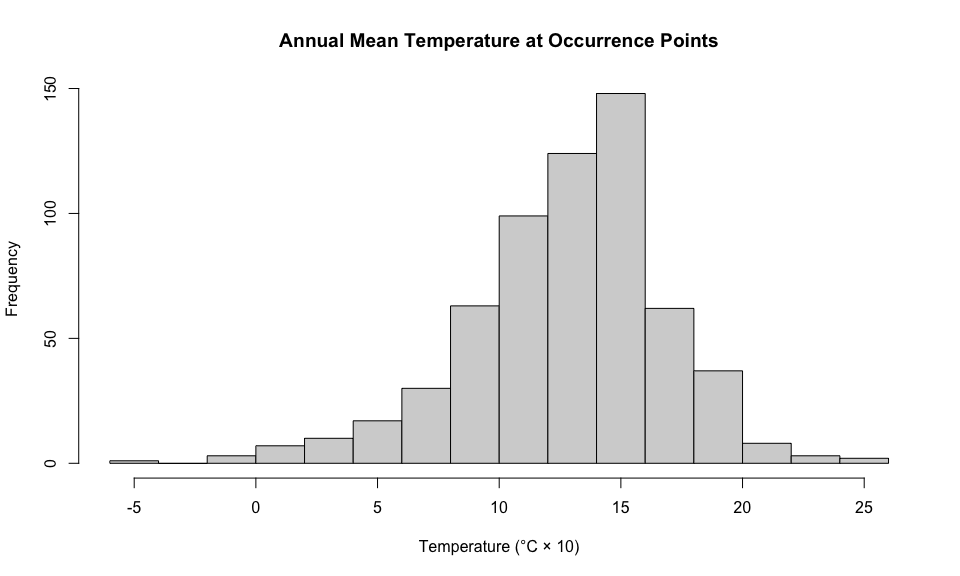

# Get climate data
Alexander W. Gofton
11 February 2026

- [Downlaod WorldClim bioclimatic
  variables](#downlaod-worldclim-bioclimatic-variables)
- [Load occurence data](#load-occurence-data)
- [Extract climatic values at occurence
  points](#extract-climatic-values-at-occurence-points)
- [Saving data](#saving-data)
- [Session Information](#session-information)

``` r
setwd("~/Library/CloudStorage/OneDrive-CSIRO/OneDrive - Docs/01_Projects/Hlongicornis_SDM")
library(tidyverse)
library(geodata)
library(terra)
library(sf)
```

## Downlaod WorldClim bioclimatic variables

``` r
# Resolution options: 10 (very high, ~340m), 5 (~1km), 2.5 (~5km), 0.5 (~1km but global)
# For Australia, I'd recommend 2.5 or 5 minutes
# Already done do commenting out - no need to download again

# bioclim <- worldclim_global(var = "bio",
#                             res = 2.5,  # 2.5 minute resolution (~5km)
#                             path = "data/worldclim")  # where to save
```

``` r
# Load the raster data
#bioclim <- rast(bioclim)

# Load the raster data using the correct relative path
worldclim_path <- "~/Library/CloudStorage/OneDrive-CSIRO/OneDrive - Docs/01_Projects/Hlongicornis_SDM/data/worldclim/"

bioclim <- rast(
  paste0(
    worldclim_path,
    c(
      "climate/wc2.1_2.5m/wc2.1_2.5m_bio_1.tif",
      "climate/wc2.1_2.5m/wc2.1_2.5m_bio_2.tif",
      "climate/wc2.1_2.5m/wc2.1_2.5m_bio_3.tif",
      "climate/wc2.1_2.5m/wc2.1_2.5m_bio_4.tif",
      "climate/wc2.1_2.5m/wc2.1_2.5m_bio_5.tif",
      "climate/wc2.1_2.5m/wc2.1_2.5m_bio_6.tif",
      "climate/wc2.1_2.5m/wc2.1_2.5m_bio_7.tif",
      "climate/wc2.1_2.5m/wc2.1_2.5m_bio_8.tif",
      "climate/wc2.1_2.5m/wc2.1_2.5m_bio_9.tif",
      "climate/wc2.1_2.5m/wc2.1_2.5m_bio_10.tif",
      "climate/wc2.1_2.5m/wc2.1_2.5m_bio_11.tif",
      "climate/wc2.1_2.5m/wc2.1_2.5m_bio_12.tif",
      "climate/wc2.1_2.5m/wc2.1_2.5m_bio_13.tif",
      "climate/wc2.1_2.5m/wc2.1_2.5m_bio_14.tif",
      "climate/wc2.1_2.5m/wc2.1_2.5m_bio_15.tif",
      "climate/wc2.1_2.5m/wc2.1_2.5m_bio_16.tif",
      "climate/wc2.1_2.5m/wc2.1_2.5m_bio_17.tif",
      "climate/wc2.1_2.5m/wc2.1_2.5m_bio_18.tif",
      "climate/wc2.1_2.5m/wc2.1_2.5m_bio_19.tif"
      )
    )
  )
```

``` r
# Check what you got
print(bioclim)
```

    class       : SpatRaster 
    size        : 4320, 8640, 19  (nrow, ncol, nlyr)
    resolution  : 0.04166667, 0.04166667  (x, y)
    extent      : -180, 180, -90, 90  (xmin, xmax, ymin, ymax)
    coord. ref. : lon/lat WGS 84 (EPSG:4326) 
    sources     : wc2.1_2.5m_bio_1.tif  
                  wc2.1_2.5m_bio_2.tif  
                  wc2.1_2.5m_bio_3.tif  
                  ... and 16 more sources
    names       : wc2.1~bio_1, wc2.1~bio_2, wc2.1~bio_3, wc2.1~bio_4, wc2.1~bio_5, wc2.1~bio_6, ... 
    min values  :   -54.75917,       1.000,    9.063088,       0.000,      -30.76,     -72.504, ... 
    max values  :    31.16667,      21.973,  100.000000,    2377.624,       48.46,      26.450, ... 

``` r
nlyr(bioclim)  # Should show 19 layers (bio1-bio19)
```

    [1] 19

## Load occurence data

``` r
occurrences <- read.csv(
  "~/Library/CloudStorage/OneDrive-CSIRO/OneDrive - Docs/01_Projects/Hlongicornis_SDM/processed_data/thinned_data_thin1.csv"
  )

# Convert to spatial object
occ_spatial <- vect(occurrences,
                    geom = c("lon", "lat"),
                    crs = "EPSG:4326")
```

``` r
# Quick check - plot on your climate data
plot(bioclim[[1]])
points(occ_spatial, pch = 16, col = "red", cex = 0.5)
```



## Extract climatic values at occurence points

``` r
# Make sure your occurrence points match the climate data CRS
occ_spatial <- project(occ_spatial, crs(bioclim))

# Extract climate values
occ_climate <- extract(bioclim, occ_spatial)

# Add back to your dataframe
occurrences <- cbind(occurrences, occ_climate)

# Quick check - look at climate space
hist(occurrences$wc2.1_2.5m_bio_1,
     main = "Annual Mean Temperature at Occurrence Points",
     xlab = "Temperature (°C × 10)")
```



## Saving data

``` r
# Save your cropped bioclim data
# This saves all 19 layers in one file
writeRaster(bioclim,
            filename = "~/Library/CloudStorage/OneDrive-CSIRO/OneDrive - Docs/01_Projects/Hlongicornis_SDM/processed_data/bioclim.tif",
            overwrite = TRUE)
```


    |---------|---------|---------|---------|
    =========================================
                                              

``` r
# Or save as RDS (R's native format - faster to load)
saveRDS(bioclim, "~/Library/CloudStorage/OneDrive-CSIRO/OneDrive - Docs/01_Projects/Hlongicornis_SDM/processed_data/bioclim.rds")

# To reload later:
#bioclim_aus_nz <- rast("data/processed/bioclim_aus_nz.tif")
# OR
#bioclim_aus_nz <- readRDS("data/processed/bioclim_aus_nz.rds")
```

``` r
# Save occurnce data
write.csv(occurrences,
          "~/Library/CloudStorage/OneDrive-CSIRO/OneDrive - Docs/01_Projects/Hlongicornis_SDM/processed_data/occurrences_thinned.csv",
          row.names = FALSE)

# As RDS (preserves R object structure better)
saveRDS(occurrences, "~/Library/CloudStorage/OneDrive-CSIRO/OneDrive - Docs/01_Projects/Hlongicornis_SDM/processed_data/occurrences_thinned.rds")

# If it's a spatial object (SpatVector)
writeVector(occ_spatial,
            "~/Library/CloudStorage/OneDrive-CSIRO/OneDrive - Docs/01_Projects/Hlongicornis_SDM/processed_data/occurrences_thinned.gpkg",
            overwrite = TRUE)

# To reload:
#occurrences <- read.csv("~/Library/CloudStorage/OneDrive-CSIRO/OneDrive - Docs/01_Projects/Hlongicornis_SDM/processed_data/occurrences_thinned.csv")
# OR
#occurrences <- readRDS("~/Library/CloudStorage/OneDrive-CSIRO/OneDrive - Docs/01_Projects/Hlongicornis_SDM/processed_data/occurrences_thinned.rds")
# OR
#occ_spatial <- vect("~/Library/CloudStorage/OneDrive-CSIRO/OneDrive - Docs/01_Projects/Hlongicornis_SDM/processed_data/occurrences_thinned.gpkg")
```

# Session Information

``` r
sessionInfo()
```

    R version 4.4.1 (2024-06-14)
    Platform: aarch64-apple-darwin20
    Running under: macOS 26.2

    Matrix products: default
    BLAS:   /Library/Frameworks/R.framework/Versions/4.4-arm64/Resources/lib/libRblas.0.dylib 
    LAPACK: /Library/Frameworks/R.framework/Versions/4.4-arm64/Resources/lib/libRlapack.dylib;  LAPACK version 3.12.0

    locale:
    [1] en_US.UTF-8/en_US.UTF-8/en_US.UTF-8/C/en_US.UTF-8/en_US.UTF-8

    time zone: Australia/Brisbane
    tzcode source: internal

    attached base packages:
    [1] stats     graphics  grDevices utils     datasets  methods   base     

    other attached packages:
     [1] sf_1.0-21       geodata_0.6-2   terra_1.8-93    lubridate_1.9.4
     [5] forcats_1.0.0   stringr_1.5.1   dplyr_1.1.4     purrr_1.1.0    
     [9] readr_2.1.5     tidyr_1.3.1     tibble_3.3.0    ggplot2_4.0.0  
    [13] tidyverse_2.0.0

    loaded via a namespace (and not attached):
     [1] gtable_0.3.6       jsonlite_2.0.0     compiler_4.4.1     Rcpp_1.1.0        
     [5] tidyselect_1.2.1   scales_1.4.0       yaml_2.3.10        fastmap_1.2.0     
     [9] R6_2.6.1           generics_0.1.4     classInt_0.4-11    knitr_1.50        
    [13] units_0.8-7        DBI_1.2.3          pillar_1.11.0      RColorBrewer_1.1-3
    [17] tzdb_0.5.0         rlang_1.1.6        stringi_1.8.7      xfun_0.53         
    [21] S7_0.2.0           timechange_0.3.0   cli_3.6.5          withr_3.0.2       
    [25] magrittr_2.0.3     class_7.3-23       digest_0.6.37      grid_4.4.1        
    [29] hms_1.1.3          lifecycle_1.0.4    vctrs_0.6.5        KernSmooth_2.23-26
    [33] proxy_0.4-27       evaluate_1.0.5     glue_1.8.0         farver_2.1.2      
    [37] codetools_0.2-20   e1071_1.7-16       rmarkdown_2.29     tools_4.4.1       
    [41] pkgconfig_2.0.3    htmltools_0.5.8.1 
