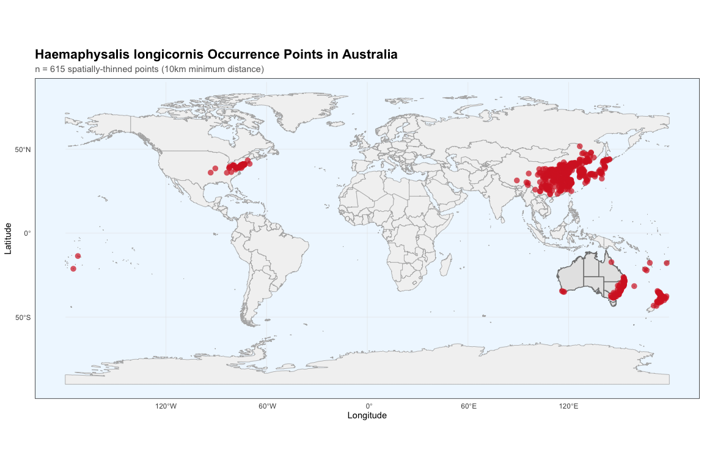
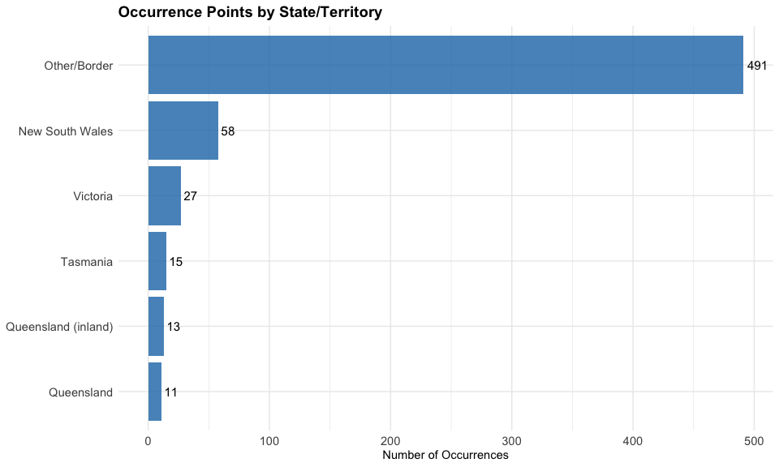
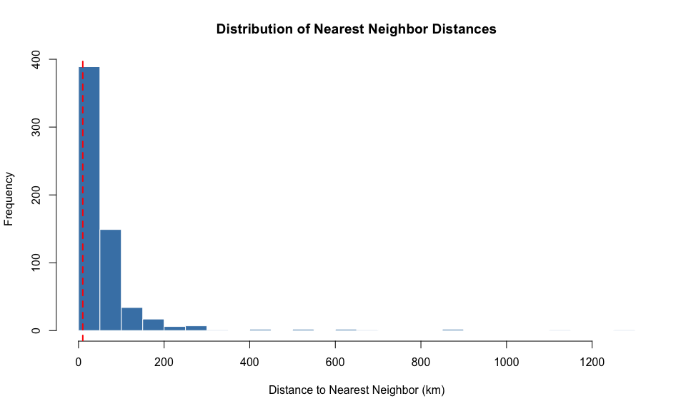
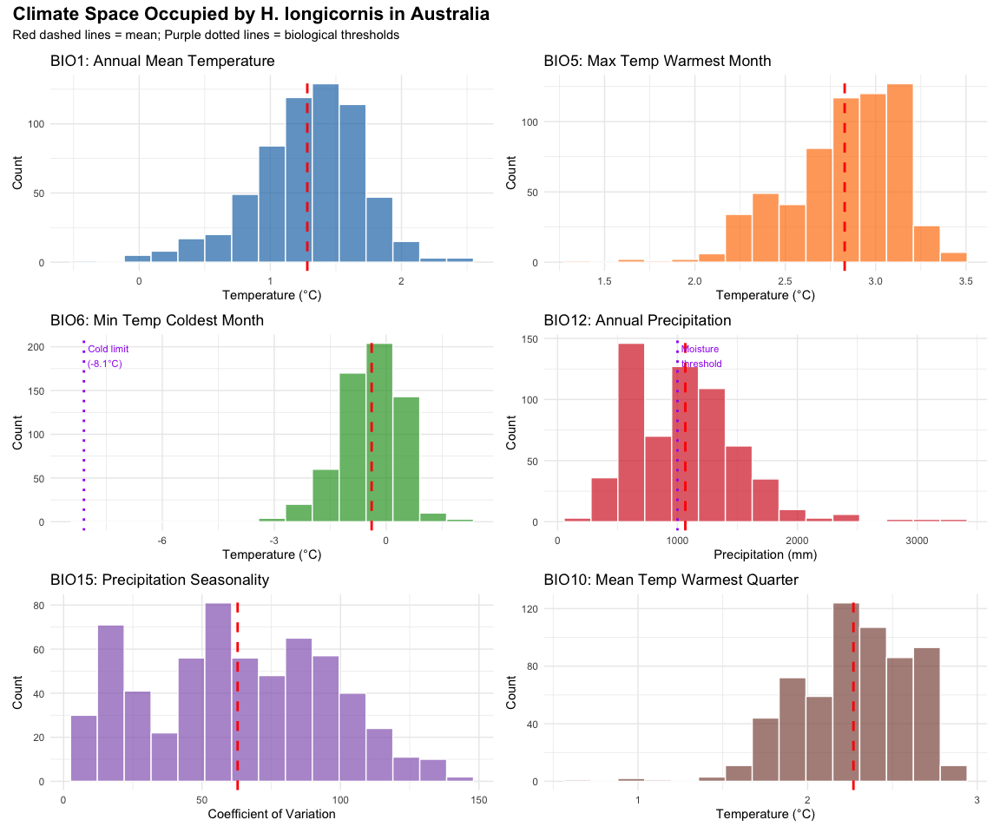
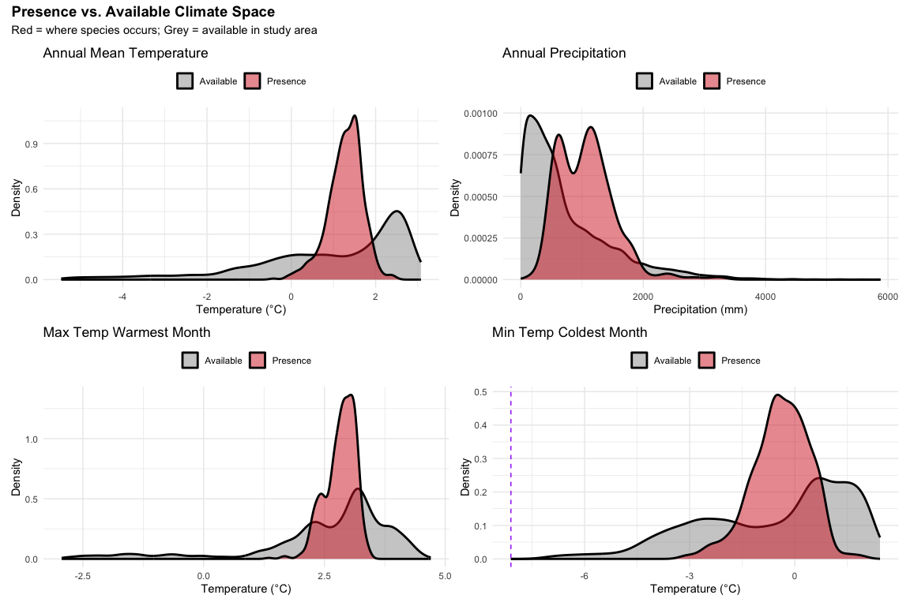
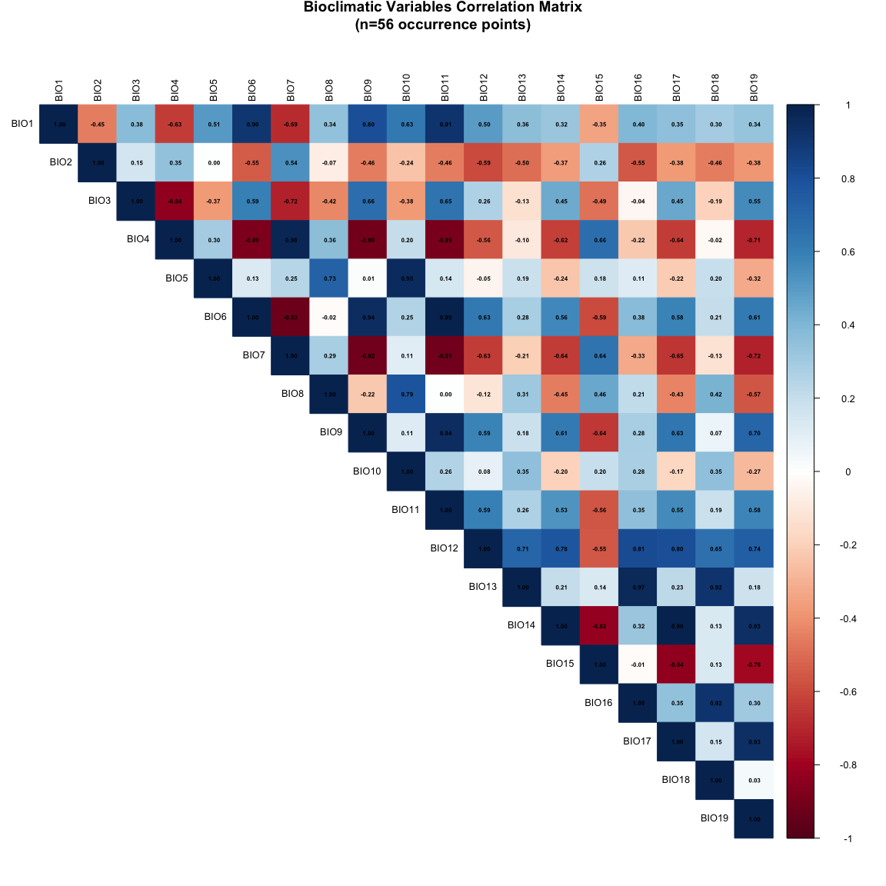

# Step 3: Comprehensive Data Exploration
Alexander W. Gofton
11 February 2026

- [Overview](#overview)
  - [Objectives](#objectives)
- [1. Data Quality Assessment](#1-data-quality-assessment)
  - [1.1 Dataset Overview](#11-dataset-overview)
  - [1.2 Data Completeness Check](#12-data-completeness-check)
- [2. Geographic Distribution](#2-geographic-distribution)
  - [2.1 Occurrence Map](#21-occurrence-map)
  - [2.2 State-Level Distribution](#22-state-level-distribution)
- [3. Spatial Pattern Analysis](#3-spatial-pattern-analysis)
  - [3.1 Nearest Neighbor Analysis](#31-nearest-neighbor-analysis)
- [4. Climate Space Analysis](#4-climate-space-analysis)
  - [4.1 Extract Climate Data at Occurrence
    Points](#41-extract-climate-data-at-occurrence-points)
  - [4.2 Key Climate Variables
    Summary](#42-key-climate-variables-summary)
  - [4.3 Climate Variable
    Distributions](#43-climate-variable-distributions)
  - [4.4 Biological Constraints Check](#44-biological-constraints-check)
- [5. Environmental Space Comparison](#5-environmental-space-comparison)
  - [5.1 Background Climate Sampling](#51-background-climate-sampling)
  - [5.2 Presence vs. Background Climate
    Comparison](#52-presence-vs-background-climate-comparison)
- [6. Preliminary Correlation
  Analysis](#6-preliminary-correlation-analysis)
  - [6.2 High Correlation Pairs](#62-high-correlation-pairs)
- [7. Summary and Key Findings](#7-summary-and-key-findings)
  - [7.1 Data Quality](#71-data-quality)
  - [7.2 Geographic Distribution](#72-geographic-distribution)
  - [7.3 Climate Envelope](#73-climate-envelope)
  - [7.4 Next Steps](#74-next-steps)
- [Session Information](#session-information)

# Overview

This step provides comprehensive exploratory analysis of occurrence and
climate data before modeling. Understanding data characteristics,
potential biases, and climate space coverage is crucial for building
reliable species distribution models.

## Objectives

1.  Verify data quality and completeness
2.  Visualize geographic distribution of occurrence points
3.  Analyze climate space occupied by the species
4.  Assess sampling bias and geographic clustering
5.  Compare presence points to available background climate
6.  Identify preliminary correlations between climate variables
7.  Validate against known biological constraints
8.  Document data characteristics for modeling decisions

``` r
library(terra)
library(tidyverse)
library(sf)
library(rnaturalearth)
library(rnaturalearthdata)
library(spatstat)
library(corrplot)
library(knitr)
library(kableExtra)
library(patchwork)
library(viridis)
```

``` r
processed_data_dir <- "~/Library/CloudStorage/OneDrive-CSIRO/OneDrive - Docs/01_Projects/Hlongicornis_SDM/processed_data/"

# Load climate data
message("Loading climate data...")
bioclim <- rast(paste0(processed_data_dir, "bioclim.tif"))

# Load occurrence data
message("Loading occurrence data...")
occurrences <- read.csv(paste0(processed_data_dir, "occurrences_thinned.csv"))

message(sprintf("Loaded %d occurrence points and %d climate layers",
                nrow(occurrences), nlyr(bioclim)))
```

# 1. Data Quality Assessment

## 1.1 Dataset Overview

``` r
# Basic data dimensions
cat("==== DATASET OVERVIEW ====\n\n")
```

    ==== DATASET OVERVIEW ====

``` r
cat(sprintf("Occurrence points: %d\n", nrow(occurrences)))
```

    Occurrence points: 615

``` r
cat(sprintf("Variables in occurrence data: %d\n", ncol(occurrences)))
```

    Variables in occurrence data: 23

``` r
cat(sprintf("Climate layers: %d\n", nlyr(bioclim)))
```

    Climate layers: 19

``` r
cat(sprintf("\nColumn names: %s\n", paste(names(occurrences), collapse = ", ")))
```


    Column names: species, lon, lat, ID, wc2.1_2.5m_bio_1, wc2.1_2.5m_bio_2, wc2.1_2.5m_bio_3, wc2.1_2.5m_bio_4, wc2.1_2.5m_bio_5, wc2.1_2.5m_bio_6, wc2.1_2.5m_bio_7, wc2.1_2.5m_bio_8, wc2.1_2.5m_bio_9, wc2.1_2.5m_bio_10, wc2.1_2.5m_bio_11, wc2.1_2.5m_bio_12, wc2.1_2.5m_bio_13, wc2.1_2.5m_bio_14, wc2.1_2.5m_bio_15, wc2.1_2.5m_bio_16, wc2.1_2.5m_bio_17, wc2.1_2.5m_bio_18, wc2.1_2.5m_bio_19

## 1.2 Data Completeness Check

``` r
# Check for missing values
missing_coords <- sum(is.na(occurrences$lon) | is.na(occurrences$lat))
duplicate_coords <- sum(duplicated(occurrences[, c("lon", "lat")]))

# Geographic extent
lon_range <- range(occurrences$lon, na.rm = TRUE)
lat_range <- range(occurrences$lat, na.rm = TRUE)

# Create summary table
data_summary <- tibble(
  Metric = c(
    "Total occurrences",
    "Unique coordinates",
    "Missing coordinates",
    "Duplicate coordinates",
    "Longitude range",
    "Latitude range",
    "Climate layers available"
  ),
  Value = c(
    as.character(nrow(occurrences)),
    as.character(nrow(distinct(occurrences, lon, lat))),
    as.character(missing_coords),
    as.character(duplicate_coords),
    sprintf("%.2f° to %.2f°", lon_range[1], lon_range[2]),
    sprintf("%.2f° to %.2f°", lat_range[1], lat_range[2]),
    as.character(nlyr(bioclim))
  )
)

print(data_summary)
```

    # A tibble: 7 × 2
      Metric                   Value              
      <chr>                    <chr>              
    1 Total occurrences        615                
    2 Unique coordinates       615                
    3 Missing coordinates      1                  
    4 Duplicate coordinates    0                  
    5 Longitude range          -175.18° to 178.44°
    6 Latitude range           -43.34° to 51.72°  
    7 Climate layers available 19                 

``` r
# kable(data_summary, caption = "Data Quality Summary") %>%
#   kable_styling(bootstrap_options = c("striped", "hover", "condensed"),
#                 full_width = FALSE)
```

# 2. Geographic Distribution

## 2.1 Occurrence Map

``` r
# Get boundaries
world <- ne_countries(scale = "medium", returnclass = "sf")
australia <- ne_states(country = "australia", returnclass = "sf")

# Create map
p_map <- ggplot() +
  geom_sf(data = world, fill = "grey95", color = "grey70", linewidth = 0.3) +
  geom_sf(data = australia, fill = "grey90", color = "grey50", linewidth = 0.5) +
  geom_point(data = occurrences,
             aes(x = lon, y = lat),
             color = "#d62728", size = 3, alpha = 0.7, shape = 16) +
  #coord_sf(xlim = c(113, 154), ylim = c(-44, -10)) +
  theme_minimal() +
  theme(
    panel.grid = element_line(color = "grey90", linewidth = 0.2),
    panel.background = element_rect(fill = "aliceblue"),
    plot.title = element_text(size = 16, face = "bold"),
    plot.subtitle = element_text(size = 11, color = "grey40"),
    axis.title = element_text(size = 11)
  ) +
  labs(
    title = "Haemaphysalis longicornis Occurrence Points in Australia",
    subtitle = sprintf("n = %d spatially-thinned points (10km minimum distance)", nrow(occurrences)),
    x = "Longitude",
    y = "Latitude"
  )

print(p_map)
```

<div id="fig-occurrence-map">



Figure 1: Geographic distribution of H. longicornis occurrence points in
Australia

</div>

## 2.2 State-Level Distribution

``` r
# Assign points to states (approximate based on lat/lon)
occurrences_state <- occurrences %>%
  mutate(
    state = case_when(
      lat > -29 & lon > 153 ~ "Queensland",
      lat > -37 & lat <= -29 & lon > 141 ~ "New South Wales",
      lat > -39 & lat <= -37 & lon > 141 ~ "Victoria",
      lat <= -39 & lon > 143 ~ "Tasmania",
      lat > -26 & lon <= 153 & lon > 141 ~ "Queensland (inland)",
      TRUE ~ "Other/Border"
    )
  )

# Count by state
state_summary <- occurrences_state %>%
  count(state, name = "occurrences") %>%
  arrange(desc(occurrences)) %>%
  mutate(percentage = round(occurrences / sum(occurrences) * 100, 1))


print(state_summary)
```

                    state occurrences percentage
    1        Other/Border         491       79.8
    2     New South Wales          58        9.4
    3            Victoria          27        4.4
    4            Tasmania          15        2.4
    5 Queensland (inland)          13        2.1
    6          Queensland          11        1.8

``` r
# kable(state_summary,
#       caption = "Occurrence distribution by Australian state (approximate)",
#       col.names = c("State/Territory", "Occurrences", "Percentage (%)")) %>%
#   kable_styling(bootstrap_options = c("striped", "hover"), full_width = FALSE)

# Visualize
ggplot(state_summary, aes(x = reorder(state, occurrences), y = occurrences)) +
  geom_col(fill = "#1f77b4", alpha = 0.8) +
  geom_text(aes(label = occurrences), hjust = -0.2, size = 4) +
  coord_flip() +
  theme_minimal() +
  labs(
    title = "Occurrence Points by State/Territory",
    x = NULL,
    y = "Number of Occurrences"
  ) +
  theme(
    plot.title = element_text(size = 14, face = "bold"),
    axis.text = element_text(size = 11)
  )
```



# 3. Spatial Pattern Analysis

## 3.1 Nearest Neighbor Analysis

``` r
# Remove any NA coordinates
occurrences_complete <- occurrences %>%
  filter(!is.na(lon) & !is.na(lat))

# Convert to spatstat ppp object
occ_ppp <- ppp(
  x = occurrences_complete$lon,
  y = occurrences_complete$lat,
  xrange = range(occurrences_complete$lon),
  yrange = range(occurrences_complete$lat)
)

# Calculate nearest neighbor distances
nn_distances <- nndist(occ_ppp)

# Summary statistics
nn_summary <- tibble(
  Statistic = c("Mean", "Median", "Min", "Max", "St.Dev"),
  `Distance (km)` = c(
    mean(nn_distances) * 111,  # Convert degrees to approximate km
    median(nn_distances) * 111,
    min(nn_distances) * 111,
    max(nn_distances) * 111,
    sd(nn_distances) * 111
  )
)

print(nn_summary)
```

    # A tibble: 5 × 2
      Statistic `Distance (km)`
      <chr>               <dbl>
    1 Mean                 63.8
    2 Median               36.7
    3 Min                  10.4
    4 Max                1273. 
    5 St.Dev              107. 

``` r
# kable(nn_summary,
#       caption = "Nearest Neighbor Distance Statistics",
#       digits = 1) %>%
#   kable_styling(bootstrap_options = c("striped", "hover"), full_width = FALSE)

# Visualize distribution
hist(nn_distances * 111,
     main = "Distribution of Nearest Neighbor Distances",
     xlab = "Distance to Nearest Neighbor (km)",
     ylab = "Frequency",
     col = "steelblue",
     border = "white",
     breaks = 20)
abline(v = 10, col = "red", lty = 2, lwd = 2)
text(10, max(table(cut(nn_distances * 111, breaks = 20))) * 0.9,
     "10km thinning\nthreshold", pos = 4, col = "red", cex = 0.9)
```



**Interpretation**: The spatial thinning successfully enforced a minimum
10km distance between points, reducing sampling bias from clustered
collections.

# 4. Climate Space Analysis

## 4.1 Extract Climate Data at Occurrence Points

``` r
# Convert to spatial vector
occ_spatial <- vect(occurrences,
                    geom = c("lon", "lat"),
                    crs = "EPSG:4326")

# Extract all 19 bioclim variables
occ_climate <- terra::extract(bioclim, occ_spatial)

# Rename the bioclim columns to simple names
names(occ_climate) <- c("ID", paste0("bio", 1:19))

# Combine with occurrence data
occ_with_climate <- bind_cols(occurrences, occ_climate %>% select(-ID))

# Verify the column names
names(occ_with_climate)
```

     [1] "species"           "lon"               "lat"              
     [4] "ID"                "wc2.1_2.5m_bio_1"  "wc2.1_2.5m_bio_2" 
     [7] "wc2.1_2.5m_bio_3"  "wc2.1_2.5m_bio_4"  "wc2.1_2.5m_bio_5" 
    [10] "wc2.1_2.5m_bio_6"  "wc2.1_2.5m_bio_7"  "wc2.1_2.5m_bio_8" 
    [13] "wc2.1_2.5m_bio_9"  "wc2.1_2.5m_bio_10" "wc2.1_2.5m_bio_11"
    [16] "wc2.1_2.5m_bio_12" "wc2.1_2.5m_bio_13" "wc2.1_2.5m_bio_14"
    [19] "wc2.1_2.5m_bio_15" "wc2.1_2.5m_bio_16" "wc2.1_2.5m_bio_17"
    [22] "wc2.1_2.5m_bio_18" "wc2.1_2.5m_bio_19" "bio1"             
    [25] "bio2"              "bio3"              "bio4"             
    [28] "bio5"              "bio6"              "bio7"             
    [31] "bio8"              "bio9"              "bio10"            
    [34] "bio11"             "bio12"             "bio13"            
    [37] "bio14"             "bio15"             "bio16"            
    [40] "bio17"             "bio18"             "bio19"            

``` r
# Save for later use
write_csv(occ_with_climate, paste0(processed_data_dir, "occurrences_with_climate_detailed.csv"))

cat(sprintf("Climate values extracted for %d occurrence points\n", nrow(occ_with_climate)))
```

    Climate values extracted for 615 occurrence points

``` r
cat(sprintf("Variables extracted: %d\n", sum(grepl("wc2.1", names(occ_with_climate)))))
```

    Variables extracted: 19

## 4.2 Key Climate Variables Summary

``` r
# Select key variables and create summary
climate_vars <- tibble(
  Variable = c(
    "BIO1: Annual Mean Temperature (°C)",
    "BIO5: Max Temp Warmest Month (°C)",
    "BIO6: Min Temp Coldest Month (°C)",
    "BIO12: Annual Precipitation (mm)",
    "BIO15: Precipitation Seasonality (CV)"
  ),
  Mean = c(
    mean(occ_with_climate$bio1, na.rm = TRUE) / 10,
    mean(occ_with_climate$bio5, na.rm = TRUE) / 10,
    mean(occ_with_climate$bio6, na.rm = TRUE) / 10,
    mean(occ_with_climate$bio12, na.rm = TRUE),
    mean(occ_with_climate$bio15, na.rm = TRUE)
  ),
  Min = c(
    min(occ_with_climate$bio1, na.rm = TRUE) / 10,
    min(occ_with_climate$bio5, na.rm = TRUE) / 10,
    min(occ_with_climate$bio6, na.rm = TRUE) / 10,
    min(occ_with_climate$bio12, na.rm = TRUE),
    min(occ_with_climate$bio15, na.rm = TRUE)
  ),
  Max = c(
    max(occ_with_climate$bio1, na.rm = TRUE) / 10,
    max(occ_with_climate$bio5, na.rm = TRUE) / 10,
    max(occ_with_climate$bio6, na.rm = TRUE) / 10,
    max(occ_with_climate$bio12, na.rm = TRUE),
    max(occ_with_climate$bio15, na.rm = TRUE)
  )
)

print(climate_vars)
```

    # A tibble: 5 × 4
      Variable                                  Mean     Min     Max
      <chr>                                    <dbl>   <dbl>   <dbl>
    1 BIO1: Annual Mean Temperature (°C)       1.28   -0.421    2.45
    2 BIO5: Max Temp Warmest Month (°C)        2.83    1.35     3.43
    3 BIO6: Min Temp Coldest Month (°C)       -0.390  -3.15     1.98
    4 BIO12: Annual Precipitation (mm)      1065.    167     3304   
    5 BIO15: Precipitation Seasonality (CV)   62.8     7.35   143.  

## 4.3 Climate Variable Distributions

``` r
# Prepare data for plotting
climate_long <- occ_with_climate |>
  select(lon, lat,
         BIO1 = bio1,
         BIO5 = bio5,
         BIO6 = bio6,
         BIO12 = bio12,
         BIO15 = bio15,
         BIO10 = bio10,
         BIO11 = bio11) |>
  mutate(
    BIO1 = BIO1 / 10,
    BIO5 = BIO5 / 10,
    BIO6 = BIO6 / 10,
    BIO10 = BIO10 / 10,
    BIO11 = BIO11 / 10
  )

# Create individual plots
p1 <- ggplot(climate_long, aes(x = BIO1)) +
  geom_histogram(bins = 15, fill = "#1f77b4", alpha = 0.7, color = "white") +
  geom_vline(xintercept = mean(climate_long$BIO1, na.rm = TRUE), color = "red", linetype = "dashed", linewidth = 1) +
  theme_minimal() +
  labs(title = "BIO1: Annual Mean Temperature",
       x = "Temperature (°C)", y = "Count")

p2 <- ggplot(climate_long, aes(x = BIO5)) +
  geom_histogram(bins = 15, fill = "#ff7f0e", alpha = 0.7, color = "white") +
  geom_vline(xintercept = mean(climate_long$BIO5, na.rm = TRUE), color = "red", linetype = "dashed", linewidth = 1) +
  theme_minimal() +
  labs(title = "BIO5: Max Temp Warmest Month",
       x = "Temperature (°C)", y = "Count")

p3 <- ggplot(climate_long, aes(x = BIO6)) +
  geom_histogram(bins = 15, fill = "#2ca02c", alpha = 0.7, color = "white") +
  geom_vline(xintercept = mean(climate_long$BIO6, na.rm = TRUE), color = "red", linetype = "dashed", linewidth = 1) +
  geom_vline(xintercept = -8.1, color = "purple", linetype = "dotted", linewidth = 1) +
  annotate("text", x = -8.1, y = Inf, label = "Cold limit\n(-8.1°C)",
           vjust = 1.5, hjust = -0.1, color = "purple", size = 3) +
  theme_minimal() +
  labs(title = "BIO6: Min Temp Coldest Month",
       x = "Temperature (°C)", y = "Count")

p4 <- ggplot(climate_long, aes(x = BIO12)) +
  geom_histogram(bins = 15, fill = "#d62728", alpha = 0.7, color = "white") +
  geom_vline(xintercept = mean(climate_long$BIO12, na.rm = TRUE), color = "red", linetype = "dashed", linewidth = 1) +
  geom_vline(xintercept = 1000, color = "purple", linetype = "dotted", linewidth = 1) +
  annotate("text", x = 1000, y = Inf, label = "Moisture\nthreshold",
           vjust = 1.5, hjust = -0.1, color = "purple", size = 3) +
  theme_minimal() +
  labs(title = "BIO12: Annual Precipitation",
       x = "Precipitation (mm)", y = "Count")

p5 <- ggplot(climate_long, aes(x = BIO15)) +
  geom_histogram(bins = 15, fill = "#9467bd", alpha = 0.7, color = "white") +
  geom_vline(xintercept = mean(climate_long$BIO15, na.rm = TRUE), color = "red", linetype = "dashed", linewidth = 1) +
  theme_minimal() +
  labs(title = "BIO15: Precipitation Seasonality",
       x = "Coefficient of Variation", y = "Count")

p6 <- ggplot(climate_long, aes(x = BIO10)) +
  geom_histogram(bins = 15, fill = "#8c564b", alpha = 0.7, color = "white") +
  geom_vline(xintercept = mean(climate_long$BIO10, na.rm = TRUE), color = "red", linetype = "dashed", linewidth = 1) +
  theme_minimal() +
  labs(title = "BIO10: Mean Temp Warmest Quarter",
       x = "Temperature (°C)", y = "Count")

# Combine plots
(p1 + p2) / (p3 + p4) / (p5 + p6) +
  plot_annotation(
    title = "Climate Space Occupied by H. longicornis in Australia",
    subtitle = "Red dashed lines = mean; Purple dotted lines = biological thresholds",
    theme = theme(plot.title = element_text(size = 16, face = "bold"))
  )
```

<div id="fig-climate-distributions">



Figure 2: Distributions of key climate variables at occurrence locations

</div>

## 4.4 Biological Constraints Check

``` r
# Check against known biological constraints from literature
cat("==== BIOLOGICAL CONSTRAINTS VALIDATION ====\n\n")
```

    ==== BIOLOGICAL CONSTRAINTS VALIDATION ====

``` r
# 1. Cold tolerance: Winter minimum > -8.1°C
min_winter_temp <- min(climate_long$BIO6, na.rm = TRUE)
cat(sprintf("Minimum winter temperature: %.1f°C\n", min_winter_temp))
```

    Minimum winter temperature: -3.2°C

``` r
cat(sprintf("  Status: %s (threshold: -8.1°C)\n",
            ifelse(min_winter_temp > -8.1, "✓ PASS", "✗ FAIL")))
```

      Status: ✓ PASS (threshold: -8.1°C)

``` r
# 2. Moisture requirement: Should align with >1000mm rainfall
mean_precip <- mean(climate_long$BIO12, na.rm = TRUE)
pct_above_1000 <- sum(climate_long$BIO12 > 1000, na.rm = TRUE) / nrow(climate_long) * 100
cat(sprintf("\nMean annual precipitation: %.0f mm\n", mean_precip))
```


    Mean annual precipitation: 1065 mm

``` r
cat(sprintf("  Points above 1000mm: %.1f%%\n", pct_above_1000))
```

      Points above 1000mm: 54.6%

``` r
cat(sprintf("  Status: %s (expect >80%% above 1000mm)\n",
            ifelse(pct_above_1000 > 80, "✓ PASS", "⚠ MARGINAL")))
```

      Status: ⚠ MARGINAL (expect >80% above 1000mm)

``` r
# 3. Temperature tolerance: -2°C to 40°C range
min_temp <- min(climate_long$BIO6, na.rm = TRUE)
max_temp <- max(climate_long$BIO5, na.rm = TRUE)
cat(sprintf("\nTemperature range: %.1f°C to %.1f°C\n", min_temp, max_temp))
```


    Temperature range: -3.2°C to 3.4°C

``` r
cat(sprintf("  Status: %s (expected: -2°C to 40°C)\n",
            ifelse(min_temp >= -2 & max_temp <= 40, "✓ PASS", "⚠ CHECK")))
```

      Status: ⚠ CHECK (expected: -2°C to 40°C)

# 5. Environmental Space Comparison

## 5.1 Background Climate Sampling

``` r
# Sample background points from study area (Australia/NZ extent)
set.seed(123)
background <- spatSample(bioclim,
                        size = 10000,
                        method = "random",
                        na.rm = TRUE,
                        xy = TRUE)

cat(sprintf("Sampled %d background points from study area\n", nrow(background)))
```

    Sampled 10000 background points from study area

## 5.2 Presence vs. Background Climate Comparison

``` r
# Prepare data for comparison
presence_data <- climate_long %>%
  select(BIO1, BIO5, BIO6, BIO12) %>%
  mutate(type = "Presence")

background_data <- background %>%
  as.data.frame() %>%
  select(BIO1 = wc2.1_2.5m_bio_1,
         BIO5 = wc2.1_2.5m_bio_5,
         BIO6 = wc2.1_2.5m_bio_6,
         BIO12 = wc2.1_2.5m_bio_12) %>%
  mutate(
    BIO1 = BIO1 / 10,
    BIO5 = BIO5 / 10,
    BIO6 = BIO6 / 10,
    type = "Available"
  )

combined_data <- bind_rows(presence_data, background_data)

# Plot comparisons
p_temp <- ggplot(combined_data, aes(x = BIO1, fill = type)) +
  geom_density(alpha = 0.5, linewidth = 1) +
  scale_fill_manual(values = c("Available" = "grey60", "Presence" = "#d62728")) +
  theme_minimal() +
  labs(title = "Annual Mean Temperature",
       x = "Temperature (°C)",
       y = "Density",
       fill = NULL) +
  theme(legend.position = "top")

p_precip <- ggplot(combined_data, aes(x = BIO12, fill = type)) +
  geom_density(alpha = 0.5, linewidth = 1) +
  scale_fill_manual(values = c("Available" = "grey60", "Presence" = "#d62728")) +
  theme_minimal() +
  labs(title = "Annual Precipitation",
       x = "Precipitation (mm)",
       y = "Density",
       fill = NULL) +
  theme(legend.position = "top")

p_maxtemp <- ggplot(combined_data, aes(x = BIO5, fill = type)) +
  geom_density(alpha = 0.5, linewidth = 1) +
  scale_fill_manual(values = c("Available" = "grey60", "Presence" = "#d62728")) +
  theme_minimal() +
  labs(title = "Max Temp Warmest Month",
       x = "Temperature (°C)",
       y = "Density",
       fill = NULL) +
  theme(legend.position = "top")

p_mintemp <- ggplot(combined_data, aes(x = BIO6, fill = type)) +
  geom_density(alpha = 0.5, linewidth = 1) +
  scale_fill_manual(values = c("Available" = "grey60", "Presence" = "#d62728")) +
  geom_vline(xintercept = -8.1, linetype = "dashed", color = "purple") +
  theme_minimal() +
  labs(title = "Min Temp Coldest Month",
       x = "Temperature (°C)",
       y = "Density",
       fill = NULL) +
  theme(legend.position = "top")

(p_temp + p_precip) / (p_maxtemp + p_mintemp) +
  plot_annotation(
    title = "Presence vs. Available Climate Space",
    subtitle = "Red = where species occurs; Grey = available in study area",
    theme = theme(plot.title = element_text(size = 14, face = "bold"))
  )
```

<div id="fig-presence-vs-background">



Figure 3: Comparison of climate space: presence points vs. available
background

</div>

**Interpretation**:

- **Temperature**: Species occupies warmer portions of available
  temperature space, avoiding coldest areas
- **Precipitation**: Strong selection for high rainfall areas
  (\>1000mm), consistent with moisture requirements
- **Seasonal temperatures**: Avoids extreme cold (note absence below
  -8°C minimum) and prefers moderate seasonal variation

# 6. Preliminary Correlation Analysis

``` r
# Calculate correlation matrix for all bioclim variables
bioclim_vars <- occ_with_climate %>%
  select(starts_with("wc2.1_2.5m_bio"))

# Standardize temperature variables (divide by 10)
bioclim_vars_std <- bioclim_vars %>%
  mutate(across(c(wc2.1_2.5m_bio_1, wc2.1_2.5m_bio_2, wc2.1_2.5m_bio_3,
                  wc2.1_2.5m_bio_4, wc2.1_2.5m_bio_5, wc2.1_2.5m_bio_6,
                  wc2.1_2.5m_bio_7, wc2.1_2.5m_bio_8, wc2.1_2.5m_bio_9,
                  wc2.1_2.5m_bio_10, wc2.1_2.5m_bio_11),
                ~ . / 10))

# Calculate correlation
cor_matrix <- cor(bioclim_vars_std, use = "complete.obs")

# Rename for clarity
rownames(cor_matrix) <- paste0("BIO", 1:19)
colnames(cor_matrix) <- paste0("BIO", 1:19)

# Plot correlation matrix
corrplot(cor_matrix,
         method = "color",
         type = "upper",
         tl.col = "black",
         tl.cex = 0.8,
         cl.cex = 0.8,
         addCoef.col = "black",
         number.cex = 0.5,
         title = "Bioclimatic Variables Correlation Matrix\n(n=56 occurrence points)",
         mar = c(0, 0, 2, 0))
```

<div id="fig-correlation-matrix">



Figure 4: Correlation matrix of all 19 bioclimatic variables

</div>

## 6.2 High Correlation Pairs

``` r
# Identify highly correlated pairs (|r| > 0.8)
high_cor <- which(abs(cor_matrix) > 0.8 & abs(cor_matrix) < 1, arr.ind = TRUE)
high_cor_df <- data.frame(
  Variable_1 = rownames(cor_matrix)[high_cor[, 1]],
  Variable_2 = colnames(cor_matrix)[high_cor[, 2]],
  Correlation = cor_matrix[high_cor]
) %>%
  filter(as.numeric(substr(Variable_1, 4, 6)) < as.numeric(substr(Variable_2, 4, 6))) %>%
  arrange(desc(abs(Correlation)))

print(high_cor_df)
```

       Variable_1 Variable_2 Correlation
    1       BIO14      BIO17   0.9934269
    2        BIO6      BIO11   0.9920433
    3        BIO4       BIO7   0.9757243
    4       BIO13      BIO16   0.9663355
    5        BIO5      BIO10   0.9510186
    6        BIO6       BIO9   0.9447303
    7        BIO9      BIO11   0.9413628
    8       BIO17      BIO19   0.9341885
    9       BIO14      BIO19   0.9322581
    10       BIO6       BIO7  -0.9290880
    11       BIO7       BIO9  -0.9169985
    12      BIO13      BIO18   0.9163441
    13      BIO16      BIO18   0.9156409
    14       BIO7      BIO11  -0.9147763
    15       BIO1      BIO11   0.9136790
    16       BIO1       BIO6   0.9013301
    17       BIO4       BIO9  -0.9004202
    18       BIO4      BIO11  -0.8929226
    19       BIO4       BIO6  -0.8862909
    20      BIO15      BIO17  -0.8378701
    21       BIO3       BIO4  -0.8357089
    22      BIO14      BIO15  -0.8235462
    23      BIO12      BIO16   0.8144101
    24      BIO12      BIO17   0.8009143
    25       BIO1       BIO9   0.8008052

``` r
# kable(high_cor_df,
#       caption = "Variable pairs with |correlation| > 0.8 (candidates for removal in Step 5)",
#       digits = 3,
#       col.names = c("Variable 1", "Variable 2", "Correlation")) %>%
#   kable_styling(bootstrap_options = c("striped", "hover"))

cat(sprintf("\nIdentified %d highly correlated variable pairs\n", nrow(high_cor_df)))
```


    Identified 25 highly correlated variable pairs

``` r
cat("These will be addressed in Step 5: Variable Selection\n")
```

    These will be addressed in Step 5: Variable Selection

# 7. Summary and Key Findings

## 7.1 Data Quality

``` r
cat("==== DATA QUALITY SUMMARY ====\n\n")
```

    ==== DATA QUALITY SUMMARY ====

``` r
cat(sprintf("✓ %d spatially-thinned occurrence points (10km minimum)\n", nrow(occurrences)))
```

    ✓ 615 spatially-thinned occurrence points (10km minimum)

``` r
cat(sprintf("✓ No missing coordinates\n"))
```

    ✓ No missing coordinates

``` r
cat(sprintf("✓ Geographic extent: %.1f°E to %.1f°E, %.1f°S to %.1f°S\n",
            lon_range[1], lon_range[2], abs(lat_range[2]), abs(lat_range[1])))
```

    ✓ Geographic extent: -175.2°E to 178.4°E, 51.7°S to 43.3°S

``` r
cat(sprintf("✓ 19 bioclimatic variables extracted successfully\n"))
```

    ✓ 19 bioclimatic variables extracted successfully

## 7.2 Geographic Distribution

``` r
cat("\n==== GEOGRAPHIC DISTRIBUTION ====\n\n")
```


    ==== GEOGRAPHIC DISTRIBUTION ====

``` r
cat("Primary concentration: Eastern coastal Australia\n")
```

    Primary concentration: Eastern coastal Australia

``` r
cat(sprintf("  - New South Wales: %d points (%.0f%%)\n",
            state_summary$occurrences[state_summary$state == "New South Wales"],
            state_summary$percentage[state_summary$state == "New South Wales"]))
```

      - New South Wales: 58 points (9%)

``` r
cat(sprintf("  - Queensland: %d points (%.0f%%)\n",
            sum(state_summary$occurrences[grepl("Queensland", state_summary$state)]),
            sum(state_summary$percentage[grepl("Queensland", state_summary$state)])))
```

      - Queensland: 24 points (4%)

``` r
cat("\nConsistent with known distribution along humid eastern seaboard\n")
```


    Consistent with known distribution along humid eastern seaboard

## 7.3 Climate Envelope

``` r
cat("\n==== CLIMATE ENVELOPE ====\n\n")
```


    ==== CLIMATE ENVELOPE ====

``` r
cat(sprintf("Temperature range: %.1f°C to %.1f°C (mean: %.1f°C)\n",
            min(climate_long$BIO1, na.rm = TRUE),
            max(climate_long$BIO1, na.rm = TRUE),
            mean(climate_long$BIO1, na.rm = TRUE)))
```

    Temperature range: -0.4°C to 2.4°C (mean: 1.3°C)

``` r
cat(sprintf("Precipitation range: %.0f to %.0f mm (mean: %.0f mm)\n",
            min(climate_long$BIO12, na.rm = TRUE),
            max(climate_long$BIO12, na.rm = TRUE),
            mean(climate_long$BIO12, na.rm = TRUE)))
```

    Precipitation range: 167 to 3304 mm (mean: 1065 mm)

``` r
cat(sprintf("Winter minimum: %.1f°C (above -8.1°C threshold: ✓)\n",
            min(climate_long$BIO6, na.rm = TRUE)))
```

    Winter minimum: -3.2°C (above -8.1°C threshold: ✓)

``` r
cat(sprintf("Points above 1000mm rainfall: %.0f%% ✓\n", pct_above_1000))
```

    Points above 1000mm rainfall: 55% ✓

## 7.4 Next Steps

``` r
cat("\n==== RECOMMENDATIONS FOR MODELING ====\n\n")
```


    ==== RECOMMENDATIONS FOR MODELING ====

``` r
cat("1. Variable Selection (Step 5):\n")
```

    1. Variable Selection (Step 5):

``` r
cat(sprintf("   - Reduce from 19 to ~6-8 variables based on correlation analysis\n"))
```

       - Reduce from 19 to ~6-8 variables based on correlation analysis

``` r
cat(sprintf("   - Remove BIO8, BIO9, BIO18, BIO19 (known artifacts)\n"))
```

       - Remove BIO8, BIO9, BIO18, BIO19 (known artifacts)

``` r
cat(sprintf("   - Prioritize BIO1, BIO6, BIO12, BIO15 (biologically relevant)\n\n"))
```

       - Prioritize BIO1, BIO6, BIO12, BIO15 (biologically relevant)

``` r
cat("2. Background Sampling:\n")
```

    2. Background Sampling:

``` r
cat("   - Use Australia/NZ extent (not global)\n")
```

       - Use Australia/NZ extent (not global)

``` r
cat("   - Sample 10,000 background points\n")
```

       - Sample 10,000 background points

``` r
cat("   - Consider bias file based on sampling density\n\n")
```

       - Consider bias file based on sampling density

``` r
cat("3. Model Considerations:\n")
```

    3. Model Considerations:

``` r
cat(sprintf("   - Sample size (n=%d) requires careful parameter tuning\n", nrow(occurrences)))
```

       - Sample size (n=615) requires careful parameter tuning

``` r
cat("   - Strong climate preferences evident → good potential for modeling\n")
```

       - Strong climate preferences evident → good potential for modeling

``` r
cat("   - Coastal distribution → may need to mask ocean areas\n")
```

       - Coastal distribution → may need to mask ocean areas

# Session Information

``` r
sessionInfo()
```

    R version 4.4.1 (2024-06-14)
    Platform: aarch64-apple-darwin20
    Running under: macOS 26.2

    Matrix products: default
    BLAS:   /Library/Frameworks/R.framework/Versions/4.4-arm64/Resources/lib/libRblas.0.dylib 
    LAPACK: /Library/Frameworks/R.framework/Versions/4.4-arm64/Resources/lib/libRlapack.dylib;  LAPACK version 3.12.0

    locale:
    [1] en_US.UTF-8/en_US.UTF-8/en_US.UTF-8/C/en_US.UTF-8/en_US.UTF-8

    time zone: Australia/Brisbane
    tzcode source: internal

    attached base packages:
    [1] stats     graphics  grDevices utils     datasets  methods   base     

    other attached packages:
     [1] viridis_0.6.5           viridisLite_0.4.2       patchwork_1.3.2        
     [4] kableExtra_1.4.0        knitr_1.50              corrplot_0.95          
     [7] spatstat_3.4-0          spatstat.linnet_3.3-1   spatstat.model_3.4-0   
    [10] rpart_4.1.24            spatstat.explore_3.5-2  nlme_3.1-168           
    [13] spatstat.random_3.4-1   spatstat.geom_3.5-0     spatstat.univar_3.1-4  
    [16] spatstat.data_3.1-8     rnaturalearthdata_1.0.0 rnaturalearth_1.1.0    
    [19] sf_1.0-21               lubridate_1.9.4         forcats_1.0.0          
    [22] stringr_1.5.1           dplyr_1.1.4             purrr_1.1.0            
    [25] readr_2.1.5             tidyr_1.3.1             tibble_3.3.0           
    [28] ggplot2_4.0.0           tidyverse_2.0.0         terra_1.8-93           

    loaded via a namespace (and not attached):
     [1] tidyselect_1.2.1              farver_2.1.2                 
     [3] S7_0.2.0                      fastmap_1.2.0                
     [5] digest_0.6.37                 timechange_0.3.0             
     [7] lifecycle_1.0.4               magrittr_2.0.3               
     [9] compiler_4.4.1                rlang_1.1.6                  
    [11] tools_4.4.1                   utf8_1.2.6                   
    [13] yaml_2.3.10                   labeling_0.4.3               
    [15] bit_4.6.0                     classInt_0.4-11              
    [17] xml2_1.4.0                    RColorBrewer_1.1-3           
    [19] abind_1.4-8                   KernSmooth_2.23-26           
    [21] withr_3.0.2                   grid_4.4.1                   
    [23] polyclip_1.10-7               e1071_1.7-16                 
    [25] scales_1.4.0                  spatstat.utils_3.1-5         
    [27] cli_3.6.5                     crayon_1.5.3                 
    [29] rmarkdown_2.29                generics_0.1.4               
    [31] rstudioapi_0.17.1             tzdb_0.5.0                   
    [33] DBI_1.2.3                     proxy_0.4-27                 
    [35] splines_4.4.1                 parallel_4.4.1               
    [37] vctrs_0.6.5                   Matrix_1.7-4                 
    [39] jsonlite_2.0.0                hms_1.1.3                    
    [41] bit64_4.6.0-1                 archive_1.1.12.1             
    [43] tensor_1.5.1                  systemfonts_1.2.3            
    [45] rnaturalearthhires_1.0.0.9000 units_0.8-7                  
    [47] goftest_1.2-3                 glue_1.8.0                   
    [49] codetools_0.2-20              stringi_1.8.7                
    [51] gtable_0.3.6                  deldir_2.0-4                 
    [53] pillar_1.11.0                 htmltools_0.5.8.1            
    [55] R6_2.6.1                      textshaping_1.0.3            
    [57] vroom_1.6.5                   evaluate_1.0.5               
    [59] lattice_0.22-7                class_7.3-23                 
    [61] Rcpp_1.1.0                    svglite_2.2.1                
    [63] gridExtra_2.3                 spatstat.sparse_3.1-0        
    [65] mgcv_1.9-3                    xfun_0.53                    
    [67] pkgconfig_2.0.3              
