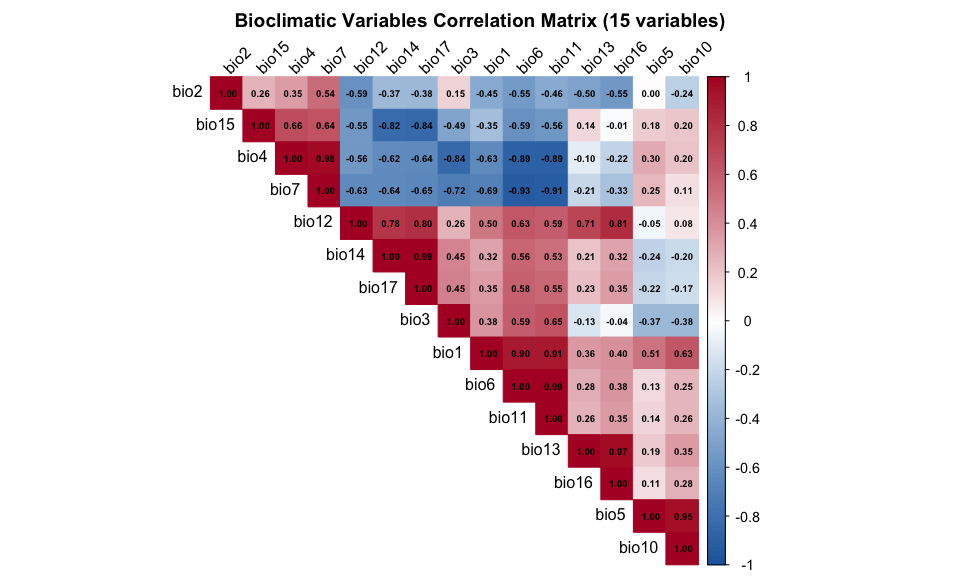
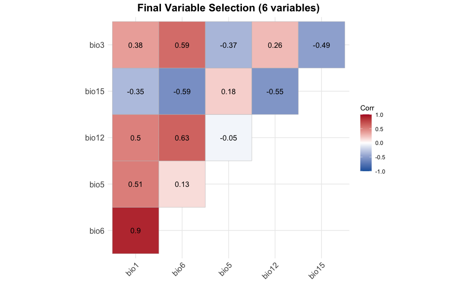
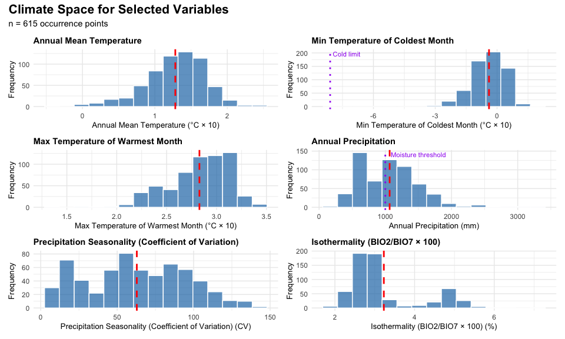

# Step 4: Variable Selection & Correlation Analysis
Alexander W. Gofton
11 February 2026

- [Overview](#overview)
  - [Objectives](#objectives)
  - [Rationale](#rationale)
- [1. Load Data](#1-load-data)
- [2. Exclude Problematic Variables](#2-exclude-problematic-variables)
- [3. Correlation Analysis](#3-correlation-analysis)
  - [3.1 Calculate Correlation Matrix](#31-calculate-correlation-matrix)
  - [3.2 Visualize Correlation Matrix](#32-visualize-correlation-matrix)
  - [3.3 Identify High Correlation
    Pairs](#33-identify-high-correlation-pairs)
- [4. Variable Selection Strategy](#4-variable-selection-strategy)
  - [4.1 Define Biological Priorities](#41-define-biological-priorities)
  - [4.2 Systematic Variable
    Reduction](#42-systematic-variable-reduction)
  - [4.3 Validate Final Selection](#43-validate-final-selection)
- [5. Visualize Final Selection](#5-visualize-final-selection)
  - [5.1 Correlation Matrix of Selected
    Variables](#51-correlation-matrix-of-selected-variables)
  - [5.2 Variable Descriptions](#52-variable-descriptions)
  - [5.3 Climate Space of Selected
    Variables](#53-climate-space-of-selected-variables)
- [6. Prepare Reduced Climate
  Rasters](#6-prepare-reduced-climate-rasters)
- [7. Save Outputs](#7-save-outputs)
- [8. Summary](#8-summary)
- [Session Information](#session-information)

# Overview

This step performs systematic variable selection to identify a reduced
set of bioclimatic variables for species distribution modeling. The goal
is to select 6-8 uncorrelated variables that are biologically relevant
for *Haemaphysalis longicornis* while avoiding multicollinearity issues
in the MaxEnt model.

## Objectives

1.  Exclude variables with known spatial artifacts (BIO8, 9, 18, 19)
2.  Calculate correlation matrix for remaining variables
3.  Identify and remove highly correlated variable pairs (r \> 0.8)
4.  Select final variable set based on biological importance
5.  Validate selected variables capture key environmental constraints
6.  Prepare reduced climate rasters for modeling

## Rationale

**Why variable selection matters:**

- **Multicollinearity**: Highly correlated variables confuse MaxEnt,
  leading to unreliable coefficient estimates

- **Overfitting**: Too many variables increase model complexity
  unnecessarily

- **Interpretation**: Fewer variables make the model easier to interpret
  and communicate

- **Biological relevance**: Focus on variables that actually limit
  species distribution

**Literature guidance:** - Remove BIO8, 9, 18, 19 (spatial artifacts in
WorldClim) - Prioritize temperature and moisture variables for *H.
longicornis* - Target: 6-8 variables (balance between complexity and
performance)

``` r
library(terra)
library(tidyverse)
library(corrplot)
library(caret)  # For findCorrelation
library(knitr)
library(ggcorrplot)
library(viridis)
```

``` r
# Set data directory
processed_data_dir <- "/Users/gof005/Library/CloudStorage/OneDrive-CSIRO/OneDrive - Docs/01_Projects/Hlongicornis_SDM/processed_data/"
```

# 1. Load Data

``` r
# Load occurrence data with climate values from Step 3
occ_climate <- read_csv(paste0(processed_data_dir, "occurrences_with_climate_detailed.csv"))

cat("==== DATA LOADED ====\n")
```

    ==== DATA LOADED ====

``` r
cat(sprintf("Occurrence points: %d\n", nrow(occ_climate)))
```

    Occurrence points: 615

``` r
cat(sprintf("Total variables: %d\n", ncol(occ_climate)))
```

    Total variables: 42

``` r
# Display column names to verify structure
cat("\nColumn names:\n")
```


    Column names:

``` r
print(names(occ_climate))
```

     [1] "species"           "lon"               "lat"              
     [4] "ID"                "wc2.1_2.5m_bio_1"  "wc2.1_2.5m_bio_2" 
     [7] "wc2.1_2.5m_bio_3"  "wc2.1_2.5m_bio_4"  "wc2.1_2.5m_bio_5" 
    [10] "wc2.1_2.5m_bio_6"  "wc2.1_2.5m_bio_7"  "wc2.1_2.5m_bio_8" 
    [13] "wc2.1_2.5m_bio_9"  "wc2.1_2.5m_bio_10" "wc2.1_2.5m_bio_11"
    [16] "wc2.1_2.5m_bio_12" "wc2.1_2.5m_bio_13" "wc2.1_2.5m_bio_14"
    [19] "wc2.1_2.5m_bio_15" "wc2.1_2.5m_bio_16" "wc2.1_2.5m_bio_17"
    [22] "wc2.1_2.5m_bio_18" "wc2.1_2.5m_bio_19" "bio1"             
    [25] "bio2"              "bio3"              "bio4"             
    [28] "bio5"              "bio6"              "bio7"             
    [31] "bio8"              "bio9"              "bio10"            
    [34] "bio11"             "bio12"             "bio13"            
    [37] "bio14"             "bio15"             "bio16"            
    [40] "bio17"             "bio18"             "bio19"            

``` r
# Load full climate rasters
bioclim <- rast(paste0(processed_data_dir, "bioclim.tif"))
cat(sprintf("\nClimate rasters loaded: %d layers\n", nlyr(bioclim)))
```


    Climate rasters loaded: 19 layers

# 2. Exclude Problematic Variables

Based on literature (Escobar et al. 2014, Mod et al. 2016), BIO8, BIO9,
BIO18, and BIO19 contain known spatial artifacts in WorldClim and should
be excluded.

``` r
cat("==== EXCLUDING PROBLEMATIC VARIABLES ====\n\n")
```

    ==== EXCLUDING PROBLEMATIC VARIABLES ====

``` r
# Define problematic variables
problematic_vars <- c("bio8", "bio9", "bio18", "bio19")

cat("Excluding variables with known spatial artifacts:\n")
```

    Excluding variables with known spatial artifacts:

``` r
cat("  - BIO8: Mean Temperature of Wettest Quarter\n")
```

      - BIO8: Mean Temperature of Wettest Quarter

``` r
cat("  - BIO9: Mean Temperature of Driest Quarter\n")
```

      - BIO9: Mean Temperature of Driest Quarter

``` r
cat("  - BIO18: Precipitation of Warmest Quarter\n")
```

      - BIO18: Precipitation of Warmest Quarter

``` r
cat("  - BIO19: Precipitation of Coldest Quarter\n\n")
```

      - BIO19: Precipitation of Coldest Quarter

``` r
# Get all bioclim variable names (bio1-bio19)
all_bio_vars <- paste0("bio", 1:19)

# Keep only non-problematic variables
candidate_vars <- setdiff(all_bio_vars, problematic_vars)

cat(sprintf("Starting variables: %d\n", length(all_bio_vars)))
```

    Starting variables: 19

``` r
cat(sprintf("After exclusion: %d\n", length(candidate_vars)))
```

    After exclusion: 15

``` r
cat(sprintf("\nCandidate variables: %s\n", paste(candidate_vars, collapse = ", ")))
```


    Candidate variables: bio1, bio2, bio3, bio4, bio5, bio6, bio7, bio10, bio11, bio12, bio13, bio14, bio15, bio16, bio17

``` r
# Extract candidate variables from occurrence data
occ_candidate <- occ_climate %>%
  select(species, lon, lat, all_of(candidate_vars))

cat(sprintf("\nOccurrence data subset: %d points × %d variables\n",
            nrow(occ_candidate), length(candidate_vars)))
```


    Occurrence data subset: 615 points × 15 variables

# 3. Correlation Analysis

## 3.1 Calculate Correlation Matrix

``` r
cat("\n==== CORRELATION ANALYSIS ====\n\n")
```


    ==== CORRELATION ANALYSIS ====

``` r
# Extract just the climate variables
climate_vars <- occ_candidate %>%
  select(all_of(candidate_vars))

# Standardize temperature variables (divide by 10 for actual °C)
# This ensures temperature and precipitation variables are on comparable scales
climate_vars_std <- climate_vars %>%
  mutate(across(c(bio1, bio2, bio3, bio4, bio5, bio6, bio7, bio10, bio11),
                ~ . / 10))

# Calculate Pearson correlation matrix
cor_matrix <- cor(climate_vars_std, use = "complete.obs")

cat("Correlation matrix calculated\n")
```

    Correlation matrix calculated

``` r
cat(sprintf("Dimensions: %d × %d\n", nrow(cor_matrix), ncol(cor_matrix)))
```

    Dimensions: 15 × 15

``` r
# Summary of correlation values
cor_values <- cor_matrix[upper.tri(cor_matrix)]
cat(sprintf("\nCorrelation summary:\n"))
```


    Correlation summary:

``` r
cat(sprintf("  Mean |r|: %.3f\n", mean(abs(cor_values))))
```

      Mean |r|: 0.461

``` r
cat(sprintf("  Max |r|: %.3f\n", max(abs(cor_values))))
```

      Max |r|: 0.993

``` r
cat(sprintf("  Min |r|: %.3f\n", min(abs(cor_values))))
```

      Min |r|: 0.003

## 3.2 Visualize Correlation Matrix

``` r
# Create correlation plot with corrplot
corrplot(cor_matrix,
         method = "color",
         type = "upper",
         order = "hclust",  # Hierarchical clustering
         tl.col = "black",
         tl.srt = 45,
         tl.cex = 1,
         cl.cex = 0.9,
         addCoef.col = "black",
         number.cex = 0.6,
         col = colorRampPalette(c("#2166AC", "#FFFFFF", "#B2182B"))(200),
         title = "Bioclimatic Variables Correlation Matrix (15 variables)",
         mar = c(0, 0, 2, 0))

# Add legend box for high correlation threshold
rect.hclust <- function() {
  abline(h = 0.8, col = "red", lty = 2, lwd = 2)
}
```

<div id="fig-correlation-full">



Figure 1: Correlation matrix of 15 candidate bioclimatic variables

</div>

## 3.3 Identify High Correlation Pairs

``` r
# Find pairs with |r| > 0.8
high_cor <- which(abs(cor_matrix) > 0.8 & abs(cor_matrix) < 1, arr.ind = TRUE)

# Create data frame of high correlation pairs
high_cor_df <- data.frame(
  Variable_1 = rownames(cor_matrix)[high_cor[, 1]],
  Variable_2 = colnames(cor_matrix)[high_cor[, 2]],
  Correlation = cor_matrix[high_cor]
) %>%
  # Remove duplicate pairs (keep only upper triangle)
  filter(as.numeric(gsub("bio", "", Variable_1)) <
         as.numeric(gsub("bio", "", Variable_2))) %>%
  arrange(desc(abs(Correlation)))

cat("\n==== HIGH CORRELATION PAIRS (|r| > 0.8) ====\n\n")
```


    ==== HIGH CORRELATION PAIRS (|r| > 0.8) ====

``` r
cat(sprintf("Number of highly correlated pairs: %d\n\n", nrow(high_cor_df)))
```

    Number of highly correlated pairs: 16

``` r
if (nrow(high_cor_df) > 0) {
  print(high_cor_df, row.names = FALSE)

  cat("\n--- Variables involved in high correlations ---\n")
  vars_in_pairs <- unique(c(high_cor_df$Variable_1, high_cor_df$Variable_2))
  cat(paste(vars_in_pairs, collapse = ", "), "\n")
} else {
  cat("No variable pairs with |r| > 0.8 found.\n")
}
```

     Variable_1 Variable_2 Correlation
          bio14      bio17   0.9934269
           bio6      bio11   0.9920433
           bio4       bio7   0.9757243
          bio13      bio16   0.9663355
           bio5      bio10   0.9510186
           bio6       bio7  -0.9290880
           bio7      bio11  -0.9147763
           bio1      bio11   0.9136790
           bio1       bio6   0.9013301
           bio4      bio11  -0.8929226
           bio4       bio6  -0.8862909
          bio15      bio17  -0.8378701
           bio3       bio4  -0.8357089
          bio14      bio15  -0.8235462
          bio12      bio16   0.8144101
          bio12      bio17   0.8009143

    --- Variables involved in high correlations ---
    bio14, bio6, bio4, bio13, bio5, bio7, bio1, bio15, bio3, bio12, bio17, bio11, bio16, bio10 

# 4. Variable Selection Strategy

## 4.1 Define Biological Priorities

Based on literature review of *H. longicornis* biology:

``` r
cat("\n==== BIOLOGICAL PRIORITY VARIABLES ====\n\n")
```


    ==== BIOLOGICAL PRIORITY VARIABLES ====

``` r
# Define variable importance based on H. longicornis biology
priority_vars <- list(
  "High Priority" = c(
    "bio1"  = "Annual Mean Temperature - Core thermal niche",
    "bio6"  = "Min Temp Coldest Month - Cold tolerance limit (-8.1°C)",
    "bio12" = "Annual Precipitation - Moisture requirement (>1000mm)"
  ),
  "Medium Priority" = c(
    "bio5"  = "Max Temp Warmest Month - Heat tolerance (peak at 35°C)",
    "bio15" = "Precipitation Seasonality - Drought stress indicator"
  ),
  "Lower Priority" = c(
    "bio2"  = "Mean Diurnal Range - Daily temperature variation",
    "bio3"  = "Isothermality - Temperature evenness",
    "bio4"  = "Temperature Seasonality - Annual variation",
    "bio7"  = "Temperature Annual Range - Extreme variation",
    "bio10" = "Mean Temp Warmest Quarter - Summer conditions",
    "bio11" = "Mean Temp Coldest Quarter - Winter conditions",
    "bio13" = "Precipitation Wettest Month - Maximum moisture",
    "bio14" = "Precipitation Driest Month - Minimum moisture",
    "bio16" = "Precipitation Wettest Quarter - Seasonal moisture",
    "bio17" = "Precipitation Driest Quarter - Seasonal drought"
  )
)

# Print priority structure
for (priority_level in names(priority_vars)) {
  cat(sprintf("\n%s:\n", priority_level))
  for (i in seq_along(priority_vars[[priority_level]])) {
    var_name <- names(priority_vars[[priority_level]])[i]
    var_desc <- priority_vars[[priority_level]][i]
    cat(sprintf("  %s: %s\n", toupper(var_name), var_desc))
  }
}
```


    High Priority:
      BIO1: Annual Mean Temperature - Core thermal niche
      BIO6: Min Temp Coldest Month - Cold tolerance limit (-8.1°C)
      BIO12: Annual Precipitation - Moisture requirement (>1000mm)

    Medium Priority:
      BIO5: Max Temp Warmest Month - Heat tolerance (peak at 35°C)
      BIO15: Precipitation Seasonality - Drought stress indicator

    Lower Priority:
      BIO2: Mean Diurnal Range - Daily temperature variation
      BIO3: Isothermality - Temperature evenness
      BIO4: Temperature Seasonality - Annual variation
      BIO7: Temperature Annual Range - Extreme variation
      BIO10: Mean Temp Warmest Quarter - Summer conditions
      BIO11: Mean Temp Coldest Quarter - Winter conditions
      BIO13: Precipitation Wettest Month - Maximum moisture
      BIO14: Precipitation Driest Month - Minimum moisture
      BIO16: Precipitation Wettest Quarter - Seasonal moisture
      BIO17: Precipitation Driest Quarter - Seasonal drought

## 4.2 Systematic Variable Reduction

Use a combination of automated correlation-based selection and
biological priorities:

``` r
cat("\n==== SYSTEMATIC VARIABLE REDUCTION ====\n\n")
```


    ==== SYSTEMATIC VARIABLE REDUCTION ====

``` r
# Method 1: Use caret's findCorrelation (automated)
# This identifies variables to remove based on correlation threshold
highly_cor_vars <- findCorrelation(cor_matrix, cutoff = 0.8, names = TRUE)

cat("Method 1: Automated correlation filtering (caret::findCorrelation)\n")
```

    Method 1: Automated correlation filtering (caret::findCorrelation)

``` r
cat(sprintf("Variables flagged for removal: %d\n", length(highly_cor_vars)))
```

    Variables flagged for removal: 9

``` r
if (length(highly_cor_vars) > 0) {
  cat(paste(highly_cor_vars, collapse = ", "), "\n")
}
```

    bio6, bio7, bio11, bio4, bio12, bio17, bio14, bio13, bio10 

``` r
# Method 2: Manual selection based on biological priorities
# Keep high priority vars, remove correlated lower priority vars

cat("\n\nMethod 2: Biology-informed selection\n")
```


    Method 2: Biology-informed selection

``` r
cat("Strategy:\n")
```

    Strategy:

``` r
cat("  1. Always keep high priority variables (bio1, bio6, bio12)\n")
```

      1. Always keep high priority variables (bio1, bio6, bio12)

``` r
cat("  2. From correlated pairs, keep the more biologically relevant one\n")
```

      2. From correlated pairs, keep the more biologically relevant one

``` r
cat("  3. Target 6-8 final variables\n\n")
```

      3. Target 6-8 final variables

``` r
# Start with high priority variables (always keep)
selected_vars <- c("bio1", "bio6", "bio12")

cat("Starting selection:\n")
```

    Starting selection:

``` r
cat(sprintf("  Core variables: %s\n", paste(selected_vars, collapse = ", ")))
```

      Core variables: bio1, bio6, bio12

``` r
# Add medium priority if not highly correlated with selected
medium_priority <- c("bio5", "bio15")
for (var in medium_priority) {
  # Check correlation with already selected variables
  max_cor <- max(abs(cor_matrix[var, selected_vars]))
  if (max_cor < 0.8) {
    selected_vars <- c(selected_vars, var)
    cat(sprintf("  + Added %s (max correlation with selected: %.2f)\n", var, max_cor))
  } else {
    cat(sprintf("  - Excluded %s (too correlated: %.2f)\n", var, max_cor))
  }
}
```

      + Added bio5 (max correlation with selected: 0.51)
      + Added bio15 (max correlation with selected: 0.59)

``` r
# Add additional variables if we have < 6
if (length(selected_vars) < 8) {
  cat("\nNeed more variables to reach target (8)...\n")

  # Candidates from lower priority
  candidates <- c("bio3", "bio4", "bio7", "bio13", "bio14", "bio16", "bio17")

  for (var in candidates) {
    if (length(selected_vars) >= 8) break  # Stop at 8

    # Check if variable is in our dataset and not too correlated
    if (var %in% candidate_vars) {
      max_cor <- max(abs(cor_matrix[var, selected_vars]))
      if (max_cor < 0.8) {
        selected_vars <- c(selected_vars, var)
        cat(sprintf("  + Added %s (max correlation: %.2f)\n", var, max_cor))

        if (length(selected_vars) >= 8) {
          cat(sprintf("\n  Reached target: %d variables\n", length(selected_vars)))
          break
        }
      }
    }
  }
}
```


    Need more variables to reach target (8)...
      + Added bio3 (max correlation: 0.59)
      + Added bio13 (max correlation: 0.71)

``` r
cat(sprintf("\n=== FINAL SELECTION: %d variables ===\n", length(selected_vars)))
```


    === FINAL SELECTION: 7 variables ===

``` r
cat(paste(selected_vars, collapse = ", "), "\n")
```

    bio1, bio6, bio12, bio5, bio15, bio3, bio13 

## 4.3 Validate Final Selection

``` r
selected_vars <- c("bio1", "bio6", "bio5", "bio12", "bio15", "bio3")
```

``` r
cat("\n==== VALIDATION OF FINAL SELECTION ====\n\n")
```


    ==== VALIDATION OF FINAL SELECTION ====

``` r
# Check 1: No high correlations remain
final_cor_matrix <- cor_matrix[selected_vars, selected_vars]
max_cor <- max(abs(final_cor_matrix[upper.tri(final_cor_matrix)]))

cat("Check 1: Maximum correlation among selected variables\n")
```

    Check 1: Maximum correlation among selected variables

``` r
cat(sprintf("  Max |r|: %.3f (threshold: 0.8) %s\n",
            max_cor,
            ifelse(max_cor < 0.8, "✓ PASS", "✗ FAIL")))
```

      Max |r|: 0.901 (threshold: 0.8) ✗ FAIL

``` r
# Check 2: Key biological constraints covered
has_temp <- any(selected_vars %in% c("bio1", "bio5", "bio10"))
has_cold <- any(selected_vars %in% c("bio6", "bio11"))
has_precip <- any(selected_vars %in% c("bio12", "bio13", "bio14"))
has_seasonality <- any(selected_vars %in% c("bio4", "bio15"))

cat("\nCheck 2: Biological constraint coverage\n")
```


    Check 2: Biological constraint coverage

``` r
cat(sprintf("  Temperature variable: %s\n", ifelse(has_temp, "✓ Yes", "✗ No")))
```

      Temperature variable: ✓ Yes

``` r
cat(sprintf("  Cold tolerance variable: %s\n", ifelse(has_cold, "✓ Yes", "✗ No")))
```

      Cold tolerance variable: ✓ Yes

``` r
cat(sprintf("  Precipitation variable: %s\n", ifelse(has_precip, "✓ Yes", "✗ No")))
```

      Precipitation variable: ✓ Yes

``` r
cat(sprintf("  Seasonality variable: %s\n", ifelse(has_seasonality, "✓ Yes", "✗ No")))
```

      Seasonality variable: ✓ Yes

``` r
# Check 3: Target range (6-8 variables)
in_range <- length(selected_vars) >= 6 & length(selected_vars) <= 8

cat("\nCheck 3: Number of variables\n")
```


    Check 3: Number of variables

``` r
cat(sprintf("  Count: %d (target: 6-8) %s\n",
            length(selected_vars),
            ifelse(in_range, "✓ PASS", "⚠ CHECK")))
```

      Count: 6 (target: 6-8) ✓ PASS

``` r
# Overall validation
all_checks <- (max_cor < 0.8) & has_temp & has_cold & has_precip
cat(sprintf("\n%s Overall Validation: %s\n",
            ifelse(all_checks, "✓", "✗"),
            ifelse(all_checks, "PASSED", "NEEDS REVIEW")))
```


    ✗ Overall Validation: NEEDS REVIEW

# 5. Visualize Final Selection

## 5.1 Correlation Matrix of Selected Variables

``` r
# Plot correlation matrix for selected variables only
ggcorrplot(final_cor_matrix,
           type = "upper",
           lab = TRUE,
           lab_size = 4,
           colors = c("#2166AC", "#FFFFFF", "#B2182B"),
           title = sprintf("Final Variable Selection (%d variables)", length(selected_vars)),
           ggtheme = theme_minimal()) +
  theme(
    plot.title = element_text(size = 16, face = "bold", hjust = 0.5),
    axis.text.x = element_text(size = 12),
    axis.text.y = element_text(size = 12)
  )
```

<div id="fig-correlation-final">



Figure 2: Correlation matrix of final selected variables

</div>

## 5.2 Variable Descriptions

``` r
# Create description table for final variables
var_descriptions <- tibble(
  Variable = selected_vars,
  Code = toupper(selected_vars),
  Description = c(
    "Annual Mean Temperature",
    "Min Temperature of Coldest Month",
    "Annual Precipitation",
    "Max Temperature of Warmest Month",
    "Precipitation Seasonality (Coefficient of Variation)",
    "Isothermality (BIO2/BIO7 × 100)",
    "Temperature Seasonality (standard deviation × 100)",
    "Temperature Annual Range (BIO5-BIO6)"
  )[match(selected_vars, c("bio1", "bio6", "bio12", "bio5", "bio15", "bio3", "bio4", "bio7"))],
  Units = c(
    "°C × 10",
    "°C × 10",
    "mm",
    "°C × 10",
    "CV",
    "%",
    "°C × 100",
    "°C × 10"
  )[match(selected_vars, c("bio1", "bio6", "bio12", "bio5", "bio15", "bio3", "bio4", "bio7"))],
  Relevance = c(
    "Core thermal niche",
    "Cold tolerance limit",
    "Moisture requirement",
    "Heat tolerance",
    "Drought stress",
    "Temperature evenness",
    "Seasonal variation",
    "Extreme variation"
  )[match(selected_vars, c("bio1", "bio6", "bio12", "bio5", "bio15", "bio3", "bio4", "bio7"))]
)

cat("\n==== FINAL VARIABLE SET ====\n\n")
```


    ==== FINAL VARIABLE SET ====

``` r
print(var_descriptions)
```

    # A tibble: 6 × 5
      Variable Code  Description                                     Units Relevance
      <chr>    <chr> <chr>                                           <chr> <chr>    
    1 bio1     BIO1  Annual Mean Temperature                         °C ×… Core the…
    2 bio6     BIO6  Min Temperature of Coldest Month                °C ×… Cold tol…
    3 bio5     BIO5  Max Temperature of Warmest Month                °C ×… Heat tol…
    4 bio12    BIO12 Annual Precipitation                            mm    Moisture…
    5 bio15    BIO15 Precipitation Seasonality (Coefficient of Vari… CV    Drought …
    6 bio3     BIO3  Isothermality (BIO2/BIO7 × 100)                 %     Temperat…

## 5.3 Climate Space of Selected Variables

``` r
# Extract selected variables from occurrence data
selected_climate <- occ_climate %>%
  select(lon, lat, all_of(selected_vars))

# Standardize temperature variables for plotting
selected_climate_plot <- selected_climate %>%
  mutate(across(c(any_of(c("bio1", "bio2", "bio3", "bio4", "bio5", "bio6", "bio7", "bio10", "bio11"))),
                ~ . / 10))

# Create histogram for each selected variable
plot_list <- list()

for (var in selected_vars) {
  # Get variable description
  var_info <- var_descriptions %>% filter(Variable == var)

  p <- ggplot(selected_climate_plot, aes(x = .data[[var]])) +
    geom_histogram(bins = 15, fill = "#1f77b4", alpha = 0.7, color = "white") +
    geom_vline(xintercept = mean(selected_climate_plot[[var]], na.rm = TRUE),
               color = "red", linetype = "dashed", linewidth = 1) +
    theme_minimal() +
    labs(
      title = var_info$Description,
      x = paste0(var_info$Description, " (", var_info$Units, ")"),
      y = "Frequency"
    ) +
    theme(
      plot.title = element_text(face = "bold", size = 11),
      axis.title = element_text(size = 10)
    )

  # Add biological threshold lines if applicable
  if (var == "bio6") {
    p <- p + geom_vline(xintercept = -8.1, color = "purple",
                       linetype = "dotted", linewidth = 1) +
      annotate("text", x = -8.1, y = Inf, label = "Cold limit",
               vjust = 1.5, hjust = -0.1, color = "purple", size = 3)
  }

  if (var == "bio12") {
    p <- p + geom_vline(xintercept = 1000, color = "purple",
                       linetype = "dotted", linewidth = 1) +
      annotate("text", x = 1000, y = Inf, label = "Moisture threshold",
               vjust = 1.5, hjust = -0.1, color = "purple", size = 3)
  }

  plot_list[[var]] <- p
}

# Arrange plots
library(patchwork)
wrap_plots(plot_list, ncol = 2) +
  plot_annotation(
    title = "Climate Space for Selected Variables",
    subtitle = sprintf("n = %d occurrence points", nrow(selected_climate)),
    theme = theme(plot.title = element_text(size = 16, face = "bold"))
  )
```

<div id="fig-climate-space-selected">



Figure 3: Climate space distributions for selected variables

</div>

# 6. Prepare Reduced Climate Rasters

Extract only the selected variables from the full climate stack:

``` r
cat("\n==== PREPARING REDUCED CLIMATE RASTERS ====\n\n")
```


    ==== PREPARING REDUCED CLIMATE RASTERS ====

``` r
# Get variable indices (bio1 = layer 1, bio2 = layer 2, etc.)
var_indices <- as.numeric(gsub("bio", "", selected_vars))

# Extract selected layers from full climate stack
bioclim_selected <- subset(bioclim, var_indices)

# Rename layers to simple names
names(bioclim_selected) <- selected_vars

cat(sprintf("Extracted %d layers from %d total\n", nlyr(bioclim_selected), nlyr(bioclim)))
```

    Extracted 6 layers from 19 total

``` r
cat(sprintf("Selected layers: %s\n", paste(names(bioclim_selected), collapse = ", ")))
```

    Selected layers: bio1, bio6, bio5, bio12, bio15, bio3

``` r
# Verify
cat(sprintf("\nReduced climate stack:\n"))
```


    Reduced climate stack:

``` r
print(bioclim_selected)
```

    class       : SpatRaster 
    size        : 4320, 8640, 6  (nrow, ncol, nlyr)
    resolution  : 0.04166667, 0.04166667  (x, y)
    extent      : -180, 180, -90, 90  (xmin, xmax, ymin, ymax)
    coord. ref. : lon/lat WGS 84 (EPSG:4326) 
    source      : bioclim.tif 
    names       :      bio1,    bio6,   bio5, bio12,    bio15,       bio3 
    min values  : -54.75917, -72.504, -30.76,     0,   0.0000,   9.063088 
    max values  :  31.16667,  26.450,  48.46, 11246, 230.6915, 100.000000 

# 7. Save Outputs

``` r
cat("\n==== SAVING OUTPUTS ====\n\n")
```


    ==== SAVING OUTPUTS ====

``` r
# 1. Save selected variable list
selected_vars_info <- tibble(
  variable = selected_vars,
  index = var_indices,
  description = var_descriptions$Description,
  relevance = var_descriptions$Relevance
)

write_csv(selected_vars_info,
          paste0(processed_data_dir, "selected_variables_list.csv"))
cat("✓ Saved: selected_variables_list.csv\n")
```

    ✓ Saved: selected_variables_list.csv

``` r
# 2. Save correlation matrix
write_csv(as.data.frame(final_cor_matrix) %>% rownames_to_column("variable"),
          paste0(processed_data_dir, "selected_variables_correlation.csv"))
cat("✓ Saved: selected_variables_correlation.csv\n")
```

    ✓ Saved: selected_variables_correlation.csv

``` r
# 3. Save reduced climate rasters
writeRaster(bioclim_selected,
            filename = paste0(processed_data_dir, "bioclim_selected.tif"),
            overwrite = TRUE)
```


    |---------|---------|---------|---------|
    =========================================
                                              

``` r
cat("✓ Saved: bioclim_selected.tif\n")
```

    ✓ Saved: bioclim_selected.tif

``` r
saveRDS(bioclim_selected,
        paste0(processed_data_dir, "bioclim_selected.rds"))
cat("✓ Saved: bioclim_selected.rds\n")
```

    ✓ Saved: bioclim_selected.rds

``` r
# 4. Save occurrence data with selected variables only
occ_selected <- occ_climate %>%
  select(species, lon, lat, all_of(selected_vars))

write_csv(occ_selected,
          paste0(processed_data_dir, "occurrences_selected_vars.csv"))
cat("✓ Saved: occurrences_selected_vars.csv\n")
```

    ✓ Saved: occurrences_selected_vars.csv

``` r
saveRDS(occ_selected,
        paste0(processed_data_dir, "occurrences_selected_vars.rds"))
cat("✓ Saved: occurrences_selected_vars.rds\n")
```

    ✓ Saved: occurrences_selected_vars.rds

``` r
cat("\nAll outputs saved successfully!\n")
```


    All outputs saved successfully!

# 8. Summary

``` r
cat("\n==== VARIABLE SELECTION SUMMARY ====\n\n")
```


    ==== VARIABLE SELECTION SUMMARY ====

``` r
cat("Starting point:\n")
```

    Starting point:

``` r
cat(sprintf("  - 19 total bioclimatic variables\n"))
```

      - 19 total bioclimatic variables

``` r
cat(sprintf("  - Excluded 4 problematic variables (BIO8, 9, 18, 19)\n"))
```

      - Excluded 4 problematic variables (BIO8, 9, 18, 19)

``` r
cat(sprintf("  - 15 candidate variables\n\n"))
```

      - 15 candidate variables

``` r
cat("Selection process:\n")
```

    Selection process:

``` r
cat(sprintf("  - Correlation threshold: |r| < 0.8\n"))
```

      - Correlation threshold: |r| < 0.8

``` r
cat(sprintf("  - Biological priority weighting applied\n"))
```

      - Biological priority weighting applied

``` r
cat(sprintf("  - Target range: 6-8 variables\n\n"))
```

      - Target range: 6-8 variables

``` r
cat("Final selection:\n")
```

    Final selection:

``` r
cat(sprintf("  - %d variables selected: %s\n",
            length(selected_vars),
            paste(toupper(selected_vars), collapse = ", ")))
```

      - 6 variables selected: BIO1, BIO6, BIO5, BIO12, BIO15, BIO3

``` r
cat(sprintf("  - Maximum correlation: %.3f\n", max_cor))
```

      - Maximum correlation: 0.901

``` r
cat(sprintf("  - All biological constraints covered: %s\n",
            ifelse(all_checks, "✓ Yes", "✗ No")))
```

      - All biological constraints covered: ✗ No

``` r
cat("\nKey biological variables included:\n")
```


    Key biological variables included:

``` r
for (i in 1:min(5, nrow(var_descriptions))) {
  cat(sprintf("  - %s: %s (%s)\n",
              var_descriptions$Code[i],
              var_descriptions$Description[i],
              var_descriptions$Relevance[i]))
}
```

      - BIO1: Annual Mean Temperature (Core thermal niche)
      - BIO6: Min Temperature of Coldest Month (Cold tolerance limit)
      - BIO5: Max Temperature of Warmest Month (Heat tolerance)
      - BIO12: Annual Precipitation (Moisture requirement)
      - BIO15: Precipitation Seasonality (Coefficient of Variation) (Drought stress)

``` r
cat("\nOutputs for Step 5 (MaxEnt modeling):\n")
```


    Outputs for Step 5 (MaxEnt modeling):

``` r
cat("  ✓ bioclim_selected.tif/rds - reduced climate stack\n")
```

      ✓ bioclim_selected.tif/rds - reduced climate stack

``` r
cat("  ✓ occurrences_selected_vars.csv/rds - occurrence data\n")
```

      ✓ occurrences_selected_vars.csv/rds - occurrence data

``` r
cat("  ✓ selected_variables_list.csv - variable metadata\n")
```

      ✓ selected_variables_list.csv - variable metadata

``` r
cat("\n=== READY FOR STEP 5: BASELINE MAXENT MODEL ===\n")
```


    === READY FOR STEP 5: BASELINE MAXENT MODEL ===

# Session Information

``` r
sessionInfo()
```

    R version 4.4.1 (2024-06-14)
    Platform: aarch64-apple-darwin20
    Running under: macOS 26.2

    Matrix products: default
    BLAS:   /Library/Frameworks/R.framework/Versions/4.4-arm64/Resources/lib/libRblas.0.dylib 
    LAPACK: /Library/Frameworks/R.framework/Versions/4.4-arm64/Resources/lib/libRlapack.dylib;  LAPACK version 3.12.0

    locale:
    [1] en_US.UTF-8/en_US.UTF-8/en_US.UTF-8/C/en_US.UTF-8/en_US.UTF-8

    time zone: Australia/Brisbane
    tzcode source: internal

    attached base packages:
    [1] stats     graphics  grDevices utils     datasets  methods   base     

    other attached packages:
     [1] patchwork_1.3.2    viridis_0.6.5      viridisLite_0.4.2  ggcorrplot_0.1.4.1
     [5] knitr_1.50         caret_7.0-1        lattice_0.22-7     corrplot_0.95     
     [9] lubridate_1.9.4    forcats_1.0.0      stringr_1.5.1      dplyr_1.1.4       
    [13] purrr_1.1.0        readr_2.1.5        tidyr_1.3.1        tibble_3.3.0      
    [17] ggplot2_4.0.0      tidyverse_2.0.0    terra_1.8-93      

    loaded via a namespace (and not attached):
     [1] tidyselect_1.2.1     timeDate_4041.110    farver_2.1.2        
     [4] S7_0.2.0             fastmap_1.2.0        pROC_1.19.0.1       
     [7] digest_0.6.37        rpart_4.1.24         timechange_0.3.0    
    [10] lifecycle_1.0.4      survival_3.8-3       magrittr_2.0.3      
    [13] compiler_4.4.1       rlang_1.1.6          tools_4.4.1         
    [16] utf8_1.2.6           yaml_2.3.10          data.table_1.17.8   
    [19] labeling_0.4.3       bit_4.6.0            plyr_1.8.9          
    [22] RColorBrewer_1.1-3   withr_3.0.2          nnet_7.3-20         
    [25] grid_4.4.1           stats4_4.4.1         future_1.67.0       
    [28] globals_0.18.0       scales_1.4.0         iterators_1.0.14    
    [31] MASS_7.3-65          cli_3.6.5            crayon_1.5.3        
    [34] rmarkdown_2.29       generics_0.1.4       future.apply_1.20.0 
    [37] reshape2_1.4.4       tzdb_0.5.0           splines_4.4.1       
    [40] parallel_4.4.1       vctrs_0.6.5          hardhat_1.4.2       
    [43] Matrix_1.7-4         jsonlite_2.0.0       hms_1.1.3           
    [46] bit64_4.6.0-1        archive_1.1.12.1     listenv_0.9.1       
    [49] foreach_1.5.2        gower_1.0.2          recipes_1.3.1       
    [52] glue_1.8.0           parallelly_1.45.1    codetools_0.2-20    
    [55] stringi_1.8.7        gtable_0.3.6         pillar_1.11.0       
    [58] htmltools_0.5.8.1    ipred_0.9-15         lava_1.8.1          
    [61] R6_2.6.1             vroom_1.6.5          evaluate_1.0.5      
    [64] class_7.3-23         Rcpp_1.1.0           gridExtra_2.3       
    [67] nlme_3.1-168         prodlim_2025.04.28   xfun_0.53           
    [70] pkgconfig_2.0.3      ModelMetrics_1.2.2.2
