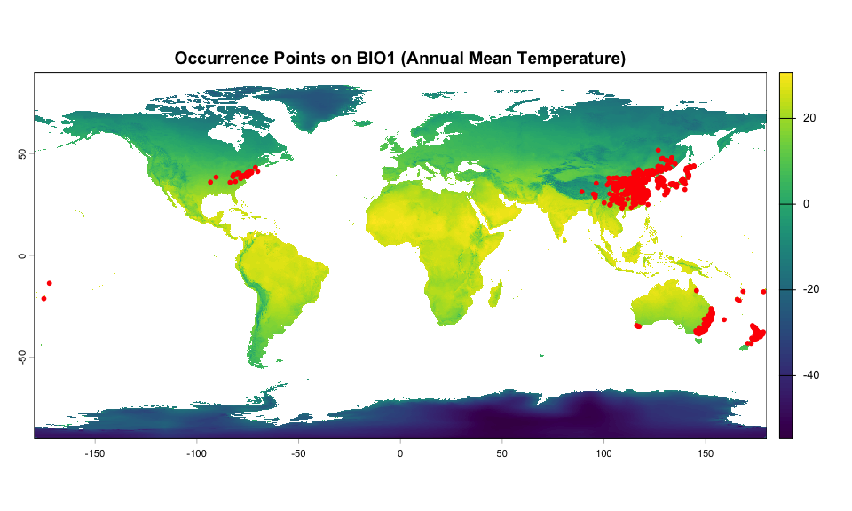
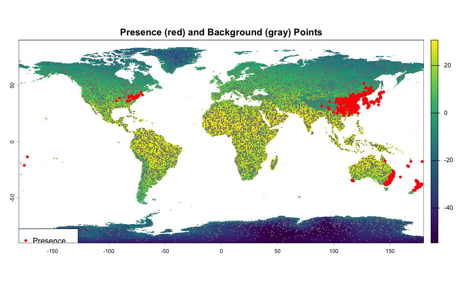
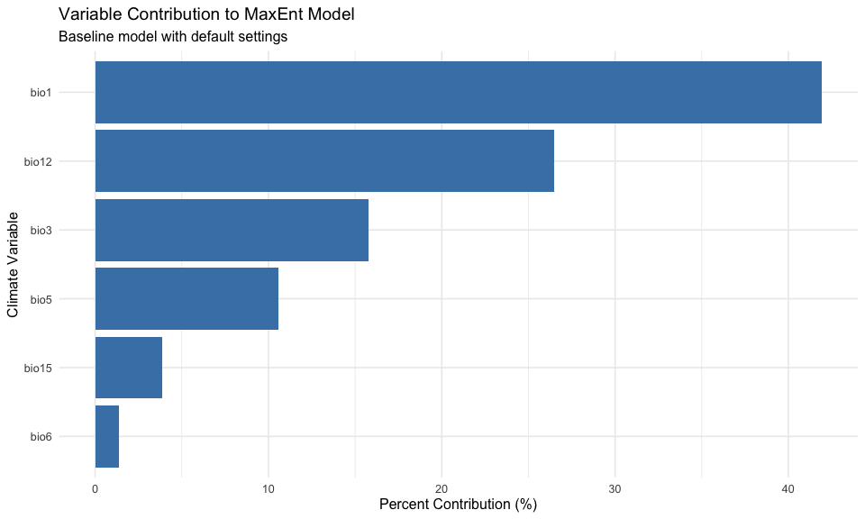
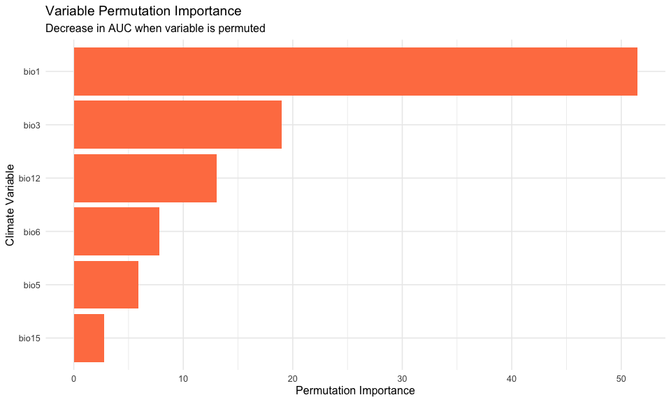
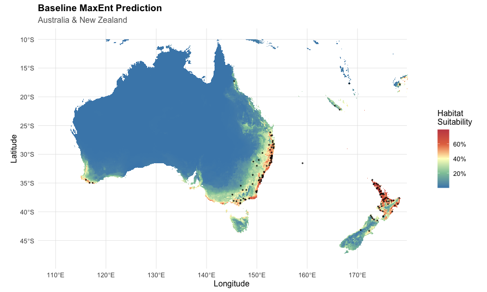
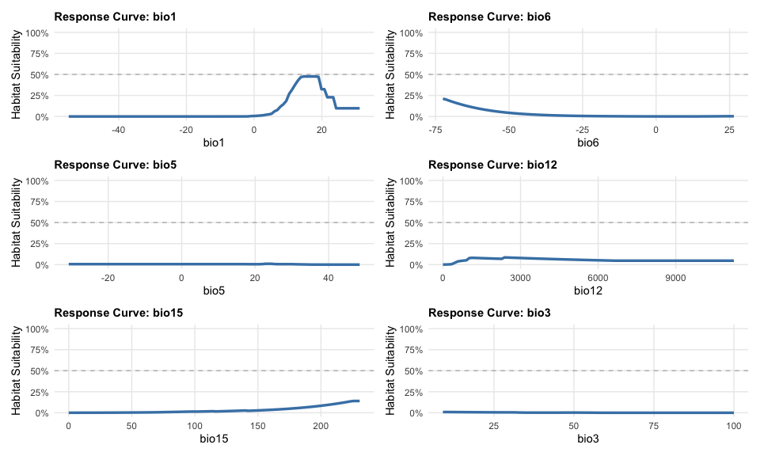

# Step 5: Baseline MaxEnt Model
Alexander W. Gofton
11 February 2026

- [Overview](#overview)
- [Setup](#setup)
- [Load Data](#load-data)
- [Prepare Presence Data](#prepare-presence-data)
- [Generate Background Points](#generate-background-points)
- [Extract Climate Values](#extract-climate-values)
- [Train-Test Split](#train-test-split)
- [Build Baseline MaxEnt Model](#build-baseline-maxent-model)
- [Model Evaluation - AUC](#model-evaluation---auc)
- [Variable Importance](#variable-importance)
- [Generate Predictions - Australia/NZ
  Focus](#generate-predictions---australianz-focus)
- [Response Curves](#response-curves)
- [Jackknife Analysis](#jackknife-analysis)
- [Save Model and Results](#save-model-and-results)
- [Summary and Next Steps](#summary-and-next-steps)
- [Session Information](#session-information)

## Overview

This script builds a baseline MaxEnt species distribution model for
*Haemaphysalis longicornis* using:

- **56 global occurrence points** (Australia, Asia, NZ, USA)
- **6 selected climate variables** (bio1, bio6, bio5, bio12, bio15,
  bio3)
- **Default MaxEnt settings** as a baseline for later optimization

The model is trained on global data to capture the full climate niche
and reduce extrapolation risk when projecting to future climates.

## Setup

``` r
library(tidyverse)
library(terra)
library(predicts)  # Modern MaxEnt implementation (replaces dismo)
library(rJava)  # Required for MaxEnt backend
library(beepr)

# Define directories
processed_data_dir <-
  "~/Library/CloudStorage/OneDrive-CSIRO/OneDrive - Docs/01_Projects/Hlongicornis_SDM/processed_data/"
figures_dir <- "~/Library/CloudStorage/OneDrive-CSIRO/OneDrive - Docs/01_Projects/Hlongicornis_SDM/figures/"
```

## Load Data

``` r
# Load selected climate variables (global extent)
bioclim_selected <- readRDS(paste0(processed_data_dir, "bioclim_selected.rds"))

# Load occurrence data with selected variables
occurrences <- readRDS(paste0(processed_data_dir, "occurrences_selected_vars.rds"))

# Check data
cat("Climate layers loaded:", nlyr(bioclim_selected), "\n")
```

    Climate layers loaded: 6 

``` r
cat("Layer names:", names(bioclim_selected), "\n\n")
```

    Layer names: bio1 bio6 bio5 bio12 bio15 bio3 

``` r
cat("Occurrence points:", nrow(occurrences), "\n")
```

    Occurrence points: 615 

``` r
cat("Columns:", paste(names(occurrences), collapse = ", "), "\n")
```

    Columns: species, lon, lat, bio1, bio6, bio5, bio12, bio15, bio3 

``` r
# View first few records
head(occurrences)
```

    # A tibble: 6 × 9
      species         lon   lat  bio1  bio6  bio5 bio12 bio15  bio3
      <chr>         <dbl> <dbl> <dbl> <dbl> <dbl> <dbl> <dbl> <dbl>
    1 H_longicornis  153. -31.1  18.7  6.48  28.4  1289  41.9  51.3
    2 H_longicornis   NA   NA    NA   NA     NA      NA  NA    NA  
    3 H_longicornis  151. -34.7  17.0  8.18  25.1  1271  27.4  47.8
    4 H_longicornis  150. -32    16.1  2.35  30.0   680  29.2  47.5
    5 H_longicornis  150. -34.6  13.1  1.48  25.2  1019  18.6  48.3
    6 H_longicornis  153. -29.2  18.8  6.27  29.3  1050  54.9  51.0

## Prepare Presence Data

``` r
# Extract coordinates as data frame
presence_coords <- occurrences |>
  dplyr::select(lon, lat) |>
  as.data.frame()

cat("Presence coordinates prepared:", nrow(presence_coords), "points\n")
```

    Presence coordinates prepared: 615 points

``` r
cat("Longitude range:", round(min(presence_coords$lon, na.rm = TRUE), 2), "to",
    round(max(presence_coords$lon, na.rm = TRUE), 2), "\n")
```

    Longitude range: -175.18 to 178.44 

``` r
cat("Latitude range:", round(min(presence_coords$lat, na.rm = TRUE), 2), "to",
    round(max(presence_coords$lat, na.rm = TRUE), 2), "\n")
```

    Latitude range: -43.34 to 51.72 

``` r
# Quick visualization
plot(bioclim_selected[[1]], main = "Occurrence Points on BIO1 (Annual Mean Temperature)")
points(presence_coords, pch = 16, col = "red", cex = 0.8)
```



## Generate Background Points

MaxEnt requires background (pseudo-absence) points representing
available environmental conditions. We’ll sample 10,000 random points
from the accessible range.

``` r
# Set seed for reproducibility
set.seed(7990)

# Define background points file path
background_file <- paste0(processed_data_dir, "background_points.csv")

# Check if background points already generated
if(file.exists(background_file)) {
  cat("Loading existing background points from file...\n")
  background_coords <- read.csv(background_file)
} else {
  # Sample background points from non-NA cells in climate rasters
  # Using 10,000 points (standard for presence-only models)
  background_coords <- spatSample(
    bioclim_selected,
    size = 10000,
    method = "random",
    na.rm = TRUE,
    xy = TRUE,
    values = FALSE
  ) %>%
  as.data.frame() %>%
  dplyr::select(x, y) %>%
  rename(lon = x, lat = y)

  # Save background points for reproducibility
  write.csv(
    background_coords,
    paste0(processed_data_dir, "background_points.csv"),
    row.names = FALSE
    )

  beep(sound = 3)
}
```

    Loading existing background points from file...

``` r
cat("Background points generated:", nrow(background_coords), "\n")
```

    Background points generated: 10000 

``` r
cat("Longitude range:", round(min(background_coords$lon), 2), "to",
    round(max(background_coords$lon), 2), "\n")
```

    Longitude range: -179.98 to 178.81 

``` r
cat("Latitude range:", round(min(background_coords$lat), 2), "to",
    round(max(background_coords$lat), 2), "\n")
```

    Latitude range: -89.94 to 83.02 

``` r
# Visualize presence and background points
plot(bioclim_selected[[1]], main = "Presence (red) and Background (gray) Points")
points(background_coords, pch = ".", col = "gray50", cex = 2)
points(presence_coords, pch = 16, col = "red", cex = 0.8)
legend("bottomleft",
       legend = c("Presence", "Background"),
       pch = c(16, 46),
       col = c("red", "gray50"),
       pt.cex = c(0.8, 2))
```



``` r
# Save background points for reproducibility
write.csv(
  background_coords,
  paste0(
    processed_data_dir,
    "background_points.csv"
    ),
  row.names = FALSE)
```

## Extract Climate Values

``` r
# Extract climate values at presence points
presence_climate <- extract(bioclim_selected, presence_coords)

# Extract climate values at background points
background_climate <- extract(bioclim_selected, background_coords)

# Save extracted climate data
write.csv(presence_climate,
          paste0(processed_data_dir, "presence_climate.csv"),
          row.names = FALSE)

write.csv(background_climate,
          paste0(processed_data_dir, "background_climate.csv"),
          row.names = FALSE)


beep(sound = 4)
```

``` r
# Check for and remove any NA values
presence_complete <- complete.cases(presence_climate)
background_complete <- complete.cases(background_climate)

cat("Presence points with complete data:", sum(presence_complete), "/", nrow(presence_climate), "\n")
```

    Presence points with complete data: 614 / 615 

``` r
cat("Background points with complete data:", sum(background_complete), "/", nrow(background_climate), "\n")
```

    Background points with complete data: 10000 / 10000 

``` r
# Filter to complete cases
if (!all(presence_complete)) {
  cat("\nWarning: Removing", sum(!presence_complete), "presence points with missing climate data\n")
  presence_coords <- presence_coords[presence_complete, ]
  presence_climate <- presence_climate[presence_complete, ]
}
```


    Warning: Removing 1 presence points with missing climate data

``` r
if (!all(background_complete)) {
  cat("Removing", sum(!background_complete), "background points with missing climate data\n")
  background_coords <- background_coords[background_complete, ]
  background_climate <- background_climate[background_complete, ]
}
```

``` r
# Remove ID column from extracted data
presence_climate <- presence_climate %>% dplyr::select(-ID)
background_climate <- background_climate %>% dplyr::select(-ID)

cat("\nFinal sample sizes:\n")
```


    Final sample sizes:

``` r
cat("Presence:", nrow(presence_climate), "\n")
```

    Presence: 614 

``` r
cat("Background:", nrow(background_climate), "\n")
```

    Background: 10000 

## Train-Test Split

We’ll use 80% of data for training and 20% for testing to evaluate model
performance.

``` r
# Set seed for reproducibility
set.seed(7990)

# Create training/testing indices for presence data
train_indices <- sample(1:nrow(presence_coords),
                        size = round(0.8 * nrow(presence_coords)))

# Split presence data
train_presence <- presence_coords[train_indices, ]
test_presence <- presence_coords[-train_indices, ]

cat("Training presence points:", nrow(train_presence), "\n")
```

    Training presence points: 491 

``` r
cat("Testing presence points:", nrow(test_presence), "\n")
```

    Testing presence points: 123 

``` r
cat("Training proportion:", round(nrow(train_presence) / nrow(presence_coords), 2), "\n")
```

    Training proportion: 0.8 

## Build Baseline MaxEnt Model

Training MaxEnt with default settings: - Features: linear, quadratic,
product, threshold, hinge (auto-selected based on sample size) -
Regularization multiplier: β = 1 (default) - Convergence threshold:
10^-5 - Maximum iterations: 500

``` r
outputs_dir <- "~/Library/CloudStorage/OneDrive-CSIRO/OneDrive - Docs/01_Projects/Hlongicornis_SDM/outputs/"

# Define file paths
model_file <- paste0(outputs_dir, "maxent_baseline_model.rds")
results_file <- paste0(outputs_dir, "maxent_model_results.csv")
split_file <- paste0(outputs_dir, "train_test_split.rds")

# Check if all output files exist
if (file.exists(model_file) && file.exists(results_file) && file.exists(split_file)) {
  cat("Loading existing MaxEnt model from file...\n")

  # Load the saved model
  maxent_model <- readRDS(model_file)

  # Load train/test split
  split_data <- readRDS(split_file)
  train_presence <- split_data$train_presence
  test_presence <- split_data$test_presence
  train_indices <- split_data$train_indices

  cat("✓ Model loaded successfully\n")
  cat("- Training points:", nrow(train_presence), "\n")
  cat("- Testing points:", nrow(test_presence), "\n")

} else {
  cat("Training MaxEnt model...\n")
  cat("This may take a few minutes with global data...\n\n")

  # Train MaxEnt model using predicts package
  maxent_model <- MaxEnt(
    x = bioclim_selected,
    p = train_presence,
    a = background_coords,
    args = c(
      'betamultiplier=1',
      'linear=true',
      'quadratic=true',
      'product=true',
      'threshold=true',
      'hinge=true',
      'threads=4',
      'responsecurves=true',
      'jackknife=true'
    )
  )

  cat("\nMaxEnt model training complete!\n")

  # Save the trained model object
  saveRDS(maxent_model, model_file)

  # Save model results (variable importance, statistics, etc.)
  model_results <- as.data.frame(maxent_model@results)
  write.csv(model_results, results_file, row.names = TRUE)

  # Save training/test data for reproducibility
  saveRDS(list(
    train_presence = train_presence,
    test_presence = test_presence,
    train_indices = train_indices
  ), split_file)

  cat("Model outputs saved:\n")
  cat("- Model object:", model_file, "\n")
  cat("- Model results:", results_file, "\n")
  cat("- Train/test split:", split_file, "\n")

  beep(sound = 8)
}
```

    Loading existing MaxEnt model from file...
    ✓ Model loaded successfully
    - Training points: 491 
    - Testing points: 123 

``` r
# View model summary
print(maxent_model)
```

    class    : MaxEnt_model 
    variables: bio1 bio6 bio5 bio12 bio15 bio3 
    output html file no longer exists

## Model Evaluation - AUC

``` r
# Evaluate on training data using predicts::pa_evaluate()
train_eval <- pa_evaluate(
  p = train_presence,
  a = background_coords,  # Use all background points
  model = maxent_model,
  x = bioclim_selected
)

# Evaluate on test data
test_eval <- pa_evaluate(
  p = test_presence,
  a = background_coords,
  model = maxent_model,
  x = bioclim_selected
)
```

``` r
# Check the structure of the evaluation object
str(train_eval)
```

    Formal class 'paModelEvaluation' [package "predicts"] with 6 slots
      ..@ presence  : num [1:491] 0.939 0.912 0.701 0.702 0.737 ...
      ..@ absence   : num [1:10000] 1.95e-01 3.69e-05 6.53e-02 6.82e-03 3.81e-03 ...
      ..@ confusion : int [1:1494, 1:4] 491 491 491 491 491 491 491 491 491 491 ...
      .. ..- attr(*, "dimnames")=List of 2
      .. .. ..$ : NULL
      .. .. ..$ : chr [1:4] "tp" "fp" "fn" "tn"
      ..@ stats     :'data.frame':  1 obs. of  7 variables:
      .. ..$ np        : int 491
      .. ..$ na        : int 10000
      .. ..$ prevalence: num 0.0468
      .. ..$ auc       : num 0.977
      .. ..$ cor       : num 0.658
      .. ..$ pcor      : num 0
      .. ..$ ODP       : num 0.953
      ..@ tr_stats  :'data.frame':  1494 obs. of  11 variables:
      .. ..$ treshold: num [1:1494] -1.00e-04 -1.00e-04 -9.99e-05 -9.98e-05 -9.97e-05 ...
      .. ..$ kappa   : num [1:1494] 0 0 0 0 0 0 0 0 0 0 ...
      .. ..$ CCR     : num [1:1494] 0.0468 0.0468 0.0468 0.0468 0.0468 ...
      .. ..$ TPR     : num [1:1494] 1 1 1 1 1 1 1 1 1 1 ...
      .. ..$ TNR     : num [1:1494] 0 0 0 0 0 0 0 0 0 0 ...
      .. ..$ FPR     : num [1:1494] 1 1 1 1 1 1 1 1 1 1 ...
      .. ..$ FNR     : num [1:1494] 0 0 0 0 0 0 0 0 0 0 ...
      .. ..$ PPP     : num [1:1494] 0.0468 0.0468 0.0468 0.0468 0.0468 ...
      .. ..$ NPP     : num [1:1494] NaN NaN NaN NaN NaN NaN NaN NaN NaN NaN ...
      .. ..$ MCR     : num [1:1494] 0.953 0.953 0.953 0.953 0.953 ...
      .. ..$ OR      : num [1:1494] NaN NaN NaN NaN NaN NaN NaN NaN NaN NaN ...
      ..@ thresholds:'data.frame':  1 obs. of  5 variables:
      .. ..$ max_kappa       : num 0.616
      .. ..$ max_spec_sens   : num 0.283
      .. ..$ no_omission     : num 0.000498
      .. ..$ equal_prevalence: num 0.047
      .. ..$ equal_sens_spec : num 0.339

``` r
# Access AUC from the stats data frame
cat("=== Model Performance ===\n\n")
```

    === Model Performance ===

``` r
cat("Training AUC:", round(train_eval@stats$auc, 3), "\n")
```

    Training AUC: 0.977 

``` r
cat("Testing AUC:", round(test_eval@stats$auc, 3), "\n")
```

    Testing AUC: 0.976 

``` r
cat("AUC difference (train - test):", round(train_eval@stats$auc - test_eval@stats$auc, 3), "\n")
```

    AUC difference (train - test): 0 

``` r
# Interpretation
if (test_eval@stats$auc >= 0.9) {
  cat("\nInterpretation: Excellent model discrimination\n")
} else if (test_eval@stats$auc >= 0.8) {
  cat("\nInterpretation: Good model discrimination\n")
} else if (test_eval@stats$auc >= 0.7) {
  cat("\nInterpretation: Acceptable model discrimination\n")
} else {
  cat("\nInterpretation: Poor model discrimination - investigate issues\n")
}
```


    Interpretation: Excellent model discrimination

``` r
# Check for overfitting
if ((train_eval@stats$auc - test_eval@stats$auc) > 0.1) {
  cat("\nWarning: Possible overfitting detected (AUC difference > 0.1)\n")
  cat("Consider simplifying model in optimization step\n")
} else {
  cat("\nNo severe overfitting detected (AUC difference < 0.1)\n")
}
```


    No severe overfitting detected (AUC difference < 0.1)

## Variable Importance

``` r
# Extract variable contribution
var_importance <- as.data.frame(maxent_model@results) %>%
  rownames_to_column("metric") %>%
  rename(value = 2) %>%
  filter(grepl("contribution|permutation.importance", metric))

# Separate contribution and permutation importance
contributions <- var_importance %>%
  filter(grepl("contribution", metric)) %>%
  mutate(
    variable = str_remove(metric, ".contribution"),
    type = "Percent Contribution"
  ) %>%
  dplyr::select(variable, value, type)

permutation <- var_importance %>%
  filter(grepl("permutation", metric)) %>%
  mutate(
    variable = str_remove(metric, ".permutation.importance"),
    type = "Permutation Importance"
  ) %>%
  dplyr::select(variable, value, type)

# Combine
all_importance <- bind_rows(contributions, permutation)

# Print table
cat("\n=== Variable Importance ===\n\n")
```


    === Variable Importance ===

``` r
print(all_importance %>% pivot_wider(names_from = type, values_from = value), n = 20)
```

    # A tibble: 6 × 3
      variable `Percent Contribution` `Permutation Importance`
      <chr>                     <dbl>                    <dbl>
    1 bio1                      41.9                     51.5 
    2 bio12                     26.5                     13.0 
    3 bio15                      3.89                     2.76
    4 bio3                      15.8                     19.0 
    5 bio5                      10.6                      5.91
    6 bio6                       1.39                     7.81

``` r
# Plot variable contribution
ggplot(contributions, aes(x = reorder(variable, value), y = value)) +
  geom_col(fill = "steelblue") +
  coord_flip() +
  labs(
    title = "Variable Contribution to MaxEnt Model",
    subtitle = "Baseline model with default settings",
    x = "Climate Variable",
    y = "Percent Contribution (%)"
  ) +
  theme_minimal(base_size = 12)
```



``` r
ggsave(paste0(figures_dir, "05_variable_contribution.png"),
       width = 8, height = 5, dpi = 300)

# Plot permutation importance
ggplot(permutation, aes(x = reorder(variable, value), y = value)) +
  geom_col(fill = "coral") +
  coord_flip() +
  labs(
    title = "Variable Permutation Importance",
    subtitle = "Decrease in AUC when variable is permuted",
    x = "Climate Variable",
    y = "Permutation Importance"
  ) +
  theme_minimal(base_size = 12)
```



``` r
ggsave(paste0(figures_dir, "05_permutation_importance.png"),
       width = 8, height = 5, dpi = 300)
```

## Generate Predictions - Australia/NZ Focus

For detailed Australian projections, we’ll crop to Australia/NZ extent.

``` r
# Define Australia/NZ extent
# Longitude: 110°E to 180°E
# Latitude: -48°S to -10°S
aus_nz_extent <- ext(110, 180, -48, -10)

# Crop climate data to Australia/NZ
bioclim_aus <- crop(bioclim_selected, aus_nz_extent)

# Predict to Australia/NZ
prediction_aus <- predict(
  maxent_model,
  bioclim_aus,
  args = c('outputformat=logistic')
)

cat("Australia/NZ prediction raster:\n")
```

    Australia/NZ prediction raster:

``` r
print(prediction_aus)
```

    class       : SpatRaster 
    size        : 912, 1680, 1  (nrow, ncol, nlyr)
    resolution  : 0.04166667, 0.04166667  (x, y)
    extent      : 110, 180, -48, -10  (xmin, xmax, ymin, ymax)
    coord. ref. : lon/lat WGS 84 (EPSG:4326) 
    source(s)   : memory
    name        :       maxent 
    min value   : 1.698333e-05 
    max value   : 7.939028e-01 

``` r
# Save Australia/NZ prediction
writeRaster(
  prediction_aus,
  paste0(processed_data_dir, "maxent_baseline_prediction_aus.tif"),
  overwrite = TRUE
)
```

``` r
# Plot Australia/NZ prediction
library(tidyterra)

ggplot() +
  geom_spatraster(data = prediction_aus) +
  geom_point(data = presence_coords,
             aes(x = lon, y = lat),
             color = "black",
             size = 0.5,
             alpha = 0.7) +
  scale_fill_whitebox_c(
    palette = "muted",
    na.value = "transparent",
    labels = scales::percent,
    name = "Habitat\nSuitability"
  ) +
  coord_sf(xlim = c(110, 180), ylim = c(-48, -10)) +
  labs(
    title = "Baseline MaxEnt Prediction",
    subtitle = "Australia & New Zealand",
    x = "Longitude",
    y = "Latitude"
  ) +
  theme_minimal(base_size = 12) +
  theme(
    legend.position = "right",
    panel.grid.major = element_line(color = "gray90", linewidth = 0.3),
    plot.title = element_text(face = "bold", size = 14),
    plot.subtitle = element_text(color = "gray40")
  )
```



``` r
ggsave(paste0(figures_dir, "05_prediction_australia_nz.png"),
       width = 10, height = 8, dpi = 300)
```

``` r
# Leaflet map
library(leaflet)
library(leaflet.extras2)

# Convert prediction to a color palette
# First, create a color function
pal <- colorNumeric(
  palette = c("white", "darkred"),
  domain = values(prediction_aus, na.rm = TRUE),
  na.color = "transparent"
)

# Filter presence points to Australia/NZ region
aus_presence <- presence_coords |>
  filter(lon >= 110, lon <= 180, lat >= -48, lat <= -10)

# Create leaflet map
aus_map <- leaflet() |>
  addProviderTiles(providers$CartoDB.Positron) |>
  addRasterImage(
    prediction_aus,
    colors = pal,
    opacity = 0.8,
    group = "Habitat Suitability"
  ) |>
  addCircleMarkers(
    data = aus_presence,
    lng = ~lon,
    lat = ~lat,
    radius = 4,
    color = "black",
    fillColor = "black",
    fillOpacity = 0.7,
    stroke = TRUE,
    weight = 1,
    group = "Occurrence Points",
    popup = ~paste("Lon:", round(lon, 3), "<br>Lat:", round(lat, 3))
  ) |>
  addLegend(
    position = "bottomright",
    pal = pal,
    values = values(prediction_aus, na.rm = TRUE),
    title = "Habitat<br>Suitability",
    labFormat = labelFormat(
      suffix = "%",
      transform = function(x) x * 100
    )
  ) |>
  addLayersControl(
    overlayGroups = c("Habitat Suitability", "Occurrence Points"),
    options = layersControlOptions(collapsed = FALSE)
  ) |>
  setView(lng = 145, lat = -25, zoom = 4)

aus_map
```


``` r
# Save as HTML
library(htmlwidgets)
saveWidget(
  aus_map,
  file = paste0(figures_dir, "05_interactive_map_australia_nz.html"),
  selfcontained = TRUE
)
```

## Response Curves

MaxEnt generates response curves showing how predicted suitability
changes with each variable.

``` r
# Create proper response curves using MaxEnt's predict function

# Get variable names
vars <- names(bioclim_selected)

cat("Generating response curves for", length(vars), "variables...\n")
```

    Generating response curves for 6 variables...

``` r
# Create response curves
response_plots <- list()

for(var in vars) {
  cat(sprintf("  Processing %s...\n", var))

  # Get variable range from global climate data
  var_range <- global(bioclim_selected[[var]], "range", na.rm = TRUE)
  var_seq <- seq(var_range$min, var_range$max, length.out = 100)

  # Get median values for all variables
  pred_data <- as.data.frame(bioclim_selected, na.rm = TRUE)
  medians <- apply(pred_data, 2, median, na.rm = TRUE)

  # Initialize suitability vector
  suitability_values <- numeric(100)

  # For each value of the focal variable
  for(i in 1:100) {
    # Create a data frame with all variables at median except focal variable
    pred_point <- as.data.frame(t(medians))
    pred_point[[var]] <- var_seq[i]

    # Create a SpatRaster with single cell containing these values
    # Use a small extent that matches the climate data CRS
    temp_extent <- ext(c(0, 1, 0, 1))
    temp_rast_list <- list()

    for(v in vars) {
      temp_r <- rast(temp_extent, nrows=1, ncols=1, crs="EPSG:4326")
      values(temp_r) <- pred_point[[v]]
      names(temp_r) <- v
      temp_rast_list[[v]] <- temp_r
    }

    # Stack all variables
    temp_stack <- rast(temp_rast_list)

    # Predict using MaxEnt model
    pred_result <- predict(maxent_model, temp_stack, args=c('outputformat=logistic'))

    # Extract the single predicted value
    suitability_values[i] <- values(pred_result)[1]
  }

  # Create response data frame
  response_df <- data.frame(
    value = var_seq,
    suitability = suitability_values
  )

  # Create plot with better styling
  response_plots[[var]] <- ggplot(response_df, aes(x = value, y = suitability)) +
    geom_line(color = "steelblue", linewidth = 1.2) +
    geom_hline(yintercept = 0.5, linetype = "dashed", color = "gray50", alpha = 0.5) +
    labs(
      title = paste("Response Curve:", var),
      x = var,
      y = "Habitat Suitability"
    ) +
    scale_y_continuous(limits = c(0, 1), labels = scales::percent) +
    theme_minimal() +
    theme(
      plot.title = element_text(face = "bold", size = 11),
      panel.grid.minor = element_blank()
    )
}
```

      Processing bio1...
      Processing bio6...
      Processing bio5...
      Processing bio12...
      Processing bio15...
      Processing bio3...

``` r
cat("✓ Response curves generated\n")
```

    ✓ Response curves generated

``` r
# Display all plots
library(patchwork)
combined_response <- wrap_plots(response_plots, ncol = 2)

print(combined_response)
```



``` r
ggsave(paste0(figures_dir, "05_response_curves.png"),
       combined_response,
       width = 12, height = 10, dpi = 300)

cat("✓ Response curves saved to figures/05_response_curves.png\n")
```

    ✓ Response curves saved to figures/05_response_curves.png

## Jackknife Analysis

Jackknife tests show the importance of each variable by: 1. Training
with only that variable 2. Training without that variable

``` r
# Jackknife results are in the model object
# Plot using MaxEnt's built-in visualization

# Note: This creates a plot showing:
# - Dark blue bars: Model gain with only that variable
# - Light blue bars: Model gain without that variable
# - Red bar: Model gain with all variables

# The jackknife plot is automatically created during model training
# It shows which variables contain the most unique information

cat("Jackknife analysis completed during model training.\n")
```

    Jackknife analysis completed during model training.

``` r
cat("Check MaxEnt output for jackknife plots.\n")
```

    Check MaxEnt output for jackknife plots.

``` r
# Get the path to MaxEnt output directory
maxent_output_path <- maxent_model@path

cat("MaxEnt output directory:\n")
```

    MaxEnt output directory:

``` r
cat(maxent_output_path, "\n\n")
```

    /var/folders/qk/w71qnntx22g9xmst4qjsqh280000gp/T//RtmpAhSZvp/maxent/1328767348 

``` r
# List files in the MaxEnt output directory
cat("Files generated by MaxEnt:\n")
```

    Files generated by MaxEnt:

``` r
list.files(maxent_output_path, pattern = "\\.(png|html)$")
```

    character(0)

``` r
# The jackknife plots are typically named:
# - "species_jacknife.png" (for training gain)
# - "plots/species_jacknife.png" (sometimes in a plots subdirectory)

# Copy jackknife plot to your figures directory
jackknife_file <- list.files(maxent_output_path,
                              pattern = "jacknife.*\\.png$",
                              full.names = TRUE,
                              recursive = TRUE)

if (length(jackknife_file) > 0) {
  file.copy(jackknife_file[1],
            paste0(figures_dir, "05_jackknife_plot.png"),
            overwrite = TRUE)
  cat("\nJackknife plot copied to:", paste0(figures_dir, "05_jackknife_plot.png"), "\n")
} else {
  cat("\nWarning: Jackknife plot not found in MaxEnt output\n")
}
```


    Warning: Jackknife plot not found in MaxEnt output

``` r
# You can also open the HTML results file which contains all plots
html_file <- list.files(maxent_output_path,
                        pattern = "\\.html$",
                        full.names = TRUE)

if (length(html_file) > 0) {
  cat("HTML results file:", html_file[1], "\n")
  cat("Open this file in a browser to view all MaxEnt plots and results\n")
}
```

## Save Model and Results

``` r
# Save the trained model object
saveRDS(maxent_model, paste0(processed_data_dir, "maxent_baseline_model.rds"))

# Save evaluation metrics
evaluation_results <- data.frame(
  metric = c("Training AUC", "Testing AUC", "AUC Difference", "Sample Size (Training)",
             "Sample Size (Testing)", "Background Points"),
  value = c(
    round(train_eval@stats$auc, 3),
    round(test_eval@stats$auc, 3),
    round(train_eval@stats$auc - test_eval@stats$auc, 3),
    nrow(train_presence),
    nrow(test_presence),
    nrow(background_coords)
  )
)

write.csv(evaluation_results,
          paste0(processed_data_dir, "maxent_baseline_evaluation.csv"),
          row.names = FALSE)

# Save variable importance
write.csv(all_importance,
          paste0(processed_data_dir, "maxent_baseline_variable_importance.csv"),
          row.names = FALSE)

cat("\n=== Outputs Saved ===\n\n")
```


    === Outputs Saved ===

``` r
cat("Model object:", paste0(processed_data_dir, "maxent_baseline_model.rds"), "\n")
```

    Model object: ~/Library/CloudStorage/OneDrive-CSIRO/OneDrive - Docs/01_Projects/Hlongicornis_SDM/processed_data/maxent_baseline_model.rds 

``` r
cat("Global prediction:", paste0(processed_data_dir, "maxent_baseline_prediction_global.tif"), "\n")
```

    Global prediction: ~/Library/CloudStorage/OneDrive-CSIRO/OneDrive - Docs/01_Projects/Hlongicornis_SDM/processed_data/maxent_baseline_prediction_global.tif 

``` r
cat("Australia prediction:", paste0(processed_data_dir, "maxent_baseline_prediction_aus.tif"), "\n")
```

    Australia prediction: ~/Library/CloudStorage/OneDrive-CSIRO/OneDrive - Docs/01_Projects/Hlongicornis_SDM/processed_data/maxent_baseline_prediction_aus.tif 

``` r
cat("Evaluation metrics:", paste0(processed_data_dir, "maxent_baseline_evaluation.csv"), "\n")
```

    Evaluation metrics: ~/Library/CloudStorage/OneDrive-CSIRO/OneDrive - Docs/01_Projects/Hlongicornis_SDM/processed_data/maxent_baseline_evaluation.csv 

``` r
cat("Variable importance:", paste0(processed_data_dir, "maxent_baseline_variable_importance.csv"), "\n")
```

    Variable importance: ~/Library/CloudStorage/OneDrive-CSIRO/OneDrive - Docs/01_Projects/Hlongicornis_SDM/processed_data/maxent_baseline_variable_importance.csv 

``` r
cat("Background points:", paste0(processed_data_dir, "background_points.csv"), "\n")
```

    Background points: ~/Library/CloudStorage/OneDrive-CSIRO/OneDrive - Docs/01_Projects/Hlongicornis_SDM/processed_data/background_points.csv 

## Summary and Next Steps

``` r
cat("\n=== STEP 5 COMPLETE ===\n\n")
```


    === STEP 5 COMPLETE ===

``` r
cat("Baseline MaxEnt Model Summary:\n")
```

    Baseline MaxEnt Model Summary:

``` r
cat("- Training points:", nrow(train_presence), "\n")
```

    - Training points: 491 

``` r
cat("- Testing points:", nrow(test_presence), "\n")
```

    - Testing points: 123 

``` r
cat("- Background points:", nrow(background_coords), "\n")
```

    - Background points: 10000 

``` r
cat("- Climate variables:", nlyr(bioclim_selected), "\n")
```

    - Climate variables: 6 

``` r
cat("- Training AUC:", round(train_eval@stats$auc, 3), "\n")
```

    - Training AUC: 0.977 

``` r
cat("- Testing AUC:", round(test_eval@stats$auc, 3), "\n\n")
```

    - Testing AUC: 0.976 

``` r
cat("Key Findings:\n")
```

    Key Findings:

``` r
cat("1. Variable importance shows which climate factors drive distribution\n")
```

    1. Variable importance shows which climate factors drive distribution

``` r
cat("2. Response curves reveal species-environment relationships\n")
```

    2. Response curves reveal species-environment relationships

``` r
cat("3. Global predictions validate model performance across regions\n")
```

    3. Global predictions validate model performance across regions

``` r
cat("4. Australia/NZ predictions provide baseline for future comparisons\n\n")
```

    4. Australia/NZ predictions provide baseline for future comparisons

``` r
cat("Next Steps:\n")
```

    Next Steps:

``` r
cat("- Step 6: Detailed model evaluation and diagnostics\n")
```

    - Step 6: Detailed model evaluation and diagnostics

``` r
cat("- Step 7: Parameter optimization with ENMeval (test 30 model configurations)\n")
```

    - Step 7: Parameter optimization with ENMeval (test 30 model configurations)

``` r
cat("- Step 8: Final model validation with spatial cross-validation\n\n")
```

    - Step 8: Final model validation with spatial cross-validation

``` r
cat("Quality Checks to Review:\n")
```

    Quality Checks to Review:

``` r
cat("✓ Is testing AUC > 0.7? (Acceptable discrimination)\n")
```

    ✓ Is testing AUC > 0.7? (Acceptable discrimination)

``` r
cat("✓ Is AUC difference < 0.1? (No severe overfitting)\n")
```

    ✓ Is AUC difference < 0.1? (No severe overfitting)

``` r
cat("✓ Do predictions show high suitability in eastern Australia?\n")
```

    ✓ Do predictions show high suitability in eastern Australia?

``` r
cat("✓ Do predictions show low suitability in arid interior?\n")
```

    ✓ Do predictions show low suitability in arid interior?

``` r
cat("✓ Are most important variables biologically sensible?\n")
```

    ✓ Are most important variables biologically sensible?

## Session Information

``` r
sessionInfo()
```

    R version 4.4.1 (2024-06-14)
    Platform: aarch64-apple-darwin20
    Running under: macOS 26.2

    Matrix products: default
    BLAS:   /Library/Frameworks/R.framework/Versions/4.4-arm64/Resources/lib/libRblas.0.dylib 
    LAPACK: /Library/Frameworks/R.framework/Versions/4.4-arm64/Resources/lib/libRlapack.dylib;  LAPACK version 3.12.0

    locale:
    [1] en_US.UTF-8/en_US.UTF-8/en_US.UTF-8/C/en_US.UTF-8/en_US.UTF-8

    time zone: Australia/Brisbane
    tzcode source: internal

    attached base packages:
    [1] stats     graphics  grDevices utils     datasets  methods   base     

    other attached packages:
     [1] patchwork_1.3.2       htmlwidgets_1.6.4     leaflet.extras2_1.3.2
     [4] leaflet_2.2.3         tidyterra_1.0.0       beepr_2.0            
     [7] rJava_1.0-11          predicts_0.1-19       terra_1.8-93         
    [10] lubridate_1.9.4       forcats_1.0.0         stringr_1.5.1        
    [13] dplyr_1.1.4           purrr_1.1.0           readr_2.1.5          
    [16] tidyr_1.3.1           tibble_3.3.0          ggplot2_4.0.0        
    [19] tidyverse_2.0.0      

    loaded via a namespace (and not attached):
     [1] gtable_0.3.6            xfun_0.53               processx_3.8.6         
     [4] callr_3.7.6             tzdb_0.5.0              ps_1.9.1               
     [7] leaflet.providers_2.0.0 vctrs_0.6.5             tools_4.4.1            
    [10] crosstalk_1.2.2         generics_0.1.4          proxy_0.4-27           
    [13] pkgconfig_2.0.3         KernSmooth_2.23-26      data.table_1.17.8      
    [16] RColorBrewer_1.1-3      S7_0.2.0                webshot_0.5.5          
    [19] lifecycle_1.0.4         compiler_4.4.1          farver_2.1.2           
    [22] textshaping_1.0.3       codetools_0.2-20        htmltools_0.5.8.1      
    [25] class_7.3-23            yaml_2.3.10             pillar_1.11.0          
    [28] jquerylib_0.1.4         classInt_0.4-11         tidyselect_1.2.1       
    [31] digest_0.6.37           stringi_1.8.7           sf_1.0-21              
    [34] labeling_0.4.3          fastmap_1.2.0           grid_4.4.1             
    [37] cli_3.6.5               magrittr_2.0.3          utf8_1.2.6             
    [40] e1071_1.7-16            withr_3.0.2             scales_1.4.0           
    [43] timechange_0.3.0        rmarkdown_2.29          audio_0.1-12           
    [46] ragg_1.5.0              png_0.1-8               hms_1.1.3              
    [49] evaluate_1.0.5          knitr_1.50              rlang_1.1.6            
    [52] Rcpp_1.1.0              glue_1.8.0              DBI_1.2.3              
    [55] jsonlite_2.0.0          R6_2.6.1                systemfonts_1.2.3      
    [58] units_0.8-7            
