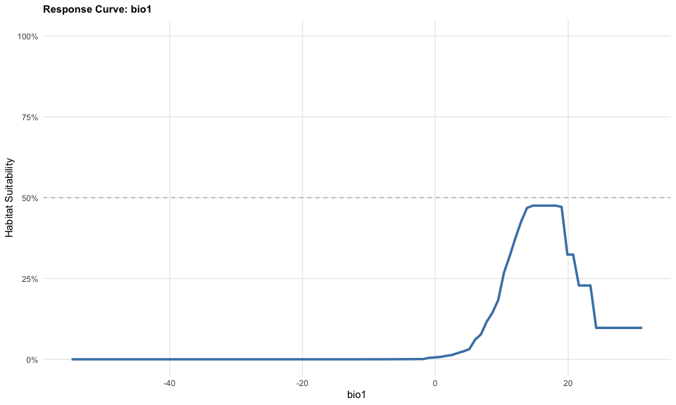
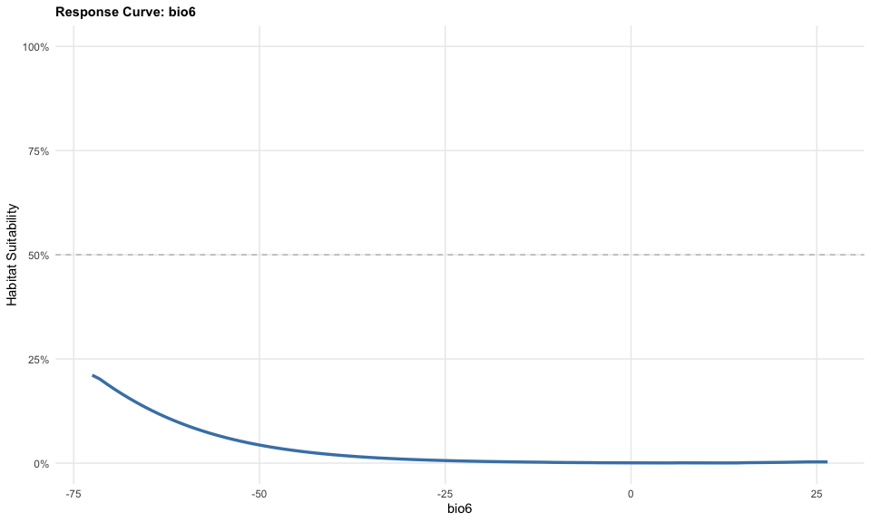
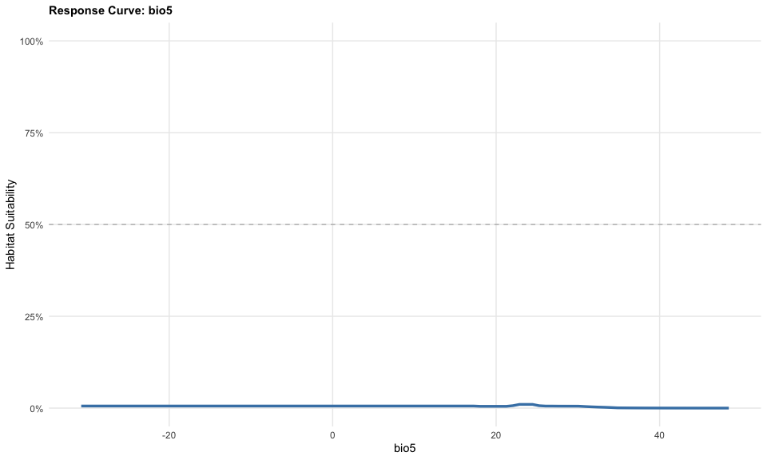
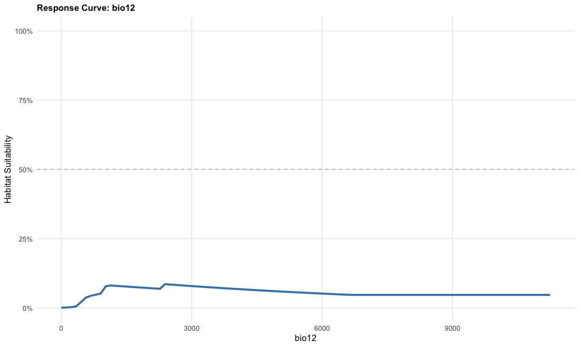
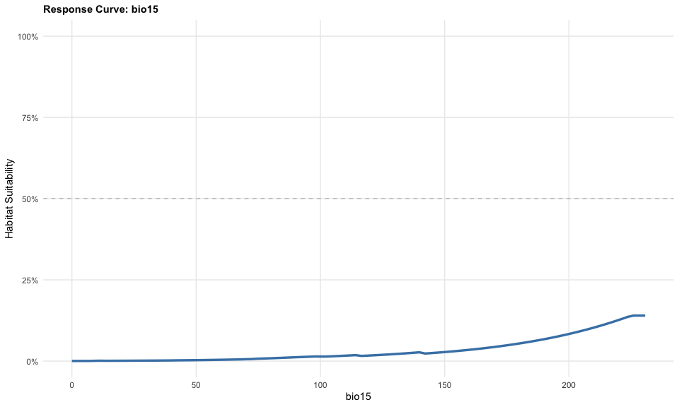
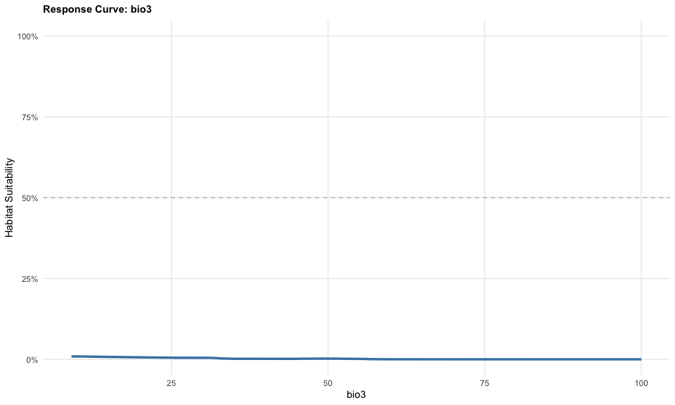

# Step 5b: Correcting Response Curves
Species Distribution Modeling Pipeline
2026-02-11

- [Quick Fix: Regenerate Response Curves for Step
  5](#quick-fix-regenerate-response-curves-for-step-5)
- [This script loads the existing MaxEnt model and creates proper
  response
  curves](#this-script-loads-the-existing-maxent-model-and-creates-proper-response-curves)

# Quick Fix: Regenerate Response Curves for Step 5

# This script loads the existing MaxEnt model and creates proper response curves

``` r
library(terra)
library(predicts)
library(tidyverse)
library(ggplot2)
library(patchwork)

cat("=== Regenerating Response Curves ===\n\n")
```

    === Regenerating Response Curves ===

``` r
# Load saved model and climate data

processed_data_dir <- "~/Library/CloudStorage/OneDrive-CSIRO/OneDrive - Docs/01_Projects/Hlongicornis_SDM/processed_data/"

cat("Loading model and climate data...\n")
```

    Loading model and climate data...

``` r
maxent_model <- readRDS(
  paste0(processed_data_dir, "maxent_baseline_model.rds")

  )
bioclim_selected <- rast(
  paste0(processed_data_dir, "bioclim_selected.rds")
)

# Get variable names
vars <- names(bioclim_selected)
cat(sprintf("Variables: %s\n\n", paste(vars, collapse=", ")))
```

    Variables: bio1, bio6, bio5, bio12, bio15, bio3

``` r
# Create response curves
response_plots <- list()

for(var in vars) {
  cat(sprintf("Processing %s...\n", var))

  # Get variable range from global climate data
  var_range <- global(bioclim_selected[[var]], "range", na.rm = TRUE)
  var_seq <- seq(var_range$min, var_range$max, length.out = 100)

  # Get median values for all variables
  pred_data <- as.data.frame(bioclim_selected, na.rm = TRUE)
  medians <- apply(pred_data, 2, median, na.rm = TRUE)

  # Initialize suitability vector
  suitability_values <- numeric(100)

  # For each value of the focal variable
  for(i in 1:100) {
    # Create a data frame with all variables at median except focal variable
    pred_point <- as.data.frame(t(medians))
    pred_point[[var]] <- var_seq[i]

    # Create a SpatRaster with single cell containing these values
    temp_extent <- ext(c(0, 1, 0, 1))
    temp_rast_list <- list()

    for(v in vars) {
      temp_r <- rast(temp_extent, nrows=1, ncols=1, crs="EPSG:4326")
      values(temp_r) <- pred_point[[v]]
      names(temp_r) <- v
      temp_rast_list[[v]] <- temp_r
    }

    # Stack all variables
    temp_stack <- rast(temp_rast_list)

    # Predict using MaxEnt model
    pred_result <- predict(maxent_model, temp_stack, args=c('outputformat=logistic'))

    # Extract the single predicted value
    suitability_values[i] <- values(pred_result)[1]
  }

  # Create response data frame
  response_df <- data.frame(
    value = var_seq,
    suitability = suitability_values
  )

  # Create plot
  response_plots[[var]] <- ggplot(response_df, aes(x = value, y = suitability)) +
    geom_line(color = "steelblue", linewidth = 1.2) +
    geom_hline(yintercept = 0.5, linetype = "dashed", color = "gray50", alpha = 0.5) +
    labs(
      title = paste("Response Curve:", var),
      x = var,
      y = "Habitat Suitability"
    ) +
    scale_y_continuous(limits = c(0, 1), labels = scales::percent) +
    theme_minimal() +
    theme(
      plot.title = element_text(face = "bold", size = 11),
      panel.grid.minor = element_blank()
    )
}
```

    Processing bio1...

    Processing bio6...
    Processing bio5...
    Processing bio12...
    Processing bio15...
    Processing bio3...

``` r
cat("\n✓ All response curves generated\n\n")
```


    ✓ All response curves generated

``` r
# Combine and save
figures_dir <- "~/Library/CloudStorage/OneDrive-CSIRO/OneDrive - Docs/01_Projects/Hlongicornis_SDM/figures/"


combined_response <- wrap_plots(response_plots, ncol = 2)

ggsave(
  paste0(figures_dir, "05_response_curves_CORRECTED.png"),
  combined_response,
  width = 12,
  height = 10,
  dpi = 300
  )
```

``` r
response_plots
```

    $bio1




    $bio6




    $bio5




    $bio12




    $bio15




    $bio3


