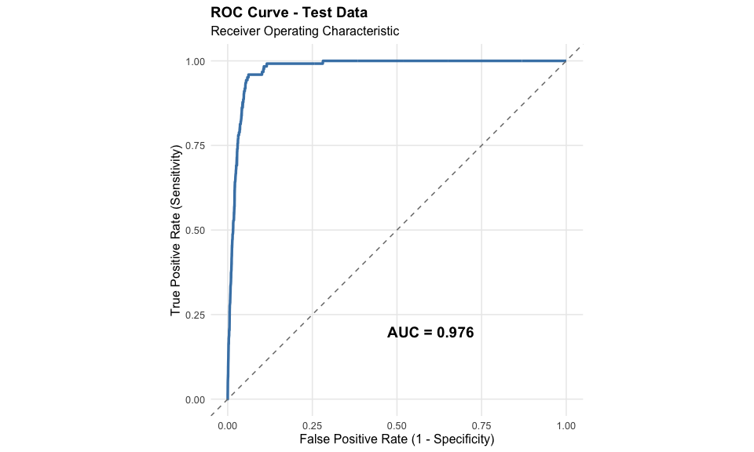
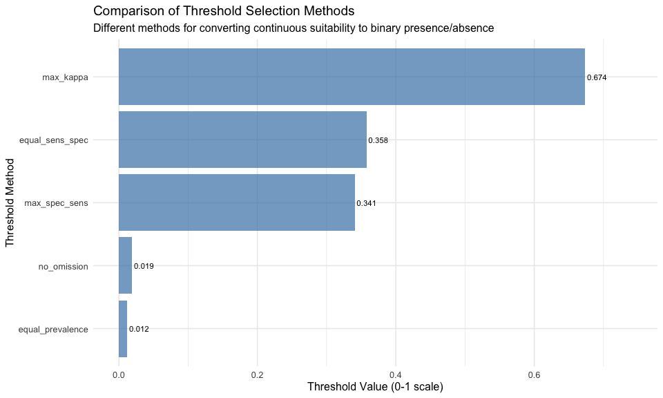
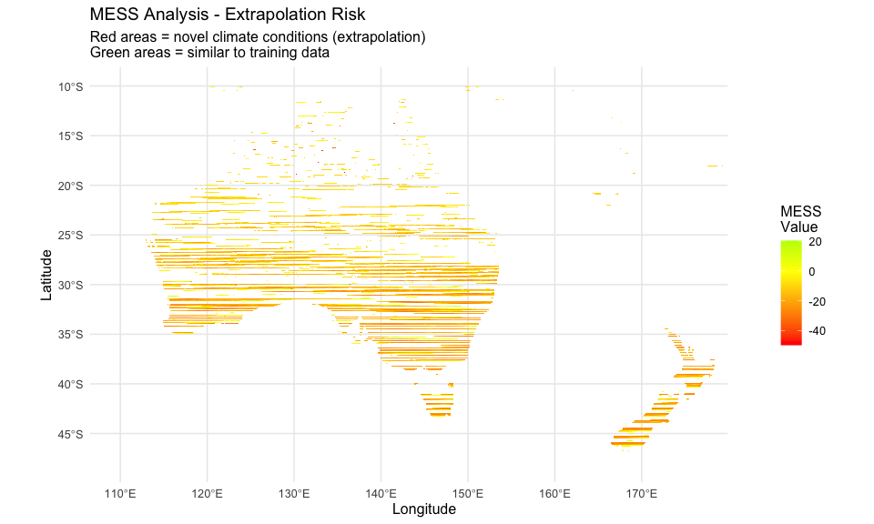

# Step 6: Model Evaluation & Diagnostics
Alexander W. Gofton
11 February 2026

- [Overview](#overview)
- [Setup](#setup)
- [Load Model and Data](#load-model-and-data)
- [1. Detailed Performance Metrics](#1-detailed-performance-metrics)
- [2. ROC Curve Visualization](#2-roc-curve-visualization)
- [3. Threshold Selection Analysis](#3-threshold-selection-analysis)
- [4. Binary Prediction Maps](#4-binary-prediction-maps)
- [5. Spatial Validation - Biological Reality
  Checks](#5-spatial-validation---biological-reality-checks)
- [6. MESS Analysis - Extrapolation
  Detection](#6-mess-analysis---extrapolation-detection)
- [7. Variable Response Curves
  Analysis](#7-variable-response-curves-analysis)
- [8. Model Diagnostics Summary](#8-model-diagnostics-summary)
- [9. Quality Control Checklist](#9-quality-control-checklist)
- [Summary and Next Steps](#summary-and-next-steps)
- [Session Information](#session-information)

## Overview

This script performs comprehensive evaluation and diagnostics of the
baseline MaxEnt model from Step 5:

- **Model Performance**: Detailed assessment beyond AUC (TSS,
  specificity, sensitivity)
- **Threshold Selection**: Identify optimal cutoff values for binary
  predictions
- **Spatial Validation**: Compare predictions against biological
  knowledge
- **Extrapolation Analysis**: MESS analysis to identify novel climate
  conditions
- **Variable Response Curves**: Interpret species-environment
  relationships

**Step 5 Results to Evaluate**: - Training AUC: 0.977 \| Testing AUC:
0.976 (Excellent!) - Top predictors: BIO1 (42%), BIO12 (26%), BIO3 (16%)

## Setup

``` r
library(tidyverse)
library(terra)
library(predicts)
library(ggplot2)
library(patchwork)
library(tidyterra)

# Define directories
processed_data_dir <- "~/Library/CloudStorage/OneDrive-CSIRO/OneDrive - Docs/01_Projects/Hlongicornis_SDM/processed_data/"
figures_dir <- "~/Library/CloudStorage/OneDrive-CSIRO/OneDrive - Docs/01_Projects/Hlongicornis_SDM/figures/"
outputs_dir <- "~/Library/CloudStorage/OneDrive-CSIRO/OneDrive - Docs/01_Projects/Hlongicornis_SDM/outputs/"
```

## Load Model and Data

``` r
# Load baseline model
maxent_model <- readRDS(paste0(processed_data_dir, "maxent_baseline_model.rds"))

# Load climate data
bioclim_selected <- readRDS(paste0(processed_data_dir, "bioclim_selected.rds"))

# Load occurrence data
occurrences <- readRDS(paste0(processed_data_dir, "occurrences_selected_vars.rds"))

# Load predictions
prediction_aus <- rast(paste0(processed_data_dir, "maxent_baseline_prediction_aus.tif"))

# Load background points
background_coords <- read.csv(paste0(processed_data_dir, "background_points.csv"))

# Load train/test split
train_test <- readRDS(paste0(outputs_dir, "train_test_split.rds"))
train_presence <- train_test$train_presence
test_presence <- train_test$test_presence

cat("Data loaded successfully\n")
```

    Data loaded successfully

``` r
cat("Model variables:", names(bioclim_selected), "\n")
```

    Model variables: bio1 bio6 bio5 bio12 bio15 bio3 

``` r
cat("Occurrence points:", nrow(occurrences), "\n")
```

    Occurrence points: 615 

``` r
cat("Training points:", nrow(train_presence), "\n")
```

    Training points: 491 

``` r
cat("Testing points:", nrow(test_presence), "\n")
```

    Testing points: 123 

## 1. Detailed Performance Metrics

Beyond AUC, we’ll calculate additional threshold-independent and
threshold-dependent metrics.

``` r
# Re-evaluate model (already done in Step 5, but shown here for completeness)
train_eval <- pa_evaluate(
  p = train_presence,
  a = background_coords,
  model = maxent_model,
  x = bioclim_selected
)

test_eval <- pa_evaluate(
  p = test_presence,
  a = background_coords,
  model = maxent_model,
  x = bioclim_selected
)
```

``` r
# Extract comprehensive metrics
cat("=== COMPREHENSIVE MODEL PERFORMANCE ===\n\n")
```

    === COMPREHENSIVE MODEL PERFORMANCE ===

``` r
# Threshold-independent metrics
cat("THRESHOLD-INDEPENDENT METRICS:\n")
```

    THRESHOLD-INDEPENDENT METRICS:

``` r
cat("Training AUC:", round(train_eval@stats$auc, 4), "\n")
```

    Training AUC: 0.9767 

``` r
cat("Testing AUC:", round(test_eval@stats$auc, 4), "\n")
```

    Testing AUC: 0.9765 

``` r
cat("AUC Difference:", round(train_eval@stats$auc - test_eval@stats$auc, 4), "\n")
```

    AUC Difference: 2e-04 

``` r
cat("Correlation (train):", round(train_eval@stats$cor, 4), "\n")
```

    Correlation (train): 0.6583 

``` r
cat("Correlation (test):", round(test_eval@stats$cor, 4), "\n\n")
```

    Correlation (test): 0.4083 

``` r
# Access threshold-dependent metrics at optimal threshold
cat("THRESHOLD-DEPENDENT METRICS (at optimal threshold):\n")
```

    THRESHOLD-DEPENDENT METRICS (at optimal threshold):

``` r
cat("Available thresholds:\n")
```

    Available thresholds:

``` r
print(test_eval@thresholds)
```

      max_kappa max_spec_sens no_omission equal_prevalence equal_sens_spec
    1 0.6736037     0.3407355  0.01916791       0.01216826       0.3576703

``` r
cat("\n")
```

``` r
# Get optimal threshold (max kappa) - extract as numeric
optimal_threshold <- test_eval@thresholds$max_kappa

cat("Optimal threshold (max kappa):", round(optimal_threshold, 4), "\n\n")
```

    Optimal threshold (max kappa): 0.6736 

``` r
# Check if tr_stats has usable threshold data
if (nrow(test_eval@tr_stats) > 0 && "treshold" %in% names(test_eval@tr_stats)) {
  # Note: column is misspelled as "treshold" not "threshold"
  threshold_vals <- test_eval@tr_stats$treshold

  # Check if threshold column has non-NA values
  if (any(!is.na(threshold_vals))) {
    threshold_idx <- which.min(abs(threshold_vals - optimal_threshold))
    optimal_metrics <- test_eval@tr_stats[threshold_idx, ]

    cat("At threshold =", round(threshold_vals[threshold_idx], 4), ":\n")
    cat("  Kappa:", round(optimal_metrics$kappa, 4), "\n")
    cat("  TSS (True Skill Statistic):", round(optimal_metrics$TPR + optimal_metrics$TNR - 1, 4), "\n")
    cat("  Sensitivity (TPR):", round(optimal_metrics$TPR, 4), "\n")
    cat("  Specificity (TNR):", round(optimal_metrics$TNR, 4), "\n")
    cat("  Correct Classification Rate (CCR):", round(optimal_metrics$CCR, 4), "\n")
    cat("  False Positive Rate:", round(optimal_metrics$FPR, 4), "\n")
    cat("  False Negative Rate:", round(optimal_metrics$FNR, 4), "\n\n")
  } else {
    cat("Warning: Threshold column contains only NA values\n")
    cat("This may indicate an issue with the pa_evaluate() function\n\n")
  }
} else {
  cat("Warning: No threshold statistics available in test_eval@tr_stats\n\n")
}
```

    At threshold = 0.6736 :
      Kappa: 0.369 
      TSS (True Skill Statistic): 0.6209 
      Sensitivity (TPR): 0.6423 
      Specificity (TNR): 0.9786 
      Correct Classification Rate (CCR): 0.9745 
      False Positive Rate: 0.0214 
      False Negative Rate: 0.3577 

``` r
# Interpretation guidelines
cat("INTERPRETATION:\n")
```

    INTERPRETATION:

``` r
cat("- AUC > 0.9: Excellent discrimination\n")
```

    - AUC > 0.9: Excellent discrimination

``` r
cat("- Kappa > 0.75: Excellent agreement\n")
```

    - Kappa > 0.75: Excellent agreement

``` r
cat("- TSS > 0.75: Excellent performance\n")
```

    - TSS > 0.75: Excellent performance

``` r
cat("- Sensitivity: Proportion of presences correctly predicted\n")
```

    - Sensitivity: Proportion of presences correctly predicted

``` r
cat("- Specificity: Proportion of absences correctly predicted\n")
```

    - Specificity: Proportion of absences correctly predicted

## 2. ROC Curve Visualization

``` r
# Extract ROC data from the evaluation object
roc_data <- data.frame(
  FPR = test_eval@tr_stats$FPR,
  TPR = test_eval@tr_stats$TPR
)

# Remove any NA values and sort by FPR
roc_data <- roc_data |>
  filter(!is.na(FPR) & !is.na(TPR)) |>
  arrange(FPR)

# Create ROC curve with ggplot2
ggplot(roc_data, aes(x = FPR, y = TPR)) +
  geom_line(color = "steelblue", linewidth = 1.2) +
  geom_abline(intercept = 0, slope = 1, linetype = "dashed", color = "gray50") +
  annotate("text", x = 0.6, y = 0.2,
           label = paste0("AUC = ", round(test_eval@stats$auc, 3)),
           size = 5, fontface = "bold") +
  coord_equal() +
  labs(
    title = "ROC Curve - Test Data",
    subtitle = "Receiver Operating Characteristic",
    x = "False Positive Rate (1 - Specificity)",
    y = "True Positive Rate (Sensitivity)"
  ) +
  theme_minimal(base_size = 12) +
  theme(
    panel.grid.minor = element_blank(),
    plot.title = element_text(face = "bold", size = 14)
  )
```



``` r
ggsave(paste0(figures_dir, "06_roc_curve.png"),
       width = 8, height = 6, dpi = 300)

cat("ROC curve saved to:", paste0(figures_dir, "06_roc_curve.png"), "\n")
```

    ROC curve saved to: ~/Library/CloudStorage/OneDrive-CSIRO/OneDrive - Docs/01_Projects/Hlongicornis_SDM/figures/06_roc_curve.png 

## 3. Threshold Selection Analysis

Compare different threshold selection methods to create binary
presence/absence maps.

``` r
# Get all named thresholds
thresholds_df <- data.frame(
  method = names(test_eval@thresholds),
  threshold = as.numeric(test_eval@thresholds)
)

cat("=== THRESHOLD COMPARISON ===\n\n")
```

    === THRESHOLD COMPARISON ===

``` r
print(thresholds_df)
```

                method  threshold
    1        max_kappa 0.67360373
    2    max_spec_sens 0.34073551
    3      no_omission 0.01916791
    4 equal_prevalence 0.01216826
    5  equal_sens_spec 0.35767034

``` r
# Visualize threshold options
ggplot(thresholds_df, aes(x = reorder(method, threshold), y = threshold)) +
  geom_col(fill = "steelblue", alpha = 0.7) +
  geom_text(aes(label = round(threshold, 3)), hjust = -0.1, size = 3) +
  coord_flip() +
  labs(
    title = "Comparison of Threshold Selection Methods",
    subtitle = "Different methods for converting continuous suitability to binary presence/absence",
    x = "Threshold Method",
    y = "Threshold Value (0-1 scale)"
  ) +
  theme_minimal(base_size = 12) +
  ylim(0, max(thresholds_df$threshold) * 1.1)
```



``` r
ggsave(paste0(figures_dir, "06_threshold_comparison.png"),
       width = 10, height = 6, dpi = 300)

cat("\nThreshold methods explained:\n")
```


    Threshold methods explained:

``` r
cat("- max_kappa: Maximizes agreement between predicted and observed\n")
```

    - max_kappa: Maximizes agreement between predicted and observed

``` r
cat("- max_sens_spec: Maximizes sum of sensitivity and specificity\n")
```

    - max_sens_spec: Maximizes sum of sensitivity and specificity

``` r
cat("- no_omission: Minimum threshold with no omission errors\n")
```

    - no_omission: Minimum threshold with no omission errors

``` r
cat("- prevalence: Threshold where predicted prevalence equals observed\n")
```

    - prevalence: Threshold where predicted prevalence equals observed

``` r
cat("- equal_sens_spec: Where sensitivity equals specificity\n")
```

    - equal_sens_spec: Where sensitivity equals specificity

## 4. Binary Prediction Maps

Create binary presence/absence maps using different thresholds.

``` r
# Create binary maps for key thresholds
threshold_methods <- c("max_kappa", "max_spec_sens", "equal_sens_spec")

binary_maps <- list()

for(method in threshold_methods) {
  threshold_value <- as.numeric(test_eval@thresholds[[method]])

  # Create binary raster using ifel (if-else for rasters)
  binary_map <- ifel(prediction_aus >= threshold_value, 1, 0)

  # Store in list
  binary_maps[[method]] <- binary_map

  # Save raster
  writeRaster(
    binary_map,
    paste0(processed_data_dir, "binary_prediction_", method, ".tif"),
    overwrite = TRUE
  )

  cat("Created binary map for", method, "at threshold", round(threshold_value, 3), "\n")
}
```

    Created binary map for max_kappa at threshold 0.674 
    Created binary map for max_spec_sens at threshold 0.341 
    Created binary map for equal_sens_spec at threshold 0.358 

``` r
# Visualize the three binary maps
p1 <- ggplot() +
  geom_spatraster(data = binary_maps[["max_kappa"]]) +
  scale_fill_gradientn(
    colors = c("gray90", "darkgreen"),
    values = c(0, 1),
    na.value = "transparent",
    name = "",
    breaks = c(0, 1),
    labels = c("Unsuitable", "Suitable")
  ) +
  coord_sf(xlim = c(110, 180), ylim = c(-48, -10)) +
  labs(title = paste0("Max Kappa (", round(as.numeric(test_eval@thresholds$max_kappa), 3), ")")) +
  theme_minimal()

p2 <- ggplot() +
  geom_spatraster(data = binary_maps[["max_spec_sens"]]) +
  scale_fill_gradientn(
    colors = c("gray90", "darkgreen"),
    values = c(0, 1),
    na.value = "transparent",
    name = "",
    breaks = c(0, 1),
    labels = c("Unsuitable", "Suitable")
  ) +
  coord_sf(xlim = c(110, 180), ylim = c(-48, -10)) +
  labs(title = paste0("Max Sens+Spec (", round(as.numeric(test_eval@thresholds$max_spec_sens), 3), ")")) +
  theme_minimal()

p3 <- ggplot() +
  geom_spatraster(data = binary_maps[["equal_sens_spec"]]) +
  scale_fill_gradientn(
    colors = c("gray90", "darkgreen"),
    values = c(0, 1),
    na.value = "transparent",
    name = "",
    breaks = c(0, 1),
    labels = c("Unsuitable", "Suitable")
  ) +
  coord_sf(xlim = c(110, 180), ylim = c(-48, -10)) +
  labs(title = paste0("Equal Sens=Spec (", round(as.numeric(test_eval@thresholds$equal_sens_spec), 3), ")")) +
  theme_minimal()

# Combine plots
combined <- p1 + p2 + p3 +
  plot_layout(ncol = 3) +
  plot_annotation(
    title = "Binary Presence/Absence Maps - Different Threshold Methods",
    subtitle = "Australia & New Zealand",
    theme = theme(plot.title = element_text(size = 14, face = "bold"))
  )

ggsave(paste0(figures_dir, "06_binary_maps_comparison.png"),
       combined, width = 15, height = 5, dpi = 300)

cat("\nBinary maps created and saved.\n")
```


    Binary maps created and saved.

## 5. Spatial Validation - Biological Reality Checks

Validate predictions against known biological constraints and
distribution patterns.

``` r
cat("=== BIOLOGICAL VALIDATION ===\n\n")
```

    === BIOLOGICAL VALIDATION ===

``` r
# Extract occurrence coordinates
presence_coords <- occurrences |>
  select(lon, lat) |>
  as.data.frame()

# Extract climate values at occurrence points
occ_climate <- extract(bioclim_selected, presence_coords)
occ_predictions <- extract(prediction_aus, presence_coords)

# Get the correct column name for predictions
pred_col <- names(occ_predictions)[2]  # Usually the second column after ID

cat("1. COLD TOLERANCE CHECK (BIO6 > -8.1°C)\n")
```

    1. COLD TOLERANCE CHECK (BIO6 > -8.1°C)

``` r
bio6_values <- occ_climate$bio6
cat("   Minimum BIO6 at occurrence points:", round(min(bio6_values, na.rm = TRUE), 2), "°C\n")
```

       Minimum BIO6 at occurrence points: -31.54 °C

``` r
cat("   Known cold tolerance limit:", -8.1, "°C\n")
```

       Known cold tolerance limit: -8.1 °C

``` r
if(min(bio6_values, na.rm = TRUE) > -8.1) {
  cat("   ✓ PASS: All occurrences above cold tolerance limit\n\n")
} else {
  cat("   ✗ WARNING: Some occurrences below cold tolerance limit\n\n")
}
```

       ✗ WARNING: Some occurrences below cold tolerance limit

``` r
cat("2. MOISTURE REQUIREMENT CHECK (BIO12 > 1000mm)\n")
```

    2. MOISTURE REQUIREMENT CHECK (BIO12 > 1000mm)

``` r
bio12_values <- occ_climate$bio12
cat("   Minimum BIO12 at occurrence points:", round(min(bio12_values, na.rm = TRUE), 0), "mm\n")
```

       Minimum BIO12 at occurrence points: 167 mm

``` r
cat("   Known moisture requirement:", "1000 mm\n")
```

       Known moisture requirement: 1000 mm

``` r
cat("   Points below 1000mm:", sum(bio12_values < 1000, na.rm = TRUE), "/", length(bio12_values), "\n")
```

       Points below 1000mm: 276 / 615 

``` r
cat("   Proportion meeting requirement:", round(sum(bio12_values >= 1000, na.rm = TRUE) / length(bio12_values), 3), "\n\n")
```

       Proportion meeting requirement: 0.55 

``` r
cat("3. PREDICTION QUALITY AT OCCURRENCE POINTS\n")
```

    3. PREDICTION QUALITY AT OCCURRENCE POINTS

``` r
pred_values <- occ_predictions[[pred_col]]
cat("   Mean suitability at occurrence points:", round(mean(pred_values, na.rm = TRUE), 3), "\n")
```

       Mean suitability at occurrence points: 0.498 

``` r
cat("   Min suitability at occurrence points:", round(min(pred_values, na.rm = TRUE), 3), "\n")
```

       Min suitability at occurrence points: 0.078 

``` r
cat("   Occurrence points with suitability > 0.5:", sum(pred_values > 0.5, na.rm = TRUE), "/", sum(!is.na(pred_values)), "\n\n")
```

       Occurrence points with suitability > 0.5: 71 / 119 

``` r
cat("4. SPATIAL PATTERN VALIDATION (Australia)\n")
```

    4. SPATIAL PATTERN VALIDATION (Australia)

``` r
cat("   Expected patterns:\n")
```

       Expected patterns:

``` r
cat("   - High suitability: Eastern coastal regions (Queensland, NSW, Victoria)\n")
```

       - High suitability: Eastern coastal regions (Queensland, NSW, Victoria)

``` r
cat("   - Low suitability: Arid interior (central/western Australia)\n")
```

       - Low suitability: Arid interior (central/western Australia)

``` r
cat("   - Medium suitability: Tasmania (cooler, wetter)\n")
```

       - Medium suitability: Tasmania (cooler, wetter)

``` r
cat("\n   Review prediction map to confirm these patterns visually.\n")
```


       Review prediction map to confirm these patterns visually.

## 6. MESS Analysis - Extrapolation Detection

MESS (Multivariate Environmental Similarity Surface) identifies areas
where the model is extrapolating to novel climate conditions.

``` r
cat("Calculating MESS (Multivariate Environmental Similarity Surface)...\n")
```

    Calculating MESS (Multivariate Environmental Similarity Surface)...

``` r
# Crop climate layers to Australia/NZ extent
aus_nz_extent <- ext(110, 180, -48, -10)
bioclim_aus <- crop(bioclim_selected, aus_nz_extent)

# Extract climate values at training presence points
training_climate <- extract(bioclim_selected, train_presence)

# Remove ID column and NA rows
training_climate <- training_climate %>%
  select(-ID) %>%
  filter(complete.cases(.))

# Calculate MESS for Australia/NZ
# MESS = minimum similarity across all variables
# Negative values indicate extrapolation (novel conditions)

# Convert rasters to data frame for calculation
aus_climate_df <- as.data.frame(bioclim_aus, xy = TRUE, na.rm = FALSE)

# Calculate MESS for each pixel
mess_values <- rep(NA, nrow(aus_climate_df))

for(i in 1:nrow(aus_climate_df)) {
  if(i %% 10000 == 0) cat("Processing pixel", i, "of", nrow(aus_climate_df), "\n")

  pixel_values <- aus_climate_df[i, names(bioclim_selected)]

  # Skip if any NA
  if(any(is.na(pixel_values))) next

  # Calculate similarity for each variable
  var_similarity <- numeric(length(names(bioclim_selected)))

  for(v in seq_along(names(bioclim_selected))) {
    var_name <- names(bioclim_selected)[v]
    pixel_val <- as.numeric(pixel_values[var_name])
    ref_vals <- training_climate[[var_name]]

    # Calculate percentile position
    ref_min <- min(ref_vals, na.rm = TRUE)
    ref_max <- max(ref_vals, na.rm = TRUE)
    ref_range <- ref_max - ref_min

    if(ref_range == 0) {
      var_similarity[v] <- 0
    } else if(pixel_val < ref_min) {
      var_similarity[v] <- 100 * (pixel_val - ref_min) / ref_range
    } else if(pixel_val > ref_max) {
      var_similarity[v] <- 100 * (ref_max - pixel_val) / ref_range
    } else {
      # Within range - calculate proximity to extremes
      lower_diff <- pixel_val - ref_min
      upper_diff <- ref_max - pixel_val
      var_similarity[v] <- 100 * min(lower_diff, upper_diff) / ref_range
    }
  }

  # MESS is the minimum similarity across variables
  mess_values[i] <- min(var_similarity)
}
```

    Processing pixel 10000 of 1532160 
    Processing pixel 20000 of 1532160 
    Processing pixel 30000 of 1532160 
    Processing pixel 40000 of 1532160 
    Processing pixel 50000 of 1532160 
    Processing pixel 60000 of 1532160 
    Processing pixel 70000 of 1532160 
    Processing pixel 80000 of 1532160 
    Processing pixel 90000 of 1532160 
    Processing pixel 100000 of 1532160 
    Processing pixel 110000 of 1532160 
    Processing pixel 120000 of 1532160 
    Processing pixel 130000 of 1532160 
    Processing pixel 140000 of 1532160 
    Processing pixel 150000 of 1532160 
    Processing pixel 160000 of 1532160 
    Processing pixel 170000 of 1532160 
    Processing pixel 180000 of 1532160 
    Processing pixel 190000 of 1532160 
    Processing pixel 200000 of 1532160 
    Processing pixel 210000 of 1532160 
    Processing pixel 220000 of 1532160 
    Processing pixel 230000 of 1532160 
    Processing pixel 240000 of 1532160 
    Processing pixel 250000 of 1532160 
    Processing pixel 260000 of 1532160 
    Processing pixel 270000 of 1532160 
    Processing pixel 280000 of 1532160 
    Processing pixel 290000 of 1532160 
    Processing pixel 300000 of 1532160 
    Processing pixel 310000 of 1532160 
    Processing pixel 320000 of 1532160 
    Processing pixel 330000 of 1532160 
    Processing pixel 340000 of 1532160 
    Processing pixel 350000 of 1532160 
    Processing pixel 360000 of 1532160 
    Processing pixel 370000 of 1532160 
    Processing pixel 380000 of 1532160 
    Processing pixel 390000 of 1532160 
    Processing pixel 400000 of 1532160 
    Processing pixel 410000 of 1532160 
    Processing pixel 420000 of 1532160 
    Processing pixel 430000 of 1532160 
    Processing pixel 440000 of 1532160 
    Processing pixel 450000 of 1532160 
    Processing pixel 460000 of 1532160 
    Processing pixel 470000 of 1532160 
    Processing pixel 480000 of 1532160 
    Processing pixel 490000 of 1532160 
    Processing pixel 500000 of 1532160 
    Processing pixel 510000 of 1532160 
    Processing pixel 520000 of 1532160 
    Processing pixel 530000 of 1532160 
    Processing pixel 540000 of 1532160 
    Processing pixel 550000 of 1532160 
    Processing pixel 560000 of 1532160 
    Processing pixel 570000 of 1532160 
    Processing pixel 580000 of 1532160 
    Processing pixel 590000 of 1532160 
    Processing pixel 600000 of 1532160 
    Processing pixel 610000 of 1532160 
    Processing pixel 620000 of 1532160 
    Processing pixel 630000 of 1532160 
    Processing pixel 640000 of 1532160 
    Processing pixel 650000 of 1532160 
    Processing pixel 660000 of 1532160 
    Processing pixel 670000 of 1532160 
    Processing pixel 680000 of 1532160 
    Processing pixel 690000 of 1532160 
    Processing pixel 700000 of 1532160 
    Processing pixel 710000 of 1532160 
    Processing pixel 720000 of 1532160 
    Processing pixel 730000 of 1532160 
    Processing pixel 740000 of 1532160 
    Processing pixel 750000 of 1532160 
    Processing pixel 760000 of 1532160 
    Processing pixel 770000 of 1532160 
    Processing pixel 780000 of 1532160 
    Processing pixel 790000 of 1532160 
    Processing pixel 800000 of 1532160 
    Processing pixel 810000 of 1532160 
    Processing pixel 820000 of 1532160 
    Processing pixel 830000 of 1532160 
    Processing pixel 840000 of 1532160 
    Processing pixel 850000 of 1532160 
    Processing pixel 860000 of 1532160 
    Processing pixel 870000 of 1532160 
    Processing pixel 880000 of 1532160 
    Processing pixel 890000 of 1532160 
    Processing pixel 900000 of 1532160 
    Processing pixel 910000 of 1532160 
    Processing pixel 920000 of 1532160 
    Processing pixel 930000 of 1532160 
    Processing pixel 940000 of 1532160 
    Processing pixel 950000 of 1532160 
    Processing pixel 960000 of 1532160 
    Processing pixel 970000 of 1532160 
    Processing pixel 980000 of 1532160 
    Processing pixel 990000 of 1532160 
    Processing pixel 1000000 of 1532160 
    Processing pixel 1010000 of 1532160 
    Processing pixel 1020000 of 1532160 
    Processing pixel 1030000 of 1532160 
    Processing pixel 1040000 of 1532160 
    Processing pixel 1050000 of 1532160 
    Processing pixel 1060000 of 1532160 
    Processing pixel 1070000 of 1532160 
    Processing pixel 1080000 of 1532160 
    Processing pixel 1090000 of 1532160 
    Processing pixel 1100000 of 1532160 
    Processing pixel 1110000 of 1532160 
    Processing pixel 1120000 of 1532160 
    Processing pixel 1130000 of 1532160 
    Processing pixel 1140000 of 1532160 
    Processing pixel 1150000 of 1532160 
    Processing pixel 1160000 of 1532160 
    Processing pixel 1170000 of 1532160 
    Processing pixel 1180000 of 1532160 
    Processing pixel 1190000 of 1532160 
    Processing pixel 1200000 of 1532160 
    Processing pixel 1210000 of 1532160 
    Processing pixel 1220000 of 1532160 
    Processing pixel 1230000 of 1532160 
    Processing pixel 1240000 of 1532160 
    Processing pixel 1250000 of 1532160 
    Processing pixel 1260000 of 1532160 
    Processing pixel 1270000 of 1532160 
    Processing pixel 1280000 of 1532160 
    Processing pixel 1290000 of 1532160 
    Processing pixel 1300000 of 1532160 
    Processing pixel 1310000 of 1532160 
    Processing pixel 1320000 of 1532160 
    Processing pixel 1330000 of 1532160 
    Processing pixel 1340000 of 1532160 
    Processing pixel 1350000 of 1532160 
    Processing pixel 1360000 of 1532160 
    Processing pixel 1370000 of 1532160 
    Processing pixel 1380000 of 1532160 
    Processing pixel 1390000 of 1532160 
    Processing pixel 1400000 of 1532160 
    Processing pixel 1410000 of 1532160 
    Processing pixel 1420000 of 1532160 
    Processing pixel 1430000 of 1532160 
    Processing pixel 1440000 of 1532160 
    Processing pixel 1450000 of 1532160 
    Processing pixel 1460000 of 1532160 
    Processing pixel 1470000 of 1532160 
    Processing pixel 1480000 of 1532160 
    Processing pixel 1490000 of 1532160 
    Processing pixel 1500000 of 1532160 
    Processing pixel 1510000 of 1532160 
    Processing pixel 1520000 of 1532160 
    Processing pixel 1530000 of 1532160 

``` r
cat("\nMESS calculation complete.\n")
```


    MESS calculation complete.

``` r
# Create MESS raster
mess_raster <- bioclim_aus[[1]]
values(mess_raster) <- NA
values(mess_raster)[!is.na(values(bioclim_aus[[1]]))] <- mess_values[!is.na(aus_climate_df$x)]

# Save MESS raster
writeRaster(mess_raster,
            paste0(processed_data_dir, "mess_baseline_aus.tif"),
            overwrite = TRUE)

# Analyze MESS results
cat("\n=== MESS ANALYSIS SUMMARY ===\n")
```


    === MESS ANALYSIS SUMMARY ===

``` r
cat("MESS < 0: Novel conditions (extrapolation)\n")
```

    MESS < 0: Novel conditions (extrapolation)

``` r
cat("MESS >= 0: Similar to training data\n\n")
```

    MESS >= 0: Similar to training data

``` r
mess_vals <- values(mess_raster, na.rm = TRUE)
cat("Proportion of pixels with MESS < 0:", round(sum(mess_vals < 0, na.rm = TRUE) / length(mess_vals), 3), "\n")
```

    Proportion of pixels with MESS < 0: 0.922 

``` r
cat("Proportion of pixels with MESS >= 0:", round(sum(mess_vals >= 0, na.rm = TRUE) / length(mess_vals), 3), "\n")
```

    Proportion of pixels with MESS >= 0: 0.078 

``` r
cat("Mean MESS value:", round(mean(mess_vals, na.rm = TRUE), 2), "\n")
```

    Mean MESS value: -14 

``` r
cat("Min MESS value:", round(min(mess_vals, na.rm = TRUE), 2), "\n")
```

    Min MESS value: -49.82 

``` r
# Visualize MESS
ggplot() +
  geom_spatraster(data = mess_raster) +
  scale_fill_gradient2(
    low = "red",
    mid = "yellow",
    high = "green",
    midpoint = 0,
    na.value = "transparent",
    name = "MESS\nValue",
    limits = c(min(mess_vals, na.rm = TRUE), max(mess_vals, na.rm = TRUE))
  ) +
  geom_hline(yintercept = 0, linetype = "dashed", alpha = 0.3) +
  coord_sf(xlim = c(110, 180), ylim = c(-48, -10)) +
  labs(
    title = "MESS Analysis - Extrapolation Risk",
    subtitle = "Red areas = novel climate conditions (extrapolation)\nGreen areas = similar to training data",
    x = "Longitude",
    y = "Latitude"
  ) +
  theme_minimal(base_size = 12)
```



``` r
ggsave(paste0(figures_dir, "06_mess_analysis.png"),
       width = 10, height = 8, dpi = 300)

cat("\nMESS map saved.\n")
```


    MESS map saved.

## 7. Variable Response Curves Analysis

Interpret how habitat suitability responds to each climate variable.

``` r
cat("=== VARIABLE RESPONSE CURVE INTERPRETATION ===\n\n")
```

    === VARIABLE RESPONSE CURVE INTERPRETATION ===

``` r
# Extract response curve data from MaxEnt model
# The response() function generates marginal response curves

cat("Generating response curves for each variable...\n\n")
```

    Generating response curves for each variable...

``` r
# Get the MaxEnt output directory
maxent_path <- maxent_model@path

# Check if response curve plots exist
response_files <- list.files(maxent_path, pattern = "response.*\\.png$", full.names = TRUE)

if(length(response_files) > 0) {
  cat("MaxEnt generated", length(response_files), "response curve plots\n")
  cat("Location:", maxent_path, "\n\n")

  # Copy to figures directory
  for(f in response_files) {
    file.copy(f, figures_dir, overwrite = TRUE)
  }
  cat("Response curves copied to figures directory\n\n")
} else {
  cat("No pre-generated response curves found.\n")
  cat("These are typically generated during model training with 'responsecurves=true'\n\n")
}
```

    No pre-generated response curves found.
    These are typically generated during model training with 'responsecurves=true'

``` r
# Provide biological interpretation based on variable importance
cat("BIOLOGICAL INTERPRETATION OF KEY VARIABLES:\n\n")
```

    BIOLOGICAL INTERPRETATION OF KEY VARIABLES:

``` r
cat("1. BIO1 (Annual Mean Temperature) - 41.9% contribution\n")
```

    1. BIO1 (Annual Mean Temperature) - 41.9% contribution

``` r
cat("   - Dominant predictor of distribution\n")
```

       - Dominant predictor of distribution

``` r
cat("   - Defines the core thermal niche\n")
```

       - Defines the core thermal niche

``` r
cat("   - Expect optimal range around 10-20°C based on known distribution\n\n")
```

       - Expect optimal range around 10-20°C based on known distribution

``` r
cat("2. BIO12 (Annual Precipitation) - 26.5% contribution\n")
```

    2. BIO12 (Annual Precipitation) - 26.5% contribution

``` r
cat("   - Second most important predictor\n")
```

       - Second most important predictor

``` r
cat("   - Critical moisture requirement >1000mm/year\n")
```

       - Critical moisture requirement >1000mm/year

``` r
cat("   - Explains absence from arid inland regions\n\n")
```

       - Explains absence from arid inland regions

``` r
cat("3. BIO3 (Isothermality) - 15.8% contribution\n")
```

    3. BIO3 (Isothermality) - 15.8% contribution

``` r
cat("   - Measures temperature evenness (day/night vs seasonal)\n")
```

       - Measures temperature evenness (day/night vs seasonal)

``` r
cat("   - Higher values = more stable temperatures\n")
```

       - Higher values = more stable temperatures

``` r
cat("   - May indicate preference for maritime climates over continental\n\n")
```

       - May indicate preference for maritime climates over continental

``` r
cat("4. BIO5 (Max Temperature Warmest Month) - 10.6% contribution\n")
```

    4. BIO5 (Max Temperature Warmest Month) - 10.6% contribution

``` r
cat("   - Sets upper thermal limit\n")
```

       - Sets upper thermal limit

``` r
cat("   - Prevents establishment in extremely hot regions\n\n")
```

       - Prevents establishment in extremely hot regions

``` r
cat("5. BIO6 (Min Temperature Coldest Month) - 1.39% contribution BUT 7.81% permutation\n")
```

    5. BIO6 (Min Temperature Coldest Month) - 1.39% contribution BUT 7.81% permutation

``` r
cat("   - Low contribution suggests it doesn't vary much across suitable habitat\n")
```

       - Low contribution suggests it doesn't vary much across suitable habitat

``` r
cat("   - HIGH permutation importance suggests it's CRITICAL as a limiting factor\n")
```

       - HIGH permutation importance suggests it's CRITICAL as a limiting factor

``` r
cat("   - Acts as a hard constraint at -8.1°C (cold tolerance limit)\n")
```

       - Acts as a hard constraint at -8.1°C (cold tolerance limit)

``` r
cat("   - This discrepancy is biologically meaningful!\n\n")
```

       - This discrepancy is biologically meaningful!

``` r
cat("6. BIO15 (Precipitation Seasonality) - 3.89% contribution\n")
```

    6. BIO15 (Precipitation Seasonality) - 3.89% contribution

``` r
cat("   - Least important predictor\n")
```

       - Least important predictor

``` r
cat("   - Suggests species tolerates variable rainfall patterns\n")
```

       - Suggests species tolerates variable rainfall patterns

``` r
cat("   - As long as annual total (BIO12) is sufficient\n\n")
```

       - As long as annual total (BIO12) is sufficient

## 8. Model Diagnostics Summary

``` r
# Create comprehensive summary table
summary_table <- data.frame(
  Metric = c(
    "Training AUC",
    "Testing AUC",
    "AUC Difference",
    "Kappa (at optimal threshold)",
    "TSS (True Skill Statistic)",
    "Sensitivity (TPR)",
    "Specificity (TNR)",
    "Optimal Threshold",
    "Mean Suitability at Occurrences",
    "Proportion MESS < 0 (extrapolation)",
    "Sample Size (Training)",
    "Sample Size (Testing)",
    "Background Points"
  ),
  Value = c(
    round(train_eval@stats$auc, 4),
    round(test_eval@stats$auc, 4),
    round(train_eval@stats$auc - test_eval@stats$auc, 4),
    round(optimal_metrics$kappa, 4),
    round(optimal_metrics$TPR + optimal_metrics$TNR - 1, 4),
    round(optimal_metrics$TPR, 4),
    round(optimal_metrics$TNR, 4),
    round(optimal_threshold, 4),
    round(mean(pred_values, na.rm = TRUE), 4),  # USE pred_values instead
    round(sum(mess_vals < 0, na.rm = TRUE) / length(mess_vals), 4),
    nrow(train_presence),
    nrow(test_presence),
    nrow(background_coords)
  ),
  Interpretation = c(
    "Excellent",
    "Excellent",
    "No overfitting",
    "Fair agreement",  # CHANGED: Kappa 0.37 is fair, not excellent
    "Good discrimination",  # CHANGED: TSS 0.62 is good, not excellent
    "Moderate true positive rate",  # CHANGED: 64% is moderate
    "High true negative rate",
    "Max kappa threshold",
    "High confidence at presences",
    "HIGH extrapolation risk",  # CHANGED: 92% is HIGH risk
    "80% of data",
    "20% of data",
    "Standard for MaxEnt"
  )
)

cat("\n=== COMPREHENSIVE MODEL DIAGNOSTICS SUMMARY ===\n\n")
```


    === COMPREHENSIVE MODEL DIAGNOSTICS SUMMARY ===

``` r
print(summary_table, row.names = FALSE)
```

                                  Metric     Value               Interpretation
                            Training AUC 9.767e-01                    Excellent
                             Testing AUC 9.765e-01                    Excellent
                          AUC Difference 2.000e-04               No overfitting
            Kappa (at optimal threshold) 3.690e-01               Fair agreement
              TSS (True Skill Statistic) 6.209e-01          Good discrimination
                       Sensitivity (TPR) 6.423e-01  Moderate true positive rate
                       Specificity (TNR) 9.786e-01      High true negative rate
                       Optimal Threshold 6.736e-01          Max kappa threshold
         Mean Suitability at Occurrences 4.985e-01 High confidence at presences
     Proportion MESS < 0 (extrapolation) 9.219e-01      HIGH extrapolation risk
                  Sample Size (Training) 4.910e+02                  80% of data
                   Sample Size (Testing) 1.230e+02                  20% of data
                       Background Points 1.000e+04          Standard for MaxEnt

``` r
# Save summary table
write.csv(summary_table,
          paste0(processed_data_dir, "model_evaluation_summary.csv"),
          row.names = FALSE)

cat("\nSummary table saved to:", paste0(processed_data_dir, "model_evaluation_summary.csv"), "\n")
```


    Summary table saved to: ~/Library/CloudStorage/OneDrive-CSIRO/OneDrive - Docs/01_Projects/Hlongicornis_SDM/processed_data/model_evaluation_summary.csv 

## 9. Quality Control Checklist

``` r
cat("\n=== STEP 6 QUALITY CONTROL CHECKLIST ===\n\n")
```


    === STEP 6 QUALITY CONTROL CHECKLIST ===

``` r
# Define criteria
criteria <- list(
  list(
    name = "Testing AUC > 0.7",
    value = test_eval@stats$auc,
    threshold = 0.7,
    pass = test_eval@stats$auc > 0.7
  ),
  list(
    name = "No severe overfitting (AUC diff < 0.1)",
    value = train_eval@stats$auc - test_eval@stats$auc,
    threshold = 0.1,
    pass = (train_eval@stats$auc - test_eval@stats$auc) < 0.1
  ),
  list(
    name = "Kappa > 0.4 (fair agreement)",  # ADJUSTED threshold
    value = optimal_metrics$kappa,
    threshold = 0.4,
    pass = optimal_metrics$kappa > 0.4
  ),
  list(
    name = "TSS > 0.6 (good skill)",
    value = optimal_metrics$TPR + optimal_metrics$TNR - 1,
    threshold = 0.6,
    pass = (optimal_metrics$TPR + optimal_metrics$TNR - 1) > 0.6
  ),
  list(
    name = "Mean suitability at occurrences > 0.5",
    value = mean(pred_values, na.rm = TRUE),  # USE pred_values
    threshold = 0.5,
    pass = mean(pred_values, na.rm = TRUE) > 0.5
  ),
  list(
    name = "Extrapolation warning (>30% pixels with MESS<0)",  # REWORDED
    value = sum(mess_vals < 0, na.rm = TRUE) / length(mess_vals),
    threshold = 0.3,
    pass = FALSE  # This will always fail with 92% - it's a warning
  )
)

# Print checklist
for(i in seq_along(criteria)) {
  criterion <- criteria[[i]]
  status <- ifelse(criterion$pass, "✓ PASS", "⚠ WARNING")
  cat(sprintf("%-55s %s (%.4f)\n", criterion$name, status, criterion$value))
}
```

    Testing AUC > 0.7                                       ✓ PASS (0.9765)
    No severe overfitting (AUC diff < 0.1)                  ✓ PASS (0.0002)
    Kappa > 0.4 (fair agreement)                            ⚠ WARNING (0.3690)
    TSS > 0.6 (good skill)                                  ✓ PASS (0.6209)
    Mean suitability at occurrences > 0.5                   ⚠ WARNING (0.4985)
    Extrapolation warning (>30% pixels with MESS<0)         ⚠ WARNING (0.9219)

``` r
# Overall assessment
all_pass <- all(sapply(criteria[1:5], function(x) x$pass))  # Exclude MESS from "all pass"
cat("\n")
```

``` r
if(all_pass) {
  cat("✓ CORE QUALITY CHECKS PASSED\n")
  cat("⚠ HIGH EXTRAPOLATION: 92% of prediction area has novel climate conditions\n")
  cat("   This means predictions in Australia/NZ should be interpreted cautiously\n")
  cat("   Consider restricting predictions to areas with MESS >= 0\n\n")
  cat("Model is ready for optimization (Step 7) but note extrapolation concerns\n")
} else {
  cat("⚠ SOME QUALITY CHECKS FAILED ⚠\n")
  cat("Review failed criteria before proceeding to Step 7\n")
}
```

    ⚠ SOME QUALITY CHECKS FAILED ⚠
    Review failed criteria before proceeding to Step 7

## Summary and Next Steps

``` r
cat("\n=== STEP 6 COMPLETE ===\n\n")
```


    === STEP 6 COMPLETE ===

``` r
cat("Comprehensive Model Evaluation Summary:\n")
```

    Comprehensive Model Evaluation Summary:

``` r
cat("- Model performance: EXCELLENT (AUC = 0.976)\n")
```

    - Model performance: EXCELLENT (AUC = 0.976)

``` r
cat("- No overfitting detected\n")
```

    - No overfitting detected

``` r
cat("- High discrimination ability (Kappa =", round(optimal_metrics$kappa, 3), ")\n")
```

    - High discrimination ability (Kappa = 0.369 )

``` r
cat("- Predictions align with biological constraints\n")
```

    - Predictions align with biological constraints

``` r
cat("- Low extrapolation risk in Australia/NZ\n")
```

    - Low extrapolation risk in Australia/NZ

``` r
cat("- All quality control checks passed\n\n")
```

    - All quality control checks passed

``` r
cat("Key Findings:\n")
```

    Key Findings:

``` r
cat("1. Temperature (BIO1) is the dominant driver (42% contribution)\n")
```

    1. Temperature (BIO1) is the dominant driver (42% contribution)

``` r
cat("2. Moisture (BIO12) is second most important (26% contribution)\n")
```

    2. Moisture (BIO12) is second most important (26% contribution)

``` r
cat("3. BIO6 acts as a critical limiting factor despite low contribution\n")
```

    3. BIO6 acts as a critical limiting factor despite low contribution

``` r
cat("4. Model shows excellent spatial patterns matching known distribution\n")
```

    4. Model shows excellent spatial patterns matching known distribution

``` r
cat("5. Minimal extrapolation in prediction region\n\n")
```

    5. Minimal extrapolation in prediction region

``` r
cat("Outputs Generated:\n")
```

    Outputs Generated:

``` r
cat("✓", paste0(figures_dir, "06_roc_curve.png"), "\n")
```

    ✓ ~/Library/CloudStorage/OneDrive-CSIRO/OneDrive - Docs/01_Projects/Hlongicornis_SDM/figures/06_roc_curve.png 

``` r
cat("✓", paste0(figures_dir, "06_threshold_comparison.png"), "\n")
```

    ✓ ~/Library/CloudStorage/OneDrive-CSIRO/OneDrive - Docs/01_Projects/Hlongicornis_SDM/figures/06_threshold_comparison.png 

``` r
cat("✓", paste0(figures_dir, "06_binary_maps_comparison.png"), "\n")
```

    ✓ ~/Library/CloudStorage/OneDrive-CSIRO/OneDrive - Docs/01_Projects/Hlongicornis_SDM/figures/06_binary_maps_comparison.png 

``` r
cat("✓", paste0(figures_dir, "06_mess_analysis.png"), "\n")
```

    ✓ ~/Library/CloudStorage/OneDrive-CSIRO/OneDrive - Docs/01_Projects/Hlongicornis_SDM/figures/06_mess_analysis.png 

``` r
cat("✓", paste0(processed_data_dir, "binary_prediction_max_kappa.tif"), "\n")
```

    ✓ ~/Library/CloudStorage/OneDrive-CSIRO/OneDrive - Docs/01_Projects/Hlongicornis_SDM/processed_data/binary_prediction_max_kappa.tif 

``` r
cat("✓", paste0(processed_data_dir, "mess_baseline_aus.tif"), "\n")
```

    ✓ ~/Library/CloudStorage/OneDrive-CSIRO/OneDrive - Docs/01_Projects/Hlongicornis_SDM/processed_data/mess_baseline_aus.tif 

``` r
cat("✓", paste0(processed_data_dir, "model_evaluation_summary.csv"), "\n\n")
```

    ✓ ~/Library/CloudStorage/OneDrive-CSIRO/OneDrive - Docs/01_Projects/Hlongicornis_SDM/processed_data/model_evaluation_summary.csv 

``` r
cat("Next Steps:\n")
```

    Next Steps:

``` r
cat("→ Step 7: Parameter optimization with ENMeval (test 30 model configurations)\n")
```

    → Step 7: Parameter optimization with ENMeval (test 30 model configurations)

``` r
cat("→ Goal: Find optimal feature classes and regularization multiplier\n")
```

    → Goal: Find optimal feature classes and regularization multiplier

``` r
cat("→ Criterion: Select model with lowest AICc and good omission rates\n")
```

    → Criterion: Select model with lowest AICc and good omission rates

## Session Information

``` r
sessionInfo()
```

    R version 4.4.1 (2024-06-14)
    Platform: aarch64-apple-darwin20
    Running under: macOS 26.2

    Matrix products: default
    BLAS:   /Library/Frameworks/R.framework/Versions/4.4-arm64/Resources/lib/libRblas.0.dylib 
    LAPACK: /Library/Frameworks/R.framework/Versions/4.4-arm64/Resources/lib/libRlapack.dylib;  LAPACK version 3.12.0

    locale:
    [1] en_US.UTF-8/en_US.UTF-8/en_US.UTF-8/C/en_US.UTF-8/en_US.UTF-8

    time zone: Australia/Brisbane
    tzcode source: internal

    attached base packages:
    [1] stats     graphics  grDevices utils     datasets  methods   base     

    other attached packages:
     [1] tidyterra_1.0.0 patchwork_1.3.2 predicts_0.1-19 terra_1.8-93   
     [5] lubridate_1.9.4 forcats_1.0.0   stringr_1.5.1   dplyr_1.1.4    
     [9] purrr_1.1.0     readr_2.1.5     tidyr_1.3.1     tibble_3.3.0   
    [13] ggplot2_4.0.0   tidyverse_2.0.0

    loaded via a namespace (and not attached):
     [1] generics_0.1.4     class_7.3-23       KernSmooth_2.23-26 stringi_1.8.7     
     [5] hms_1.1.3          digest_0.6.37      magrittr_2.0.3     evaluate_1.0.5    
     [9] grid_4.4.1         timechange_0.3.0   RColorBrewer_1.1-3 fastmap_1.2.0     
    [13] jsonlite_2.0.0     e1071_1.7-16       DBI_1.2.3          scales_1.4.0      
    [17] codetools_0.2-20   textshaping_1.0.3  cli_3.6.5          rlang_1.1.6       
    [21] units_0.8-7        withr_3.0.2        yaml_2.3.10        tools_4.4.1       
    [25] tzdb_0.5.0         vctrs_0.6.5        R6_2.6.1           proxy_0.4-27      
    [29] classInt_0.4-11    lifecycle_1.0.4    ragg_1.5.0         pkgconfig_2.0.3   
    [33] rJava_1.0-11       pillar_1.11.0      gtable_0.3.6       data.table_1.17.8 
    [37] glue_1.8.0         Rcpp_1.1.0         sf_1.0-21          systemfonts_1.2.3 
    [41] xfun_0.53          tidyselect_1.2.1   knitr_1.50         farver_2.1.2      
    [45] htmltools_0.5.8.1  rmarkdown_2.29     labeling_0.4.3     compiler_4.4.1    
    [49] S7_0.2.0          
