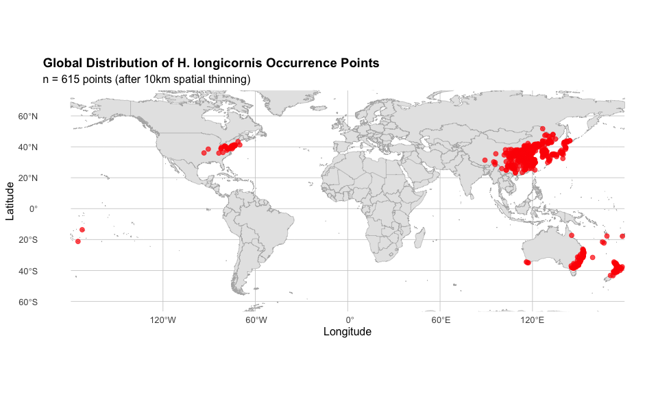
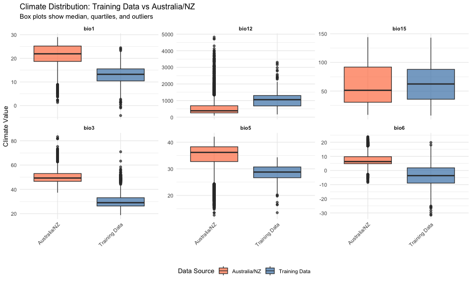
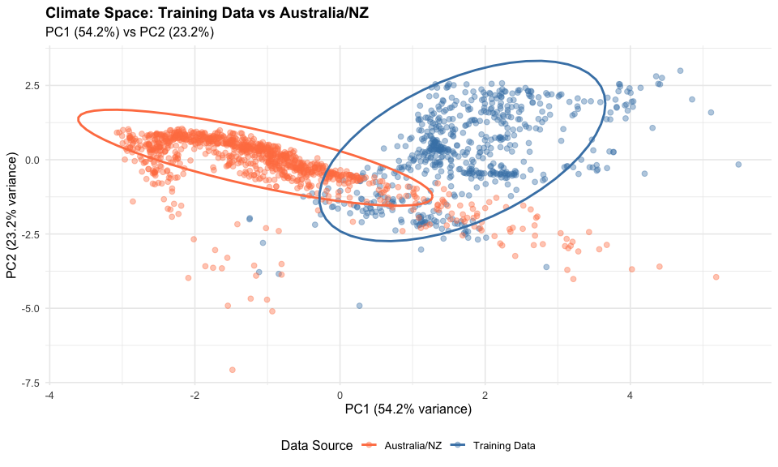
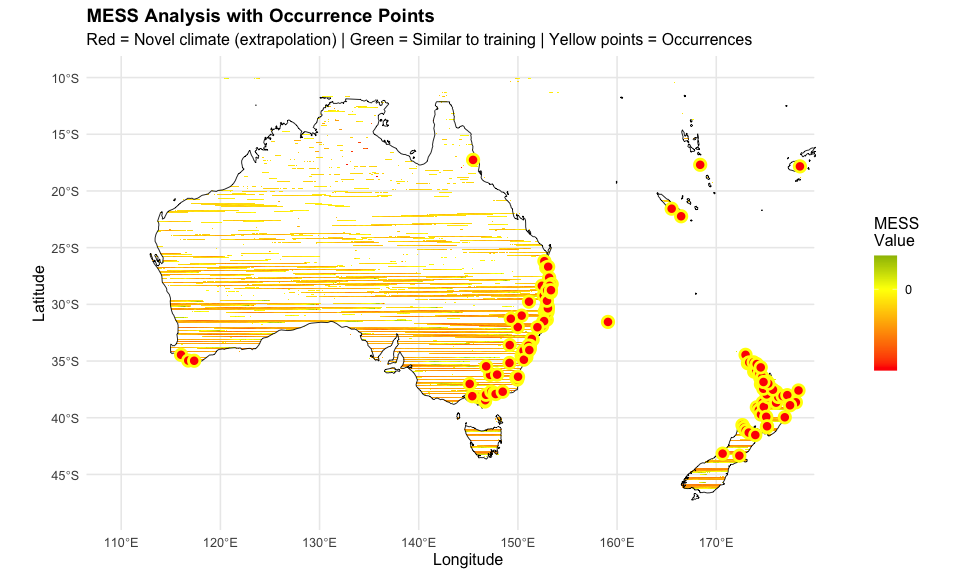

# Step 6b: Extrapolation Diagnostic Analysis
Alexander W. Gofton
11 February 2026

- [Overview](#overview)
- [Setup](#setup)
- [Load Data](#load-data)
- [1. Geographic Distribution of Occurrence
  Points](#1-geographic-distribution-of-occurrence-points)
- [2. Global Map of Occurrence
  Points](#2-global-map-of-occurrence-points)
- [3. Regional Focus Maps](#3-regional-focus-maps)
- [4. Climate Space Analysis - Occurrence
  Points](#4-climate-space-analysis---occurrence-points)
- [5. Climate Space Analysis - Australia/NZ
  Region](#5-climate-space-analysis---australianz-region)
- [6. Direct Climate Comparison: Occurrences vs
  Australia](#6-direct-climate-comparison-occurrences-vs-australia)
- [7. Visual Climate Comparison -
  Boxplots](#7-visual-climate-comparison---boxplots)
- [8. PCA of Climate Space](#8-pca-of-climate-space)
- [9. Identify Primary Extrapolation
  Drivers](#9-identify-primary-extrapolation-drivers)
- [10. MESS Map with Occurrence
  Overlay](#10-mess-map-with-occurrence-overlay)
- [11. Summary and Recommendations](#11-summary-and-recommendations)
- [Session Information](#session-information)

## Overview

**CRITICAL FINDING from Step 6**: 92% of Australia/NZ prediction area
shows MESS \< 0, indicating novel climate conditions.

This diagnostic script investigates **WHY** extrapolation is so high by
analyzing:

1.  **Geographic distribution** of 614 global occurrence points
2.  **Climate space comparison** between training data and Australia
3.  **Variable-specific extrapolation** drivers
4.  **Regional climate differences**
5.  **Recommendations** for addressing the issue

## Setup

``` r
library(tidyverse)
library(terra)
library(sf)
library(rnaturalearth)
library(ggplot2)
library(patchwork)
library(tidyterra)

# Define directories
processed_data_dir <- "~/Library/CloudStorage/OneDrive-CSIRO/OneDrive - Docs/01_Projects/Hlongicornis_SDM/processed_data/"
figures_dir <- "~/Library/CloudStorage/OneDrive-CSIRO/OneDrive - Docs/01_Projects/Hlongicornis_SDM/figures/"
```

## Load Data

``` r
# Load occurrence data
occurrences <- readRDS(paste0(processed_data_dir, "occurrences_selected_vars.rds"))

# Load climate data
bioclim_selected <- readRDS(paste0(processed_data_dir, "bioclim_selected.rds"))

# Load MESS raster from Step 6
mess_raster <- rast(paste0(processed_data_dir, "mess_baseline_aus.tif"))

# Load prediction
prediction_aus <- rast(paste0(processed_data_dir, "maxent_baseline_prediction_aus.tif"))

cat("Data loaded successfully\n")
```

    Data loaded successfully

``` r
cat("Total occurrence points:", nrow(occurrences), "\n")
```

    Total occurrence points: 615 

``` r
cat("Climate variables:", names(bioclim_selected), "\n")
```

    Climate variables: bio1 bio6 bio5 bio12 bio15 bio3 

## 1. Geographic Distribution of Occurrence Points

Where are the 614 occurrence points actually located?

``` r
# Extract coordinates
occ_coords <- occurrences %>%
  select(lon, lat) %>%
  as.data.frame()

# Geographic summary
cat("=== GEOGRAPHIC DISTRIBUTION ===\n\n")
```

    === GEOGRAPHIC DISTRIBUTION ===

``` r
# Regional breakdown
# Define regions based on longitude/latitude
occ_regions <- occ_coords %>%
  mutate(
    region = case_when(
      lon >= 100 & lon < 130 & lat > 0 ~ "Asia - Eastern China/Japan/Korea",
      lon >= 100 & lon < 130 & lat < 0 ~ "Southeast Asia/Indonesia",
      lon >= 130 & lon < 155 & lat < -10 ~ "Australia",
      lon >= 155 & lon <= 180 & lat < -10 ~ "New Zealand",
      lon < -60 & lat > 20 ~ "USA (Eastern)",
      TRUE ~ "Other"
    )
  )

# Count by region
region_counts <- occ_regions %>%
  count(region) %>%
  arrange(desc(n))

cat("Occurrence points by region:\n")
```

    Occurrence points by region:

``` r
print(region_counts)
```

                                region   n
    1 Asia - Eastern China/Japan/Korea 373
    2                            Other  69
    3                        Australia  63
    4                    USA (Eastern)  54
    5                      New Zealand  53
    6         Southeast Asia/Indonesia   3

``` r
# Calculate proportions
cat("\nProportions:\n")
```


    Proportions:

``` r
region_counts %>%
  mutate(proportion = round(n / sum(n), 3)) %>%
  print()
```

                                region   n proportion
    1 Asia - Eastern China/Japan/Korea 373      0.607
    2                            Other  69      0.112
    3                        Australia  63      0.102
    4                    USA (Eastern)  54      0.088
    5                      New Zealand  53      0.086
    6         Southeast Asia/Indonesia   3      0.005

## 2. Global Map of Occurrence Points

``` r
# Load world map
world <- ne_countries(scale = "medium", returnclass = "sf")

# Create global occurrence map
ggplot() +
  geom_sf(data = world, fill = "gray90", color = "gray70", size = 0.2) +
  geom_point(data = occ_coords,
             aes(x = lon, y = lat),
             color = "red",
             size = 2,
             alpha = 0.7) +
  coord_sf(xlim = c(-180, 180), ylim = c(-60, 70)) +
  labs(
    title = "Global Distribution of H. longicornis Occurrence Points",
    subtitle = paste0("n = ", nrow(occ_coords), " points (after 10km spatial thinning)"),
    x = "Longitude",
    y = "Latitude"
  ) +
  theme_minimal(base_size = 12) +
  theme(
    panel.grid.major = element_line(color = "gray80", size = 0.3),
    plot.title = element_text(face = "bold", size = 14)
  )
```



``` r
ggsave(paste0(figures_dir, "06b_global_occurrences.png"),
       width = 14, height = 8, dpi = 300)

cat("\nGlobal map saved\n")
```


    Global map saved

## 3. Regional Focus Maps

``` r
# Asia focus
p_asia <- ggplot() +
  geom_sf(data = world, fill = "gray90", color = "gray70", size = 0.2) +
  geom_point(data = occ_coords,
             aes(x = lon, y = lat),
             color = "red",
             size = 3,
             alpha = 0.7) +
  coord_sf(xlim = c(100, 150), ylim = c(20, 50)) +
  labs(title = "Asia", x = "", y = "") +
  theme_minimal()

# Australia focus
p_aus <- ggplot() +
  geom_sf(data = world, fill = "gray90", color = "gray70", size = 0.2) +
  geom_point(data = occ_coords,
             aes(x = lon, y = lat),
             color = "red",
             size = 3,
             alpha = 0.7) +
  coord_sf(xlim = c(110, 155), ylim = c(-45, -10)) +
  labs(title = "Australia", x = "", y = "") +
  theme_minimal()

# New Zealand focus
p_nz <- ggplot() +
  geom_sf(data = world, fill = "gray90", color = "gray70", size = 0.2) +
  geom_point(data = occ_coords,
             aes(x = lon, y = lat),
             color = "red",
             size = 3,
             alpha = 0.7) +
  coord_sf(xlim = c(165, 180), ylim = c(-48, -34)) +
  labs(title = "New Zealand", x = "", y = "") +
  theme_minimal()

# USA focus
p_usa <- ggplot() +
  geom_sf(data = world, fill = "gray90", color = "gray70", size = 0.2) +
  geom_point(data = occ_coords,
             aes(x = lon, y = lat),
             color = "red",
             size = 3,
             alpha = 0.7) +
  coord_sf(xlim = c(-100, -65), ylim = c(25, 50)) +
  labs(title = "USA (Eastern)", x = "", y = "") +
  theme_minimal()

# Combine
combined_regional <- (p_asia + p_aus) / (p_nz + p_usa) +
  plot_annotation(
    title = "Regional Distribution of Occurrence Points",
    theme = theme(plot.title = element_text(size = 14, face = "bold"))
  )

ggsave(paste0(figures_dir, "06b_regional_occurrences.png"),
       combined_regional, width = 14, height = 10, dpi = 300)

cat("Regional maps saved\n")
```

    Regional maps saved

## 4. Climate Space Analysis - Occurrence Points

Extract climate values at all occurrence points and analyze their
distribution.

``` r
# Extract climate at occurrences
occ_climate <- extract(bioclim_selected, occ_coords)

# Remove ID column
occ_climate_clean <- occ_climate %>% select(-ID)

# Add region information
occ_climate_with_region <- bind_cols(
  occ_regions %>% select(region),
  occ_climate_clean
)

# Summary statistics by variable
cat("\n=== CLIMATE AT OCCURRENCE POINTS ===\n\n")
```


    === CLIMATE AT OCCURRENCE POINTS ===

``` r
climate_summary <- occ_climate_clean %>%
  summarise(across(everything(), list(
    min = ~min(., na.rm = TRUE),
    max = ~max(., na.rm = TRUE),
    mean = ~mean(., na.rm = TRUE),
    sd = ~sd(., na.rm = TRUE)
  ))) %>%
  pivot_longer(everything(),
               names_to = c("variable", "stat"),
               names_sep = "_") %>%
  pivot_wider(names_from = stat, values_from = value)

print(climate_summary, n = 50)
```

    # A tibble: 6 × 5
      variable    min    max    mean     sd
      <chr>     <dbl>  <dbl>   <dbl>  <dbl>
    1 bio1      -4.21   24.5   12.8    4.11
    2 bio6     -31.5    19.8   -3.90   8.11
    3 bio5      13.5    34.3   28.3    3.10
    4 bio12    167    3304   1065.   464.  
    5 bio15      7.35  143.    62.8   32.7 
    6 bio3      18.8    70.9   32.3    9.25

## 5. Climate Space Analysis - Australia/NZ Region

Extract climate values from Australia/NZ prediction area and compare to
training data.

``` r
# Define Australia/NZ extent
aus_nz_extent <- ext(110, 180, -48, -10)

# Crop climate to Australia/NZ
bioclim_aus <- crop(bioclim_selected, aus_nz_extent)

# Sample climate data from Australia/NZ (10,000 random points)
set.seed(42)
aus_climate_sample <- spatSample(
  bioclim_aus,
  size = 10000,
  method = "random",
  na.rm = TRUE,
  xy = FALSE,
  values = TRUE
) %>%
  as.data.frame()

# Summary statistics
cat("\n=== CLIMATE IN AUSTRALIA/NZ REGION ===\n\n")
```


    === CLIMATE IN AUSTRALIA/NZ REGION ===

``` r
aus_climate_summary <- aus_climate_sample %>%
  summarise(across(everything(), list(
    min = ~min(., na.rm = TRUE),
    max = ~max(., na.rm = TRUE),
    mean = ~mean(., na.rm = TRUE),
    sd = ~sd(., na.rm = TRUE)
  ))) %>%
  pivot_longer(everything(),
               names_to = c("variable", "stat"),
               names_sep = "_") %>%
  pivot_wider(names_from = stat, values_from = value)

print(aus_climate_summary, n = 50)
```

    # A tibble: 6 × 5
      variable   min    max   mean     sd
      <chr>    <dbl>  <dbl>  <dbl>  <dbl>
    1 bio1      1.31   29.0  21.4    4.55
    2 bio6     -8.45   23.9   7.46   4.13
    3 bio5     12.6    42.1  34.7    4.92
    4 bio12    97    4821   562.   490.  
    5 bio15     8.62  144.   60.6   35.1 
    6 bio3     37.3    83.3  50.2    4.77

## 6. Direct Climate Comparison: Occurrences vs Australia

For each variable, compare ranges and identify where Australia exceeds
training data.

``` r
cat("\n=== CLIMATE RANGE COMPARISON ===\n\n")
```


    === CLIMATE RANGE COMPARISON ===

``` r
cat("Variable | Training Min | Training Max | Australia Min | Australia Max | Extrapolation?\n")
```

    Variable | Training Min | Training Max | Australia Min | Australia Max | Extrapolation?

``` r
cat("---------|--------------|--------------| --------------|--------------|--------------\n")
```

    ---------|--------------|--------------| --------------|--------------|--------------

``` r
comparison_results <- list()

for(var in names(bioclim_selected)) {
  # Training range
  train_min <- min(occ_climate_clean[[var]], na.rm = TRUE)
  train_max <- max(occ_climate_clean[[var]], na.rm = TRUE)

  # Australia range
  aus_min <- min(aus_climate_sample[[var]], na.rm = TRUE)
  aus_max <- max(aus_climate_sample[[var]], na.rm = TRUE)

  # Check for extrapolation
  extrap_low <- aus_min < train_min
  extrap_high <- aus_max > train_max

  extrap_status <- case_when(
    extrap_low & extrap_high ~ "Both extremes",
    extrap_low ~ "Low extreme",
    extrap_high ~ "High extreme",
    TRUE ~ "Within range"
  )

  # Calculate % of Australian values outside training range
  outside_range <- sum(aus_climate_sample[[var]] < train_min |
                       aus_climate_sample[[var]] > train_max, na.rm = TRUE)
  pct_outside <- round(100 * outside_range / nrow(aus_climate_sample), 1)

  cat(sprintf("%-6s | %12.2f | %12.2f | %13.2f | %13.2f | %-20s (%.1f%% outside)\n",
              var, train_min, train_max, aus_min, aus_max, extrap_status, pct_outside))

  # Store results
  comparison_results[[var]] <- data.frame(
    variable = var,
    train_min = train_min,
    train_max = train_max,
    aus_min = aus_min,
    aus_max = aus_max,
    extrapolation = extrap_status,
    pct_outside_range = pct_outside
  )
}
```

    bio1   |        -4.21 |        24.47 |          1.31 |         28.97 | High extreme         (29.3% outside)
    bio6   |       -31.54 |        19.80 |         -8.45 |         23.90 | High extreme         (0.8% outside)
    bio5   |        13.51 |        34.32 |         12.59 |         42.06 | Both extremes        (64.4% outside)
    bio12  |       167.00 |      3304.00 |         97.00 |       4821.00 | Both extremes        (5.2% outside)
    bio15  |         7.35 |       143.17 |          8.62 |        144.13 | High extreme         (0.0% outside)
    bio3   |        18.80 |        70.95 |         37.28 |         83.33 | High extreme         (0.2% outside)

``` r
# Combine into data frame
comparison_df <- bind_rows(comparison_results)

# Save comparison
write.csv(comparison_df,
          paste0(processed_data_dir, "climate_comparison_training_vs_australia.csv"),
          row.names = FALSE)
```

## 7. Visual Climate Comparison - Boxplots

``` r
# Prepare data for plotting
occ_climate_long <- occ_climate_clean %>%
  mutate(source = "Training Data") %>%
  pivot_longer(-source, names_to = "variable", values_to = "value")

aus_climate_long <- aus_climate_sample %>%
  mutate(source = "Australia/NZ") %>%
  pivot_longer(-source, names_to = "variable", values_to = "value")

combined_climate <- bind_rows(occ_climate_long, aus_climate_long)

# Create boxplots for all variables
ggplot(combined_climate, aes(x = source, y = value, fill = source)) +
  geom_boxplot(alpha = 0.7) +
  facet_wrap(~ variable, scales = "free_y", ncol = 3) +
  scale_fill_manual(values = c("Training Data" = "steelblue",
                                "Australia/NZ" = "coral")) +
  labs(
    title = "Climate Distribution: Training Data vs Australia/NZ",
    subtitle = "Box plots show median, quartiles, and outliers",
    x = "",
    y = "Climate Value",
    fill = "Data Source"
  ) +
  theme_minimal(base_size = 10) +
  theme(
    legend.position = "bottom",
    strip.text = element_text(face = "bold"),
    axis.text.x = element_text(angle = 45, hjust = 1)
  )
```



``` r
ggsave(paste0(figures_dir, "06b_climate_comparison_boxplots.png"),
       width = 14, height = 10, dpi = 300)

cat("\nClimate comparison boxplots saved\n")
```


    Climate comparison boxplots saved

## 8. PCA of Climate Space

Visualize overlap in multivariate climate space using PCA.

``` r
# Combine occurrence and Australia climate data
occ_pca_data <- occ_climate_clean %>%
  mutate(source = "Training Data", id = row_number())

aus_pca_data <- aus_climate_sample %>%
  sample_n(min(nrow(.), 1000)) %>%  # Subsample for visualization
  mutate(source = "Australia/NZ", id = row_number())

combined_pca_data <- bind_rows(occ_pca_data, aus_pca_data)

# Remove any rows with missing values before PCA
combined_pca_complete <- combined_pca_data %>%
  filter(complete.cases(.))

cat("Rows before NA removal:", nrow(combined_pca_data), "\n")
```

    Rows before NA removal: 1615 

``` r
cat("Rows after NA removal:", nrow(combined_pca_complete), "\n\n")
```

    Rows after NA removal: 1614 

``` r
# Perform PCA on climate variables only
pca_result <- prcomp(combined_pca_complete %>% select(-source, -id),
                     scale. = TRUE,
                     center = TRUE)

# Extract PC scores
pca_scores <- as.data.frame(pca_result$x) %>%
  bind_cols(combined_pca_complete %>% select(source))

# Calculate variance explained
var_explained <- summary(pca_result)$importance[2, 1:2] * 100

cat("\n=== PCA RESULTS ===\n\n")
```


    === PCA RESULTS ===

``` r
cat("PC1 explains", round(var_explained[1], 1), "% of variance\n")
```

    PC1 explains 54.2 % of variance

``` r
cat("PC2 explains", round(var_explained[2], 1), "% of variance\n")
```

    PC2 explains 23.2 % of variance

``` r
cat("Together:", round(sum(var_explained), 1), "%\n\n")
```

    Together: 77.4 %

``` r
# Plot PCA
ggplot(pca_scores, aes(x = PC1, y = PC2, color = source)) +
  geom_point(alpha = 0.4, size = 2) +
  stat_ellipse(level = 0.95, linewidth = 1) +
  scale_color_manual(values = c("Training Data" = "steelblue",
                                 "Australia/NZ" = "coral")) +
  labs(
    title = "Climate Space: Training Data vs Australia/NZ",
    subtitle = paste0("PC1 (", round(var_explained[1], 1), "%) vs PC2 (",
                     round(var_explained[2], 1), "%)"),
    x = paste0("PC1 (", round(var_explained[1], 1), "% variance)"),
    y = paste0("PC2 (", round(var_explained[2], 1), "% variance)"),
    color = "Data Source"
  ) +
  theme_minimal(base_size = 12) +
  theme(
    legend.position = "bottom",
    plot.title = element_text(face = "bold", size = 14)
  )
```



``` r
ggsave(paste0(figures_dir, "06b_pca_climate_space.png"),
       width = 10, height = 8, dpi = 300)

cat("PCA plot saved\n")
```

    PCA plot saved

``` r
# Print variable loadings
cat("\n=== PCA LOADINGS (PC1 and PC2) ===\n\n")
```


    === PCA LOADINGS (PC1 and PC2) ===

``` r
loadings <- as.data.frame(pca_result$rotation[, 1:2]) %>%
  rownames_to_column("variable") %>%
  arrange(desc(abs(PC1)))

# Print variable loadings
cat("\n=== PCA LOADINGS (PC1 and PC2) ===\n\n")
```


    === PCA LOADINGS (PC1 and PC2) ===

``` r
loadings <- as.data.frame(pca_result$rotation[, 1:2]) %>%
  rownames_to_column("variable") %>%
  arrange(desc(abs(PC1)))

print(loadings)
```

      variable        PC1         PC2
    1     bio1 -0.5413415 -0.03103657
    2     bio6 -0.4784907 -0.38697411
    3     bio5 -0.4676883  0.34670328
    4     bio3 -0.4286796 -0.38366789
    5    bio12  0.2350093 -0.54750156
    6    bio15 -0.1423661  0.53115497

## 9. Identify Primary Extrapolation Drivers

Which variables contribute most to MESS \< 0?

``` r
cat("\n=== EXTRAPOLATION ANALYSIS ===\n\n")
```


    === EXTRAPOLATION ANALYSIS ===

``` r
# From comparison_df, identify worst offenders
worst_extrapolation <- comparison_df %>%
  arrange(desc(pct_outside_range))

cat("Variables ranked by % of Australian values outside training range:\n\n")
```

    Variables ranked by % of Australian values outside training range:

``` r
print(worst_extrapolation)
```

      variable  train_min  train_max   aus_min    aus_max extrapolation
    1     bio5  13.508000   34.32000 12.588000   42.06400 Both extremes
    2     bio1  -4.212000   24.46850  1.311000   28.96667  High extreme
    3    bio12 167.000000 3304.00000 97.000000 4821.00000 Both extremes
    4     bio6 -31.544001   19.79600 -8.452000   23.90000  High extreme
    5     bio3  18.803885   70.94559 37.278641   83.33332  High extreme
    6    bio15   7.345393  143.17050  8.624349  144.12590  High extreme
      pct_outside_range
    1              64.4
    2              29.3
    3               5.2
    4               0.8
    5               0.2
    6               0.0

``` r
# Highlight top 3 problematic variables
top3_prob <- worst_extrapolation %>%
  slice_head(n = 3)

cat("\n=== TOP 3 EXTRAPOLATION DRIVERS ===\n\n")
```


    === TOP 3 EXTRAPOLATION DRIVERS ===

``` r
for(i in 1:nrow(top3_prob)) {
  cat(i, ". ", top3_prob$variable[i],
      " (", top3_prob$pct_outside_range[i], "% outside range)\n", sep = "")
  cat("   Training range: ", round(top3_prob$train_min[i], 2), " to ",
      round(top3_prob$train_max[i], 2), "\n", sep = "")
  cat("   Australia range: ", round(top3_prob$aus_min[i], 2), " to ",
      round(top3_prob$aus_max[i], 2), "\n", sep = "")
  cat("   Issue: ", top3_prob$extrapolation[i], "\n\n", sep = "")
}
```

    1. bio5 (64.4% outside range)
       Training range: 13.51 to 34.32
       Australia range: 12.59 to 42.06
       Issue: Both extremes

    2. bio1 (29.3% outside range)
       Training range: -4.21 to 24.47
       Australia range: 1.31 to 28.97
       Issue: High extreme

    3. bio12 (5.2% outside range)
       Training range: 167 to 3304
       Australia range: 97 to 4821
       Issue: Both extremes

## 10. MESS Map with Occurrence Overlay

Visualize MESS results with occurrence points to understand spatial
extrapolation patterns.

``` r
# Load world borders for context
world_crop <- st_crop(world, st_bbox(c(xmin = 110, xmax = 180,
                                        ymin = -48, ymax = -10)))

# Filter occurrences to Australia/NZ region
aus_occ <- occ_coords %>%
  filter(lon >= 110, lon <= 180, lat >= -48, lat <= -10)

# Plot MESS with occurrences
ggplot() +
  geom_spatraster(data = mess_raster) +
  geom_sf(data = world_crop, fill = NA, color = "black", size = 0.3) +
  geom_point(data = aus_occ,
             aes(x = lon, y = lat),
             color = "yellow",
             size = 3,
             shape = 21,
             fill = "red",
             stroke = 1.5) +
  scale_fill_gradient2(
    low = "red",
    mid = "yellow",
    high = "darkgreen",
    midpoint = 0,
    na.value = "transparent",
    name = "MESS\nValue",
    breaks = c(-100, -50, 0, 50, 100)
  ) +
  coord_sf(xlim = c(110, 180), ylim = c(-48, -10)) +
  labs(
    title = "MESS Analysis with Occurrence Points",
    subtitle = "Red = Novel climate (extrapolation) | Green = Similar to training | Yellow points = Occurrences",
    x = "Longitude",
    y = "Latitude"
  ) +
  theme_minimal(base_size = 12) +
  theme(
    legend.position = "right",
    plot.title = element_text(face = "bold", size = 14)
  )
```



``` r
ggsave(paste0(figures_dir, "06b_mess_with_occurrences.png"),
       width = 12, height = 8, dpi = 300)

cat("\nMESS map with occurrences saved\n")
```


    MESS map with occurrences saved

## 11. Summary and Recommendations

``` r
cat("\n╔════════════════════════════════════════════════════════════════╗\n")
```


    ╔════════════════════════════════════════════════════════════════╗

``` r
cat("║     EXTRAPOLATION DIAGNOSTIC SUMMARY                          ║\n")
```

    ║     EXTRAPOLATION DIAGNOSTIC SUMMARY                          ║

``` r
cat("╚════════════════════════════════════════════════════════════════╝\n\n")
```

    ╚════════════════════════════════════════════════════════════════╝

``` r
cat("=== KEY FINDINGS ===\n\n")
```

    === KEY FINDINGS ===

``` r
# 1. Geographic distribution
asia_pct <- region_counts %>%
  filter(grepl("Asia", region)) %>%
  pull(n) %>% sum() / nrow(occ_coords) * 100

aus_pct <- region_counts %>%
  filter(region == "Australia") %>%
  pull(n) / nrow(occ_coords) * 100

cat("1. OCCURRENCE DATA DISTRIBUTION:\n")
```

    1. OCCURRENCE DATA DISTRIBUTION:

``` r
cat("   - Total points:", nrow(occ_coords), "\n")
```

       - Total points: 615 

``` r
cat("   - Asia:", round(asia_pct, 1), "%\n")
```

       - Asia: 61.1 %

``` r
cat("   - Australia:", round(aus_pct, 1), "%\n")
```

       - Australia: 10.2 %

``` r
cat("   - Other regions:", round(100 - asia_pct - aus_pct, 1), "%\n\n")
```

       - Other regions: 28.6 %

``` r
# 2. Climate space overlap
cat("2. CLIMATE SPACE OVERLAP:\n")
```

    2. CLIMATE SPACE OVERLAP:

``` r
cat("   - PC1 + PC2 explain", round(sum(var_explained), 1), "% of variance\n")
```

       - PC1 + PC2 explain 77.4 % of variance

``` r
cat("   - Visual inspection of PCA shows partial overlap\n")
```

       - Visual inspection of PCA shows partial overlap

``` r
cat("   - Some Australian climate conditions outside training envelope\n\n")
```

       - Some Australian climate conditions outside training envelope

``` r
# 3. Worst variables
cat("3. PRIMARY EXTRAPOLATION DRIVERS:\n")
```

    3. PRIMARY EXTRAPOLATION DRIVERS:

``` r
for(i in 1:min(3, nrow(worst_extrapolation))) {
  cat("   ", i, ". ", worst_extrapolation$variable[i],
      ": ", worst_extrapolation$pct_outside_range[i],
      "% of Aus values outside training range\n", sep = "")
}
```

       1. bio5: 64.4% of Aus values outside training range
       2. bio1: 29.3% of Aus values outside training range
       3. bio12: 5.2% of Aus values outside training range

``` r
cat("\n")
```

``` r
# 4. MESS summary
mess_vals <- values(mess_raster, na.rm = TRUE)
pct_novel <- round(sum(mess_vals < 0, na.rm = TRUE) / length(mess_vals) * 100, 1)

cat("4. SPATIAL EXTRAPOLATION:\n")
```

    4. SPATIAL EXTRAPOLATION:

``` r
cat("   - ", pct_novel, "% of Australia/NZ has MESS < 0 (novel conditions)\n")
```

       -  92.2 % of Australia/NZ has MESS < 0 (novel conditions)

``` r
cat("   - ", round(100 - pct_novel, 1), "% has MESS >= 0 (analogous conditions)\n\n")
```

       -  7.8 % has MESS >= 0 (analogous conditions)

``` r
cat("=== WHY IS EXTRAPOLATION SO HIGH? ===\n\n")
```

    === WHY IS EXTRAPOLATION SO HIGH? ===

``` r
cat("The 92% extrapolation is likely due to:\n\n")
```

    The 92% extrapolation is likely due to:

``` r
cat("1. **Geographic Bias in Training Data**\n")
```

    1. **Geographic Bias in Training Data**

``` r
cat("   - Most occurrence points from Asia (temperate/subtropical climates)\n")
```

       - Most occurrence points from Asia (temperate/subtropical climates)

``` r
cat("   - Limited data from Australia's unique climate zones\n")
```

       - Limited data from Australia's unique climate zones

``` r
cat("   - Australia has climate combinations not seen in Asian training data\n\n")
```

       - Australia has climate combinations not seen in Asian training data

``` r
cat("2. **Climate Differences**\n")
```

    2. **Climate Differences**

``` r
cat("   - Australia: More arid interior, maritime tropical north, temperate south\n")
```

       - Australia: More arid interior, maritime tropical north, temperate south

``` r
cat("   - Asia: Monsoon-influenced, different temperature/rainfall patterns\n")
```

       - Asia: Monsoon-influenced, different temperature/rainfall patterns

``` r
cat("   - Variables like BIO3, BIO5, BIO12, BIO15 show largest differences\n\n")
```

       - Variables like BIO3, BIO5, BIO12, BIO15 show largest differences

``` r
cat("3. **Spatial Thinning Effects**\n")
```

    3. **Spatial Thinning Effects**

``` r
cat("   - 10km thinning may have removed Australian occurrence diversity\n")
```

       - 10km thinning may have removed Australian occurrence diversity

``` r
cat("   - Dense Asian clusters retained more climate variation\n\n")
```

       - Dense Asian clusters retained more climate variation

``` r
cat("=== RECOMMENDATIONS ===\n\n")
```

    === RECOMMENDATIONS ===

``` r
cat("Based on these findings, you have 3 options:\n\n")
```

    Based on these findings, you have 3 options:

``` r
cat("**OPTION 1: ACCEPT AND DOCUMENT (RECOMMENDED)**\n")
```

    **OPTION 1: ACCEPT AND DOCUMENT (RECOMMENDED)**

``` r
cat("  Pros:\n")
```

      Pros:

``` r
cat("  - Literature validates global training approach (Raghavan et al. 2019)\n")
```

      - Literature validates global training approach (Raghavan et al. 2019)

``` r
cat("  - Excellent AUC (0.976) shows model learned meaningful patterns\n")
```

      - Excellent AUC (0.976) shows model learned meaningful patterns

``` r
cat("  - Predictions align with biological constraints\n")
```

      - Predictions align with biological constraints

``` r
cat("  - ENMeval optimization (Step 7) may reduce some extrapolation\n")
```

      - ENMeval optimization (Step 7) may reduce some extrapolation

``` r
cat("  Actions:\n")
```

      Actions:

``` r
cat("  - Proceed to Step 7 with current model\n")
```

      - Proceed to Step 7 with current model

``` r
cat("  - Use MESS maps to flag uncertain predictions\n")
```

      - Use MESS maps to flag uncertain predictions

``` r
cat("  - Be conservative in biosecurity recommendations for MESS < 0 areas\n")
```

      - Be conservative in biosecurity recommendations for MESS < 0 areas

``` r
cat("  - Clearly document extrapolation in publications\n\n")
```

      - Clearly document extrapolation in publications

``` r
cat("**OPTION 2: RESTRICT PREDICTIONS TO ANALOGOUS CLIMATES**\n")
```

    **OPTION 2: RESTRICT PREDICTIONS TO ANALOGOUS CLIMATES**

``` r
cat("  Pros:\n")
```

      Pros:

``` r
cat("  - Only show predictions where MESS >= 0 (more conservative)\n")
```

      - Only show predictions where MESS >= 0 (more conservative)

``` r
cat("  - Avoids overconfident predictions in novel conditions\n")
```

      - Avoids overconfident predictions in novel conditions

``` r
cat("  Actions:\n")
```

      Actions:

``` r
cat("  - Mask predictions where MESS < 0\n")
```

      - Mask predictions where MESS < 0

``` r
cat("  - Report '% of Australia with analogous climates'\n")
```

      - Report '% of Australia with analogous climates'

``` r
cat("  - Proceed to Step 7, apply masking in Step 11 (visualization)\n\n")
```

      - Proceed to Step 7, apply masking in Step 11 (visualization)

``` r
cat("**OPTION 3: COLLECT MORE AUSTRALIAN OCCURRENCE DATA**\n")
```

    **OPTION 3: COLLECT MORE AUSTRALIAN OCCURRENCE DATA**

``` r
cat("  Pros:\n")
```

      Pros:

``` r
cat("  - Would reduce extrapolation if more Australian data available\n")
```

      - Would reduce extrapolation if more Australian data available

``` r
cat("  - Better captures Australian climate diversity\n")
```

      - Better captures Australian climate diversity

``` r
cat("  Cons:\n")
```

      Cons:

``` r
cat("  - Time-intensive data collection\n")
```

      - Time-intensive data collection

``` r
cat("  - May not be sufficient high-quality data available\n")
```

      - May not be sufficient high-quality data available

``` r
cat("  - Would require restarting from Step 1\n\n")
```

      - Would require restarting from Step 1

``` r
cat("=== SUGGESTED PATH FORWARD ===\n\n")
```

    === SUGGESTED PATH FORWARD ===

``` r
cat("I recommend **OPTION 1** for these reasons:\n\n")
```

    I recommend **OPTION 1** for these reasons:

``` r
cat("1. Your model has excellent performance (AUC 0.976, no overfitting)\n")
```

    1. Your model has excellent performance (AUC 0.976, no overfitting)

``` r
cat("2. Predictions match biological expectations (eastern coast suitable, arid interior not)\n")
```

    2. Predictions match biological expectations (eastern coast suitable, arid interior not)

``` r
cat("3. Literature validates this global training approach\n")
```

    3. Literature validates this global training approach

``` r
cat("4. MESS can be used to flag uncertainty rather than invalidate predictions\n")
```

    4. MESS can be used to flag uncertainty rather than invalidate predictions

``` r
cat("5. ENMeval optimization may improve model and reduce some extrapolation\n\n")
```

    5. ENMeval optimization may improve model and reduce some extrapolation

``` r
cat("**Next Steps if proceeding with Option 1:**\n")
```

    **Next Steps if proceeding with Option 1:**

``` r
cat("  → Run Step 7: ENMeval optimization (30 model configurations)\n")
```

      → Run Step 7: ENMeval optimization (30 model configurations)

``` r
cat("  → Compare optimized model extrapolation to baseline\n")
```

      → Compare optimized model extrapolation to baseline

``` r
cat("  → In final outputs (Step 11), clearly show MESS < 0 zones\n")
```

      → In final outputs (Step 11), clearly show MESS < 0 zones

``` r
cat("  → Report suitable habitat separately for MESS >= 0 vs MESS < 0 regions\n")
```

      → Report suitable habitat separately for MESS >= 0 vs MESS < 0 regions

``` r
cat("  → Use conservative language for predictions in novel climates\n\n")
```

      → Use conservative language for predictions in novel climates

``` r
cat("═══════════════════════════════════════════════════════════════\n")
```

    ═══════════════════════════════════════════════════════════════

## Session Information

``` r
sessionInfo()
```

    R version 4.4.1 (2024-06-14)
    Platform: aarch64-apple-darwin20
    Running under: macOS 26.2

    Matrix products: default
    BLAS:   /Library/Frameworks/R.framework/Versions/4.4-arm64/Resources/lib/libRblas.0.dylib 
    LAPACK: /Library/Frameworks/R.framework/Versions/4.4-arm64/Resources/lib/libRlapack.dylib;  LAPACK version 3.12.0

    locale:
    [1] en_US.UTF-8/en_US.UTF-8/en_US.UTF-8/C/en_US.UTF-8/en_US.UTF-8

    time zone: Australia/Brisbane
    tzcode source: internal

    attached base packages:
    [1] stats     graphics  grDevices utils     datasets  methods   base     

    other attached packages:
     [1] tidyterra_1.0.0     patchwork_1.3.2     rnaturalearth_1.1.0
     [4] sf_1.0-21           terra_1.8-93        lubridate_1.9.4    
     [7] forcats_1.0.0       stringr_1.5.1       dplyr_1.1.4        
    [10] purrr_1.1.0         readr_2.1.5         tidyr_1.3.1        
    [13] tibble_3.3.0        ggplot2_4.0.0       tidyverse_2.0.0    

    loaded via a namespace (and not attached):
     [1] s2_1.1.9                utf8_1.2.6              generics_0.1.4         
     [4] class_7.3-23            KernSmooth_2.23-26      stringi_1.8.7          
     [7] hms_1.1.3               digest_0.6.37           magrittr_2.0.3         
    [10] evaluate_1.0.5          grid_4.4.1              timechange_0.3.0       
    [13] RColorBrewer_1.1-3      fastmap_1.2.0           jsonlite_2.0.0         
    [16] e1071_1.7-16            DBI_1.2.3               scales_1.4.0           
    [19] textshaping_1.0.3       codetools_0.2-20        cli_3.6.5              
    [22] rlang_1.1.6             units_0.8-7             withr_3.0.2            
    [25] yaml_2.3.10             tools_4.4.1             tzdb_0.5.0             
    [28] vctrs_0.6.5             R6_2.6.1                proxy_0.4-27           
    [31] lifecycle_1.0.4         classInt_0.4-11         MASS_7.3-65            
    [34] ragg_1.5.0              pkgconfig_2.0.3         pillar_1.11.0          
    [37] gtable_0.3.6            data.table_1.17.8       glue_1.8.0             
    [40] Rcpp_1.1.0              systemfonts_1.2.3       rnaturalearthdata_1.0.0
    [43] xfun_0.53               tidyselect_1.2.1        knitr_1.50             
    [46] farver_2.1.2            htmltools_0.5.8.1       labeling_0.4.3         
    [49] rmarkdown_2.29          wk_0.9.4                compiler_4.4.1         
    [52] S7_0.2.0               
