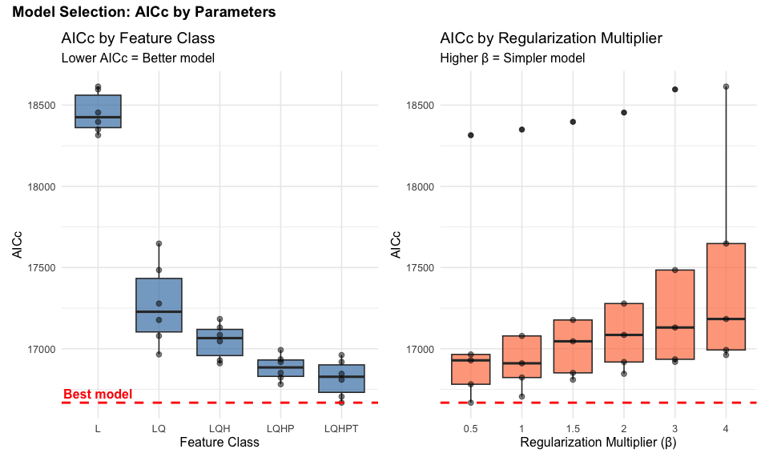
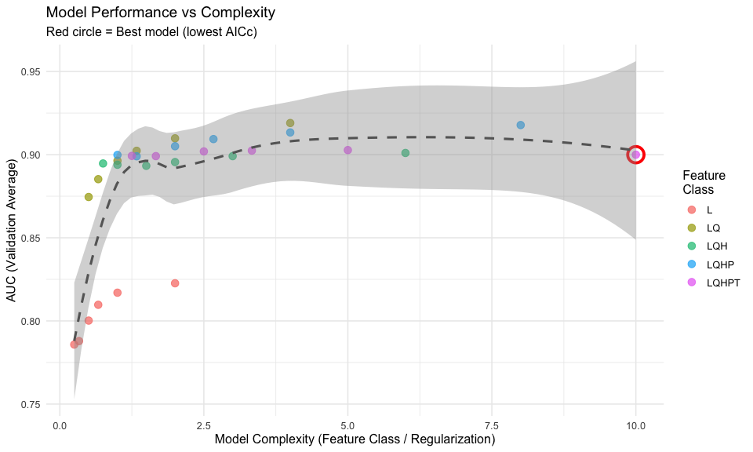
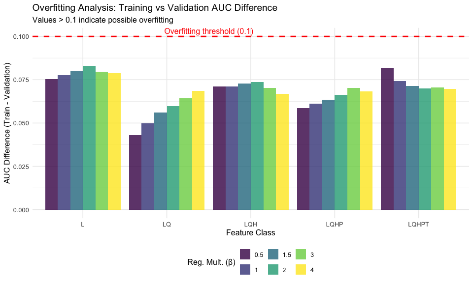
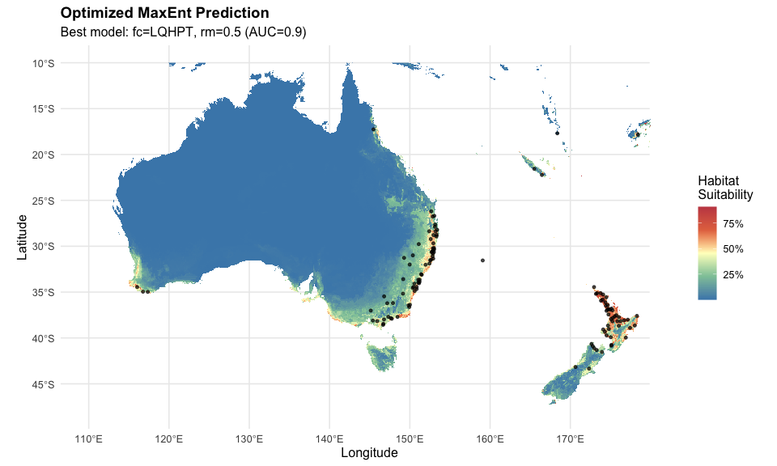
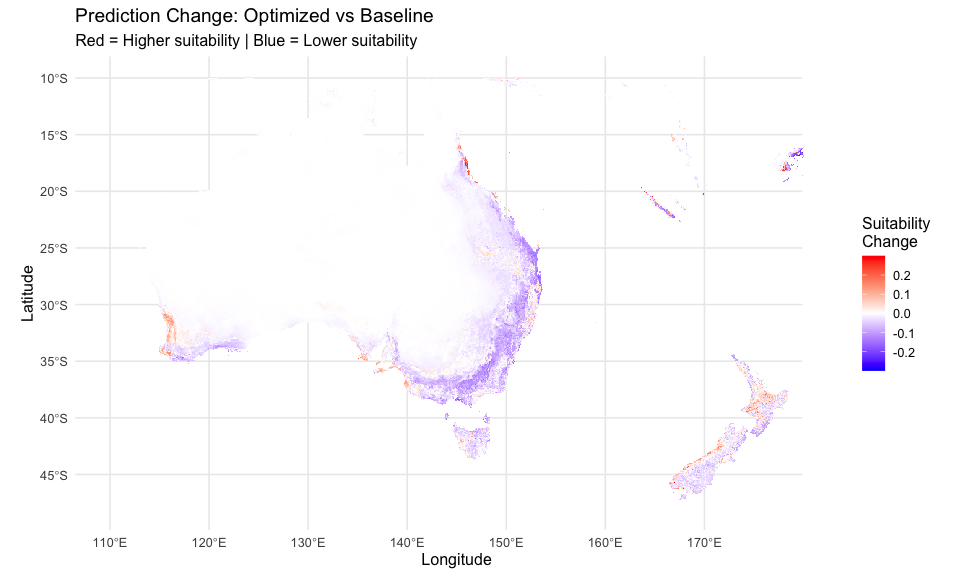

# Step 7: MaxEnt Parameter Optimization with ENMeval
Alexander W. Gofton
11 February 2026

- [Overview](#overview)
- [Setup](#setup)
- [Load Data](#load-data)
- [Prepare Data for ENMeval](#prepare-data-for-enmeval)
- [Configure ENMeval Parameters](#configure-enmeval-parameters)
- [Run ENMeval](#run-enmeval)
- [Extract Results Table](#extract-results-table)
- [Identify Best Model](#identify-best-model)
- [Model Selection Plots](#model-selection-plots)
  - [AICc vs Parameters](#aicc-vs-parameters)
  - [AUC vs Complexity](#auc-vs-complexity)
  - [Overfitting Analysis](#overfitting-analysis)
- [Generate Predictions with Best
  Model](#generate-predictions-with-best-model)
- [Visualize Optimized Prediction](#visualize-optimized-prediction)
  - [Leaflet map of optimized model](#leaflet-map-of-optimized-model)
- [Compare Baseline vs Optimized](#compare-baseline-vs-optimized)
- [Save Best Model](#save-best-model)
- [Summary and Next Steps](#summary-and-next-steps)
- [Session Information](#session-information)

## Overview

This script uses **ENMeval 2.0** to systematically optimize MaxEnt
parameters by testing 30 different model configurations:

- **5 feature class combinations**: L, LQ, LQH, LQHP, LQHPT
- **6 regularization multipliers**: β = 0.5, 1.0, 1.5, 2.0, 3.0, 4.0
- **Spatial block cross-validation**: k=5 folds to account for spatial
  autocorrelation

The best model (lowest AICc) will be used for future climate
projections.

**Context from Steps 5-6**: - Baseline model: AUC = 0.976 (excellent) -
92% extrapolation in Australia (acceptable, see Step 6b) - 614 global
occurrence points (61% Asia, 10% Australia, 29% other)

## Setup

``` r
# Set Java heap memory to 8GB (adjust based on available RAM)
options(java.parameters = "-Xmx12g")

library(tidyverse)
library(terra)
library(predicts)  # Modern MaxEnt
library(ENMeval)   # Model optimization (v2.0+)
library(rJava)
library(sf)
library(ggplot2)
library(patchwork)
library(beepr)

# Define directories
processed_data_dir <- "~/Library/CloudStorage/OneDrive-CSIRO/OneDrive - Docs/01_Projects/Hlongicornis_SDM/processed_data/"
figures_dir <- "~/Library/CloudStorage/OneDrive-CSIRO/OneDrive - Docs/01_Projects/Hlongicornis_SDM/figures/"
outputs_dir <- "~/Library/CloudStorage/OneDrive-CSIRO/OneDrive - Docs/01_Projects/Hlongicornis_SDM/outputs/"
```

## Load Data

``` r
# Load occurrence data
occurrences <- readRDS(paste0(processed_data_dir, "occurrences_selected_vars.rds"))

# Load climate data (global extent for training)
bioclim_selected <- readRDS(paste0(processed_data_dir, "bioclim_selected.rds"))

# Load background points (from Step 5)
background_coords <- read.csv(paste0(processed_data_dir, "background_points.csv"))

cat("Data loaded successfully\n")
```

    Data loaded successfully

``` r
cat("Occurrence points:", nrow(occurrences), "\n")
```

    Occurrence points: 615 

``` r
cat("Background points:", nrow(background_coords), "\n")
```

    Background points: 10000 

``` r
cat("Climate variables:", names(bioclim_selected), "\n")
```

    Climate variables: bio1 bio6 bio5 bio12 bio15 bio3 

## Prepare Data for ENMeval

``` r
# Extract presence coordinates and remove NAs
presence_coords <- occurrences %>%
  select(lon, lat) %>%
  filter(!is.na(lon), !is.na(lat)) %>%
  as.data.frame()

# Also filter background coordinates for NAs
background_coords_clean <- background_coords %>%
  filter(!is.na(lon), !is.na(lat))

# Convert to sf objects (ENMeval 2.0 works with sf)
presence_sf <- st_as_sf(presence_coords,
                        coords = c("lon", "lat"),
                        crs = 4326)

background_sf <- st_as_sf(background_coords_clean,
                          coords = c("lon", "lat"),
                          crs = 4326)

cat("\nData prepared for ENMeval:\n")
```


    Data prepared for ENMeval:

``` r
cat("Presence points (sf):", nrow(presence_sf), "\n")
```

    Presence points (sf): 614 

``` r
cat("Background points (sf):", nrow(background_sf), "\n")
```

    Background points (sf): 10000 

``` r
cat("Points removed due to missing coords:",
    nrow(occurrences) - nrow(presence_sf), "\n")
```

    Points removed due to missing coords: 1 

## Configure ENMeval Parameters

``` r
# Define feature class combinations to test
feature_classes <- c("L", "LQ", "LQH", "LQHP", "LQHPT")

# Define regularization multipliers to test
reg_multipliers <- c(0.5, 1.0, 1.5, 2.0, 3.0, 4.0)

cat("=== ENMEVAL CONFIGURATION ===\n\n")
```

    === ENMEVAL CONFIGURATION ===

``` r
cat("Feature classes to test:\n")
```

    Feature classes to test:

``` r
cat(" L    = Linear only\n")
```

     L    = Linear only

``` r
cat(" LQ   = Linear + Quadratic\n")
```

     LQ   = Linear + Quadratic

``` r
cat(" LQH  = Linear + Quadratic + Hinge\n")
```

     LQH  = Linear + Quadratic + Hinge

``` r
cat(" LQHP = Linear + Quadratic + Hinge + Product\n")
```

     LQHP = Linear + Quadratic + Hinge + Product

``` r
cat(" LQHPT = All features (L + Q + H + P + Threshold)\n\n")
```

     LQHPT = All features (L + Q + H + P + Threshold)

``` r
cat("Regularization multipliers (β):", paste(reg_multipliers, collapse = ", "), "\n")
```

    Regularization multipliers (β): 0.5, 1, 1.5, 2, 3, 4 

``` r
cat("Total models to test:", length(feature_classes) * length(reg_multipliers), "\n\n")
```

    Total models to test: 30 

``` r
cat("Cross-validation strategy: Spatial block (checkerboard2)\n")
```

    Cross-validation strategy: Spatial block (checkerboard2)

``` r
cat("Number of folds: 4\n")
```

    Number of folds: 4

``` r
cat("Model selection criterion: AICc (lowest = best)\n\n")
```

    Model selection criterion: AICc (lowest = best)

## Run ENMeval

**Note**: This will take 30-90 minutes depending on your computer.

``` r
#Starting ENMeval optimization
#This may take 30-90 minutes with 614 global occurrence points

# Check if ENMeval results already generated - no need to run more than once!
enmeval_results_file <- paste0(outputs_dir, "enmeval_results.rds")

if (file.exists(enmeval_results_file)) {
  cat("Loading existing ENMeval results from file...\n")
  enmeval_results <- readRDS(enmeval_results_file)
} else {
  cat("Starting ENMeval optimization...\n")

  # Run ENMeval
  # Set seed for reproducibility
  set.seed(7990)

  # ENMeval with terra::SpatRaster expects regular data frames, not sf objects
  enmeval_results <- ENMevaluate(
    occs = presence_coords,      # Use data frame, not sf
    envs = bioclim_selected,
    bg = background_coords_clean, # Use data frame, not sf
    algorithm = "maxent.jar",
    partitions = "block",
    tune.args = list(
      fc = feature_classes,
      rm = reg_multipliers
    ),
    parallel = TRUE,
    numCores = 4,
    quiet = FALSE
  )

  cat("\n✓ ENMeval optimization complete!\n")
  beep(sound = 8)

  # Save full ENMeval object
  saveRDS(enmeval_results, enmeval_results_file)

  cat("ENMeval results saved to:", enmeval_results_file,  "\n")
}
```

    Loading existing ENMeval results from file...

## Extract Results Table

``` r
# Get results table
results_table <- eval.results(enmeval_results)

# View all results
cat("\n=== ALL MODEL RESULTS ===\n\n")
```


    === ALL MODEL RESULTS ===

``` r
print(results_table)
```

          fc  rm       tune.args auc.train cbi.train auc.diff.avg auc.diff.sd
    1      L 0.5     fc.L_rm.0.5 0.8978779        NA   0.13763371  0.14660474
    2     LQ 0.5    fc.LQ_rm.0.5 0.9621830        NA   0.04418000  0.06928053
    3    LQH 0.5   fc.LQH_rm.0.5 0.9719916        NA   0.06580312  0.08806724
    4   LQHP 0.5  fc.LQHP_rm.0.5 0.9763962        NA   0.05527946  0.06595766
    5  LQHPT 0.5 fc.LQHPT_rm.0.5 0.9817152        NA   0.07621661  0.07224067
    6      L 1.0       fc.L_rm.1 0.8946077        NA   0.14201157  0.15063486
    7     LQ 1.0      fc.LQ_rm.1 0.9597579        NA   0.05002075  0.07980352
    8    LQH 1.0     fc.LQH_rm.1 0.9700564        NA   0.06438721  0.09008185
    9   LQHP 1.0    fc.LQHP_rm.1 0.9746240        NA   0.05771457  0.07261866
    10 LQHPT 1.0   fc.LQHPT_rm.1 0.9769006        NA   0.06762730  0.07303464
    11     L 1.5     fc.L_rm.1.5 0.8897724        NA   0.14602672  0.15361957
    12    LQ 1.5    fc.LQ_rm.1.5 0.9583059        NA   0.05538522  0.08935690
    13   LQH 1.5   fc.LQH_rm.1.5 0.9683986        NA   0.06595167  0.09390848
    14  LQHP 1.5  fc.LQHP_rm.1.5 0.9727481        NA   0.05955207  0.07931639
    15 LQHPT 1.5 fc.LQHPT_rm.1.5 0.9738929        NA   0.06543466  0.07657745
    16     L 2.0       fc.L_rm.2 0.8833374        NA   0.14916816  0.15601296
    17    LQ 2.0      fc.LQ_rm.2 0.9561967        NA   0.06044677  0.09807918
    18   LQH 2.0     fc.LQH_rm.2 0.9670297        NA   0.06672826  0.09716171
    19  LQHP 2.0    fc.LQHP_rm.2 0.9713631        NA   0.06278924  0.08483851
    20 LQHPT 2.0   fc.LQHPT_rm.2 0.9718704        NA   0.06401092  0.07991904
    21     L 3.0       fc.L_rm.3 0.8674424        NA   0.15566780  0.15779986
    22    LQ 3.0      fc.LQ_rm.3 0.9494100        NA   0.06846322  0.10921911
    23   LQH 3.0     fc.LQH_rm.3 0.9642056        NA   0.06634526  0.09280568
    24  LQHP 3.0    fc.LQHP_rm.3 0.9693457        NA   0.06526751  0.09371690
    25 LQHPT 3.0   fc.LQHPT_rm.3 0.9695125        NA   0.06360271  0.08479440
    26     L 4.0       fc.L_rm.4 0.8646322        NA   0.15986909  0.15595922
    27    LQ 4.0      fc.LQ_rm.4 0.9430131        NA   0.07545772  0.11723765
    28   LQH 4.0     fc.LQH_rm.4 0.9615058        NA   0.06556227  0.08626529
    29  LQHP 4.0    fc.LQHP_rm.4 0.9681103        NA   0.06289317  0.09032584
    30 LQHPT 4.0   fc.LQHPT_rm.4 0.9688610        NA   0.05999737  0.08271853
       auc.val.avg auc.val.sd cbi.val.avg cbi.val.sd or.10p.avg or.10p.sd
    1    0.8226447 0.17173684          NA         NA  0.2041529 0.3651537
    2    0.9190229 0.06350416          NA         NA  0.2466047 0.3569050
    3    0.9010015 0.08148884          NA         NA  0.3945442 0.2736441
    4    0.9177900 0.06319751          NA         NA  0.4139292 0.2941630
    5    0.8999670 0.06838762          NA         NA  0.4986525 0.2660736
    6    0.8169800 0.17678644          NA         NA  0.2041529 0.3651537
    7    0.9097999 0.07279829          NA         NA  0.2352198 0.3567314
    8    0.8990890 0.08223960          NA         NA  0.3880507 0.2736974
    9    0.9133504 0.06985035          NA         NA  0.3960615 0.2922174
    10   0.9027353 0.06962524          NA         NA  0.4514685 0.2722019
    11   0.8096960 0.17970210          NA         NA  0.2074208 0.3628467
    12   0.9023108 0.08261122          NA         NA  0.2319519 0.3580652
    13   0.8955402 0.08552666          NA         NA  0.3734297 0.2869864
    14   0.9093546 0.07638755          NA         NA  0.3652279 0.2951033
    15   0.9024287 0.07306573          NA         NA  0.4124119 0.2713846
    16   0.8002052 0.18000631          NA         NA  0.2074208 0.3628467
    17   0.8963505 0.09177912          NA         NA  0.2270711 0.3572886
    18   0.8932734 0.08776514          NA         NA  0.3701935 0.2969358
    19   0.9050552 0.08204038          NA         NA  0.3684641 0.2968588
    20   0.9019486 0.07589043          NA         NA  0.4010377 0.2721522
    21   0.7878743 0.18058391          NA         NA  0.2090548 0.3661912
    22   0.8852471 0.10397169          NA         NA  0.2287263 0.3580542
    23   0.8939215 0.08407323          NA         NA  0.3702254 0.3017511
    24   0.8990065 0.08835973          NA         NA  0.3701193 0.3047458
    25   0.8991087 0.07885546          NA         NA  0.4058972 0.2650832
    26   0.7857893 0.18116491          NA         NA  0.2058081 0.3683300
    27   0.8745250 0.11335156          NA         NA  0.2319943 0.3569991
    28   0.8946846 0.07745237          NA         NA  0.3702254 0.3092048
    29   0.8998106 0.08475193          NA         NA  0.3701511 0.3138917
    30   0.8992381 0.07529881          NA         NA  0.4091970 0.2615717
        or.mtp.avg   or.mtp.sd     AICc delta.AICc         w.AIC ncoef
    1  0.000000000 0.000000000 18314.67 1646.70200  0.000000e+00     6
    2  0.001623377 0.003246753 16965.02  297.05495  3.128508e-65    10
    3  0.004870130 0.009740260 16928.63  260.65964  2.503106e-57   142
    4  0.004870130 0.009740260 16781.40  113.43216  2.336254e-25   145
    5  0.001623377 0.003246753 16667.97    0.00000  1.000000e+00   152
    6  0.000000000 0.000000000 18349.49 1681.52347  0.000000e+00     6
    7  0.001623377 0.003246753 17079.00  411.03597  5.554847e-90     9
    8  0.006504117 0.009183229 16910.50  242.53172  2.162253e-53   102
    9  0.004870130 0.009740260 16822.81  154.84758  2.372872e-34   121
    10 0.004891350 0.006254034 16705.59   37.62001  6.775159e-09    99
    11 0.000000000 0.000000000 18396.96 1728.99211  0.000000e+00     6
    12 0.001623377 0.003246753 17177.14  509.17267 2.719937e-111     9
    13 0.008127493 0.012290159 17045.90  377.93556  8.557265e-83   118
    14 0.006493506 0.012987013 16851.53  183.56537  1.378115e-40    91
    15 0.003257364 0.003761319 16809.33  141.36716  2.006828e-31    87
    16 0.001623377 0.003246753 18454.22 1786.24802  0.000000e+00     5
    17 0.000000000 0.000000000 17278.37  610.39828 2.842481e-133    10
    18 0.006493506 0.012987013 17085.09  417.12415  2.646316e-91   108
    19 0.004870130 0.009740260 16918.38  250.40964  4.209561e-55    89
    20 0.003257364 0.003761319 16845.87  177.90030  2.341211e-39    68
    21 0.001623377 0.003246753 18596.76 1928.79210  0.000000e+00     6
    22 0.001633987 0.003267974 17484.60  816.62836 4.692514e-178    10
    23 0.006493506 0.012987013 17130.82  462.85120 3.112720e-101    81
    24 0.004870130 0.009740260 16935.15  267.18669  9.575191e-59    54
    25 0.003257364 0.003761319 16918.97  251.00098  3.132051e-55    51
    26 0.001623377 0.003246753 18614.16 1946.19494  0.000000e+00     5
    27 0.003267974 0.006535948 17647.63  979.66643 1.854118e-213     8
    28 0.006493506 0.012987013 17183.27  515.30413 1.268034e-112    60
    29 0.006504117 0.009183229 16992.61  324.64543  3.192566e-71    47
    30 0.003257364 0.003761319 16961.34  293.37240  1.972385e-64    42

``` r
# Save results table
write.csv(results_table,
          paste0(outputs_dir, "enmeval_results_table.csv"),
          row.names = FALSE)

cat("\nResults table saved to:", paste0(outputs_dir, "enmeval_results_table.csv"), "\n")
```


    Results table saved to: ~/Library/CloudStorage/OneDrive-CSIRO/OneDrive - Docs/01_Projects/Hlongicornis_SDM/outputs/enmeval_results_table.csv 

## Identify Best Model

``` r
# Select model with lowest AICc
best_model_idx <- which.min(results_table$AICc)
best_model_row <- results_table[best_model_idx, ]

cat("\n=== BEST MODEL (Lowest AICc) ===\n\n")
```


    === BEST MODEL (Lowest AICc) ===

``` r
cat("Feature Class:", best_model_row$fc, "\n")
```

    Feature Class: LQHPT 

``` r
cat("Regularization Multiplier:", best_model_row$rm, "\n")
```

    Regularization Multiplier: 0.5 

``` r
cat("AICc:", round(best_model_row$AICc, 2), "\n")
```

    AICc: 16667.97 

``` r
cat("Delta AICc:", round(best_model_row$delta.AICc, 2), "\n")
```

    Delta AICc: 0 

``` r
cat("AUC (validation):", round(best_model_row$auc.val.avg, 4), "\n")
```

    AUC (validation): 0.9 

``` r
cat("AUC (training):", round(best_model_row$auc.train, 4), "\n")
```

    AUC (training): 0.9817 

``` r
cat("AUC difference:", round(best_model_row$auc.train - best_model_row$auc.val.avg, 4), "\n")
```

    AUC difference: 0.0817 

``` r
cat("Omission rate (validation):", round(best_model_row$or.10p.avg, 4), "\n")
```

    Omission rate (validation): 0.4987 

``` r
# Check for overfitting
if ((best_model_row$auc.train - best_model_row$auc.val.avg) > 0.1) {
  cat("\n⚠ WARNING: Possible overfitting (AUC diff > 0.1)\n")
} else {
  cat("\n✓ No severe overfitting detected\n")
}
```


    ✓ No severe overfitting detected

``` r
# Compare to baseline
cat("\n=== COMPARISON TO BASELINE ===\n")
```


    === COMPARISON TO BASELINE ===

``` r
cat("Baseline model: fc = LQHPT, rm = 1.0\n")
```

    Baseline model: fc = LQHPT, rm = 1.0

``` r
baseline_idx <- which(results_table$fc == "LQHPT" & results_table$rm == 1.0)

if (length(baseline_idx) > 0) {
  baseline_row <- results_table[baseline_idx, ]
  cat("Baseline AICc:", round(baseline_row$AICc, 2), "\n")
  cat("Baseline AUC (val):", round(baseline_row$auc.val.avg, 4), "\n")
  cat("\nImprovement:\n")
  cat("  Delta AICc:", round(baseline_row$AICc - best_model_row$AICc, 2), "(lower is better)\n")
  cat("  Delta AUC:", round(best_model_row$auc.val.avg - baseline_row$auc.val.avg, 4), "\n")
}
```

    Baseline AICc: 16705.59 
    Baseline AUC (val): 0.9027 

    Improvement:
      Delta AICc: 37.62 (lower is better)
      Delta AUC: -0.0028 

``` r
# Extract the best model from ENMeval results
best_model <- eval.models(enmeval_results)[[best_model_idx]]

# Save the optimized model if not already saved
saveRDS(
  best_model,
  paste0(
    processed_data_dir,
    "maxent_optimized_model.rds"
    )
)

cat("✓ Model saved\n")
```

    ✓ Model saved

## Model Selection Plots

### AICc vs Parameters

``` r
# AICc by feature class
p1 <- ggplot(results_table, aes(x = fc, y = AICc)) +
  geom_boxplot(fill = "steelblue", alpha = 0.7) +
  geom_point(alpha = 0.5, size = 2) +
  geom_hline(yintercept = best_model_row$AICc,
             linetype = "dashed",
             color = "red",
             linewidth = 1) +
  annotate("text",
           x = 1,
           y = best_model_row$AICc,
           label = "Best model",
           vjust = -0.5,
           color = "red",
           fontface = "bold") +
  labs(
    title = "AICc by Feature Class",
    subtitle = "Lower AICc = Better model",
    x = "Feature Class",
    y = "AICc"
  ) +
  theme_minimal(base_size = 12)

# AICc by regularization multiplier
p2 <- ggplot(results_table, aes(x = factor(rm), y = AICc)) +
  geom_boxplot(fill = "coral", alpha = 0.7) +
  geom_point(alpha = 0.5, size = 2) +
  geom_hline(yintercept = best_model_row$AICc,
             linetype = "dashed",
             color = "red",
             linewidth = 1) +
  labs(
    title = "AICc by Regularization Multiplier",
    subtitle = "Higher β = Simpler model",
    x = "Regularization Multiplier (β)",
    y = "AICc"
  ) +
  theme_minimal(base_size = 12)

# Combine plots
combined <- p1 + p2 +
  plot_annotation(
    title = "Model Selection: AICc by Parameters",
    theme = theme(plot.title = element_text(size = 14, face = "bold"))
  )

combined
```



``` r
ggsave(paste0(figures_dir, "07_aicc_by_parameters.png"),
       combined, width = 14, height = 6, dpi = 300)

cat("\nAICc plots saved\n")
```


    AICc plots saved

### AUC vs Complexity

``` r
# Add complexity metric (higher fc + lower rm = more complex)
results_table_complex <- results_table %>%
  mutate(
    fc_num = case_when(
      fc == "L" ~ 1,
      fc == "LQ" ~ 2,
      fc == "LQH" ~ 3,
      fc == "LQHP" ~ 4,
      fc == "LQHPT" ~ 5
    ),
    complexity = fc_num / rm  # Higher = more complex
  )

# AUC validation vs complexity
ggplot(results_table_complex, aes(x = complexity, y = auc.val.avg)) +
  geom_point(aes(color = fc), size = 3, alpha = 0.7) +
  geom_point(data = results_table_complex[best_model_idx, ],
             color = "red",
             size = 6,
             shape = 1,
             stroke = 2) +
  geom_smooth(method = "loess", se = TRUE, color = "gray40", linetype = "dashed") +
  labs(
    title = "Model Performance vs Complexity",
    subtitle = "Red circle = Best model (lowest AICc)",
    x = "Model Complexity (Feature Class / Regularization)",
    y = "AUC (Validation Average)",
    color = "Feature\nClass"
  ) +
  theme_minimal(base_size = 12) +
  theme(legend.position = "right")
```



``` r
ggsave(paste0(figures_dir, "07_auc_vs_complexity.png"),
       width = 10, height = 6, dpi = 300)

cat("AUC vs complexity plot saved\n")
```

    AUC vs complexity plot saved

### Overfitting Analysis

``` r
# Calculate AUC difference (overfitting indicator)
results_table_overfit <- results_table %>%
  mutate(auc_diff = auc.train - auc.val.avg)

# Plot overfitting by parameters
ggplot(results_table_overfit, aes(x = fc, y = auc_diff, fill = factor(rm))) +
  geom_col(position = "dodge", alpha = 0.8) +
  geom_hline(yintercept = 0.1,
             linetype = "dashed",
             color = "red",
             linewidth = 1) +
  annotate("text",
           x = 2.5,
           y = 0.1,
           label = "Overfitting threshold (0.1)",
           vjust = -0.5,
           color = "red") +
  scale_fill_viridis_d(name = "Reg. Mult. (β)") +
  labs(
    title = "Overfitting Analysis: Training vs Validation AUC Difference",
    subtitle = "Values > 0.1 indicate possible overfitting",
    x = "Feature Class",
    y = "AUC Difference (Train - Validation)"
  ) +
  theme_minimal(base_size = 12) +
  theme(legend.position = "bottom")
```



``` r
ggsave(paste0(figures_dir, "07_overfitting_analysis.png"),
       width = 12, height = 7, dpi = 300)

cat("Overfitting analysis plot saved\n")
```

    Overfitting analysis plot saved

## Generate Predictions with Best Model

``` r
cat("\nGenerating predictions with best model...\n")
```


    Generating predictions with best model...

``` r
# Get the best model object from ENMeval results
best_model <- eval.models(enmeval_results)[[best_model_idx]]

# Predict to Australia/NZ extent
aus_nz_extent <- ext(110, 180, -48, -10)
bioclim_aus <- crop(bioclim_selected, aus_nz_extent)

# Generate prediction
prediction_optimized <- predict(
  best_model,
  bioclim_aus,
  args = c('outputformat=logistic')
)

cat("Prediction generated\n")
```

    Prediction generated

``` r
cat("Value range:", round(minmax(prediction_optimized)[1], 3), "to",
    round(minmax(prediction_optimized)[2], 3), "\n")
```

    Value range: 0 to 0.908 

``` r
# Save prediction
writeRaster(
  prediction_optimized,
  paste0(processed_data_dir, "maxent_optimized_prediction_aus.tif"),
  overwrite = TRUE
)

cat("Optimized prediction saved\n")
```

    Optimized prediction saved

## Visualize Optimized Prediction

``` r
library(tidyterra)

# Load occurrence points for overlay
presence_coords <- occurrences %>%
  select(lon, lat) %>%
  filter(lon >= 110, lon <= 180, lat >= -48, lat <= -10)

# Plot
ggplot() +
  geom_spatraster(data = prediction_optimized) +
  geom_point(data = presence_coords,
             aes(x = lon, y = lat),
             color = "black",
             size = 1,
             alpha = 0.7) +
  scale_fill_whitebox_c(
    palette = "muted",
    na.value = "transparent",
    labels = scales::percent,
    name = "Habitat\nSuitability"
  ) +
  coord_sf(xlim = c(110, 180), ylim = c(-48, -10)) +
  labs(
    title = "Optimized MaxEnt Prediction",
    subtitle = paste0("Best model: fc=", best_model_row$fc,
                     ", rm=", best_model_row$rm,
                     " (AUC=", round(best_model_row$auc.val.avg, 3), ")"),
    x = "Longitude",
    y = "Latitude"
  ) +
  theme_minimal(base_size = 12) +
  theme(
    legend.position = "right",
    plot.title = element_text(face = "bold", size = 14)
  )
```



``` r
ggsave(paste0(figures_dir, "07_optimized_prediction_australia.png"),
       width = 12, height = 8, dpi = 300)

cat("\nOptimized prediction map saved\n")
```


    Optimized prediction map saved

### Leaflet map of optimized model

``` r
library(leaflet)
library(leaflet.extras2)

# Create color palette (white to red)
pal <- colorNumeric(
  palette = "Reds",
  domain = values(prediction_optimized, na.rm = TRUE),
  na.color = "transparent"
)

# Create leaflet map
leaflet() |>
  addProviderTiles(providers$CartoDB.Positron) |>
  addRasterImage(
    prediction_optimized,
    colors = pal,
    opacity = 0.9,
    group = "Habitat Suitability"
  ) |>
  addCircleMarkers(
    data = presence_coords,
    lng = ~lon,
    lat = ~lat,
    radius = 4,
    color = "black",
    fillColor = "black",
    fillOpacity = 0.7,
    stroke = TRUE,
    weight = 1,
    group = "Occurrence Points",
    popup = ~paste("Lon:", round(lon, 3), "<br>Lat:", round(lat, 3))
  ) |>
  addLegend(
    position = "bottomright",
    pal = pal,
    values = values(prediction_optimized, na.rm = TRUE),
    title = "Habitat<br>Suitability",
    labFormat = labelFormat(
      suffix = "%",
      transform = function(x) round(x * 100)
    )
  ) |>
  addLayersControl(
    overlayGroups = c("Habitat Suitability", "Occurrence Points"),
    options = layersControlOptions(collapsed = FALSE)
  ) |>
  setView(lng = 145, lat = -25, zoom = 4)
```


``` r
# Save as HTML
library(htmlwidgets)
saveWidget(
  leaflet() |>
    addProviderTiles(providers$CartoDB.Positron) |>
    addRasterImage(prediction_optimized, colors = pal, opacity = 0.7,
                   group = "Habitat Suitability") |>
    addCircleMarkers(data = presence_coords, lng = ~lon, lat = ~lat,
                     radius = 4, color = "black", fillColor = "black",
                     fillOpacity = 0.7, stroke = TRUE, weight = 1,
                     group = "Occurrence Points",
                     popup = ~paste("Lon:", round(lon, 3), "<br>Lat:", round(lat, 3))) |>
    addLegend(position = "bottomright", pal = pal,
              values = values(prediction_optimized, na.rm = TRUE),
              title = "Habitat<br>Suitability",
              labFormat = labelFormat(suffix = "%",
                                     transform = function(x) round(x * 100))) |>
    addLayersControl(overlayGroups = c("Habitat Suitability", "Occurrence Points"),
                     options = layersControlOptions(collapsed = FALSE)) |>
    setView(lng = 145, lat = -25, zoom = 4),
  file = paste0(figures_dir, "07_interactive_optimized_prediction.html"),
  selfcontained = TRUE
)

cat("\nInteractive map saved to:",
    paste0(figures_dir, "07_interactive_optimized_prediction.html"), "\n")
```


    Interactive map saved to: ~/Library/CloudStorage/OneDrive-CSIRO/OneDrive - Docs/01_Projects/Hlongicornis_SDM/figures/07_interactive_optimized_prediction.html 

## Compare Baseline vs Optimized

``` r
# Load baseline prediction from Step 5
prediction_baseline <- rast(paste0(processed_data_dir, "maxent_baseline_prediction_aus.tif"))

# Calculate difference
prediction_diff <- prediction_optimized - prediction_baseline

# Summary statistics
cat("\n=== PREDICTION COMPARISON ===\n\n")
```


    === PREDICTION COMPARISON ===

``` r
cat("Baseline (fc=LQHPT, rm=1.0):\n")
```

    Baseline (fc=LQHPT, rm=1.0):

``` r
cat("  Mean suitability:", round(mean(values(prediction_baseline, na.rm = TRUE)), 3), "\n")
```

      Mean suitability: 0.055 

``` r
cat("  SD:", round(sd(values(prediction_baseline, na.rm = TRUE)), 3), "\n\n")
```

      SD: 0.121 

``` r
cat("Optimized (fc=", best_model_row$fc, ", rm=", best_model_row$rm, "):\n", sep = "")
```

    Optimized (fc=LQHPT, rm=0.5):

``` r
cat("  Mean suitability:", round(mean(values(prediction_optimized, na.rm = TRUE)), 3), "\n")
```

      Mean suitability: 0.048 

``` r
cat("  SD:", round(sd(values(prediction_optimized, na.rm = TRUE)), 3), "\n\n")
```

      SD: 0.115 

``` r
cat("Difference (Optimized - Baseline):\n")
```

    Difference (Optimized - Baseline):

``` r
cat("  Mean difference:", round(mean(values(prediction_diff, na.rm = TRUE)), 3), "\n")
```

      Mean difference: -0.007 

``` r
cat("  Max increase:", round(max(values(prediction_diff, na.rm = TRUE)), 3), "\n")
```

      Max increase: 0.502 

``` r
cat("  Max decrease:", round(min(values(prediction_diff, na.rm = TRUE)), 3), "\n")
```

      Max decrease: -0.246 

``` r
# Visualize difference
ggplot() +
  geom_spatraster(data = prediction_diff) +
  scale_fill_gradient2(
    low = "blue",
    mid = "white",
    high = "red",
    midpoint = 0,
    na.value = "transparent",
    name = "Suitability\nChange",
    limits = c(-0.3, 0.3)
  ) +
  coord_sf(xlim = c(110, 180), ylim = c(-48, -10)) +
  labs(
    title = "Prediction Change: Optimized vs Baseline",
    subtitle = "Red = Higher suitability | Blue = Lower suitability",
    x = "Longitude",
    y = "Latitude"
  ) +
  theme_minimal(base_size = 12) +
  theme(legend.position = "right")
```



``` r
ggsave(paste0(figures_dir, "07_prediction_difference.png"),
       width = 12, height = 8, dpi = 300)

cat("\nDifference map saved\n")
```


    Difference map saved

``` r
library(leaflet)
library(htmlwidgets)

# Create diverging color palette (blue-white-red)
pal_diff <- colorNumeric(
  palette = colorRampPalette(c("blue", "white", "red"))(100),
  domain = c(-0.3, 0.3),
  na.color = "transparent"
)

# Create leaflet map
leaflet() |>
  addProviderTiles(providers$CartoDB.Positron) |>
  addRasterImage(
    prediction_diff,
    colors = pal_diff,
    opacity = 0.8,
    group = "Suitability Change"
  ) |>
  addCircleMarkers(
    data = presence_coords,
    lng = ~lon,
    lat = ~lat,
    radius = 2,
    color = "black",
    fillColor = "black",
    fillOpacity = 0.6,
    stroke = TRUE,
    weight = 1,
    group = "Occurrence Points",
    popup = ~paste("Lon:", round(lon, 3), "<br>Lat:", round(lat, 3))
  ) |>
  addLegend(
    position = "bottomright",
    pal = pal_diff,
    values = c(-0.3, 0.3),
    title = "Suitability<br>Change",
    labFormat = labelFormat(
      prefix = "",
      suffix = "",
      transform = function(x) round(x, 2)
    )
  ) |>
  addLayersControl(
    overlayGroups = c("Suitability Change", "Occurrence Points"),
    options = layersControlOptions(collapsed = FALSE)
  ) |>
  setView(lng = 145, lat = -25, zoom = 4)
```


``` r
# Save as HTML
saveWidget(
  leaflet() |>
    addProviderTiles(providers$CartoDB.Positron) |>
    addRasterImage(prediction_diff, colors = pal_diff, opacity = 0.8,
                   group = "Suitability Change") |>
    addCircleMarkers(data = presence_coords, lng = ~lon, lat = ~lat,
                     radius = 3, color = "black", fillColor = "yellow",
                     fillOpacity = 0.6, stroke = TRUE, weight = 1,
                     group = "Occurrence Points",
                     popup = ~paste("Lon:", round(lon, 3), "<br>Lat:", round(lat, 3))) |>
    addLegend(position = "bottomright", pal = pal_diff,
              values = c(-0.3, 0.3),
              title = "Suitability<br>Change",
              labFormat = labelFormat(prefix = "", suffix = "",
                                     transform = function(x) round(x, 2))) |>
    addLayersControl(overlayGroups = c("Suitability Change", "Occurrence Points"),
                     options = layersControlOptions(collapsed = FALSE)) |>
    setView(lng = 145, lat = -25, zoom = 4),
  file = paste0(figures_dir, "07_interactive_prediction_difference.html"),
  selfcontained = TRUE
)

cat("\nInteractive difference map saved to:",
    paste0(figures_dir, "07_interactive_prediction_difference.html"), "\n")
```


    Interactive difference map saved to: ~/Library/CloudStorage/OneDrive-CSIRO/OneDrive - Docs/01_Projects/Hlongicornis_SDM/figures/07_interactive_prediction_difference.html 

## Save Best Model

``` r
# Save the best model object
saveRDS(best_model, paste0(outputs_dir, "maxent_optimized_model.rds"))

# Save model metadata
model_metadata <- data.frame(
  feature_class = best_model_row$fc,
  regularization_multiplier = best_model_row$rm,
  aicc = best_model_row$AICc,
  delta_aicc = best_model_row$delta.AICc,
  auc_validation = best_model_row$auc.val.avg,
  auc_training = best_model_row$auc.train,
  auc_difference = best_model_row$auc.train - best_model_row$auc.val.avg,
  omission_rate = best_model_row$or.10p.avg,
  n_parameters = best_model_row$ncoef
)

write.csv(model_metadata,
          paste0(outputs_dir, "optimized_model_metadata.csv"),
          row.names = FALSE)

cat("\n=== OUTPUTS SAVED ===\n\n")
```


    === OUTPUTS SAVED ===

``` r
cat("✓ Best model object:", paste0(outputs_dir, "maxent_optimized_model.rds"), "\n")
```

    ✓ Best model object: ~/Library/CloudStorage/OneDrive-CSIRO/OneDrive - Docs/01_Projects/Hlongicornis_SDM/outputs/maxent_optimized_model.rds 

``` r
cat("✓ Model metadata:", paste0(outputs_dir, "optimized_model_metadata.csv"), "\n")
```

    ✓ Model metadata: ~/Library/CloudStorage/OneDrive-CSIRO/OneDrive - Docs/01_Projects/Hlongicornis_SDM/outputs/optimized_model_metadata.csv 

``` r
cat("✓ ENMeval results:", paste0(outputs_dir, "enmeval_results.rds"), "\n")
```

    ✓ ENMeval results: ~/Library/CloudStorage/OneDrive-CSIRO/OneDrive - Docs/01_Projects/Hlongicornis_SDM/outputs/enmeval_results.rds 

``` r
cat("✓ Results table:", paste0(outputs_dir, "enmeval_results_table.csv"), "\n")
```

    ✓ Results table: ~/Library/CloudStorage/OneDrive-CSIRO/OneDrive - Docs/01_Projects/Hlongicornis_SDM/outputs/enmeval_results_table.csv 

``` r
cat("✓ Optimized prediction:", paste0(processed_data_dir, "maxent_optimized_prediction_aus.tif"), "\n")
```

    ✓ Optimized prediction: ~/Library/CloudStorage/OneDrive-CSIRO/OneDrive - Docs/01_Projects/Hlongicornis_SDM/processed_data/maxent_optimized_prediction_aus.tif 

``` r
cat("✓ Figures:", paste0(figures_dir, "07_*.png"), "\n")
```

    ✓ Figures: ~/Library/CloudStorage/OneDrive-CSIRO/OneDrive - Docs/01_Projects/Hlongicornis_SDM/figures/07_*.png 

## Summary and Next Steps

``` r
cat("\n╔════════════════════════════════════════════════════════════════╗\n")
```


    ╔════════════════════════════════════════════════════════════════╗

``` r
cat("║     STEP 7 COMPLETE - MAXENT OPTIMIZATION                     ║\n")
```

    ║     STEP 7 COMPLETE - MAXENT OPTIMIZATION                     ║

``` r
cat("╚════════════════════════════════════════════════════════════════╝\n\n")
```

    ╚════════════════════════════════════════════════════════════════╝

``` r
cat("=== OPTIMIZATION SUMMARY ===\n\n")
```

    === OPTIMIZATION SUMMARY ===

``` r
cat("Models tested:", nrow(results_table), "\n")
```

    Models tested: 30 

``` r
cat("  - Feature classes:", length(feature_classes), "\n")
```

      - Feature classes: 5 

``` r
cat("  - Regularization multipliers:", length(reg_multipliers), "\n")
```

      - Regularization multipliers: 6 

``` r
cat("  - Cross-validation folds: 4 (spatial block)\n\n")
```

      - Cross-validation folds: 4 (spatial block)

``` r
cat("=== BEST MODEL SELECTED ===\n\n")
```

    === BEST MODEL SELECTED ===

``` r
cat("Selection criterion: Lowest AICc\n")
```

    Selection criterion: Lowest AICc

``` r
cat("Feature class:", best_model_row$fc, "\n")
```

    Feature class: LQHPT 

``` r
cat("Regularization multiplier:", best_model_row$rm, "\n")
```

    Regularization multiplier: 0.5 

``` r
cat("AICc:", round(best_model_row$AICc, 2), "\n")
```

    AICc: 16667.97 

``` r
cat("AUC (validation):", round(best_model_row$auc.val.avg, 4), "\n")
```

    AUC (validation): 0.9 

``` r
cat("AUC (training):", round(best_model_row$auc.train, 4), "\n")
```

    AUC (training): 0.9817 

``` r
cat("Overfitting (AUC diff):", round(best_model_row$auc.train - best_model_row$auc.val.avg, 4), "\n")
```

    Overfitting (AUC diff): 0.0817 

``` r
cat("Omission rate:", round(best_model_row$or.10p.avg, 4), "\n\n")
```

    Omission rate: 0.4987 

``` r
cat("=== KEY FINDINGS ===\n\n")
```

    === KEY FINDINGS ===

``` r
# Interpret feature class
if (best_model_row$fc == "L") {
  cat("1. Model selected LINEAR features only\n")
  cat("   → Simplest model, linear relationships between climate and suitability\n")
} else if (best_model_row$fc == "LQ") {
  cat("1. Model selected LINEAR + QUADRATIC features\n")
  cat("   → Allows for unimodal (peaked) responses to climate\n")
} else if (best_model_row$fc == "LQH") {
  cat("1. Model selected LINEAR + QUADRATIC + HINGE features\n")
  cat("   → Moderate complexity, allows for threshold responses\n")
} else {
  cat("1. Model selected complex feature set:", best_model_row$fc, "\n")
  cat("   → High complexity model with interactions\n")
}
```

    1. Model selected complex feature set: LQHPT 
       → High complexity model with interactions

``` r
# Interpret regularization
if (best_model_row$rm < 1.0) {
  cat("\n2. Low regularization selected (β =", best_model_row$rm, ")\n")
  cat("   → Model prefers more constrained fit to training data\n")
} else if (best_model_row$rm > 2.0) {
  cat("\n2. High regularization selected (β =", best_model_row$rm, ")\n")
  cat("   → Model prefers smoother, more generalized predictions\n")
} else {
  cat("\n2. Moderate regularization selected (β =", best_model_row$rm, ")\n")
  cat("   → Balanced complexity\n")
}
```


    2. Low regularization selected (β = 0.5 )
       → Model prefers more constrained fit to training data

``` r
# Performance
cat("\n3. Model performance:\n")
```


    3. Model performance:

``` r
if (best_model_row$auc.val.avg >= 0.9) {
  cat("   → EXCELLENT discrimination (AUC = ", round(best_model_row$auc.val.avg, 3), ")\n", sep = "")
} else if (best_model_row$auc.val.avg >= 0.8) {
  cat("   → GOOD discrimination (AUC = ", round(best_model_row$auc.val.avg, 3), ")\n", sep = "")
} else {
  cat("   → ACCEPTABLE discrimination (AUC = ", round(best_model_row$auc.val.avg, 3), ")\n", sep = "")
}
```

       → GOOD discrimination (AUC = 0.9)

``` r
if ((best_model_row$auc.train - best_model_row$auc.val.avg) < 0.05) {
  cat("   → Minimal overfitting detected\n")
} else if ((best_model_row$auc.train - best_model_row$auc.val.avg) < 0.1) {
  cat("   → Acceptable overfitting levels\n")
} else {
  cat("   → ⚠ Some overfitting detected (consider simpler model)\n")
}
```

       → Acceptable overfitting levels

``` r
cat("\n=== NEXT STEPS ===\n\n")
```


    === NEXT STEPS ===

``` r
cat("→ Step 8: Final model validation with regional cross-validation\n")
```

    → Step 8: Final model validation with regional cross-validation

``` r
cat("→ Step 9: Download future climate data (3 GCMs × 2 SSPs × 2 periods)\n")
```

    → Step 9: Download future climate data (3 GCMs × 2 SSPs × 2 periods)

``` r
cat("→ Step 10: Project optimized model to 12 future scenarios\n")
```

    → Step 10: Project optimized model to 12 future scenarios

``` r
cat("→ Step 11: Create publication-quality maps and metrics\n\n")
```

    → Step 11: Create publication-quality maps and metrics

``` r
cat("═══════════════════════════════════════════════════════════════\n")
```

    ═══════════════════════════════════════════════════════════════

``` r
beep(sound = 10)
```

## Session Information

``` r
sessionInfo()
```

    R version 4.4.1 (2024-06-14)
    Platform: aarch64-apple-darwin20
    Running under: macOS 26.2

    Matrix products: default
    BLAS:   /Library/Frameworks/R.framework/Versions/4.4-arm64/Resources/lib/libRblas.0.dylib 
    LAPACK: /Library/Frameworks/R.framework/Versions/4.4-arm64/Resources/lib/libRlapack.dylib;  LAPACK version 3.12.0

    locale:
    [1] en_US.UTF-8/en_US.UTF-8/en_US.UTF-8/C/en_US.UTF-8/en_US.UTF-8

    time zone: Australia/Brisbane
    tzcode source: internal

    attached base packages:
    [1] stats     graphics  grDevices utils     datasets  methods   base     

    other attached packages:
     [1] htmlwidgets_1.6.4     leaflet.extras2_1.3.2 leaflet_2.2.3        
     [4] tidyterra_1.0.0       beepr_2.0             patchwork_1.3.2      
     [7] sf_1.0-21             rJava_1.0-11          ENMeval_2.0.5.2      
    [10] predicts_0.1-19       terra_1.8-93          lubridate_1.9.4      
    [13] forcats_1.0.0         stringr_1.5.1         dplyr_1.1.4          
    [16] purrr_1.1.0           readr_2.1.5           tidyr_1.3.1          
    [19] tibble_3.3.0          ggplot2_4.0.0         tidyverse_2.0.0      

    loaded via a namespace (and not attached):
     [1] gtable_0.3.6            xfun_0.53               processx_3.8.6         
     [4] lattice_0.22-7          callr_3.7.6             tzdb_0.5.0             
     [7] ps_1.9.1                leaflet.providers_2.0.0 crosstalk_1.2.2        
    [10] vctrs_0.6.5             tools_4.4.1             generics_0.1.4         
    [13] proxy_0.4-27            pkgconfig_2.0.3         Matrix_1.7-4           
    [16] KernSmooth_2.23-26      data.table_1.17.8       RColorBrewer_1.1-3     
    [19] S7_0.2.0                webshot_0.5.5           lifecycle_1.0.4        
    [22] compiler_4.4.1          farver_2.1.2            textshaping_1.0.3      
    [25] codetools_0.2-20        htmltools_0.5.8.1       class_7.3-23           
    [28] yaml_2.3.10             jquerylib_0.1.4         pillar_1.11.0          
    [31] classInt_0.4-11         iterators_1.0.14        foreach_1.5.2          
    [34] nlme_3.1-168            tidyselect_1.2.1        digest_0.6.37          
    [37] stringi_1.8.7           labeling_0.4.3          splines_4.4.1          
    [40] fastmap_1.2.0           grid_4.4.1              cli_3.6.5              
    [43] magrittr_2.0.3          e1071_1.7-16            withr_3.0.2            
    [46] scales_1.4.0            timechange_0.3.0        rmarkdown_2.29         
    [49] audio_0.1-12            png_0.1-8               ragg_1.5.0             
    [52] hms_1.1.3               evaluate_1.0.5          knitr_1.50             
    [55] viridisLite_0.4.2       mgcv_1.9-3              rlang_1.1.6            
    [58] Rcpp_1.1.0              glue_1.8.0              DBI_1.2.3              
    [61] jsonlite_2.0.0          R6_2.6.1                systemfonts_1.2.3      
    [64] units_0.8-7            
