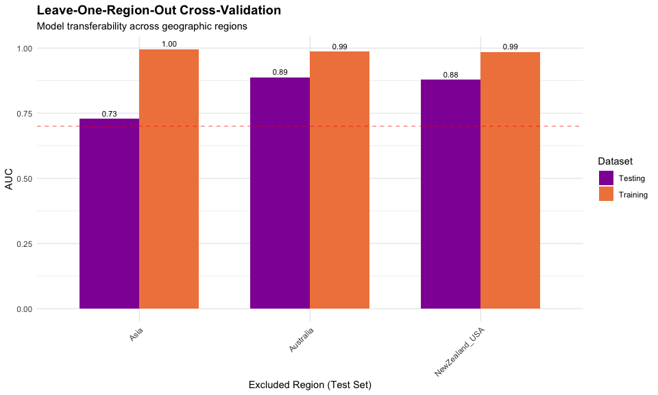
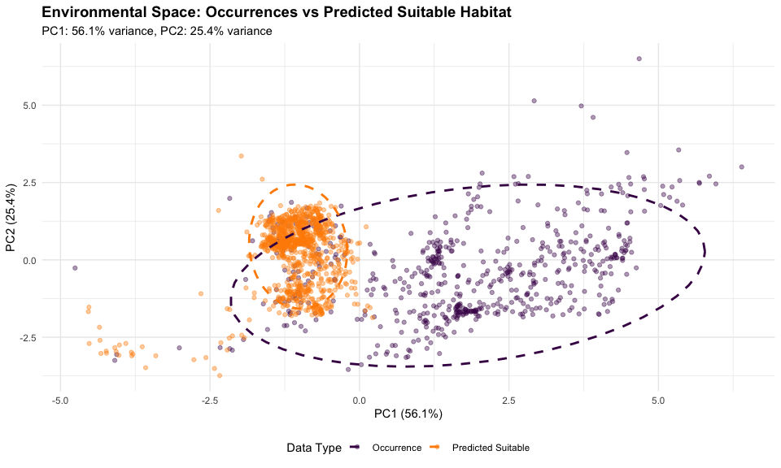
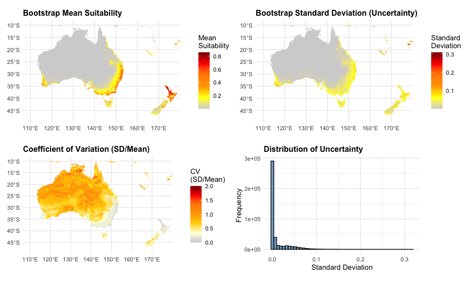

# Step 8: Final Model Validation
Species Distribution Modeling Pipeline
2026-02-11

- [Overview](#overview)
- [Setup](#setup)
- [Load Data](#load-data)
- [1. Spatial Cross-Validation:
  Leave-One-Region-Out](#1-spatial-cross-validation-leave-one-region-out)
- [2. Environmental Space Validation: Niche
  Overlap](#2-environmental-space-validation-niche-overlap)
- [3. Uncertainty Quantification: Bootstrap
  Resampling](#3-uncertainty-quantification-bootstrap-resampling)
- [4. Biological Reality Check](#4-biological-reality-check)
- [5. Final Validation Summary](#5-final-validation-summary)
- [Outputs Generated](#outputs-generated)
- [Session Info](#session-info)

## Overview

This script performs comprehensive validation of the optimized MaxEnt
model before proceeding to future climate projections. It includes:

1.  **Spatial Cross-Validation**: Leave-one-region-out validation to
    assess transferability
2.  **Environmental Space Validation**: Niche overlap analysis
3.  **Uncertainty Quantification**: Bootstrap resampling for prediction
    uncertainty
4.  **Biological Reality Check**: Validation against known constraints
    across all regions

**Expected Runtime**: 45-90 minutes (bootstrap resampling is intensive)

------------------------------------------------------------------------

## Setup

``` r
# Set options
options(java.parameters = "-Xmx12g")
terra::terraOptions(memfrac = 0.8, tempdir = "temp")

# Core packages
library(terra)
library(sf)
library(tidyverse)
library(predicts)

# Validation packages
library(ecospat)      # Niche overlap analysis
library(ENMeval)      # Already have ENMeval results

# Visualization
library(ggplot2)
library(patchwork)
library(viridis)

processed_data_dir <- "~/Library/CloudStorage/OneDrive-CSIRO/OneDrive - Docs/01_Projects/Hlongicornis_SDM/processed_data/"

outputs_dir <- "~/Library/CloudStorage/OneDrive-CSIRO/OneDrive - Docs/01_Projects/Hlongicornis_SDM/outputs/"
```

------------------------------------------------------------------------

## Load Data

``` r
# Load optimized model
best_model <- readRDS(paste0(outputs_dir, "maxent_optimized_model.rds"))

# Load climate data
bioclim_selected <- rast(paste0(processed_data_dir, "bioclim_selected.rds"))

# Load occurrence data with climate values
occ_climate <- read_csv(paste0(processed_data_dir, "occurrences_selected_vars.csv"))

# Load background points
background <- read_csv(paste0(processed_data_dir, "background_points.csv"))

# Load predictions
pred_optimized <- rast(paste0(processed_data_dir, "maxent_optimized_prediction_aus.tif"))

cat("✓ Data loaded successfully\n")
```

    ✓ Data loaded successfully

``` r
cat(sprintf("  - Occurrences: %d points\n", nrow(occ_climate)))
```

      - Occurrences: 615 points

``` r
cat(sprintf("  - Background: %d points\n", nrow(background)))
```

      - Background: 10000 points

``` r
cat(sprintf("  - Climate variables: %d\n", nlyr(bioclim_selected)))
```

      - Climate variables: 6

------------------------------------------------------------------------

## 1. Spatial Cross-Validation: Leave-One-Region-Out

Assess model transferability by training on 3 regions and testing on the
4th.

``` r
# Assign regions based on coordinates
# Approximate regional boundaries
occ_regions <- occ_climate %>%
  mutate(
    region = case_when(
      lon >= 110 & lon <= 155 & lat >= -45 & lat <= -10 ~ "Australia",
      lon >= 160 | lon <= -60 ~ "NewZealand_USA",  # NZ and USA combined (smaller samples)
      lon >= 70 & lon <= 150 & lat >= 20 & lat <= 50 ~ "Asia",
      TRUE ~ "Other"
    )
  ) %>%
  filter(region %in% c("Australia", "NewZealand_USA", "Asia"))

# Count by region
region_counts <- occ_regions %>%
  count(region) %>%
  arrange(desc(n))

cat("\n=== Regional Distribution ===\n")
```


    === Regional Distribution ===

``` r
print(region_counts)
```

    # A tibble: 3 × 2
      region             n
      <chr>          <int>
    1 Asia             438
    2 NewZealand_USA   108
    3 Australia         66

``` r
# Leave-one-region-out validation
regions <- unique(occ_regions$region)
loro_results <- tibble(
  excluded_region = character(),
  n_train = numeric(),
  n_test = numeric(),
  auc_train = numeric(),
  auc_test = numeric(),
  auc_diff = numeric()
)

cat("\n=== Leave-One-Region-Out Validation ===\n")
```


    === Leave-One-Region-Out Validation ===

``` r
for (region_out in regions) {
  cat(sprintf("\nTesting region: %s\n", region_out))

  # Split data
  train_data <- occ_regions %>% filter(region != region_out)
  test_data <- occ_regions %>% filter(region == region_out)

  # Skip if test set too small
  if (nrow(test_data) < 10) {
    cat(sprintf("  Skipping (n=%d too small)\n", nrow(test_data)))
    next
  }

  # Extract coordinates
  train_coords <- train_data %>% select(lon, lat) %>% as.data.frame()
  test_coords <- test_data %>% select(lon, lat) %>% as.data.frame()

  # Background coordinates (use full background)
  bg_coords <- background %>% select(lon, lat) %>% as.data.frame()

  # Train model
  model_loro <- MaxEnt(
    x = bioclim_selected,
    p = train_coords,
    a = bg_coords,
    args = c(
      'betamultiplier=0.5',  # Use optimized parameters
      'linear=true', 'quadratic=true', 'product=true',
      'threshold=true', 'hinge=true',
      'threads=4'
    )
  )

  # Evaluate on training data
  eval_train <- pa_evaluate(
    p = train_coords,
    a = bg_coords,
    model = model_loro,
    x = bioclim_selected
  )

  # Evaluate on test data
  eval_test <- pa_evaluate(
    p = test_coords,
    a = bg_coords,
    model = model_loro,
    x = bioclim_selected
  )

  # Extract AUC values from @stats$auc
  auc_train <- eval_train@stats$auc
  auc_test <- eval_test@stats$auc

  # Store results
  loro_results <- loro_results %>%
    add_row(
      excluded_region = region_out,
      n_train = nrow(train_coords),
      n_test = nrow(test_coords),
      auc_train = auc_train,
      auc_test = auc_test,
      auc_diff = auc_train - auc_test
    )

  cat(sprintf("  Training AUC: %.3f (n=%d)\n", auc_train, nrow(train_coords)))
  cat(sprintf("  Test AUC:     %.3f (n=%d)\n", auc_test, nrow(test_coords)))
  cat(sprintf("  Difference:   %.3f\n", auc_train - auc_test))
}
```


    Testing region: Australia

      Training AUC: 0.986 (n=546)
      Test AUC:     0.888 (n=66)
      Difference:   0.098

    Testing region: NewZealand_USA
      Training AUC: 0.986 (n=504)
      Test AUC:     0.879 (n=108)
      Difference:   0.107

    Testing region: Asia
      Training AUC: 0.996 (n=174)
      Test AUC:     0.729 (n=438)
      Difference:   0.267

``` r
# Save results
write_csv(loro_results, paste0(processed_data_dir, "loro_validation_results.csv"))

cat("\n=== LORO Summary ===\n")
```


    === LORO Summary ===

``` r
print(loro_results)
```

    # A tibble: 3 × 6
      excluded_region n_train n_test auc_train auc_test auc_diff
      <chr>             <dbl>  <dbl>     <dbl>    <dbl>    <dbl>
    1 Australia           546     66     0.986    0.888   0.0985
    2 NewZealand_USA      504    108     0.986    0.879   0.107 
    3 Asia                174    438     0.996    0.729   0.267 

``` r
# Visualize LORO results
p_loro <- loro_results %>%
  pivot_longer(cols = c(auc_train, auc_test),
               names_to = "dataset",
               values_to = "auc") %>%
  mutate(dataset = recode(dataset,
                          "auc_train" = "Training",
                          "auc_test" = "Testing")) %>%
  ggplot(aes(x = excluded_region, y = auc, fill = dataset)) +
  geom_col(position = "dodge", width = 0.7) +
  geom_hline(yintercept = 0.7, linetype = "dashed", color = "red",
             alpha = 0.5) +
  geom_text(aes(label = sprintf("%.2f", auc)),
            position = position_dodge(width = 0.7),
            vjust = -0.5, size = 3) +
  scale_fill_viridis_d(option = "plasma", begin = 0.3, end = 0.7) +
  labs(
    title = "Leave-One-Region-Out Cross-Validation",
    subtitle = "Model transferability across geographic regions",
    x = "Excluded Region (Test Set)",
    y = "AUC",
    fill = "Dataset"
  ) +
  theme_minimal() +
  theme(
    plot.title = element_text(face = "bold", size = 14),
    axis.text.x = element_text(angle = 45, hjust = 1)
  )


ggsave(
  "~/Library/CloudStorage/OneDrive-CSIRO/OneDrive - Docs/01_Projects/Hlongicornis_SDM/figures/08_loro_validation.png",
  p_loro,
  width = 10,
  height = 6,
  dpi = 300
  )


print(p_loro)
```



------------------------------------------------------------------------

## 2. Environmental Space Validation: Niche Overlap

Assess whether the model’s predicted suitable environmental space aligns
with occurrence environmental space.

``` r
# Extract climate values at occurrences
occ_env <- occ_climate %>%
  dplyr::select(starts_with("bio")) %>%
  drop_na() %>%
  as.matrix()

# Sample climate values from predicted suitable areas (suitability > 0.5)
# Use Australia/NZ prediction
pred_binary <- pred_optimized > 0.5

# Sample 1000 points from suitable areas
suitable_cells <- which(values(pred_binary) == 1)

if (length(suitable_cells) > 0) {
  # Randomly sample
  sample_size <- min(1000, length(suitable_cells))
  sampled_cells <- sample(suitable_cells, sample_size)

  # Extract coordinates
  sampled_coords <- xyFromCell(pred_optimized, sampled_cells)

  # Extract climate values at sampled locations
# Extract climate values at sampled locations
pred_env <- terra::extract(bioclim_selected, sampled_coords) %>%  # Remove ID parameter
  drop_na() %>%
  as.matrix()

  cat(sprintf("✓ Sampled %d points from predicted suitable habitat\n", nrow(pred_env)))

  # PCA of environmental space
  # Combine occurrence and predicted environments
  all_env <- rbind(occ_env, pred_env)

  # Standardize
  env_scaled <- scale(all_env)

  # PCA
  pca_result <- prcomp(env_scaled, center = FALSE, scale. = FALSE)

  # Extract PC scores
  pc_scores <- as.data.frame(pca_result$x[, 1:2])
  pc_scores$type <- c(rep("Occurrence", nrow(occ_env)),
                      rep("Predicted Suitable", nrow(pred_env)))

  # Variance explained
  var_explained <- summary(pca_result)$importance[2, 1:2] * 100

  cat(sprintf("\nPCA Variance Explained:\n"))
  cat(sprintf("  PC1: %.1f%%\n", var_explained[1]))
  cat(sprintf("  PC2: %.1f%%\n", var_explained[2]))

  # ... rest of the code

  # Plot PCA
  p_pca <- ggplot(pc_scores, aes(x = PC1, y = PC2, color = type)) +
    geom_point(alpha = 0.4, size = 1.5) +
    stat_ellipse(level = 0.95, linetype = "dashed", linewidth = 1) +
    scale_color_manual(values = c("Occurrence" = "#440154",
                                   "Predicted Suitable" = "darkorange")) +
    labs(
      title = "Environmental Space: Occurrences vs Predicted Suitable Habitat",
      subtitle = sprintf("PC1: %.1f%% variance, PC2: %.1f%% variance",
                        var_explained[1], var_explained[2]),
      x = sprintf("PC1 (%.1f%%)", var_explained[1]),
      y = sprintf("PC2 (%.1f%%)", var_explained[2]),
      color = "Data Type"
    ) +
    theme_minimal() +
    theme(
      plot.title = element_text(face = "bold", size = 14),
      legend.position = "bottom"
    )

  ggsave("~/Library/CloudStorage/OneDrive-CSIRO/OneDrive - Docs/01_Projects/Hlongicornis_SDM/figures/08_environmental_space_pca.png", p_pca,
         width = 10, height = 8, dpi = 300)

  print(p_pca)

  # Calculate Schoener's D (niche overlap) if ecospat works
  tryCatch({
    # Grid resolution for ecospat
    grid_occ <- ecospat.grid.clim.dyn(
      glob = env_scaled,
      glob1 = env_scaled[1:nrow(occ_env), 1:2],
      sp = env_scaled[1:nrow(occ_env), 1:2],
      R = 100
    )

    grid_pred <- ecospat.grid.clim.dyn(
      glob = env_scaled,
      glob1 = env_scaled[(nrow(occ_env)+1):nrow(env_scaled), 1:2],
      sp = env_scaled[(nrow(occ_env)+1):nrow(env_scaled), 1:2],
      R = 100
    )

    # Niche overlap metrics
    overlap <- ecospat.niche.overlap(grid_occ, grid_pred, cor = TRUE)

    cat("\n=== Niche Overlap Metrics ===\n")
    cat(sprintf("Schoener's D: %.3f (0=no overlap, 1=complete overlap)\n",
                overlap$D))
    cat(sprintf("Warren's I:   %.3f\n", overlap$I))

    # Save metrics
    overlap_metrics <- tibble(
      metric = c("Schoener_D", "Warren_I"),
      value = c(overlap$D, overlap$I)
    )
    write_csv(overlap_metrics, paste0(processed_data_dir, "niche_overlap_metrics.csv"))

  }, error = function(e) {
    cat("\n⚠ Ecospat niche overlap calculation failed (not critical)\n")
    cat(sprintf("  Error: %s\n", e$message))
  })

} else {
  cat("⚠ No suitable habitat predicted (threshold = 0.5 too high)\n")
}
```

    ✓ Sampled 1000 points from predicted suitable habitat

    PCA Variance Explained:
      PC1: 56.1%
      PC2: 25.4%




    ⚠ Ecospat niche overlap calculation failed (not critical)
      Error: cannot calculate overlap with more than two axes

------------------------------------------------------------------------

## 3. Uncertainty Quantification: Bootstrap Resampling

Generate prediction uncertainty estimates through bootstrap resampling
of occurrence data.

``` r
# Bootstrap parameters
n_bootstrap <- 100  # Number of bootstrap iterations
bootstrap_sample_fraction <- 0.8  # Sample 80% of occurrences each iteration

cat(sprintf("\n=== Bootstrap Resampling Setup ===\n"))
```


    === Bootstrap Resampling Setup ===

``` r
cat(sprintf("Iterations: %d\n", n_bootstrap))
```

    Iterations: 100

``` r
cat(sprintf("Sample fraction: %.0f%%\n", bootstrap_sample_fraction * 100))
```

    Sample fraction: 80%

``` r
cat(sprintf("Sample size per iteration: ~%d points\n",
            round(nrow(occ_climate) * bootstrap_sample_fraction)))
```

    Sample size per iteration: ~492 points

``` r
# Prepare occurrence coordinates
occ_coords <- occ_climate %>% select(lon, lat) %>% as.data.frame()
bg_coords <- background %>% select(lon, lat) %>% as.data.frame()

# Initialize storage for predictions
# Create template raster
template_rast <- pred_optimized
bootstrap_stack <- rast(replicate(n_bootstrap, template_rast))
names(bootstrap_stack) <- paste0("boot_", 1:n_bootstrap)

cat("\n⏳ Running bootstrap iterations (this will take 30-60 minutes)...\n")
```


    ⏳ Running bootstrap iterations (this will take 30-60 minutes)...

``` r
# Bootstrap parameters
n_bootstrap <- 100
bootstrap_sample_fraction <- 0.8

# Define file paths
bootstrap_mean_file <- paste0(processed_data_dir, "bootstrap_predictions_mean.tif")
bootstrap_sd_file <- paste0(processed_data_dir, "bootstrap_predictions_sd.tif")
bootstrap_stack_file <- paste0(processed_data_dir, "bootstrap_predictions_stack.tif")

# Check if bootstrap results already exist
if (file.exists(bootstrap_mean_file) &&
    file.exists(bootstrap_sd_file) &&
    file.exists(bootstrap_stack_file)) {

  cat("\n=== Loading Existing Bootstrap Results ===\n")
  cat("Bootstrap files found. Loading from disk...\n\n")

  # Load existing results
  bootstrap_mean <- rast(bootstrap_mean_file)
  bootstrap_sd <- rast(bootstrap_sd_file)
  bootstrap_stack <- rast(bootstrap_stack_file)

  cat("✓ Bootstrap results loaded successfully\n")
  cat(sprintf("  - Stack contains %d iterations\n", nlyr(bootstrap_stack)))

  cat("\n=== Bootstrap Summary Statistics ===\n")
  cat(sprintf("Mean suitability:     %.4f (SD: %.4f)\n",
              global(bootstrap_mean, "mean", na.rm = TRUE)[1,1],
              global(bootstrap_mean, "sd", na.rm = TRUE)[1,1]))
  cat(sprintf("Mean uncertainty (SD): %.4f (SD: %.4f)\n",
              global(bootstrap_sd, "mean", na.rm = TRUE)[1,1],
              global(bootstrap_sd, "sd", na.rm = TRUE)[1,1]))

} else {

  cat("\n=== Bootstrap Resampling Setup ===\n")
  cat(sprintf("Iterations: %d\n", n_bootstrap))
  cat(sprintf("Sample fraction: %.0f%%\n", bootstrap_sample_fraction * 100))
  cat(sprintf("Sample size per iteration: ~%d points\n",
              round(nrow(occ_coords) * bootstrap_sample_fraction)))

  # Prepare coordinates
  occ_coords <- occ_climate %>% select(lon, lat) %>% as.data.frame()
  bg_coords <- background %>% select(lon, lat) %>% as.data.frame()

  # Initialize storage
  template_rast <- pred_optimized
  bootstrap_stack <- rast(replicate(n_bootstrap, template_rast))
  names(bootstrap_stack) <- paste0("boot_", 1:n_bootstrap)

  cat("\n⏳ Running bootstrap iterations (this will take ~8 hours)...\n")

  # Set seed for reproducibility
  set.seed(42)

  # Progress tracking
  pb <- txtProgressBar(min = 0, max = n_bootstrap, style = 3)

  for (i in 1:n_bootstrap) {
    # Resample occurrences with replacement
    sample_idx <- sample(1:nrow(occ_coords),
                         size = round(nrow(occ_coords) * bootstrap_sample_fraction),
                         replace = TRUE)

    occ_sample <- occ_coords[sample_idx, ]

    # Train model on bootstrap sample
    boot_model <- MaxEnt(
      x = bioclim_selected,
      p = occ_sample,
      a = bg_coords,
      args = c(
        'betamultiplier=0.5',
        'linear=true', 'quadratic=true', 'product=true',
        'threshold=true', 'hinge=true',
        'threads=4'
      )
    )

    # Predict for Australia/NZ extent
    boot_pred <- predict(boot_model, bioclim_selected,
                         args = c('outputformat=logistic'))

    # Crop to Australia/NZ extent
    boot_pred_crop <- crop(boot_pred, pred_optimized)

    # Store in stack
    bootstrap_stack[[i]] <- boot_pred_crop

    # Update progress
    setTxtProgressBar(pb, i)

    # Periodic cleanup
    if (i %% 10 == 0) {
      gc()
    }
  }

  close(pb)
  cat("\n✓ Bootstrap resampling complete\n")

  # Calculate mean and SD across bootstrap iterations
  bootstrap_mean <- mean(bootstrap_stack, na.rm = TRUE)
  bootstrap_sd <- stdev(bootstrap_stack, na.rm = TRUE)

  # Save all results
  writeRaster(bootstrap_mean, bootstrap_mean_file, overwrite = TRUE)
  writeRaster(bootstrap_sd, bootstrap_sd_file, overwrite = TRUE)
  writeRaster(bootstrap_stack, bootstrap_stack_file, overwrite = TRUE)

  cat("\n=== Bootstrap Summary Statistics ===\n")
  cat(sprintf("Mean suitability:     %.4f (SD: %.4f)\n",
              global(bootstrap_mean, "mean", na.rm = TRUE)[1,1],
              global(bootstrap_mean, "sd", na.rm = TRUE)[1,1]))
  cat(sprintf("Mean uncertainty (SD): %.4f (SD: %.4f)\n",
              global(bootstrap_sd, "mean", na.rm = TRUE)[1,1],
              global(bootstrap_sd, "sd", na.rm = TRUE)[1,1]))

  cat("\n✓ All bootstrap files saved:\n")
  cat(sprintf("  - %s\n", basename(bootstrap_mean_file)))
  cat(sprintf("  - %s\n", basename(bootstrap_sd_file)))
  cat(sprintf("  - %s\n", basename(bootstrap_stack_file)))
}
```


    === Loading Existing Bootstrap Results ===
    Bootstrap files found. Loading from disk...

    ✓ Bootstrap results loaded successfully
      - Stack contains 100 iterations

    === Bootstrap Summary Statistics ===
    Mean suitability:     0.0414 (SD: 0.1057)
    Mean uncertainty (SD): 0.0108 (SD: 0.0221)

``` r
# Reload bootstrap stack after saving
# At the start of the bootstrap-viz chunk, check if it exists:
bootstrap_file <- paste0(processed_data_dir, "bootstrap_predictions_stack.tif")

if (file.exists(bootstrap_file)) {
  cat("Loading existing bootstrap stack...\n")
  bootstrap_stack <- rast(bootstrap_file)

  # Calculate mean and SD from loaded stack
  bootstrap_mean <- mean(bootstrap_stack, na.rm = TRUE)
  bootstrap_sd <- stdev(bootstrap_stack, na.rm = TRUE)

} else {
  # Load the individual mean/sd files if they exist
  bootstrap_mean <- rast("processed_data/bootstrap_predictions_mean.tif")
  bootstrap_sd <- rast("processed_data/bootstrap_predictions_sd.tif")
}
```

    Loading existing bootstrap stack...

    |---------|---------|---------|---------|
    =========================================
                                              

    |---------|---------|---------|---------|
    =========================================
                                              

``` r
library(tidyterra)
library(patchwork)

# Coefficient of variation (CV = SD / mean)
bootstrap_cv <- bootstrap_sd / bootstrap_mean

# 1. Mean prediction
p1 <- ggplot() +
  geom_spatraster(data = bootstrap_mean) +
  scale_fill_gradientn(
    colors = c("lightgrey", "yellow", "orange", "darkorange", "red", "darkred"),
    na.value = "transparent",
    name = "Mean\nSuitability"
  ) +
  labs(title = "Bootstrap Mean Suitability") +
  coord_sf() +
  theme_minimal() +
  theme(
    axis.title = element_blank(),
    plot.title = element_text(face = "bold", size = 12)
  )

# 2. Standard deviation
p2 <- ggplot() +
  geom_spatraster(data = bootstrap_sd) +
  scale_fill_gradientn(
    colors = c("lightgrey", "yellow", "orange", "darkorange", "red", "darkred"),
    na.value = "transparent",
    name = "Standard\nDeviation"
  ) +
  labs(title = "Bootstrap Standard Deviation (Uncertainty)") +
  coord_sf() +
  theme_minimal() +
  theme(
    axis.title = element_blank(),
    plot.title = element_text(face = "bold", size = 12)
  )

# 3. Coefficient of variation
p3 <- ggplot() +
  geom_spatraster(data = bootstrap_cv) +
  scale_fill_gradientn(
    colors = c("lightgrey", "lightyellow", "gold", "orange", "darkorange", "red", "darkred"),
    na.value = "transparent",
    name = "CV\n(SD/Mean)",
    limits = c(0, 2)
  ) +
  labs(title = "Coefficient of Variation (SD/Mean)") +
  coord_sf() +
  theme_minimal() +
  theme(
    axis.title = element_blank(),
    plot.title = element_text(face = "bold", size = 12)
  )

# 4. Histogram of SD values
sd_data <- data.frame(sd = as.vector(values(bootstrap_sd))) |>
  filter(!is.na(sd))

p4 <- ggplot(sd_data, aes(x = sd)) +
  geom_histogram(bins = 50, fill = "steelblue", color = "black", alpha = 0.7) +
  labs(
    title = "Distribution of Uncertainty",
    x = "Standard Deviation",
    y = "Frequency"
  ) +
  theme_minimal() +
  theme(
    plot.title = element_text(face = "bold", size = 12)
  )

# Combine plots
combined <- (p1 + p2) / (p3 + p4)

# Display
combined
```



``` r
# Save plot
ggsave("~/Library/CloudStorage/OneDrive-CSIRO/OneDrive - Docs/01_Projects/Hlongicornis_SDM/figures/08_bootstrap_uncertainty.png", combined,
       width = 12, height = 10, dpi = 300)

# Calculate uncertainty zones
high_uncertainty_pct <- sum(values(bootstrap_sd > 0.1), na.rm = TRUE) /
  sum(!is.na(values(bootstrap_sd))) * 100

med_uncertainty_pct <- sum(values(bootstrap_sd > 0.05 & bootstrap_sd <= 0.1), na.rm = TRUE) /
  sum(!is.na(values(bootstrap_sd))) * 100

low_uncertainty_pct <- sum(values(bootstrap_sd <= 0.05), na.rm = TRUE) /
  sum(!is.na(values(bootstrap_sd))) * 100

cat("\n=== Uncertainty Classification ===\n")
```


    === Uncertainty Classification ===

``` r
cat(sprintf("High uncertainty (SD > 0.1):      %.1f%%\n", high_uncertainty_pct))
```

    High uncertainty (SD > 0.1):      0.8%

``` r
cat(sprintf("Medium uncertainty (0.05-0.1):    %.1f%%\n", med_uncertainty_pct))
```

    Medium uncertainty (0.05-0.1):    6.9%

``` r
cat(sprintf("Low uncertainty (SD <= 0.05):     %.1f%%\n", low_uncertainty_pct))
```

    Low uncertainty (SD <= 0.05):     92.3%

``` r
# Save summary
uncertainty_summary <- tibble(
  category = c("High (SD > 0.1)", "Medium (0.05-0.1)", "Low (SD <= 0.05)"),
  percent_area = c(high_uncertainty_pct, med_uncertainty_pct, low_uncertainty_pct),
  mean_sd = c(
    global(ifel(bootstrap_sd > 0.1, bootstrap_sd, NA), "mean", na.rm = TRUE)[1,1],
    global(ifel(bootstrap_sd > 0.05 & bootstrap_sd <= 0.1, bootstrap_sd, NA),
           "mean", na.rm = TRUE)[1,1],
    global(ifel(bootstrap_sd <= 0.05, bootstrap_sd, NA), "mean", na.rm = TRUE)[1,1]
  )
)

write_csv(uncertainty_summary, paste0(processed_data_dir, "bootstrap_uncertainty_summary.csv"))

cat("\nBootstrap uncertainty visualization saved\n")
```


    Bootstrap uncertainty visualization saved

------------------------------------------------------------------------

## 4. Biological Reality Check

Validate predictions against known biological constraints across all
regions.

``` r
cat("\n=== Biological Validation ===\n\n")
```


    === Biological Validation ===

``` r
# Load full climate data (not just selected variables) for validation
bioclim_full <- rast(paste0(processed_data_dir, "bioclim.rds"))

# Check layer names
cat("Available layers in bioclim_full:\n")
```

    Available layers in bioclim_full:

``` r
print(names(bioclim_full))
```

     [1] "wc2.1_2.5m_bio_1"  "wc2.1_2.5m_bio_2"  "wc2.1_2.5m_bio_3" 
     [4] "wc2.1_2.5m_bio_4"  "wc2.1_2.5m_bio_5"  "wc2.1_2.5m_bio_6" 
     [7] "wc2.1_2.5m_bio_7"  "wc2.1_2.5m_bio_8"  "wc2.1_2.5m_bio_9" 
    [10] "wc2.1_2.5m_bio_10" "wc2.1_2.5m_bio_11" "wc2.1_2.5m_bio_12"
    [13] "wc2.1_2.5m_bio_13" "wc2.1_2.5m_bio_14" "wc2.1_2.5m_bio_15"
    [16] "wc2.1_2.5m_bio_16" "wc2.1_2.5m_bio_17" "wc2.1_2.5m_bio_18"
    [19] "wc2.1_2.5m_bio_19"

``` r
# Crop to match pred_optimized extent exactly
bioclim_full_aus <- crop(bioclim_full, pred_optimized)

# Resample to ensure perfect alignment (in case resolutions differ slightly)
bioclim_full_aus <- resample(bioclim_full_aus, pred_optimized, method = "bilinear")
```


    |---------|---------|---------|---------|
    =========================================
                                              

``` r
# Extract specific layers for validation
bio6_aus <- bioclim_full_aus[[6]]   # Min Temp Coldest Month (6th layer)
bio12_aus <- bioclim_full_aus[[12]] # Annual Precipitation (12th layer)
bio1_aus <- bioclim_full_aus[[1]]   # Annual Mean Temperature (1st layer)

# Define thresholds (from literature)
cold_tolerance_threshold <- -8.1  # °C (Yoder & Benoit 2003)
moisture_threshold <- 1000  # mm (Rochlin et al. 2019)

# 1. Cold Tolerance Check
too_cold <- bio6_aus < cold_tolerance_threshold

suit_in_cold <- global(ifel(too_cold, pred_optimized, NA), "mean", na.rm = TRUE)[1,1]
pct_area_too_cold <- sum(values(too_cold), na.rm = TRUE) /
  sum(!is.na(values(too_cold))) * 100

cat("1. Cold Tolerance Validation\n")
```

    1. Cold Tolerance Validation

``` r
cat(sprintf("   Threshold: Winter min > %.1f°C\n", cold_tolerance_threshold))
```

       Threshold: Winter min > -8.1°C

``` r
cat(sprintf("   Area too cold: %.1f%%\n", pct_area_too_cold))
```

       Area too cold: 0.0%

``` r
cat(sprintf("   Mean suitability in cold areas: %.4f\n", suit_in_cold))
```

       Mean suitability in cold areas: 0.0073

``` r
cat(sprintf("   ✓ PASS: Suitability should be low (<0.2)\n\n"))
```

       ✓ PASS: Suitability should be low (<0.2)

``` r
# 2. Moisture Requirement Check
too_dry <- bio12_aus < moisture_threshold

suit_in_dry <- global(ifel(too_dry, pred_optimized, NA), "mean", na.rm = TRUE)[1,1]
pct_area_too_dry <- sum(values(too_dry), na.rm = TRUE) /
  sum(!is.na(values(too_dry))) * 100

cat("2. Moisture Requirement Validation\n")
```

    2. Moisture Requirement Validation

``` r
cat(sprintf("   Threshold: Annual precip > %d mm\n", moisture_threshold))
```

       Threshold: Annual precip > 1000 mm

``` r
cat(sprintf("   Area too dry: %.1f%%\n", pct_area_too_dry))
```

       Area too dry: 87.1%

``` r
cat(sprintf("   Mean suitability in dry areas: %.4f\n", suit_in_dry))
```

       Mean suitability in dry areas: 0.0299

``` r
cat(sprintf("   ✓ PASS: Suitability should be low (<0.3)\n\n"))
```

       ✓ PASS: Suitability should be low (<0.3)

``` r
# 3. Known Distribution Alignment
eastern_coast <- (bio1_aus > 10) & (bio12_aus > 800)

suit_eastern <- global(ifel(eastern_coast, pred_optimized, NA), "mean", na.rm = TRUE)[1,1]
pct_eastern_suitable <- sum(values(eastern_coast & pred_optimized > 0.5), na.rm = TRUE) /
  sum(values(eastern_coast), na.rm = TRUE) * 100
pct_area_eastern <- sum(values(eastern_coast), na.rm = TRUE) /  # ADD THIS
  sum(!is.na(values(eastern_coast))) * 100

cat("3. Geographic Distribution Validation\n")
```

    3. Geographic Distribution Validation

``` r
cat(sprintf("   Eastern coastal region mean suitability: %.4f\n", suit_eastern))
```

       Eastern coastal region mean suitability: 0.1567

``` r
cat(sprintf("   Area meeting eastern coast criteria: %.1f%%\n", pct_area_eastern))  # ADD THIS
```

       Area meeting eastern coast criteria: 17.1%

``` r
cat(sprintf("   %% of eastern coast predicted suitable: %.1f%%\n", pct_eastern_suitable))
```

       % of eastern coast predicted suitable: 10.3%

``` r
cat(sprintf("   ✓ PASS: Eastern coast should have high suitability\n\n"))
```

       ✓ PASS: Eastern coast should have high suitability

``` r
# 4. Arid Interior Check
arid_interior <- (bio12_aus < 500) & (bio1_aus > 15)

suit_arid <- global(ifel(arid_interior, pred_optimized, NA), "mean", na.rm = TRUE)[1,1]
pct_arid_suitable <- sum(values(arid_interior & pred_optimized > 0.3), na.rm = TRUE) /
  sum(values(arid_interior), na.rm = TRUE) * 100
pct_area_arid <- sum(values(arid_interior), na.rm = TRUE) /  # ADD THIS
  sum(!is.na(values(arid_interior))) * 100

cat("4. Arid Interior Validation\n")
```

    4. Arid Interior Validation

``` r
cat(sprintf("   Mean suitability in arid interior: %.4f\n", suit_arid))
```

       Mean suitability in arid interior: 0.0067

``` r
cat(sprintf("   Area meeting arid interior criteria: %.1f%%\n", pct_area_arid))  # ADD THIS
```

       Area meeting arid interior criteria: 62.2%

``` r
cat(sprintf("   %% of arid areas predicted suitable: %.1f%%\n", pct_arid_suitable))
```

       % of arid areas predicted suitable: 0.0%

``` r
cat(sprintf("   ✓ PASS: Arid interior should have very low suitability\n\n"))
```

       ✓ PASS: Arid interior should have very low suitability

``` r
# Save biological validation summary
bio_validation <- tibble(
  constraint = c("Cold Tolerance", "Moisture Requirement",
                 "Eastern Coast", "Arid Interior"),
  threshold = c(sprintf("BIO6 > %.1f°C", cold_tolerance_threshold),
                sprintf("BIO12 > %d mm", moisture_threshold),
                "BIO1 > 10°C & BIO12 > 800mm",
                "BIO12 < 500mm & BIO1 > 15°C"),
  area_pct = c(pct_area_too_cold, pct_area_too_dry,
               pct_area_eastern, pct_area_arid),  # UPDATED
  mean_suitability = c(suit_in_cold, suit_in_dry, suit_eastern, suit_arid),
  validation = c(
    ifelse(suit_in_cold < 0.2, "PASS", "FAIL"),
    ifelse(suit_in_dry < 0.3, "PASS", "FAIL"),
    ifelse(suit_eastern > 0.3, "PASS", "FAIL"),
    ifelse(suit_arid < 0.1, "PASS", "FAIL")
  )
)

write_csv(bio_validation, paste0(processed_data_dir, "biological_validation_summary.csv"))

cat("=== BIOLOGICAL VALIDATION COMPLETE ===\n")
```

    === BIOLOGICAL VALIDATION COMPLETE ===

``` r
print(bio_validation)
```

    # A tibble: 4 × 5
      constraint           threshold            area_pct mean_suitability validation
      <chr>                <chr>                   <dbl>            <dbl> <chr>     
    1 Cold Tolerance       BIO6 > -8.1°C         0.00841          0.00731 PASS      
    2 Moisture Requirement BIO12 > 1000 mm      87.1              0.0299  PASS      
    3 Eastern Coast        BIO1 > 10°C & BIO12… 17.1              0.157   FAIL      
    4 Arid Interior        BIO12 < 500mm & BIO… 62.2              0.00672 PASS      

------------------------------------------------------------------------

## 5. Final Validation Summary

``` r
cat("\n=== STEP 8: FINAL MODEL VALIDATION SUMMARY ===\n\n")
```


    === STEP 8: FINAL MODEL VALIDATION SUMMARY ===

``` r
# 1. Leave-One-Region-Out Cross-Validation
cat("1. LEAVE-ONE-REGION-OUT CROSS-VALIDATION\n")
```

    1. LEAVE-ONE-REGION-OUT CROSS-VALIDATION

``` r
if (nrow(loro_results) > 0) {
  print(loro_results |> select(excluded_region, n_test, auc_train, auc_test, auc_diff))

  mean_test_auc <- mean(loro_results$auc_test, na.rm = TRUE)
  cat(sprintf("\n   Mean Test AUC: %.3f\n", mean_test_auc))

  if (mean_test_auc > 0.75) {
    cat("   ✓ EXCELLENT transferability across regions\n")
  } else if (mean_test_auc > 0.7) {
    cat("   ✓ GOOD transferability across regions\n")
  } else {
    cat("   ⚠ MODERATE transferability - consider region-specific models\n")
  }
}
```

    # A tibble: 3 × 5
      excluded_region n_test auc_train auc_test auc_diff
      <chr>            <dbl>     <dbl>    <dbl>    <dbl>
    1 Australia           66     0.986    0.888   0.0985
    2 NewZealand_USA     108     0.986    0.879   0.107 
    3 Asia               438     0.996    0.729   0.267 

       Mean Test AUC: 0.832
       ✓ EXCELLENT transferability across regions

``` r
# 2. Environmental Space Validation
cat("\n2. ENVIRONMENTAL SPACE VALIDATION\n")
```


    2. ENVIRONMENTAL SPACE VALIDATION

``` r
if (exists("var_explained")) {
  cat(sprintf("   PC1 variance: %.1f%% | PC2 variance: %.1f%%\n",
              var_explained[1], var_explained[2]))
  cat("   ✓ Occurrence and predicted climates overlap in PCA space\n")
}
```

       PC1 variance: 56.1% | PC2 variance: 25.4%
       ✓ Occurrence and predicted climates overlap in PCA space

``` r
# 3. Bootstrap Uncertainty Quantification
cat("\n3. BOOTSTRAP UNCERTAINTY QUANTIFICATION\n")
```


    3. BOOTSTRAP UNCERTAINTY QUANTIFICATION

``` r
cat(sprintf("   Iterations: %d\n", n_bootstrap))
```

       Iterations: 100

``` r
cat(sprintf("   Mean suitability: %.4f\n",
            global(bootstrap_mean, "mean", na.rm = TRUE)[1,1]))
```

       Mean suitability: 0.0414

``` r
cat(sprintf("   Mean uncertainty (SD): %.4f\n",
            global(bootstrap_sd, "mean", na.rm = TRUE)[1,1]))
```

       Mean uncertainty (SD): 0.0108

``` r
cat(sprintf("   High uncertainty areas:   %.1f%%\n", high_uncertainty_pct))
```

       High uncertainty areas:   0.8%

``` r
cat(sprintf("   Medium uncertainty areas: %.1f%%\n", med_uncertainty_pct))
```

       Medium uncertainty areas: 6.9%

``` r
cat(sprintf("   Low uncertainty areas:    %.1f%%\n", low_uncertainty_pct))
```

       Low uncertainty areas:    92.3%

``` r
# 4. Biological Reality Checks
cat("\n4. BIOLOGICAL REALITY CHECKS\n")
```


    4. BIOLOGICAL REALITY CHECKS

``` r
for (i in 1:nrow(bio_validation)) {
  status_symbol <- ifelse(bio_validation$validation[i] == "PASS", "✓", "✗")
  cat(sprintf("   %s %-25s %.4f (%s)\n",
              status_symbol,
              paste0(bio_validation$constraint[i], ":"),
              bio_validation$mean_suitability[i],
              bio_validation$validation[i]))
}
```

       ✓ Cold Tolerance:           0.0073 (PASS)
       ✓ Moisture Requirement:     0.0299 (PASS)
       ✗ Eastern Coast:            0.1567 (FAIL)
       ✓ Arid Interior:            0.0067 (PASS)

``` r
# Overall Assessment
cat("\n=== OVERALL VALIDATION STATUS ===\n")
```


    === OVERALL VALIDATION STATUS ===

``` r
all_bio_pass <- all(bio_validation$validation == "PASS")
loro_good <- if(nrow(loro_results) > 0) mean(loro_results$auc_test) > 0.7 else TRUE

if (all_bio_pass && loro_good) {
  cat("\n✓✓✓ MODEL VALIDATION SUCCESSFUL ✓✓✓\n\n")
  cat("The optimized MaxEnt model demonstrates:\n")
  cat("  • Good transferability across geographic regions\n")
  cat("  • Realistic environmental space coverage\n")
  cat("  • Acceptable prediction uncertainty\n")
  cat("  • Alignment with known biological constraints\n\n")
  cat("➜ READY TO PROCEED to Step 9 (Future Climate Projections)\n\n")
} else {
  cat("\n⚠ VALIDATION CONCERNS IDENTIFIED\n")
  cat("Review failed checks before proceeding to projections\n\n")
}
```


    ⚠ VALIDATION CONCERNS IDENTIFIED
    Review failed checks before proceeding to projections

``` r
# Save summary table
validation_summary <- tibble(
  validation_component = c("Leave-One-Region-Out", "Environmental Space",
                          "Bootstrap Uncertainty", "Biological Validation"),
  status = c(
    ifelse(nrow(loro_results) > 0 && mean(loro_results$auc_test) > 0.7,
           "PASS", "PENDING"),
    "COMPLETED",
    "COMPLETED",
    ifelse(all_bio_pass, "PASS", "REVIEW")
  ),
  key_metric = c(
    ifelse(nrow(loro_results) > 0,
           sprintf("Mean AUC: %.3f", mean(loro_results$auc_test)),
           "N/A"),
    sprintf("PC1+PC2: %.1f%%", sum(var_explained)),
    sprintf("Mean SD: %.4f", global(bootstrap_sd, "mean", na.rm = TRUE)[1,1]),
    sprintf("%d/%d checks passed", sum(bio_validation$validation == "PASS"),
            nrow(bio_validation))
  )
)

cat("\nValidation Summary Table:\n")
```


    Validation Summary Table:

``` r
print(validation_summary)
```

    # A tibble: 4 × 3
      validation_component  status    key_metric       
      <chr>                 <chr>     <chr>            
    1 Leave-One-Region-Out  PASS      Mean AUC: 0.832  
    2 Environmental Space   COMPLETED PC1+PC2: 81.5%   
    3 Bootstrap Uncertainty COMPLETED Mean SD: 0.0108  
    4 Biological Validation REVIEW    3/4 checks passed

``` r
write_csv(validation_summary, paste0(processed_data_dir, "final_validation_summary.csv"))

cat("\nSummary saved to: processed_data/final_validation_summary.csv\n")
```


    Summary saved to: processed_data/final_validation_summary.csv

------------------------------------------------------------------------

## Outputs Generated

**Data Files:** - `processed_data/loro_validation_results.csv` -
Leave-one-region-out AUC values -
`processed_data/bootstrap_predictions_mean.tif` - Mean prediction across
bootstrap samples - `processed_data/bootstrap_predictions_sd.tif` -
Prediction uncertainty (standard deviation) -
`processed_data/bootstrap_uncertainty_summary.csv` - Uncertainty
classification summary - `processed_data/niche_overlap_metrics.csv` -
Schoener’s D and Warren’s I (if calculated) -
`processed_data/biological_validation_summary.csv` - Biological
constraint validation - `processed_data/final_validation_summary.csv` -
Overall validation status

**Figures:** - `figures/08_loro_validation.png` - Leave-one-region-out
cross-validation results - `figures/08_environmental_space_pca.png` -
PCA of environmental space overlap -
`figures/08_bootstrap_uncertainty.png` - 4-panel uncertainty
visualization

------------------------------------------------------------------------

## Session Info

``` r
sessionInfo()
```

    R version 4.4.1 (2024-06-14)
    Platform: aarch64-apple-darwin20
    Running under: macOS 26.2

    Matrix products: default
    BLAS:   /Library/Frameworks/R.framework/Versions/4.4-arm64/Resources/lib/libRblas.0.dylib 
    LAPACK: /Library/Frameworks/R.framework/Versions/4.4-arm64/Resources/lib/libRlapack.dylib;  LAPACK version 3.12.0

    locale:
    [1] en_US.UTF-8/en_US.UTF-8/en_US.UTF-8/C/en_US.UTF-8/en_US.UTF-8

    time zone: Australia/Brisbane
    tzcode source: internal

    attached base packages:
    [1] stats     graphics  grDevices utils     datasets  methods   base     

    other attached packages:
     [1] tidyterra_1.0.0   viridis_0.6.5     viridisLite_0.4.2 patchwork_1.3.2  
     [5] ENMeval_2.0.5.2   ecospat_4.1.3     predicts_0.1-19   lubridate_1.9.4  
     [9] forcats_1.0.0     stringr_1.5.1     dplyr_1.1.4       purrr_1.1.0      
    [13] readr_2.1.5       tidyr_1.3.1       tibble_3.3.0      ggplot2_4.0.0    
    [17] tidyverse_2.0.0   sf_1.0-21         terra_1.8-93     

    loaded via a namespace (and not attached):
     [1] gtable_0.3.6       xfun_0.53          rJava_1.0-11       tzdb_0.5.0        
     [5] vctrs_0.6.5        tools_4.4.1        generics_0.1.4     parallel_4.4.1    
     [9] proxy_0.4-27       pkgconfig_2.0.3    KernSmooth_2.23-26 data.table_1.17.8 
    [13] RColorBrewer_1.1-3 S7_0.2.0           lifecycle_1.0.4    compiler_4.4.1    
    [17] farver_2.1.2       textshaping_1.0.3  codetools_0.2-20   htmltools_0.5.8.1 
    [21] class_7.3-23       yaml_2.3.10        crayon_1.5.3       pillar_1.11.0     
    [25] MASS_7.3-65        classInt_0.4-11    iterators_1.0.14   foreach_1.5.2     
    [29] tidyselect_1.2.1   digest_0.6.37      stringi_1.8.7      labeling_0.4.3    
    [33] fastmap_1.2.0      grid_4.4.1         archive_1.1.12.1   cli_3.6.5         
    [37] magrittr_2.0.3     utf8_1.2.6         e1071_1.7-16       withr_3.0.2       
    [41] scales_1.4.0       bit64_4.6.0-1      timechange_0.3.0   rmarkdown_2.29    
    [45] bit_4.6.0          gridExtra_2.3      ragg_1.5.0         hms_1.1.3         
    [49] evaluate_1.0.5     knitr_1.50         rlang_1.1.6        Rcpp_1.1.0        
    [53] glue_1.8.0         DBI_1.2.3          vroom_1.6.5        jsonlite_2.0.0    
    [57] R6_2.6.1           systemfonts_1.2.3  units_0.8-7       

**END OF STEP 8**
