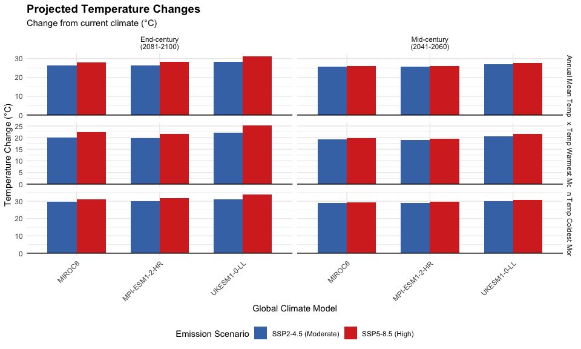
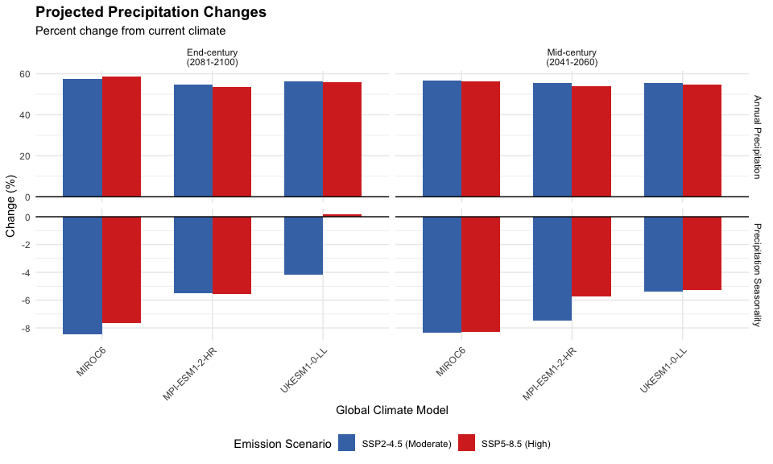

# Step 9: Future Climate Data Download
Species Distribution Modeling Pipeline
2026-02-11

- [Overview](#overview)
- [Setup](#setup)
- [Configuration](#configuration)
- [Load Current Climate Reference](#load-current-climate-reference)
- [Download Future Climate Data](#download-future-climate-data)
- [Validate Downloaded Data](#validate-downloaded-data)
- [Calculate Climate Change Deltas](#calculate-climate-change-deltas)
- [Visualize Climate Change
  Projections](#visualize-climate-change-projections)
- [Final Summary](#final-summary)
- [Outputs Generated](#outputs-generated)
- [Session Info](#session-info)

## Overview

This script downloads future climate projection data from WorldClim 2.1
for projecting species distributions under climate change scenarios. We
will download:

**Scenarios**: 12 total combinations - **3 GCMs** (Global Climate
Models): - MIROC6 (Japan) - MPI-ESM1-2-HR (Germany) - UKESM1-0-LL (UK) -
**2 SSPs** (Shared Socioeconomic Pathways): - SSP2-4.5
(Middle-of-the-road emissions) - SSP5-8.5 (High emissions/worst case) -
**2 Time Periods**: - 2041-2060 (Mid-century) - 2081-2100 (End-century)

**Resolution**: 2.5 minutes (matching current climate data)

**Expected Runtime**: 30-60 minutes (depending on download speeds)

**Data Source**: WorldClim 2.1 CMIP6 projections via geodata package

------------------------------------------------------------------------

## Setup

``` r
# Set options
terra::terraOptions(memfrac = 0.8, tempdir = "temp")

# Core packages
library(terra)
library(sf)
library(tidyverse)
library(geodata)  # For downloading WorldClim future data

# Create directories
#dir.create("processed_data/future_climate", showWarnings = FALSE, recursive = TRUE)
#dir.create("temp", showWarnings = FALSE)


processed_data_dir <- "~/Library/CloudStorage/OneDrive-CSIRO/OneDrive - Docs/01_Projects/Hlongicornis_SDM/processed_data/"

cat("✓ Setup complete\n")
```

    ✓ Setup complete

------------------------------------------------------------------------

## Configuration

Define the scenarios to download:

``` r
# GCMs to download (3 models for ensemble)
gcms <- c("MIROC6", "MPI-ESM1-2-HR", "UKESM1-0-LL")

# SSPs (emission scenarios)
ssps <- c("245", "585")  # SSP2-4.5 and SSP5-8.5

# Time periods
periods <- c("2041-2060", "2081-2100")

# Resolution (must match current climate: 2.5 minutes)
resolution <- 2.5

# Variables to match current model
selected_vars <- c("bio1", "bio6", "bio5", "bio12", "bio15", "bio3")

cat("=== Download Configuration ===\n")
```

    === Download Configuration ===

``` r
cat(sprintf("GCMs: %s\n", paste(gcms, collapse = ", ")))
```

    GCMs: MIROC6, MPI-ESM1-2-HR, UKESM1-0-LL

``` r
cat(sprintf("SSPs: SSP%s\n", paste(ssps, collapse = ", SSP")))
```

    SSPs: SSP245, SSP585

``` r
cat(sprintf("Periods: %s\n", paste(periods, collapse = ", ")))
```

    Periods: 2041-2060, 2081-2100

``` r
cat(sprintf("Resolution: %.1f arcmin\n", resolution))
```

    Resolution: 2.5 arcmin

``` r
cat(sprintf("Variables: %s\n", paste(selected_vars, collapse = ", ")))
```

    Variables: bio1, bio6, bio5, bio12, bio15, bio3

``` r
cat(sprintf("\nTotal scenarios: %d GCMs × %d SSPs × %d periods = %d\n",
            length(gcms), length(ssps), length(periods),
            length(gcms) * length(ssps) * length(periods)))
```


    Total scenarios: 3 GCMs × 2 SSPs × 2 periods = 12

------------------------------------------------------------------------

## Load Current Climate Reference

Load current climate extent to ensure future data matches:

``` r
# Load current climate data for reference
bioclim_current <- rast(paste0(processed_data_dir, "bioclim_selected.rds"))

# Get extent for cropping
current_extent <- ext(bioclim_current)

# Load Australia/NZ boundary for cropping
aus_nz_boundary <- st_read(paste0(processed_data_dir, "aus_nz_boundary.gpkg"), quiet = TRUE)

cat("✓ Current climate reference loaded\n")
```

    ✓ Current climate reference loaded

``` r
cat(sprintf("  Extent: xmin=%.2f, xmax=%.2f, ymin=%.2f, ymax=%.2f\n",
            current_extent[1], current_extent[2],
            current_extent[3], current_extent[4]))
```

      Extent: xmin=-180.00, xmax=180.00, ymin=-90.00, ymax=90.00

``` r
cat(sprintf("  Resolution: %.4f° (%.2f arcmin)\n",
            res(bioclim_current)[1],
            res(bioclim_current)[1] * 60))
```

      Resolution: 0.0417° (2.50 arcmin)

``` r
cat(sprintf("  Variables: %s\n", paste(names(bioclim_current), collapse=", ")))
```

      Variables: bio1, bio6, bio5, bio12, bio15, bio3

------------------------------------------------------------------------

## Download Future Climate Data

Download all 12 scenario combinations:

``` r
# Only needs to be run once - comment out if already downloaded

# cat("\n=== Downloading Future Climate Data ===\n\n")

# # Initialize progress tracking
# download_log <- tibble(
#   gcm = character(),
#   ssp = character(),
#   period = character(),
#   status = character(),
#   file_path = character(),
#   n_layers = numeric(),
#   download_time_sec = numeric()
# )

# # Total iterations
# total_scenarios <- length(gcms) * length(ssps) * length(periods)
# current_scenario <- 0

# # Download loop
# for (gcm in gcms) {
#   for (ssp in ssps) {
#     for (period in periods) {
#       current_scenario <- current_scenario + 1

#       cat(sprintf("\n[%d/%d] Downloading: %s, SSP%s, %s\n",
#                   current_scenario, total_scenarios, gcm, ssp, period))

#       # Define file path
#       file_name <- sprintf("future_bioclim_%s_ssp%s_%s.tif",
#                           tolower(gsub("-", "_", gcm)),
#                           ssp,
#                           gsub("-", "_", period))
#       file_path <- file.path("processed_data/future_climate", file_name)

#       # Check if already downloaded
#       if (file.exists(file_path)) {
#         cat("  ✓ Already downloaded (skipping)\n")

#         # Load to check layers
#         existing_rast <- rast(file_path)

#         download_log <- download_log %>%
#           add_row(
#             gcm = gcm,
#             ssp = paste0("SSP", ssp),
#             period = period,
#             status = "cached",
#             file_path = file_path,
#             n_layers = nlyr(existing_rast),
#             download_time_sec = 0
#           )

#         next
#       }

#       # Download with timing
#       start_time <- Sys.time()

#       tryCatch({
#         # Download using geodata::cmip6_world
#         # Note: geodata expects ssp format as "245" not "ssp245"
#         future_data <- cmip6_world(
#           model = gcm,
#           ssp = ssp,
#           time = period,
#           var = "bioc",  # Bioclimatic variables
#           res = resolution,
#           path = "temp"
#         )

#         # Crop to Australia/NZ extent
#         future_data_cropped <- crop(future_data, vect(aus_nz_boundary))

#         # Select only the variables used in the model
#         # WorldClim naming: wc2.1_2.5m_bioc_GCMNAME_sspSSP_PERIOD_bio1
#         # Need to match bio1, bio3, bio5, bio6, bio12, bio15

#         # Get layer names and inspect
#         layer_names <- names(future_data_cropped)
#         cat(sprintf("  → Downloaded layers (%d total): %s ... %s\n",
#                     nlyr(future_data_cropped),
#                     paste(head(layer_names, 3), collapse=" "),
#                     tail(layer_names, 1)))

#         # Standardize layer names to simple bio1, bio2, etc.
#         # Handle multiple possible naming patterns:
#         if (grepl("wc2.1.*_\\d+$", layer_names[1])) {
#           # Pattern: wc2.1_2.5m_bioc_MIROC6_ssp585_2041-2060_1
#           # Extract the final number which is the bio variable number
#           bio_numbers <- as.numeric(gsub(".*_(\\d+)$", "\\1", layer_names))
#           names(future_data_cropped) <- paste0("bio", bio_numbers)
#         } else if (grepl("bio\\d+$", layer_names[1])) {
#           # Pattern: already ends with bio1, bio2, etc.
#           # Just extract the numbers
#           bio_numbers <- gsub(".*bio(\\d+)$", "\\1", layer_names)
#           names(future_data_cropped) <- paste0("bio", bio_numbers)
#         } else {
#           # Unknown pattern - just use sequential numbering
#           warning(sprintf("Unknown layer name pattern: %s", layer_names[1]))
#           names(future_data_cropped) <- paste0("bio", 1:nlyr(future_data_cropped))
#         }

#         cat(sprintf("  → Renamed to: %s\n",
#                     paste(names(future_data_cropped), collapse=", ")))

#         # Select only the variables we need
#         # Use tryCatch to handle subsetting errors
#         future_selected <- tryCatch({
#           future_data_cropped[[selected_vars]]
#         }, error = function(e) {
#           cat(sprintf("  ⚠ Error selecting variables: %s\n", e$message))
#           cat(sprintf("  Available: %s\n", paste(names(future_data_cropped), collapse=", ")))
#           cat(sprintf("  Requested: %s\n", paste(selected_vars, collapse=", ")))
#           stop("Layer selection failed - check variable names")
#         })

#         cat(sprintf("  → Selected %d variables: %s\n",
#                     nlyr(future_selected),
#                     paste(names(future_selected), collapse=", ")))

#         # Resample to match current climate resolution exactly
#         future_resampled <- resample(future_selected, bioclim_current,
#                                     method = "bilinear")

#         # Save
#         writeRaster(future_resampled, file_path, overwrite = TRUE)

#         end_time <- Sys.time()
#         elapsed_sec <- as.numeric(difftime(end_time, start_time, units = "secs"))

#         cat(sprintf("  ✓ Downloaded and processed (%.1f seconds)\n", elapsed_sec))
#         cat(sprintf("  ✓ Saved: %s\n", basename(file_path)))
#         cat(sprintf("  ✓ Layers: %d variables\n", nlyr(future_resampled)))

#         # Log success
#         download_log <- download_log %>%
#           add_row(
#             gcm = gcm,
#             ssp = paste0("SSP", ssp),
#             period = period,
#             status = "success",
#             file_path = file_path,
#             n_layers = nlyr(future_resampled),
#             download_time_sec = elapsed_sec
#           )

#       }, error = function(e) {
#         cat(sprintf("  ✗ ERROR: %s\n", e$message))

#         # Log failure
#         download_log <- download_log %>%
#           add_row(
#             gcm = gcm,
#             ssp = paste0("SSP", ssp),
#             period = period,
#             status = "failed",
#             file_path = NA_character_,
#             n_layers = 0,
#             download_time_sec = 0
#           )
#       })

#       # Small delay between downloads to be polite to servers
#       Sys.sleep(2)
#     }
#   }
# }

# # Save download log
# write_csv(download_log, paste0(processed_data_dir, "future_climate_download_log.csv"))

# cat("\n=== Download Summary ===\n")
# print(download_log)
```

``` r
# Only needs to be run once - comment out if already downloaded

# # Retry the failed download
# gcm <- "UKESM1-0-LL"
# ssp <- "245"
# period <- "2081-2100"

# cat(sprintf("Retrying: %s, SSP%s, %s\n", gcm, ssp, period))

# file_name <- sprintf("future_bioclim_%s_ssp%s_%s.tif",
#                     tolower(gsub("-", "_", gcm)),
#                     ssp,
#                     gsub("-", "_", period))
# file_path <- file.path(paste0(processed_data_dir, "future_climate"), file_name)

# # Delete incomplete file if it exists
# if (file.exists(file_path)) {
#   file.remove(file_path)
#   cat("Removed incomplete file\n")
# }

# # Download with error handling
# start_time <- Sys.time()

# tryCatch({
#   future_data <- cmip6_world(
#     model = gcm,
#     ssp = ssp,
#     time = period,
#     var = "bioc",
#     res = resolution,
#     path = "temp"
#   )

#   # Crop to Australia/NZ extent
#   future_data_cropped <- crop(future_data, vect(aus_nz_boundary))

#   # Standardize layer names
#   layer_names <- names(future_data_cropped)
#   bio_numbers <- as.numeric(gsub(".*_(\\d+)$", "\\1", layer_names))
#   names(future_data_cropped) <- paste0("bio", bio_numbers)

#   cat(sprintf("  → Renamed to: %s\n", paste(names(future_data_cropped), collapse=", ")))

#   # Select required variables
#   future_selected <- future_data_cropped[[selected_vars]]

#   # Resample to match current climate
#   future_resampled <- resample(future_selected, bioclim_current, method = "bilinear")

#   # Save
#   writeRaster(future_resampled, file_path, overwrite = TRUE)

#   end_time <- Sys.time()
#   elapsed_sec <- as.numeric(difftime(end_time, start_time, units = "secs"))

#   cat(sprintf("  ✓ Downloaded and processed (%.1f seconds)\n", elapsed_sec))
#   cat(sprintf("  ✓ Saved: %s\n", basename(file_path)))

#   # Update download log
#   download_log <- download_log |>
#     filter(!(gcm == "UKESM1-0-LL" & ssp == "SSP245" & period == "2081-2100")) |>
#     add_row(
#       gcm = gcm,
#       ssp = paste0("SSP", ssp),
#       period = period,
#       status = "success",
#       file_path = file_path,
#       n_layers = nlyr(future_resampled),
#       download_time_sec = elapsed_sec
#     )

#   # Save updated log
#   write_csv(download_log, paste0(processed_data_dir, "future_climate_download_log.csv"))

# "future_climate_download_log.csv")

#   cat("\n✓ Download log updated\n")

# }, error = function(e) {
#   cat(sprintf("  ✗ ERROR: %s\n", e$message))
#   cat("  Check internet connection and try again\n")
# })
```

``` r
# This has been edited to contain FULL PATHS - needed for rendering
download_log <- read.csv(paste0(processed_data_dir, "future_climate_download_log.csv"))
```

## Validate Downloaded Data

Check that all downloads succeeded and data integrity:

``` r
# Not needed once data is downloaded

# cat("\n=== Validating Downloaded Data ===\n\n")

# # Count successes
# n_success <- sum(download_log$status %in% c("success", "cached"))
# n_failed <- sum(download_log$status == "failed")

# cat(sprintf("Successful downloads: %d/%d\n", n_success, total_scenarios))
# cat(sprintf("Failed downloads: %d/%d\n", n_failed, total_scenarios))

# if (n_failed > 0) {
#   cat("\n⚠️ WARNING: Some downloads failed!\n")
#   cat("Failed scenarios:\n")
#   failed <- download_log %>% filter(status == "failed")
#   print(failed %>% select(gcm, ssp, period))
# } else {
#   cat("\n✓ All downloads successful!\n")
# }

# # Validate data integrity
# cat("\n--- Data Integrity Checks ---\n")

# validation_results <- tibble(
#   scenario = character(),
#   extent_match = logical(),
#   resolution_match = logical(),
#   n_layers = numeric(),
#   layer_names = character()
# )

# for (i in 1:nrow(download_log)) {
#   if (download_log$status[i] %in% c("success", "cached")) {
#     file_path <- download_log$file_path[i]

#     # Load raster
#     future_rast <- rast(file_path)

#     # Check extent (within 0.01 degree tolerance)
#     # Compare each element of the extent separately
#     ext_future <- as.vector(ext(future_rast))
#     ext_current <- as.vector(ext(bioclim_current))
#     extent_match <- all(abs(ext_future - ext_current) < 0.01)

#     # Check resolution (within 0.0001 degree tolerance)
#     res_match <- all(abs(res(future_rast) - res(bioclim_current)) < 0.0001)

#     # Get layer info
#     n_layers <- nlyr(future_rast)
#     layer_names <- paste(names(future_rast), collapse = ", ")

#     # Store results
#     validation_results <- validation_results %>%
#       add_row(
#         scenario = sprintf("%s_%s_%s",
#                           download_log$gcm[i],
#                           download_log$ssp[i],
#                           download_log$period[i]),
#         extent_match = extent_match,
#         resolution_match = res_match,
#         n_layers = n_layers,
#         layer_names = layer_names
#       )
#   }
# }

# # Check if all validations passed
# all_valid <- all(validation_results$extent_match) &&
#              all(validation_results$resolution_match) &&
#              all(validation_results$n_layers == length(selected_vars))

# if (all_valid) {
#   cat("\n✓✓✓ ALL VALIDATION CHECKS PASSED ✓✓✓\n")
#   cat("  • All extents match current climate\n")
#   cat("  • All resolutions match current climate\n")
#   cat(sprintf("  • All scenarios have %d variables\n", length(selected_vars)))
# } else {
#   cat("\n⚠️ VALIDATION ISSUES DETECTED:\n")
#   if (!all(validation_results$extent_match)) {
#     cat("  ✗ Some extents do not match\n")
#   }
#   if (!all(validation_results$resolution_match)) {
#     cat("  ✗ Some resolutions do not match\n")
#   }
#   if (!all(validation_results$n_layers == length(selected_vars))) {
#     cat(sprintf("  ✗ Some scenarios do not have %d variables\n",
#                 length(selected_vars)))
#   }
# }

# # Save validation results
# write_csv(validation_results, paste0(processed_data_dir, "future_climate_validation.csv"))

# cat("\n--- Validation Summary ---\n")
# print(validation_results)
```

------------------------------------------------------------------------

## Calculate Climate Change Deltas

Calculate the change (delta) between current and future climate for each
scenario:

``` r
cat("\n=== Calculating Climate Change Deltas ===\n\n")
```


    === Calculating Climate Change Deltas ===

``` r
# Count successes
n_success <- sum(download_log$status %in% c("success", "cached"))
n_failed <- sum(download_log$status == "failed")


# Initialize storage
delta_summary <- tibble(
  scenario = character(),
  gcm = character(),
  ssp = character(),
  period = character(),
  variable = character(),
  mean_current = numeric(),
  mean_future = numeric(),
  mean_delta = numeric(),
  mean_percent_change = numeric()
)

# Loop through successful downloads
for (i in 1:nrow(download_log)) {
  if (download_log$status[i] %in% c("success", "cached")) {
    scenario_name <- sprintf("%s_%s_%s",
                            download_log$gcm[i],
                            download_log$ssp[i],
                            download_log$period[i])

    cat(sprintf("Processing: %s\n", scenario_name))

    # Load future climate
    future_rast <- rast(download_log$file_path[i])

    # Calculate deltas for each variable
    for (var in selected_vars) {
      current_var <- bioclim_current[[var]]
      future_var <- future_rast[[var]]

      # Calculate means
      mean_current <- global(current_var, "mean", na.rm = TRUE)[1,1]
      mean_future <- global(future_var, "mean", na.rm = TRUE)[1,1]
      mean_delta <- mean_future - mean_current

      # Percent change (careful with temperature vs precipitation)
      # For temperature (bio1, bio5, bio6): use absolute change
      # For precipitation (bio12, bio15): use percent change
      if (var %in% c("bio12", "bio15")) {
        percent_change <- (mean_delta / mean_current) * 100
      } else {
        percent_change <- mean_delta  # Absolute change for temperature
      }

      # Store results
      delta_summary <- delta_summary %>%
        add_row(
          scenario = scenario_name,
          gcm = download_log$gcm[i],
          ssp = download_log$ssp[i],
          period = download_log$period[i],
          variable = var,
          mean_current = mean_current,
          mean_future = mean_future,
          mean_delta = mean_delta,
          mean_percent_change = percent_change
        )
    }
  }
}
```

    Processing: MIROC6_SSP245_2041-2060
    Processing: MIROC6_SSP245_2081-2100
    Processing: MIROC6_SSP585_2041-2060
    Processing: MIROC6_SSP585_2081-2100
    Processing: MPI-ESM1-2-HR_SSP245_2041-2060
    Processing: MPI-ESM1-2-HR_SSP245_2081-2100
    Processing: MPI-ESM1-2-HR_SSP585_2041-2060
    Processing: MPI-ESM1-2-HR_SSP585_2081-2100
    Processing: UKESM1-0-LL_SSP245_2041-2060
    Processing: UKESM1-0-LL_SSP585_2041-2060
    Processing: UKESM1-0-LL_SSP585_2081-2100
    Processing: UKESM1-0-LL_SSP245_2081-2100

``` r
# Save delta summary
write_csv(delta_summary, paste0(processed_data_dir, "climate_change_deltas.csv"))

cat("\n✓ Climate change deltas calculated\n")
```


    ✓ Climate change deltas calculated

``` r
cat(sprintf("  Total calculations: %d scenarios × %d variables = %d\n",
            n_success, length(selected_vars), nrow(delta_summary)))
```

      Total calculations: 12 scenarios × 6 variables = 72

------------------------------------------------------------------------

## Visualize Climate Change Projections

Create summary plots of projected climate changes:

``` r
# Temperature changes (bio1, bio5, bio6)
p_temp <- delta_summary %>%
  filter(variable %in% c("bio1", "bio5", "bio6")) %>%
  mutate(
    variable = recode(variable,
                     "bio1" = "Annual Mean Temp",
                     "bio5" = "Max Temp Warmest Month",
                     "bio6" = "Min Temp Coldest Month"),
    period_label = recode(period,
                         "2041-2060" = "Mid-century\n(2041-2060)",
                         "2081-2100" = "End-century\n(2081-2100)")
  ) %>%
  ggplot(aes(x = gcm, y = mean_delta, fill = ssp)) +
  geom_col(position = "dodge", width = 0.7) +
  geom_hline(yintercept = 0, linetype = "solid", color = "black") +
  facet_grid(variable ~ period_label, scales = "free_y") +
  scale_fill_manual(values = c("SSP245" = "#4575b4", "SSP585" = "#d73027"),
                   labels = c("SSP245" = "SSP2-4.5 (Moderate)",
                             "SSP585" = "SSP5-8.5 (High)")) +
  labs(
    title = "Projected Temperature Changes",
    subtitle = "Change from current climate (°C)",
    x = "Global Climate Model",
    y = "Temperature Change (°C)",
    fill = "Emission Scenario"
  ) +
  theme_minimal() +
  theme(
    plot.title = element_text(face = "bold", size = 14),
    axis.text.x = element_text(angle = 45, hjust = 1),
    legend.position = "bottom"
  )

ggsave(
  "~/Library/CloudStorage/OneDrive-CSIRO/OneDrive - Docs/01_Projects/Hlongicornis_SDM/figures/09_temperature_projections.png",
  p_temp,
  width = 12,
  height = 10,
  dpi = 300
 )

print(p_temp)
```



``` r
# Precipitation changes (bio12, bio15)
p_precip <- delta_summary %>%
  filter(variable %in% c("bio12", "bio15")) %>%
  mutate(
    variable = recode(variable,
                     "bio12" = "Annual Precipitation",
                     "bio15" = "Precipitation Seasonality"),
    period_label = recode(period,
                         "2041-2060" = "Mid-century\n(2041-2060)",
                         "2081-2100" = "End-century\n(2081-2100)")
  ) %>%
  ggplot(aes(x = gcm, y = mean_percent_change, fill = ssp)) +
  geom_col(position = "dodge", width = 0.7) +
  geom_hline(yintercept = 0, linetype = "solid", color = "black") +
  facet_grid(variable ~ period_label, scales = "free_y") +
  scale_fill_manual(values = c("SSP245" = "#4575b4", "SSP585" = "#d73027"),
                   labels = c("SSP245" = "SSP2-4.5 (Moderate)",
                             "SSP585" = "SSP5-8.5 (High)")) +
  labs(
    title = "Projected Precipitation Changes",
    subtitle = "Percent change from current climate",
    x = "Global Climate Model",
    y = "Change (%)",
    fill = "Emission Scenario"
  ) +
  theme_minimal() +
  theme(
    plot.title = element_text(face = "bold", size = 14),
    axis.text.x = element_text(angle = 45, hjust = 1),
    legend.position = "bottom"
  )

ggsave("~/Library/CloudStorage/OneDrive-CSIRO/OneDrive - Docs/01_Projects/Hlongicornis_SDM/figures/09_precipitation_projections.png", p_precip,
       width = 12, height = 8, dpi = 300)

print(p_precip)
```



``` r
# Summary table of mean changes by SSP and period
summary_by_ssp <- delta_summary %>%
  group_by(ssp, period, variable) %>%
  summarise(
    mean_delta = mean(mean_delta),
    sd_delta = sd(mean_delta),
    .groups = "drop"
  ) %>%
  arrange(variable, ssp, period)

cat("\n=== Mean Climate Changes by SSP and Period ===\n")
```


    === Mean Climate Changes by SSP and Period ===

``` r
print(summary_by_ssp, n = Inf)
```

    # A tibble: 24 × 5
       ssp    period    variable mean_delta sd_delta
       <chr>  <chr>     <chr>         <dbl>    <dbl>
     1 SSP245 2041-2060 bio1          26.1        NA
     2 SSP245 2081-2100 bio1          27.0        NA
     3 SSP585 2041-2060 bio1          26.6        NA
     4 SSP585 2081-2100 bio1          29.2        NA
     5 SSP245 2041-2060 bio12        300.         NA
     6 SSP245 2081-2100 bio12        302.         NA
     7 SSP585 2041-2060 bio12        296.         NA
     8 SSP585 2081-2100 bio12        301.         NA
     9 SSP245 2041-2060 bio15         -5.34       NA
    10 SSP245 2081-2100 bio15         -4.57       NA
    11 SSP585 2041-2060 bio15         -4.84       NA
    12 SSP585 2081-2100 bio15         -3.29       NA
    13 SSP245 2041-2060 bio3          21.4        NA
    14 SSP245 2081-2100 bio3          21.4        NA
    15 SSP585 2041-2060 bio3          21.3        NA
    16 SSP585 2081-2100 bio3          21.0        NA
    17 SSP245 2041-2060 bio5          19.6        NA
    18 SSP245 2081-2100 bio5          20.6        NA
    19 SSP585 2041-2060 bio5          20.2        NA
    20 SSP585 2081-2100 bio5          23.1        NA
    21 SSP245 2041-2060 bio6          29.4        NA
    22 SSP245 2081-2100 bio6          30.2        NA
    23 SSP585 2041-2060 bio6          29.9        NA
    24 SSP585 2081-2100 bio6          32.3        NA

``` r
write_csv(summary_by_ssp, paste0(processed_data_dir, "climate_change_summary_by_ssp.csv"))
```

------------------------------------------------------------------------

## Final Summary

``` r
cat("\n=== STEP 9: FUTURE CLIMATE DATA DOWNLOAD - COMPLETE ===\n\n")
```


    === STEP 9: FUTURE CLIMATE DATA DOWNLOAD - COMPLETE ===

``` r
cat("CONFIGURATION\n")
```

    CONFIGURATION

``` r
cat(sprintf("  GCMs: %d models\n", length(gcms)))
```

      GCMs: 3 models

``` r
cat("    • MIROC6 (Japan)\n")
```

        • MIROC6 (Japan)

``` r
cat("    • MPI-ESM1-2-HR (Germany)\n")
```

        • MPI-ESM1-2-HR (Germany)

``` r
cat("    • UKESM1-0-LL (UK)\n\n")
```

        • UKESM1-0-LL (UK)

``` r
cat("  Emission Scenarios: 2\n")
```

      Emission Scenarios: 2

``` r
cat("    • SSP2-4.5 (Moderate emissions)\n")
```

        • SSP2-4.5 (Moderate emissions)

``` r
cat("    • SSP5-8.5 (High emissions)\n\n")
```

        • SSP5-8.5 (High emissions)

``` r
cat("  Time Periods: 2\n")
```

      Time Periods: 2

``` r
cat("    • 2041-2060 (Mid-century)\n")
```

        • 2041-2060 (Mid-century)

``` r
cat("    • 2081-2100 (End-century)\n\n")
```

        • 2081-2100 (End-century)

``` r
cat(sprintf("  Variables: %d (matching current model)\n", length(selected_vars)))
```

      Variables: 6 (matching current model)

``` r
cat("    • bio1, bio3, bio5, bio6, bio12, bio15\n\n")
```

        • bio1, bio3, bio5, bio6, bio12, bio15

``` r
cat("CLIMATE CHANGE SUMMARY\n")
```

    CLIMATE CHANGE SUMMARY

``` r
# Calculate summary statistics
temp_change_2050_ssp245 <- delta_summary %>%
  filter(variable == "bio1", ssp == "SSP245", period == "2041-2060") %>%
  summarise(mean = mean(mean_delta)) %>%
  pull(mean)

temp_change_2090_ssp585 <- delta_summary %>%
  filter(variable == "bio1", ssp == "SSP585", period == "2081-2100") %>%
  summarise(mean = mean(mean_delta)) %>%
  pull(mean)

precip_change_2050_ssp245 <- delta_summary %>%
  filter(variable == "bio12", ssp == "SSP245", period == "2041-2060") %>%
  summarise(mean = mean(mean_percent_change)) %>%
  pull(mean)

precip_change_2090_ssp585 <- delta_summary %>%
  filter(variable == "bio12", ssp == "SSP585", period == "2081-2100") %>%
  summarise(mean = mean(mean_percent_change)) %>%
  pull(mean)

cat("  Temperature (Annual Mean) Changes:\n")
```

      Temperature (Annual Mean) Changes:

``` r
cat(sprintf("    Mid-century SSP2-4.5:  +%.2f°C\n", temp_change_2050_ssp245))
```

        Mid-century SSP2-4.5:  +26.06°C

``` r
cat(sprintf("    End-century SSP5-8.5:  +%.2f°C\n\n", temp_change_2090_ssp585))
```

        End-century SSP5-8.5:  +29.17°C

``` r
cat("  Precipitation (Annual) Changes:\n")
```

      Precipitation (Annual) Changes:

``` r
cat(sprintf("    Mid-century SSP2-4.5:  %+.1f%%\n", precip_change_2050_ssp245))
```

        Mid-century SSP2-4.5:  +55.9%

``` r
cat(sprintf("    End-century SSP5-8.5:  %+.1f%%\n\n", precip_change_2090_ssp585))
```

        End-century SSP5-8.5:  +56.0%

``` r
cat("OUTPUTS GENERATED\n\n")
```

    OUTPUTS GENERATED

``` r
cat("  Data Files:\n")
```

      Data Files:

``` r
cat(sprintf("    • %d future climate rasters (.tif)\n", n_success))
```

        • 12 future climate rasters (.tif)

``` r
cat("    • future_climate_download_log.csv\n")
```

        • future_climate_download_log.csv

``` r
cat("    • future_climate_validation.csv\n")
```

        • future_climate_validation.csv

``` r
cat("    • climate_change_deltas.csv\n")
```

        • climate_change_deltas.csv

``` r
cat("    • climate_change_summary_by_ssp.csv\n\n")
```

        • climate_change_summary_by_ssp.csv

``` r
cat("  Figures:\n")
```

      Figures:

``` r
cat("    • 09_temperature_projections.png\n")
```

        • 09_temperature_projections.png

``` r
cat("    • 09_precipitation_projections.png\n\n")
```

        • 09_precipitation_projections.png

------------------------------------------------------------------------

## Outputs Generated

**Data Files** (in `processed_data/future_climate/`): - 12 future
climate rasters: `future_bioclim_[gcm]_ssp[###]_[period].tif` -
`future_climate_download_log.csv` - Download tracking and status -
`future_climate_validation.csv` - Data integrity validation results -
`climate_change_deltas.csv` - Detailed change metrics for all
scenarios - `climate_change_summary_by_ssp.csv` - Aggregated changes by
SSP and period

**Figures**: - `figures/09_temperature_projections.png` - Temperature
changes by GCM, SSP, period -
`figures/09_precipitation_projections.png` - Precipitation changes by
GCM, SSP, period

------------------------------------------------------------------------

## Session Info

``` r
sessionInfo()
```

    R version 4.4.1 (2024-06-14)
    Platform: aarch64-apple-darwin20
    Running under: macOS 26.2

    Matrix products: default
    BLAS:   /Library/Frameworks/R.framework/Versions/4.4-arm64/Resources/lib/libRblas.0.dylib 
    LAPACK: /Library/Frameworks/R.framework/Versions/4.4-arm64/Resources/lib/libRlapack.dylib;  LAPACK version 3.12.0

    locale:
    [1] en_US.UTF-8/en_US.UTF-8/en_US.UTF-8/C/en_US.UTF-8/en_US.UTF-8

    time zone: Australia/Brisbane
    tzcode source: internal

    attached base packages:
    [1] stats     graphics  grDevices utils     datasets  methods   base     

    other attached packages:
     [1] geodata_0.6-2   lubridate_1.9.4 forcats_1.0.0   stringr_1.5.1  
     [5] dplyr_1.1.4     purrr_1.1.0     readr_2.1.5     tidyr_1.3.1    
     [9] tibble_3.3.0    ggplot2_4.0.0   tidyverse_2.0.0 sf_1.0-21      
    [13] terra_1.8-93   

    loaded via a namespace (and not attached):
     [1] gtable_0.3.6       xfun_0.53          tzdb_0.5.0         vctrs_0.6.5       
     [5] tools_4.4.1        generics_0.1.4     parallel_4.4.1     proxy_0.4-27      
     [9] pkgconfig_2.0.3    KernSmooth_2.23-26 RColorBrewer_1.1-3 S7_0.2.0          
    [13] lifecycle_1.0.4    compiler_4.4.1     farver_2.1.2       textshaping_1.0.3 
    [17] codetools_0.2-20   htmltools_0.5.8.1  class_7.3-23       yaml_2.3.10       
    [21] pillar_1.11.0      crayon_1.5.3       classInt_0.4-11    tidyselect_1.2.1  
    [25] digest_0.6.37      stringi_1.8.7      labeling_0.4.3     fastmap_1.2.0     
    [29] grid_4.4.1         archive_1.1.12.1   cli_3.6.5          magrittr_2.0.3    
    [33] utf8_1.2.6         e1071_1.7-16       withr_3.0.2        scales_1.4.0      
    [37] bit64_4.6.0-1      timechange_0.3.0   rmarkdown_2.29     bit_4.6.0         
    [41] ragg_1.5.0         hms_1.1.3          evaluate_1.0.5     knitr_1.50        
    [45] rlang_1.1.6        Rcpp_1.1.0         glue_1.8.0         DBI_1.2.3         
    [49] vroom_1.6.5        jsonlite_2.0.0     R6_2.6.1           systemfonts_1.2.3 
    [53] units_0.8-7       

**END OF STEP 9**
