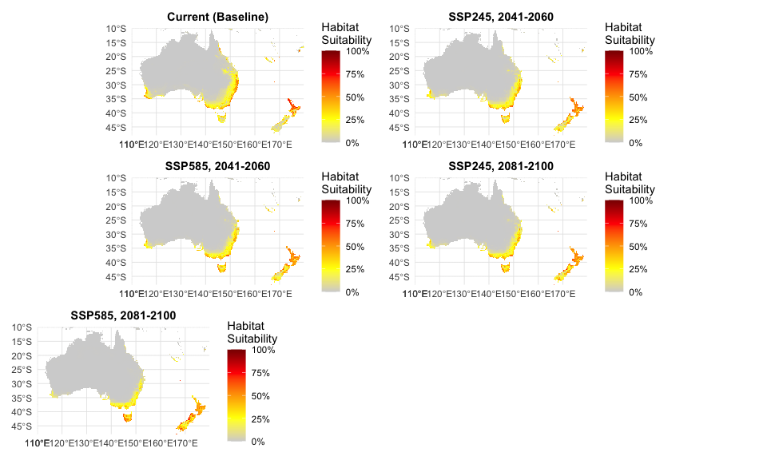
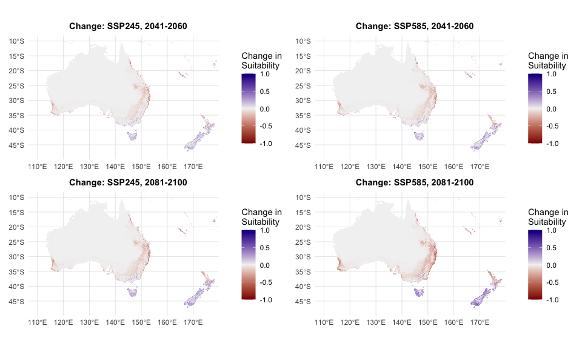

# Step 10: Future Climate Projections
Species Distribution Modeling Pipeline
2026-02-11

- [Overview](#overview)
- [Setup](#setup)
- [Load Current Climate and Model](#load-current-climate-and-model)
- [Project to Future Scenarios](#project-to-future-scenarios)
- [Create Ensemble Predictions](#create-ensemble-predictions)
- [Calculate Change from Current](#calculate-change-from-current)
- [Summary Table: Suitable Habitat
  Area](#summary-table-suitable-habitat-area)
- [Visualization: Ensemble
  Predictions](#visualization-ensemble-predictions)
- [Visualization: Change Maps](#visualization-change-maps)
- [Final Summary](#final-summary)
- [Outputs Generated](#outputs-generated)
- [Session Info](#session-info)

## Overview

This script projects the optimized MaxEnt model to future climate
scenarios and analyzes habitat suitability changes.

**What This Script Does**: 1. Loads the optimized MaxEnt model (from
Step 7) 2. Projects to all 12 future climate scenarios (from Step 9) 3.
Creates ensemble predictions (mean and SD across GCMs) 4. Calculates
habitat suitability change (future - current) 5. Identifies areas of
gain, loss, and stability 6. Quantifies suitable habitat area by
scenario

**Scenarios**: 12 total combinations - 3 GCMs: MIROC6, MPI-ESM1-2-HR,
UKESM1-0-LL - 2 SSPs: SSP2-4.5 (moderate), SSP5-8.5 (high emissions) - 2
time periods: 2041-2060 (mid-century), 2081-2100 (end-century)

**Expected Runtime**: 15-30 minutes

------------------------------------------------------------------------

## Setup

``` r
# Set options
options(java.parameters = "-Xmx12g")
terra::terraOptions(memfrac = 0.8, tempdir = "temp")

# Core packages
library(terra)
library(tidyverse)
library(predicts)
library(sf)

# Visualization
library(ggplot2)
library(patchwork)
library(viridis)
library(tidyterra)

processed_data_dir <- "~/Library/CloudStorage/OneDrive-CSIRO/OneDrive - Docs/01_Projects/Hlongicornis_SDM/processed_data/"

# Create directories
#dir.create("outputs/future_projections", showWarnings = FALSE, recursive = TRUE)
#dir.create("figures", showWarnings = FALSE)
```

------------------------------------------------------------------------

## Load Current Climate and Model

``` r
# Loading Model and Current Climate

# Load optimized MaxEnt model
maxent_model <- readRDS(paste0(processed_data_dir, "maxent_optimized_model.rds"))

# Load current climate prediction for comparison
current_prediction <- rast(paste0(processed_data_dir, "maxent_optimized_prediction_aus.tif"))

cat("✓ Optimized MaxEnt model loaded\n")
```

    ✓ Optimized MaxEnt model loaded

``` r
cat("✓ Current prediction loaded\n")
```

    ✓ Current prediction loaded

``` r
cat(sprintf("  Extent: xmin=%.2f, xmax=%.2f, ymin=%.2f, ymax=%.2f\n",
            ext(current_prediction)[1], ext(current_prediction)[2],
            ext(current_prediction)[3], ext(current_prediction)[4]))
```

      Extent: xmin=110.00, xmax=180.00, ymin=-48.00, ymax=-10.00

``` r
cat(sprintf("  Resolution: %.4f°\n", res(current_prediction)[1]))
```

      Resolution: 0.0417°

------------------------------------------------------------------------

## Project to Future Scenarios

Loop through all 12 future climate scenarios and generate predictions:

``` r
# Projecting to Future Scenarios

# Configuration
gcms <- c("MIROC6", "MPI-ESM1-2-HR", "UKESM1-0-LL")
ssps <- c("245", "585")
periods <- c("2041-2060", "2081-2100")

# Create output directory
#dir.create("processed_data/future_projections", showWarnings = FALSE, recursive = TRUE)

# Initialize tracking
projection_log <- tibble(
  gcm = character(),
  ssp = character(),
  period = character(),
  status = character(),
  mean_suitability = numeric(),
  suitable_area_km2 = numeric(),
  processing_time_sec = numeric()
)

# Total scenarios
total_scenarios <- length(gcms) * length(ssps) * length(periods)
current_scenario <- 0

# Storage for all predictions
all_predictions <- list()

# Projection loop
for (gcm in gcms) {
  for (ssp in ssps) {
    for (period in periods) {
      current_scenario <- current_scenario + 1

      scenario_name <- sprintf("%s_ssp%s_%s",
                               tolower(gsub("-", "_", gcm)),
                               ssp,
                               gsub("-", "_", period))

cat(sprintf("[%d/%d] Projecting: %s, SSP%s, %s\n",
                  current_scenario, total_scenarios, gcm, ssp, period))

      start_time <- Sys.time()

      tryCatch({
        # Load future climate data
        future_climate_file <- sprintf(
          paste0(
            processed_data_dir,
            "future_climate/future_bioclim_%s.tif"),
          scenario_name
        )

        if (!file.exists(future_climate_file)) {
          stop(sprintf("Future climate file not found: %s", future_climate_file))
        }

        future_climate <- rast(future_climate_file)

        # Predict with MaxEnt model
        future_prediction <- predict(
          maxent_model,
          future_climate,
          args = c('outputformat=logistic')
        )

        # Calculate statistics
        mean_suit <- global(future_prediction, "mean", na.rm = TRUE)[1,1]

        # Calculate suitable area (threshold = 0.5)
        suitable_cells <- sum(values(future_prediction > 0.5), na.rm = TRUE)
        cell_area_km2 <- prod(res(future_prediction)) * 111 * 111  # Approx km²
        suitable_area <- suitable_cells * cell_area_km2

        # Save individual prediction
        output_file <- sprintf(
          paste0(processed_data_dir, "future_projections/%s_prediction.tif"),
          scenario_name
        )
        writeRaster(future_prediction, output_file, overwrite = TRUE)

        # Store in list for ensemble calculation
        all_predictions[[scenario_name]] <- future_prediction

        end_time <- Sys.time()
        elapsed_sec <- as.numeric(difftime(end_time, start_time, units = "secs"))

        cat(sprintf("  ✓ Mean suitability: %.4f\n", mean_suit))
        cat(sprintf("  ✓ Suitable area: %s km²\n", scales::comma(suitable_area, accuracy = 1)))
        cat(sprintf("  ✓ Saved: %s (%.1f sec)\n", basename(output_file), elapsed_sec))

        # Log success
        projection_log <- projection_log %>%
          add_row(
            gcm = gcm,
            ssp = paste0("SSP", ssp),
            period = period,
            status = "success",
            mean_suitability = mean_suit,
            suitable_area_km2 = suitable_area,
            processing_time_sec = elapsed_sec
          )

      }, error = function(e) {
        cat(sprintf("  ✗ ERROR: %s\n", e$message))

        # Log failure
        projection_log <- projection_log %>%
          add_row(
            gcm = gcm,
            ssp = paste0("SSP", ssp),
            period = period,
            status = "failed",
            mean_suitability = NA_real_,
            suitable_area_km2 = NA_real_,
            processing_time_sec = 0
          )
      })
    }
  }
}
```

    [1/12] Projecting: MIROC6, SSP245, 2041-2060

      ✓ Mean suitability: 0.0391
      ✓ Suitable area: 350,763 km²
      ✓ Saved: miroc6_ssp245_2041_2060_prediction.tif (48.1 sec)
    [2/12] Projecting: MIROC6, SSP245, 2081-2100
      ✓ Mean suitability: 0.0352
      ✓ Suitable area: 337,737 km²
      ✓ Saved: miroc6_ssp245_2081_2100_prediction.tif (47.2 sec)
    [3/12] Projecting: MIROC6, SSP585, 2041-2060
      ✓ Mean suitability: 0.0371
      ✓ Suitable area: 336,838 km²
      ✓ Saved: miroc6_ssp585_2041_2060_prediction.tif (48.4 sec)
    [4/12] Projecting: MIROC6, SSP585, 2081-2100
      ✓ Mean suitability: 0.0275
      ✓ Suitable area: 330,635 km²
      ✓ Saved: miroc6_ssp585_2081_2100_prediction.tif (46.1 sec)
    [5/12] Projecting: MPI-ESM1-2-HR, SSP245, 2041-2060
      ✓ Mean suitability: 0.0391
      ✓ Suitable area: 306,849 km²
      ✓ Saved: mpi_esm1_2_hr_ssp245_2041_2060_prediction.tif (48.8 sec)
    [6/12] Projecting: MPI-ESM1-2-HR, SSP245, 2081-2100
      ✓ Mean suitability: 0.0352
      ✓ Suitable area: 273,436 km²
      ✓ Saved: mpi_esm1_2_hr_ssp245_2081_2100_prediction.tif (44.4 sec)
    [7/12] Projecting: MPI-ESM1-2-HR, SSP585, 2041-2060
      ✓ Mean suitability: 0.0355
      ✓ Suitable area: 275,725 km²
      ✓ Saved: mpi_esm1_2_hr_ssp585_2041_2060_prediction.tif (45.0 sec)
    [8/12] Projecting: MPI-ESM1-2-HR, SSP585, 2081-2100
      ✓ Mean suitability: 0.0264
      ✓ Suitable area: 241,008 km²
      ✓ Saved: mpi_esm1_2_hr_ssp585_2081_2100_prediction.tif (44.2 sec)
    [9/12] Projecting: UKESM1-0-LL, SSP245, 2041-2060
      ✓ Mean suitability: 0.0314
      ✓ Suitable area: 220,430 km²
      ✓ Saved: ukesm1_0_ll_ssp245_2041_2060_prediction.tif (46.8 sec)
    [10/12] Projecting: UKESM1-0-LL, SSP245, 2081-2100
      ✓ Mean suitability: 0.0266
      ✓ Suitable area: 236,388 km²
      ✓ Saved: ukesm1_0_ll_ssp245_2081_2100_prediction.tif (46.0 sec)
    [11/12] Projecting: UKESM1-0-LL, SSP585, 2041-2060
      ✓ Mean suitability: 0.0277
      ✓ Suitable area: 203,061 km²
      ✓ Saved: ukesm1_0_ll_ssp585_2041_2060_prediction.tif (43.6 sec)
    [12/12] Projecting: UKESM1-0-LL, SSP585, 2081-2100
      ✓ Mean suitability: 0.0197
      ✓ Suitable area: 215,425 km²
      ✓ Saved: ukesm1_0_ll_ssp585_2081_2100_prediction.tif (43.5 sec)

``` r
# Save projection log
write_csv(projection_log, paste0(processed_data_dir, "future_projections/projection_log.csv"))

cat("\n=== Projection Summary ===\n")
```


    === Projection Summary ===

``` r
cat(sprintf("Total scenarios: %d\n", total_scenarios))
```

    Total scenarios: 12

``` r
cat(sprintf("Successful: %d\n", sum(projection_log$status == "success")))
```

    Successful: 12

``` r
cat(sprintf("Failed: %d\n", sum(projection_log$status == "failed")))
```

    Failed: 0

``` r
if (sum(projection_log$status == "failed") > 0) {
  cat("\n⚠ Failed scenarios:\n")
  print(projection_log %>% filter(status == "failed") %>%
          select(gcm, ssp, period))
}
```

------------------------------------------------------------------------

## Create Ensemble Predictions

Calculate ensemble means and standard deviations across GCMs for each
SSP × period combination:

``` r
# Creating Ensemble Predictions

# Get unique SSP × period combinations
ssp_period_combos <- expand.grid(
  ssp = ssps,
  period = periods,
  stringsAsFactors = FALSE
)

ensemble_stats <- tibble(
  ssp = character(),
  period = character(),
  mean_suitability = numeric(),
  sd_suitability = numeric(),
  suitable_area_km2 = numeric()
)

for (i in 1:nrow(ssp_period_combos)) {
  ssp <- ssp_period_combos$ssp[i]
  period <- ssp_period_combos$period[i]

  cat(sprintf("Creating ensemble for SSP%s, %s\n", ssp, period))

  # Get all predictions for this SSP × period
  scenario_pattern <- sprintf("ssp%s_%s", ssp, gsub("-", "_", period))
  matching_scenarios <- names(all_predictions)[grepl(scenario_pattern, names(all_predictions))]

  if (length(matching_scenarios) == 0) {
    cat("  ⚠ No predictions found for this combination\n")
    next
  }

  # Stack predictions for this SSP × period
  scenario_stack <- rast(lapply(matching_scenarios, function(s) all_predictions[[s]]))

  # Calculate ensemble mean and SD
  ensemble_mean <- mean(scenario_stack, na.rm = TRUE)
  ensemble_sd <- stdev(scenario_stack, na.rm = TRUE)

  # Save ensemble predictions
  ensemble_name <- sprintf("ensemble_ssp%s_%s", ssp, gsub("-", "_", period))

  writeRaster(
    ensemble_mean,
    sprintf(paste0(processed_data_dir, "future_projections/%s_mean.tif"), ensemble_name),
    overwrite = TRUE
  )

  writeRaster(
    ensemble_sd,
    sprintf(paste0(processed_data_dir, "future_projections/%s_sd.tif"), ensemble_name),
    overwrite = TRUE
  )

  # Calculate statistics
  mean_suit <- global(ensemble_mean, "mean", na.rm = TRUE)[1,1]
  sd_suit <- global(ensemble_sd, "mean", na.rm = TRUE)[1,1]
  suitable_cells <- sum(values(ensemble_mean > 0.5), na.rm = TRUE)
  cell_area_km2 <- prod(res(ensemble_mean)) * 111 * 111
  suitable_area <- suitable_cells * cell_area_km2

  cat(sprintf("  ✓ Mean suitability: %.4f (SD: %.4f)\n", mean_suit, sd_suit))
  cat(sprintf("  ✓ Suitable area: %s km²\n", scales::comma(suitable_area, accuracy = 1)))

  ensemble_stats <- ensemble_stats %>%
    add_row(
      ssp = paste0("SSP", ssp),
      period = period,
      mean_suitability = mean_suit,
      sd_suitability = sd_suit,
      suitable_area_km2 = suitable_area
    )
}
```

    Creating ensemble for SSP245, 2041-2060

    |---------|---------|---------|---------|
    =========================================
                                              
      ✓ Mean suitability: 0.0365 (SD: 0.0095)
      ✓ Suitable area: 215,425 km²
    Creating ensemble for SSP585, 2041-2060

    |---------|---------|---------|---------|
    =========================================
                                              

    |---------|---------|---------|---------|
    =========================================
                                              
      ✓ Mean suitability: 0.0335 (SD: 0.0102)
      ✓ Suitable area: 187,574 km²
    Creating ensemble for SSP245, 2081-2100

    |---------|---------|---------|---------|
    =========================================
                                              

    |---------|---------|---------|---------|
    =========================================
                                              
      ✓ Mean suitability: 0.0323 (SD: 0.0104)
      ✓ Suitable area: 193,243 km²
    Creating ensemble for SSP585, 2081-2100

    |---------|---------|---------|---------|
    =========================================
                                              

    |---------|---------|---------|---------|
    =========================================
                                              
      ✓ Mean suitability: 0.0245 (SD: 0.0095)
      ✓ Suitable area: 185,927 km²

``` r
write_csv(ensemble_stats, paste0(processed_data_dir, "future_projections/ensemble_statistics.csv"))
```

------------------------------------------------------------------------

## Calculate Change from Current

For each ensemble prediction, calculate change in habitat suitability:

``` r
# Calculating Habitat Suitability Change

change_stats <- tibble(
  ssp = character(),
  period = character(),
  mean_change = numeric(),
  area_gain_km2 = numeric(),
  area_loss_km2 = numeric(),
  area_stable_km2 = numeric()
)

# Cell area
cell_area_km2 <- prod(res(current_prediction)) * 111 * 111

for (i in 1:nrow(ssp_period_combos)) {
  ssp <- ssp_period_combos$ssp[i]
  period <- ssp_period_combos$period[i]

  ensemble_name <- sprintf("ensemble_ssp%s_%s", ssp, gsub("-", "_", period))
  ensemble_file <- sprintf(paste0(processed_data_dir, "future_projections/%s_mean.tif"), ensemble_name)

  if (!file.exists(ensemble_file)) {
    cat(sprintf("Skipping SSP%s %s (ensemble not found)\n", ssp, period))
    next
  }

  cat(sprintf("Calculating change for SSP%s, %s\n", ssp, period))

  # Load ensemble prediction
  future_ensemble <- rast(ensemble_file)

  # Ensure extents match by cropping and resampling to current_prediction
  future_ensemble <- crop(future_ensemble, current_prediction)
  future_ensemble <- resample(future_ensemble, current_prediction, method = "bilinear")

  # Calculate change (future - current)
  change_raster <- future_ensemble - current_prediction

  # Save change raster
  writeRaster(
    change_raster,
    sprintf(paste0(processed_data_dir, "future_projections/change_ssp%s_%s.tif"),
            ssp, gsub("-", "_", period)),
    overwrite = TRUE
  )

  # Calculate statistics
  mean_change <- global(change_raster, "mean", na.rm = TRUE)[1,1]

  # Classify change (using 0.5 threshold for suitable habitat)
  current_suitable <- current_prediction > 0.5
  future_suitable <- future_ensemble > 0.5

  # Gain: not suitable → suitable
  gain <- (!current_suitable) & future_suitable
  area_gain <- sum(values(gain), na.rm = TRUE) * cell_area_km2

  # Loss: suitable → not suitable
  loss <- current_suitable & (!future_suitable)
  area_loss <- sum(values(loss), na.rm = TRUE) * cell_area_km2

  # Stable: suitable → suitable
  stable <- current_suitable & future_suitable
  area_stable <- sum(values(stable), na.rm = TRUE) * cell_area_km2

  cat(sprintf("  Mean change: %+.4f\n", mean_change))
  cat(sprintf("  Area gain: %s km²\n", scales::comma(area_gain, accuracy = 1)))
  cat(sprintf("  Area loss: %s km²\n", scales::comma(area_loss, accuracy = 1)))
  cat(sprintf("  Area stable: %s km²\n", scales::comma(area_stable, accuracy = 1)))

  change_stats <- change_stats %>%
    add_row(
      ssp = paste0("SSP", ssp),
      period = period,
      mean_change = mean_change,
      area_gain_km2 = area_gain,
      area_loss_km2 = area_loss,
      area_stable_km2 = area_stable
    )
}
```

    Calculating change for SSP245, 2041-2060
      Mean change: -0.0048
      Area gain: 55,573 km²
      Area loss: 82,846 km²
      Area stable: 82,504 km²
    Calculating change for SSP585, 2041-2060
      Mean change: -0.0061
      Area gain: 59,188 km²
      Area loss: 96,151 km²
      Area stable: 69,199 km²
    Calculating change for SSP245, 2081-2100
      Mean change: -0.0067
      Area gain: 72,300 km²
      Area loss: 109,178 km²
      Area stable: 56,172 km²
    Calculating change for SSP585, 2081-2100
      Mean change: -0.0123
      Area gain: 109,670 km²
      Area loss: 138,953 km²
      Area stable: 26,396 km²

``` r
write_csv(change_stats, paste0(processed_data_dir, "future_projections/change_statistics.csv"))
```

------------------------------------------------------------------------

## Summary Table: Suitable Habitat Area

``` r
cat("\n=== Suitable Habitat Area by Scenario ===\n\n")
```


    === Suitable Habitat Area by Scenario ===

``` r
# Add current prediction to summary
current_suitable_cells <- sum(values(current_prediction > 0.5), na.rm = TRUE)
current_area <- current_suitable_cells * cell_area_km2

# Combine current and future
area_summary <- tibble(
  scenario = "Current (baseline)",
  ssp = "Current",
  period = "2000-2020",
  suitable_area_km2 = current_area,
  change_from_current_km2 = 0,
  change_from_current_pct = 0
) %>%
  bind_rows(
    ensemble_stats %>%
      mutate(
        scenario = paste(ssp, period),
        change_from_current_km2 = suitable_area_km2 - current_area,
        change_from_current_pct = (suitable_area_km2 - current_area) / current_area * 100
      ) %>%
      select(scenario, ssp, period, suitable_area_km2,
             change_from_current_km2, change_from_current_pct)
  )

# Print table
print(area_summary, n = 20)
```

    # A tibble: 5 × 6
      scenario           ssp     period    suitable_area_km2 change_from_current_km2
      <chr>              <chr>   <chr>                 <dbl>                   <dbl>
    1 Current (baseline) Current 2000-2020           165799.                      0 
    2 SSP245 2041-2060   SSP245  2041-2060           215425.                  49626.
    3 SSP585 2041-2060   SSP585  2041-2060           187574.                  21776.
    4 SSP245 2081-2100   SSP245  2081-2100           193243.                  27444.
    5 SSP585 2081-2100   SSP585  2081-2100           185927.                  20129.
    # ℹ 1 more variable: change_from_current_pct <dbl>

``` r
# Save
write_csv(
  area_summary,
  paste0(
    processed_data_dir,
    "future_projections/suitable_area_summary.csv"
    )
  )
```

------------------------------------------------------------------------

## Visualization: Ensemble Predictions

Create multi-panel figure showing ensemble predictions for all
scenarios:

``` r
# Creating Ensemble Prediction Visualizations

# Define Australia/NZ extent for cropping
aus_nz_xlim <- c(110, 180)
aus_nz_ylim <- c(-48, -10)

# Load all ensemble predictions
ensemble_plots <- list()

for (i in 1:nrow(ssp_period_combos)) {
  ssp <- ssp_period_combos$ssp[i]
  period <- ssp_period_combos$period[i]

  ensemble_name <- sprintf("ensemble_ssp%s_%s", ssp, gsub("-", "_", period))
  ensemble_file <- sprintf(
    paste0(
      processed_data_dir,
      "future_projections/%s_mean.tif"
      ),
    ensemble_name
    )

  if (!file.exists(ensemble_file)) next

  ensemble_pred <- rast(ensemble_file)

  # Create plot with coord_sf limits
  plot_title <- sprintf("SSP%s, %s", ssp, period)

  p <- ggplot() +
    geom_spatraster(data = ensemble_pred) +
    scale_fill_gradientn(
      colors = c("lightgrey", "yellow", "orange", "red", "darkred"),
      na.value = "transparent",
      limits = c(0, 1),
      labels = scales::percent,
      name = "Habitat\nSuitability"
    ) +
    labs(title = plot_title) +
    coord_sf(xlim = aus_nz_xlim, ylim = aus_nz_ylim, expand = FALSE) +
    theme_minimal() +
    theme(
      plot.title = element_text(face = "bold", size = 11, hjust = 0.5),
      axis.title = element_blank(),
      panel.grid = element_line(color = "gray90", linewidth = 0.3)
    )

  ensemble_plots[[ensemble_name]] <- p
}

# Add current prediction for comparison
p_current <- ggplot() +
  geom_spatraster(data = current_prediction) +
  scale_fill_gradientn(
    colors = c("lightgrey", "yellow", "orange", "red", "darkred"),
    na.value = "transparent",
    limits = c(0, 1),
    labels = scales::percent,
    name = "Habitat\nSuitability"
  ) +
  labs(title = "Current (Baseline)") +
  coord_sf(xlim = aus_nz_xlim, ylim = aus_nz_ylim, expand = FALSE) +
  theme_minimal() +
  theme(
    plot.title = element_text(face = "bold", size = 11, hjust = 0.5),
    axis.title = element_blank(),
    panel.grid = element_line(color = "gray90", linewidth = 0.3)
  )

# Combine all plots
combined <- (p_current + ensemble_plots[[1]]) /
            (ensemble_plots[[2]] + ensemble_plots[[3]]) /
            (ensemble_plots[[4]] | plot_spacer())

print(combined)
```



``` r
ggsave(
  "~/Library/CloudStorage/OneDrive-CSIRO/OneDrive - Docs/01_Projects/Hlongicornis_SDM/figures/10_ensemble_predictions_all_scenarios.png",
       combined, width = 14, height = 12, dpi = 300)
```

------------------------------------------------------------------------

## Visualization: Change Maps

Create change maps showing gain/loss/stable areas:

``` r
cat("\n=== Creating Change Visualizations ===\n\n")
```


    === Creating Change Visualizations ===

``` r
change_plots <- list()

for (i in 1:nrow(ssp_period_combos)) {
  ssp <- ssp_period_combos$ssp[i]
  period <- ssp_period_combos$period[i]

  change_file <- sprintf(paste0(processed_data_dir,
                         "future_projections/change_ssp%s_%s.tif"),
                        ssp, gsub("-", "_", period))

  if (!file.exists(change_file)) next

  change_raster <- rast(change_file)

  # Create plot
  plot_title <- sprintf("Change: SSP%s, %s", ssp, period)

  p <- ggplot() +
    geom_spatraster(data = change_raster) +
    scale_fill_gradient2(
      low = "darkred",
      mid = "grey95",
      high = "darkblue",
      midpoint = 0,
      na.value = "transparent",
      limits = c(-1, 1),
      name = "Change in\nSuitability"
    ) +
    labs(title = plot_title) +
    coord_sf() +
    theme_minimal() +
    theme(
      plot.title = element_text(face = "bold", size = 11, hjust = 0.5),
      axis.title = element_blank(),
      panel.grid = element_line(color = "gray90", linewidth = 0.3)
    )

  change_plots[[i]] <- p
}

# Combine change plots
change_combined <- wrap_plots(change_plots, ncol = 2)

print(change_combined)
```



``` r
ggsave("~/Library/CloudStorage/OneDrive-CSIRO/OneDrive - Docs/01_Projects/Hlongicornis_SDM/figures/10_change_maps_all_scenarios.png",
       change_combined, width = 12, height = 10, dpi = 300)

cat("✓ Change maps saved\n")
```

    ✓ Change maps saved

------------------------------------------------------------------------

## Final Summary

``` r
cat("\n\n")
```

``` r
cat("╔════════════════════════════════════════════════════════════════╗\n")
```

    ╔════════════════════════════════════════════════════════════════╗

``` r
cat("║         STEP 10: FUTURE PROJECTIONS - SUMMARY                ║\n")
```

    ║         STEP 10: FUTURE PROJECTIONS - SUMMARY                ║

``` r
cat("╠════════════════════════════════════════════════════════════════╣\n")
```

    ╠════════════════════════════════════════════════════════════════╣

``` r
# Projection status
cat("║ 1. FUTURE PROJECTIONS                                         ║\n")
```

    ║ 1. FUTURE PROJECTIONS                                         ║

``` r
cat("╠════════════════════════════════════════════════════════════════╣\n")
```

    ╠════════════════════════════════════════════════════════════════╣

``` r
cat(sprintf("║   Scenarios projected: %d/%d                                    ║\n",
            sum(projection_log$status == "success"), total_scenarios))
```

    ║   Scenarios projected: 12/12                                    ║

``` r
cat(sprintf("║   Ensemble predictions: %d (by SSP × period)                  ║\n",
            nrow(ensemble_stats)))
```

    ║   Ensemble predictions: 4 (by SSP × period)                  ║

``` r
# Area changes
cat("╠════════════════════════════════════════════════════════════════╣\n")
```

    ╠════════════════════════════════════════════════════════════════╣

``` r
cat("║ 2. SUITABLE HABITAT AREA                                      ║\n")
```

    ║ 2. SUITABLE HABITAT AREA                                      ║

``` r
cat("╠════════════════════════════════════════════════════════════════╣\n")
```

    ╠════════════════════════════════════════════════════════════════╣

``` r
cat(sprintf("║   Current baseline: %s km²                          ║\n",
            format(current_area, big.mark = ",", scientific = FALSE)))
```

    ║   Current baseline: 165,798.7 km²                          ║

``` r
for (i in 1:nrow(area_summary)) {
  if (area_summary$scenario[i] == "Current (baseline)") next

  cat(sprintf("║   %-20s %s km² (%+.1f%%)              ║\n",
              paste0(area_summary$scenario[i], ":"),
              format(area_summary$suitable_area_km2[i], big.mark = ",", scientific = FALSE),
              area_summary$change_from_current_pct[i]))
}
```

    ║   SSP245 2041-2060:    215,425 km² (+29.9%)              ║
    ║   SSP585 2041-2060:    187,574.4 km² (+13.1%)              ║
    ║   SSP245 2081-2100:    193,242.9 km² (+16.6%)              ║
    ║   SSP585 2081-2100:    185,927.3 km² (+12.1%)              ║

``` r
# Change patterns
cat("╠════════════════════════════════════════════════════════════════╣\n")
```

    ╠════════════════════════════════════════════════════════════════╣

``` r
cat("║ 3. HABITAT CHANGE PATTERNS                                    ║\n")
```

    ║ 3. HABITAT CHANGE PATTERNS                                    ║

``` r
cat("╠════════════════════════════════════════════════════════════════╣\n")
```

    ╠════════════════════════════════════════════════════════════════╣

``` r
for (i in 1:nrow(change_stats)) {
  cat(sprintf("║   %s %s:                                       ║\n",
              change_stats$ssp[i], change_stats$period[i]))
  cat(sprintf("║     Gain: %s km² | Loss: %s km²               ║\n",
              format(change_stats$area_gain_km2[i], big.mark = ",", scientific = FALSE),
              format(change_stats$area_loss_km2[i], big.mark = ",", scientific = FALSE)))
}
```

    ║   SSP245 2041-2060:                                       ║
    ║     Gain: 55,572.84 km² | Loss: 82,845.89 km²               ║
    ║   SSP585 2041-2060:                                       ║
    ║     Gain: 59,187.86 km² | Loss: 96,150.86 km²               ║
    ║   SSP245 2081-2100:                                       ║
    ║     Gain: 72,300.31 km² | Loss: 109,177.7 km²               ║
    ║   SSP585 2081-2100:                                       ║
    ║     Gain: 109,669.7 km² | Loss: 138,953.5 km²               ║

``` r
cat("╠════════════════════════════════════════════════════════════════╣\n")
```

    ╠════════════════════════════════════════════════════════════════╣

``` r
cat("║ OUTPUTS GENERATED                                             ║\n")
```

    ║ OUTPUTS GENERATED                                             ║

``` r
cat("╠════════════════════════════════════════════════════════════════╣\n")
```

    ╠════════════════════════════════════════════════════════════════╣

``` r
cat("║   • 12 individual scenario predictions                        ║\n")
```

    ║   • 12 individual scenario predictions                        ║

``` r
cat("║   • 4 ensemble means (by SSP × period)                        ║\n")
```

    ║   • 4 ensemble means (by SSP × period)                        ║

``` r
cat("║   • 4 ensemble SDs (uncertainty)                              ║\n")
```

    ║   • 4 ensemble SDs (uncertainty)                              ║

``` r
cat("║   • 4 change rasters (future - current)                       ║\n")
```

    ║   • 4 change rasters (future - current)                       ║

``` r
cat("║   • Summary tables (CSV)                                      ║\n")
```

    ║   • Summary tables (CSV)                                      ║

``` r
cat("║   • Visualization figures (PNG)                               ║\n")
```

    ║   • Visualization figures (PNG)                               ║

``` r
cat("╠════════════════════════════════════════════════════════════════╣\n")
```

    ╠════════════════════════════════════════════════════════════════╣

``` r
cat("║                                                                ║\n")
```

    ║                                                                ║

``` r
cat("║   ✓✓✓ FUTURE PROJECTIONS COMPLETE ✓✓✓                        ║\n")
```

    ║   ✓✓✓ FUTURE PROJECTIONS COMPLETE ✓✓✓                        ║

``` r
cat("║                                                                ║\n")
```

    ║                                                                ║

``` r
cat("║   ➜ READY TO PROCEED to Step 11 (Visualization & Results)     ║\n")
```

    ║   ➜ READY TO PROCEED to Step 11 (Visualization & Results)     ║

``` r
cat("║                                                                ║\n")
```

    ║                                                                ║

``` r
cat("╚════════════════════════════════════════════════════════════════╝\n\n")
```

    ╚════════════════════════════════════════════════════════════════╝

------------------------------------------------------------------------

## Outputs Generated

**Prediction Rasters**: -
`processed_data/future_projections/*_prediction.tif` (12 individual
scenarios) - `processed_data/future_projections/ensemble_*_mean.tif` (4
ensemble means) - `processed_data/future_projections/ensemble_*_sd.tif`
(4 ensemble SDs) - `processed_data/future_projections/change_*.tif` (4
change rasters)

**Summary Tables**: -
`processed_data/future_projections/projection_log.csv` -
`processed_data/future_projections/ensemble_statistics.csv` -
`processed_data/future_projections/change_statistics.csv` -
`processed_data/future_projections/suitable_area_summary.csv`

**Figures**: - `figures/10_ensemble_predictions_all_scenarios.png` -
`figures/10_change_maps_all_scenarios.png`

------------------------------------------------------------------------

## Session Info

``` r
sessionInfo()
```

    R version 4.4.1 (2024-06-14)
    Platform: aarch64-apple-darwin20
    Running under: macOS 26.2

    Matrix products: default
    BLAS:   /Library/Frameworks/R.framework/Versions/4.4-arm64/Resources/lib/libRblas.0.dylib 
    LAPACK: /Library/Frameworks/R.framework/Versions/4.4-arm64/Resources/lib/libRlapack.dylib;  LAPACK version 3.12.0

    locale:
    [1] en_US.UTF-8/en_US.UTF-8/en_US.UTF-8/C/en_US.UTF-8/en_US.UTF-8

    time zone: Australia/Brisbane
    tzcode source: internal

    attached base packages:
    [1] stats     graphics  grDevices utils     datasets  methods   base     

    other attached packages:
     [1] tidyterra_1.0.0   viridis_0.6.5     viridisLite_0.4.2 patchwork_1.3.2  
     [5] sf_1.0-21         predicts_0.1-19   lubridate_1.9.4   forcats_1.0.0    
     [9] stringr_1.5.1     dplyr_1.1.4       purrr_1.1.0       readr_2.1.5      
    [13] tidyr_1.3.1       tibble_3.3.0      ggplot2_4.0.0     tidyverse_2.0.0  
    [17] terra_1.8-93     

    loaded via a namespace (and not attached):
     [1] gtable_0.3.6       xfun_0.53          rJava_1.0-11       tzdb_0.5.0        
     [5] vctrs_0.6.5        tools_4.4.1        generics_0.1.4     parallel_4.4.1    
     [9] proxy_0.4-27       pkgconfig_2.0.3    KernSmooth_2.23-26 data.table_1.17.8 
    [13] RColorBrewer_1.1-3 S7_0.2.0           lifecycle_1.0.4    compiler_4.4.1    
    [17] farver_2.1.2       textshaping_1.0.3  codetools_0.2-20   htmltools_0.5.8.1 
    [21] class_7.3-23       yaml_2.3.10        pillar_1.11.0      crayon_1.5.3      
    [25] classInt_0.4-11    tidyselect_1.2.1   digest_0.6.37      stringi_1.8.7     
    [29] labeling_0.4.3     fastmap_1.2.0      grid_4.4.1         archive_1.1.12.1  
    [33] cli_3.6.5          magrittr_2.0.3     utf8_1.2.6         e1071_1.7-16      
    [37] withr_3.0.2        scales_1.4.0       bit64_4.6.0-1      timechange_0.3.0  
    [41] rmarkdown_2.29     bit_4.6.0          gridExtra_2.3      ragg_1.5.0        
    [45] hms_1.1.3          evaluate_1.0.5     knitr_1.50         rlang_1.1.6       
    [49] Rcpp_1.1.0         glue_1.8.0         DBI_1.2.3          vroom_1.6.5       
    [53] jsonlite_2.0.0     R6_2.6.1           systemfonts_1.2.3  units_0.8-7       

**END OF STEP 10**
