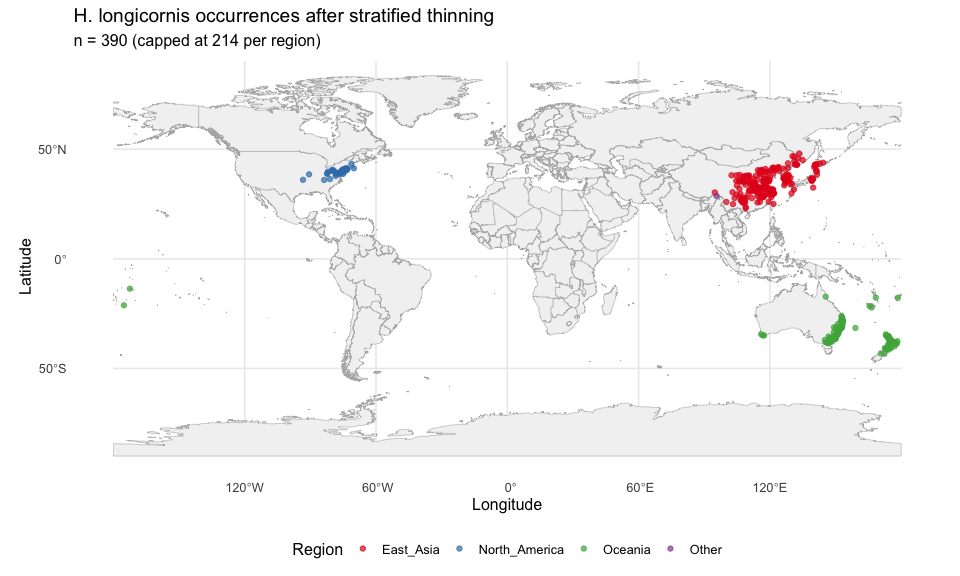
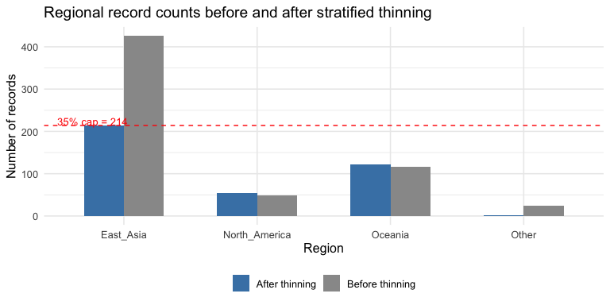

# Step 1: Occurrence Data — Revised
Alexander W. Gofton
2026-02-12

## Overview

This script revises the occurrence data from the original pipeline (v1)
with two key changes:

1.  **Remove records with missing coordinates** (1 record with NA
    lon/lat).
2.  **Geographically stratified thinning** — cap each region at ~35% of
    total records to reduce the dominance of East Asian occurrences
    (previously 61% of all data).

We start from the already-thinned v1 dataset (614 records after 10 km
spatial thinning) rather than re-running the full data assembly
pipeline.

``` r
library(tidyverse)
```

    ── Attaching core tidyverse packages ──────────────────────── tidyverse 2.0.0 ──
    ✔ dplyr     1.1.4     ✔ readr     2.1.5
    ✔ forcats   1.0.0     ✔ stringr   1.5.1
    ✔ ggplot2   4.0.0     ✔ tibble    3.3.0
    ✔ lubridate 1.9.4     ✔ tidyr     1.3.1
    ✔ purrr     1.1.0     
    ── Conflicts ────────────────────────────────────────── tidyverse_conflicts() ──
    ✖ dplyr::filter() masks stats::filter()
    ✖ dplyr::lag()    masks stats::lag()
    ℹ Use the conflicted package (<http://conflicted.r-lib.org/>) to force all conflicts to become errors

``` r
library(terra)
```

    Warning: package 'terra' was built under R version 4.4.3

    terra 1.8.93

    Attaching package: 'terra'

    The following object is masked from 'package:tidyr':

        extract

``` r
library(sf)
```

    Linking to GEOS 3.13.0, GDAL 3.8.5, PROJ 9.5.1; sf_use_s2() is TRUE

``` r
library(rnaturalearth)
library(rnaturalearthdata)
```


    Attaching package: 'rnaturalearthdata'

    The following object is masked from 'package:rnaturalearth':

        countries110

## 1. Load existing thinned occurrence data

The v1 pipeline produced a thinned dataset of 615 records (including 1
with NA coordinates) stored with all 19 WorldClim bioclimatic variables
already extracted.

``` r
# Paths — adjust base_dir to match your local setup
base_dir <- "~/Library/CloudStorage/OneDrive-CSIRO/OneDrive - Docs/01_Projects/Hlongicornis_SDM/"
processed_v1 <- file.path(base_dir, "processed_data")
processed_v2 <- file.path(base_dir, "processed_data_2")
figures_dir <- file.path(base_dir, "figures_2")

# Load the v1 thinned occurrences (615 rows, 1 has NA coords)
occ_raw <- read_csv(
  file.path(processed_v1, "occurrences_thinned.csv"),
  show_col_types = FALSE
)

sprintf("Loaded %d records from v1 thinned dataset", nrow(occ_raw))
```

    [1] "Loaded 615 records from v1 thinned dataset"

## 2. Remove records with missing coordinates

``` r
n_before <- nrow(occ_raw)

occ_clean <- occ_raw %>%
  filter(!is.na(lon), !is.na(lat))

sprintf(
  "Removed %d record(s) with missing coordinates: %d -> %d",
  n_before - nrow(occ_clean),
  n_before,
  nrow(occ_clean)
)
```

    [1] "Removed 1 record(s) with missing coordinates: 615 -> 614"

## 3. Assign geographic regions

We assign each record to one of three regions based on its coordinates:

- **East Asia**: China, Japan, Korea (N & S), Russia (Far East), Taiwan
- **Oceania**: Australia, New Zealand, Pacific Islands
- **North America**: USA

Records not falling into these categories are assigned to “Other”. We
use a spatial join with Natural Earth country boundaries.

``` r
# Get world country boundaries
world <- ne_countries(scale = "medium", returnclass = "sf") %>%
  select(name, iso_a3, continent, subregion, geometry)

# Convert occurrences to sf points
occ_sf <- st_as_sf(occ_clean, coords = c("lon", "lat"), crs = 4326)

# Spatial join to get country for each point
occ_with_country <- st_join(occ_sf, world, join = st_intersects)

# Define region mapping based on country/subregion
east_asia_countries <- c(
  "China",
  "Japan",
  "South Korea",
  "North Korea",
  "Taiwan",
  "Russia" # Russian records in our data are Far East
)

oceania_countries <- c(
  "Australia",
  "New Zealand",
  "Fiji",
  "Tonga",
  "New Caledonia",
  "Vanuatu",
  "Samoa"
)

north_america_countries <- c("United States of America")

occ_with_region <- occ_with_country %>%
  mutate(
    region = case_when(
      name %in% east_asia_countries ~ "East_Asia",
      name %in% oceania_countries ~ "Oceania",
      name %in% north_america_countries ~ "North_America",
      TRUE ~ "Other"
    )
  )

# Recover original lon/lat columns (lost during st_as_sf conversion)
coords <- st_coordinates(occ_with_region)
occ_with_region <- occ_with_region %>%
  st_drop_geometry() %>%
  mutate(lon = coords[, 1], lat = coords[, 2])

# Regional breakdown before stratified thinning
region_counts_before <- occ_with_region %>%
  count(region, name = "n_records") %>%
  mutate(pct = round(100 * n_records / sum(n_records), 1))

region_counts_before
```

    # A tibble: 4 × 3
      region        n_records   pct
      <chr>             <int> <dbl>
    1 East_Asia           426  69.4
    2 North_America        48   7.8
    3 Oceania             116  18.9
    4 Other                24   3.9

## 4. Handle unassigned records

Some points may fall just offshore (small coordinate imprecisions) and
miss the country polygons. Let’s check and assign them using
nearest-country logic.

``` r
n_other <- sum(occ_with_region$region == "Other")

if (n_other > 0) {
  # For unassigned points, find the nearest country
  unassigned_idx <- which(occ_with_region$region == "Other")

  unassigned_sf <- st_as_sf(
    occ_with_region[unassigned_idx, ],
    coords = c("lon", "lat"),
    crs = 4326
  )

  # Find nearest country for each unassigned point
  nearest_idx <- st_nearest_feature(unassigned_sf, world)
  nearest_countries <- world$name[nearest_idx]

  # Re-assign regions
  occ_with_region$name[unassigned_idx] <- nearest_countries
  occ_with_region$region[unassigned_idx] <- case_when(
    nearest_countries %in% east_asia_countries ~ "East_Asia",
    nearest_countries %in% oceania_countries ~ "Oceania",
    nearest_countries %in% north_america_countries ~ "North_America",
    TRUE ~ "Other"
  )

  sprintf(
    "Re-assigned %d offshore/unmatched points using nearest-country",
    n_other
  )
} else {
  "All points matched to a country polygon — no re-assignment needed"
}
```

    [1] "Re-assigned 24 offshore/unmatched points using nearest-country"

## 5. Geographically stratified thinning

Cap each region so no single region exceeds ~35% of total records.
Regions already below the cap are left untouched; only over-represented
regions are subsampled.

``` r
set.seed(42) # Reproducibility

total_records <- nrow(occ_with_region)
cap_pct <- 0.35
cap_n <- floor(total_records * cap_pct)

# Split by region, subsample those over the cap
occ_stratified <- occ_with_region %>%
  group_by(region) %>%
  group_modify(
    ~ {
      if (nrow(.x) > cap_n) {
        slice_sample(.x, n = cap_n)
      } else {
        .x
      }
    }
  ) %>%
  ungroup()

# Regional breakdown after stratified thinning
region_counts_after <- occ_stratified %>%
  count(region, name = "n_records") %>%
  mutate(pct = round(100 * n_records / sum(n_records), 1))

# Combined before/after comparison
region_comparison <- region_counts_before %>%
  rename(before_n = n_records, before_pct = pct) %>%
  left_join(
    region_counts_after %>% rename(after_n = n_records, after_pct = pct),
    by = "region"
  )

region_comparison
```

    # A tibble: 4 × 5
      region        before_n before_pct after_n after_pct
      <chr>            <int>      <dbl>   <int>     <dbl>
    1 East_Asia          426       69.4     214      54.9
    2 North_America       48        7.8      54      13.8
    3 Oceania            116       18.9     121      31  
    4 Other               24        3.9       1       0.3

``` r
sprintf(
  "Stratified thinning: %d -> %d records (cap = %d per region, %.0f%%)",
  total_records, nrow(occ_stratified), cap_n, cap_pct * 100
)
```

    [1] "Stratified thinning: 614 -> 390 records (cap = 214 per region, 35%)"

## 6. Visualise the stratified dataset

``` r
world_map <- ne_countries(scale = "medium", returnclass = "sf")

ggplot() +
  geom_sf(data = world_map, fill = "grey95", colour = "grey70", linewidth = 0.2) +
  geom_point(
    data = occ_stratified,
    aes(x = lon, y = lat, colour = region),
    size = 1.5, alpha = 0.7
  ) +
  scale_colour_brewer(palette = "Set1", name = "Region") +
  #coord_sf(xlim = c(90, 185), ylim = c(-50, 55)) +
  labs(
    title = "H. longicornis occurrences after stratified thinning",
    subtitle = sprintf("n = %d (capped at %d per region)", nrow(occ_stratified), cap_n),
    x = "Longitude", y = "Latitude"
  ) +
  theme_minimal(base_size = 12) +
  theme(legend.position = "bottom")

ggsave(file.path(figures_dir, "01_stratified_occurrences_map.png"),
       width = 10, height = 6, dpi = 300)
```

<div id="fig-stratified-map">



Figure 1: Occurrence records after geographically stratified thinning,
coloured by region.

</div>

``` r
region_comparison_long <- region_comparison %>%
  pivot_longer(
    cols = c(before_n, after_n),
    names_to = "stage",
    values_to = "n"
  ) %>%
  mutate(stage = ifelse(stage == "before_n", "Before thinning", "After thinning"))

ggplot(region_comparison_long, aes(x = region, y = n, fill = stage)) +
  geom_col(position = "dodge", width = 0.6) +
  geom_hline(yintercept = cap_n, linetype = "dashed", colour = "red", linewidth = 0.5) +
  annotate("text", x = 0.5, y = cap_n + 10, label = paste0("35% cap = ", cap_n),
           hjust = 0, colour = "red", size = 3.5) +
  scale_fill_manual(values = c("Before thinning" = "grey60", "After thinning" = "steelblue")) +
  labs(
    title = "Regional record counts before and after stratified thinning",
    x = "Region", y = "Number of records", fill = NULL
  ) +
  theme_minimal(base_size = 12) +
  theme(legend.position = "bottom")

ggsave(file.path(figures_dir, "01_region_comparison_bars.png"),
       width = 8, height = 4, dpi = 300)
```

<div id="fig-region-bars">



Figure 2: Regional composition before and after stratified thinning.

</div>

## 7. Save outputs

``` r
# Save the stratified occurrence data (with region assignments)
# Keep species, lon, lat, ID, region — drop the old climate columns
# (climate values will be re-extracted in Step 2 with the expanded variable set)
occ_output <- occ_stratified %>%
  select(species, lon, lat, ID, region)

write_csv(occ_output, file.path(processed_v2, "occurrences_stratified.csv"))

# Also save as an sf geopackage for spatial operations in later steps
occ_output_sf <- st_as_sf(occ_output, coords = c("lon", "lat"), crs = 4326)
st_write(occ_output_sf, file.path(processed_v2, "occurrences_stratified.gpkg"),
         delete_dsn = TRUE, quiet = TRUE)

sprintf("Saved %d records to processed_data_2/occurrences_stratified.csv", nrow(occ_output))
```

    [1] "Saved 390 records to processed_data_2/occurrences_stratified.csv"

## Summary

``` r
tibble(
  Step = c(
    "v1 thinned dataset",
    "After removing NA coordinates",
    "After stratified thinning (35% cap)"
  ),
  Records = c(nrow(occ_raw), nrow(occ_clean), nrow(occ_stratified))
)
```

    # A tibble: 3 × 2
      Step                                Records
      <chr>                                 <int>
    1 v1 thinned dataset                      615
    2 After removing NA coordinates           614
    3 After stratified thinning (35% cap)     390

## Session Information

``` r
sessionInfo()
```

    R version 4.4.1 (2024-06-14)
    Platform: aarch64-apple-darwin20
    Running under: macOS 26.2

    Matrix products: default
    BLAS:   /Library/Frameworks/R.framework/Versions/4.4-arm64/Resources/lib/libRblas.0.dylib 
    LAPACK: /Library/Frameworks/R.framework/Versions/4.4-arm64/Resources/lib/libRlapack.dylib;  LAPACK version 3.12.0

    locale:
    [1] en_US.UTF-8/en_US.UTF-8/en_US.UTF-8/C/en_US.UTF-8/en_US.UTF-8

    time zone: Australia/Brisbane
    tzcode source: internal

    attached base packages:
    [1] stats     graphics  grDevices utils     datasets  methods   base     

    other attached packages:
     [1] rnaturalearthdata_1.0.0 rnaturalearth_1.1.0     sf_1.0-21              
     [4] terra_1.8-93            lubridate_1.9.4         forcats_1.0.0          
     [7] stringr_1.5.1           dplyr_1.1.4             purrr_1.1.0            
    [10] readr_2.1.5             tidyr_1.3.1             tibble_3.3.0           
    [13] ggplot2_4.0.0           tidyverse_2.0.0        

    loaded via a namespace (and not attached):
     [1] gtable_0.3.6       xfun_0.53          tzdb_0.5.0         vctrs_0.6.5       
     [5] tools_4.4.1        generics_0.1.4     parallel_4.4.1     proxy_0.4-27      
     [9] pkgconfig_2.0.3    KernSmooth_2.23-26 RColorBrewer_1.1-3 S7_0.2.0          
    [13] lifecycle_1.0.4    compiler_4.4.1     farver_2.1.2       textshaping_1.0.3 
    [17] codetools_0.2-20   htmltools_0.5.8.1  class_7.3-23       yaml_2.3.10       
    [21] pillar_1.11.0      crayon_1.5.3       classInt_0.4-11    wk_0.9.4          
    [25] tidyselect_1.2.1   digest_0.6.37      stringi_1.8.7      labeling_0.4.3    
    [29] fastmap_1.2.0      grid_4.4.1         archive_1.1.12.1   cli_3.6.5         
    [33] magrittr_2.0.3     utf8_1.2.6         e1071_1.7-16       withr_3.0.2       
    [37] scales_1.4.0       bit64_4.6.0-1      timechange_0.3.0   rmarkdown_2.29    
    [41] bit_4.6.0          ragg_1.5.0         hms_1.1.3          evaluate_1.0.5    
    [45] knitr_1.50         s2_1.1.9           rlang_1.1.6        Rcpp_1.1.0        
    [49] glue_1.8.0         DBI_1.2.3          vroom_1.6.5        jsonlite_2.0.0    
    [53] R6_2.6.1           systemfonts_1.2.3  units_0.8-7       
