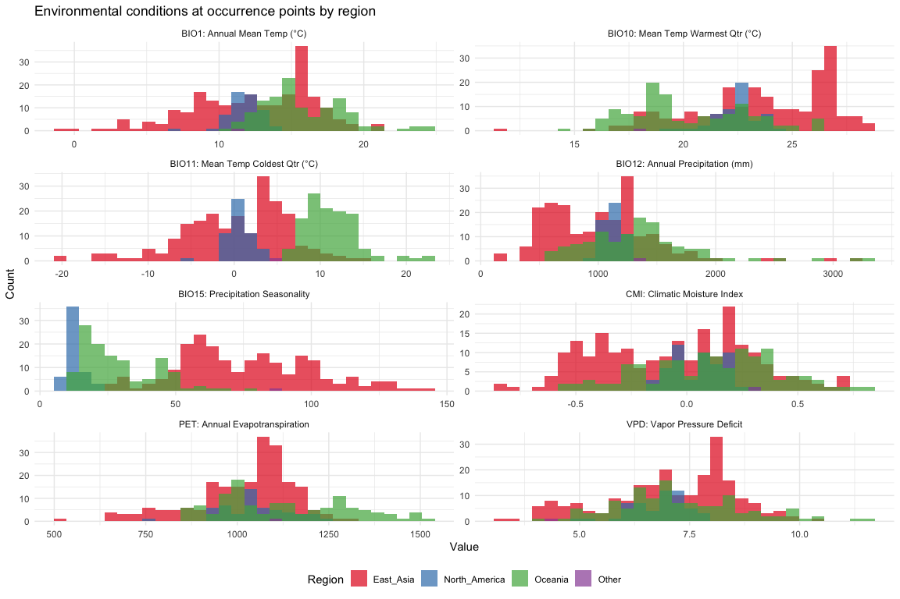

# Step 2: Environmental Data — Expanded Variable Set
Alexander W. Gofton
2026-02-13

## Overview

This script assembles an expanded set of environmental variables for SDM
modeling, going beyond the original 19 WorldClim bioclimatic variables
to include humidity and moisture metrics that are ecologically critical
for *H. longicornis*.

**Data sources:**

1.  **WorldClim 2.1** (existing) — 19 bioclimatic variables at 2.5
    arcmin
2.  **ENVIREM** — Climatic moisture index (CMI), aridity index, and PET,
    computed from WorldClim 2.1 using the `envirem` R package (Title &
    Bemmels 2018)
3.  **CHELSA v2.1** — Mean annual vapor pressure deficit (VPD),
    downloaded at 30 arcsec and aggregated to 2.5 arcmin

**Resolution justification:** 2.5 arcmin (~5 km at the equator) is used
because (a) it matches the spatial precision of occurrence records after
10 km thinning, (b) it is the standard resolution for continental-scale
*H. longicornis* SDMs in the literature (Raghavan et al. 2019, Namgyal
et al. 2020), and (c) finer resolution would introduce microclimatic
noise not captured by occurrence record precision.

``` r
library(tidyverse)
```

    ── Attaching core tidyverse packages ──────────────────────── tidyverse 2.0.0 ──
    ✔ dplyr     1.1.4     ✔ readr     2.1.5
    ✔ forcats   1.0.0     ✔ stringr   1.5.1
    ✔ ggplot2   4.0.0     ✔ tibble    3.3.0
    ✔ lubridate 1.9.4     ✔ tidyr     1.3.1
    ✔ purrr     1.1.0     
    ── Conflicts ────────────────────────────────────────── tidyverse_conflicts() ──
    ✖ dplyr::filter() masks stats::filter()
    ✖ dplyr::lag()    masks stats::lag()
    ℹ Use the conflicted package (<http://conflicted.r-lib.org/>) to force all conflicts to become errors

``` r
library(terra)
```

    Warning: package 'terra' was built under R version 4.4.3

    terra 1.8.93

    Attaching package: 'terra'

    The following object is masked from 'package:tidyr':

        extract

``` r
library(sf)
```

    Linking to GEOS 3.13.0, GDAL 3.8.5, PROJ 9.5.1; sf_use_s2() is TRUE

``` r
library(geodata)
```

``` r
base_dir <- "~/Library/CloudStorage/OneDrive-CSIRO/OneDrive - Docs/01_Projects/Hlongicornis_SDM/"
processed_v1 <- file.path(base_dir, "processed_data")
processed_v2 <- file.path(base_dir, "processed_data_2")
figures_dir <- file.path(base_dir, "figures_2")
temp_dir <- file.path(base_dir, "temp")

# WorldClim data lives here from the v1 pipeline
worldclim_path <- file.path(
  base_dir,
  "data",
  "worldclim",
  "climate",
  "wc2.1_2.5m"
)

terraOptions(memfrac = 0.6, tempdir = temp_dir)
```

## 1. Load existing WorldClim 2.1 bioclimatic variables

These were downloaded in the v1 pipeline at 2.5 arcmin global extent.

``` r
# Build file paths for all 19 bioclim variables
bio_files <- paste0(worldclim_path, "/wc2.1_2.5m_bio_", 1:19, ".tif")

# Check which files exist
existing <- file.exists(bio_files)
if (!all(existing)) {
  warning(sprintf(
    "Missing WorldClim files: %s",
    paste(bio_files[!existing], collapse = ", ")
  ))
}

# Load as a multi-layer SpatRaster
bioclim_all <- rast(bio_files[existing])

# Rename layers to clean short names
names(bioclim_all) <- paste0("bio", 1:sum(existing))

sprintf("Loaded %d WorldClim bioclimatic layers", nlyr(bioclim_all))
```

    [1] "Loaded 19 WorldClim bioclimatic layers"

``` r
sprintf(
  "Resolution: %.4f degrees (~%.1f km)",
  res(bioclim_all)[1],
  res(bioclim_all)[1] * 111
)
```

    [1] "Resolution: 0.0417 degrees (~4.6 km)"

``` r
sprintf(
  "Extent: %.1f to %.1f (lon), %.1f to %.1f (lat)",
  ext(bioclim_all)[1],
  ext(bioclim_all)[2],
  ext(bioclim_all)[3],
  ext(bioclim_all)[4]
)
```

    [1] "Extent: -180.0 to 180.0 (lon), -90.0 to 90.0 (lat)"

### WorldClim unit notes

WorldClim 2.1 bioclimatic variables use the following units. Temperature
variables are stored in degrees Celsius (NOT multiplied by 10, unlike
WorldClim v1.4). Precipitation variables are in millimetres.

``` r
# Quick sanity check — BIO1 (annual mean temp) should be roughly -30 to +30 °C
bio1_range <- global(bioclim_all[["bio1"]], range, na.rm = TRUE)
sprintf("BIO1 range: %.1f to %.1f °C", bio1_range[1, 1], bio1_range[1, 2])
```

    [1] "BIO1 range: -54.8 to 31.2 °C"

## 2. Compute ENVIREM variables from WorldClim 2.1

The ENVIREM dataset (Title & Bemmels 2018) provides ecologically
meaningful variables derived from temperature and precipitation.
Pre-computed ENVIREM rasters are based on WorldClim v1.4, so we compute
them fresh from WorldClim 2.1 using the `envirem` R package for
consistency.

We need monthly temperature min/max and monthly precipitation as inputs.

``` r
# Download monthly climate data if not already present
# These are needed as inputs for ENVIREM variable calculation
tmin_path <- file.path(base_dir, "data", "worldclim", "climate", "wc2.1_2.5m")
tmax_path <- tmin_path
prec_path <- tmin_path

# Check if monthly files already exist (from geodata download)
tmin_file_check <- file.path(tmin_path, "wc2.1_2.5m_tmin_01.tif")

if (!file.exists(tmin_file_check)) {
  message("Downloading monthly WorldClim data for ENVIREM computation...")
  # geodata::worldclim_global downloads to a cache; we load from there
  tmin_rast <- worldclim_global(
    var = "tmin",
    res = 2.5,
    path = file.path(base_dir, "data", "worldclim")
  )
  tmax_rast <- worldclim_global(
    var = "tmax",
    res = 2.5,
    path = file.path(base_dir, "data", "worldclim")
  )
  prec_rast <- worldclim_global(
    var = "prec",
    res = 2.5,
    path = file.path(base_dir, "data", "worldclim")
  )
} else {
  # Load existing monthly files
  tmin_files <- list.files(
    tmin_path,
    pattern = "wc2.1_2.5m_tmin_\\d+\\.tif$",
    full.names = TRUE
  )
  tmax_files <- list.files(
    tmax_path,
    pattern = "wc2.1_2.5m_tmax_\\d+\\.tif$",
    full.names = TRUE
  )
  prec_files <- list.files(
    prec_path,
    pattern = "wc2.1_2.5m_prec_\\d+\\.tif$",
    full.names = TRUE
  )

  tmin_rast <- rast(sort(tmin_files))
  tmax_rast <- rast(sort(tmax_files))
  prec_rast <- rast(sort(prec_files))
}

sprintf("Monthly tmin layers: %d", nlyr(tmin_rast))
```

    [1] "Monthly tmin layers: 12"

``` r
sprintf("Monthly tmax layers: %d", nlyr(tmax_rast))
```

    [1] "Monthly tmax layers: 12"

``` r
sprintf("Monthly prec layers: %d", nlyr(prec_rast))
```

    [1] "Monthly prec layers: 12"

``` r
# Path to where you unzipped the files
envirem_path <- file.path(
  base_dir,
  "data",
  "envirem",
  "global_current_2.5arcmin_geotiff"
)


envirem_file_names <- c(
  "current_2-5arcmin_annualPET.tif",
  "current_2-5arcmin_aridityIndexThornthwaite.tif",
  "current_2-5arcmin_climaticMoistureIndex.tif"
)

envirem_files <- file.path(envirem_path, paste0(envirem_file_names))


# Load into a SpatRaster
envirem_vars <- rast(envirem_files)
```

    Warning: [rast] CRS do not match

``` r
print(envirem_vars)
```

    class       : SpatRaster 
    size        : 3600, 8640, 3  (nrow, ncol, nlyr)
    resolution  : 0.04166667, 0.04166667  (x, y)
    extent      : -180, 180, -60, 90  (xmin, xmax, ymin, ymax)
    coord. ref. : lon/lat WGS 84 
    sources     : current_2-5arcmin_annualPET.tif  
                  current_2-5arcmin_aridityIndexThornthwaite.tif  
                  current_2-5arcmin_climaticMoistureIndex.tif  
    names       : current_2-~_annualPET, current_2-~ornthwaite, current_2-~stureIndex 
    min values  :                 36.28,                     0,                 -1.00 
    max values  :               2352.19,                   100,                  0.98 

``` r
# Rename layers to clean short names
names(envirem_vars) <- c("pet_idx", "aridity_idx", "cmi_idx")

sprintf(
  "Selected ENVIREM variables: %s",
  paste(names(envirem_vars), collapse = ", ")
)
```

    [1] "Selected ENVIREM variables: pet_idx, aridity_idx, cmi_idx"

## 3. Download and process CHELSA vapor pressure deficit

CHELSA v2.1 provides monthly mean vapor pressure deficit (vpd) at 30
arcsec resolution (~1 km). We download annual mean VPD and aggregate to
2.5 arcmin to match our other variables.

``` r
# CHELSA v2.1 VPD is available as monthly files

#!/bin/bash
# wget https://os.unil.cloud.switch.ch/chelsa02/chelsa/global/climatologies/vpd/1981-2010/CHELSA_vpd_01_1981-2010_V.2.1.tif
# wget https://os.unil.cloud.switch.ch/chelsa02/chelsa/global/climatologies/vpd/1981-2010/CHELSA_vpd_02_1981-2010_V.2.1.tif
# wget https://os.unil.cloud.switch.ch/chelsa02/chelsa/global/climatologies/vpd/1981-2010/CHELSA_vpd_03_1981-2010_V.2.1.tif
# wget https://os.unil.cloud.switch.ch/chelsa02/chelsa/global/climatologies/vpd/1981-2010/CHELSA_vpd_04_1981-2010_V.2.1.tif
# wget https://os.unil.cloud.switch.ch/chelsa02/chelsa/global/climatologies/vpd/1981-2010/CHELSA_vpd_05_1981-2010_V.2.1.tif
# wget https://os.unil.cloud.switch.ch/chelsa02/chelsa/global/climatologies/vpd/1981-2010/CHELSA_vpd_06_1981-2010_V.2.1.tif
# wget https://os.unil.cloud.switch.ch/chelsa02/chelsa/global/climatologies/vpd/1981-2010/CHELSA_vpd_07_1981-2010_V.2.1.tif
# wget https://os.unil.cloud.switch.ch/chelsa02/chelsa/global/climatologies/vpd/1981-2010/CHELSA_vpd_08_1981-2010_V.2.1.tif
# wget https://os.unil.cloud.switch.ch/chelsa02/chelsa/global/climatologies/vpd/1981-2010/CHELSA_vpd_09_1981-2010_V.2.1.tif
# wget https://os.unil.cloud.switch.ch/chelsa02/chelsa/global/climatologies/vpd/1981-2010/CHELSA_vpd_10_1981-2010_V.2.1.tif
# wget https://os.unil.cloud.switch.ch/chelsa02/chelsa/global/climatologies/vpd/1981-2010/CHELSA_vpd_11_1981-2010_V.2.1.tif
# wget https://os.unil.cloud.switch.ch/chelsa02/chelsa/global/climatologies/vpd/1981-2010/CHELSA_vpd_12_1981-2010_V.2.1.tif
```

``` r
# CHELSA v2.1 VPD is available as monthly files
# We download all 12 months and compute the annual mean

# Create file paths and URLs
vpd_files <- c(
  "/Users/gof005/Library/CloudStorage/OneDrive-CSIRO/OneDrive - Docs/01_Projects/Hlongicornis_SDM/data/chelsa_climatologies/CHELSA_vpd_01_1981-2010_V.2.1.tif",
  "/Users/gof005/Library/CloudStorage/OneDrive-CSIRO/OneDrive - Docs/01_Projects/Hlongicornis_SDM/data/chelsa_climatologies/CHELSA_vpd_02_1981-2010_V.2.1.tif",
  "/Users/gof005/Library/CloudStorage/OneDrive-CSIRO/OneDrive - Docs/01_Projects/Hlongicornis_SDM/data/chelsa_climatologies/CHELSA_vpd_03_1981-2010_V.2.1.tif",
  "/Users/gof005/Library/CloudStorage/OneDrive-CSIRO/OneDrive - Docs/01_Projects/Hlongicornis_SDM/data/chelsa_climatologies/CHELSA_vpd_04_1981-2010_V.2.1.tif",
  "/Users/gof005/Library/CloudStorage/OneDrive-CSIRO/OneDrive - Docs/01_Projects/Hlongicornis_SDM/data/chelsa_climatologies/CHELSA_vpd_05_1981-2010_V.2.1.tif",
  "/Users/gof005/Library/CloudStorage/OneDrive-CSIRO/OneDrive - Docs/01_Projects/Hlongicornis_SDM/data/chelsa_climatologies/CHELSA_vpd_06_1981-2010_V.2.1.tif",
  "/Users/gof005/Library/CloudStorage/OneDrive-CSIRO/OneDrive - Docs/01_Projects/Hlongicornis_SDM/data/chelsa_climatologies/CHELSA_vpd_07_1981-2010_V.2.1.tif",
  "/Users/gof005/Library/CloudStorage/OneDrive-CSIRO/OneDrive - Docs/01_Projects/Hlongicornis_SDM/data/chelsa_climatologies/CHELSA_vpd_08_1981-2010_V.2.1.tif",
  "/Users/gof005/Library/CloudStorage/OneDrive-CSIRO/OneDrive - Docs/01_Projects/Hlongicornis_SDM/data/chelsa_climatologies/CHELSA_vpd_09_1981-2010_V.2.1.tif",
  "/Users/gof005/Library/CloudStorage/OneDrive-CSIRO/OneDrive - Docs/01_Projects/Hlongicornis_SDM/data/chelsa_climatologies/CHELSA_vpd_10_1981-2010_V.2.1.tif",
  "/Users/gof005/Library/CloudStorage/OneDrive-CSIRO/OneDrive - Docs/01_Projects/Hlongicornis_SDM/data/chelsa_climatologies/CHELSA_vpd_11_1981-2010_V.2.1.tif",
  "/Users/gof005/Library/CloudStorage/OneDrive-CSIRO/OneDrive - Docs/01_Projects/Hlongicornis_SDM/data/chelsa_climatologies/CHELSA_vpd_12_1981-2010_V.2.1.tif"
)

# Load the downloaded rasters
vpd_stack <- terra::rast(vpd_files)
```

``` r
# CHELSA VPD is stored as Pa (Pascals) — convert to kPa for interpretability
# Scale factor: values are in Pa * 100 (i.e., stored as integer, divide by 100 for Pa)
# Then divide by 1000 for kPa
# Check CHELSA documentation for exact scaling — adjust if needed
vpd_monthly_stack <- vpd_stack / 100 # Pa to hPa
```


    |---------|---------|---------|---------|
    =========================================
                                              

``` r
# Compute annual mean VPD
vpd_annual <- mean(vpd_monthly_stack)
```


    |---------|---------|---------|---------|
    =========================================
                                              

``` r
names(vpd_annual) <- "vpd_annual"

# Aggregate from 30 arcsec to 2.5 arcmin (factor of 5)
# 2.5 arcmin / 30 arcsec = 5
vpd_2.5arcmin <- aggregate(vpd_annual, fact = 5, fun = "mean", na.rm = TRUE)
```


    |---------|---------|---------|---------|
    =========================================
                                              

``` r
# Resample to match the exact grid of our WorldClim data
vpd_resampled <- resample(
  vpd_2.5arcmin,
  bioclim_all[[1]],
  method = "bilinear"
)
```


    |---------|---------|---------|---------|
    =========================================
                                              

``` r
names(vpd_resampled) <- "vpd_annual"

sprintf("CHELSA VPD aggregated: %.4f° resolution", res(vpd_resampled)[1])
```

    [1] "CHELSA VPD aggregated: 0.0417° resolution"

``` r
sprintf(
  "VPD range (annual mean): %.2f to %.2f",
  global(vpd_resampled, min, na.rm = TRUE)[[1]],
  global(vpd_resampled, max, na.rm = TRUE)[[1]]
)
```

    [1] "VPD range (annual mean): 0.00 to 31.26"

## 4. Resample ENVIREM to match WorldClim grid

ENVIREM was computed from the same WorldClim inputs so should already be
on the same grid, but we resample to be safe.

``` r
envirem_resampled <- resample(
  envirem_vars,
  bioclim_all[[1]],
  method = "bilinear"
)
```


    |---------|---------|---------|---------|
    =========================================
                                              

``` r
# Verify alignment
sprintf("WorldClim resolution: %.6f", res(bioclim_all)[1])
```

    [1] "WorldClim resolution: 0.041667"

``` r
sprintf("ENVIREM resolution:   %.6f", res(envirem_resampled)[1])
```

    [1] "ENVIREM resolution:   0.041667"

``` r
sprintf(
  "Grids aligned: %s",
  compareGeom(bioclim_all, envirem_resampled, stopOnError = FALSE)
)
```

    [1] "Grids aligned: FALSE"

## 5. Stack all environmental layers

Combine WorldClim bioclimatic variables, ENVIREM, and CHELSA VPD into a
single multi-layer raster.

``` r
# Build the combined raster stack
if (!is.null(vpd_resampled)) {
  env_all <- c(bioclim_all, envirem_resampled, vpd_resampled)
} else {
  env_all <- c(bioclim_all, envirem_resampled)
}
```

    Warning: [rast] CRS do not match

``` r
sprintf("Combined environmental stack: %d layers", nlyr(env_all))
```

    [1] "Combined environmental stack: 23 layers"

``` r
names(env_all)
```

     [1] "bio1"        "bio2"        "bio3"        "bio4"        "bio5"       
     [6] "bio6"        "bio7"        "bio8"        "bio9"        "bio10"      
    [11] "bio11"       "bio12"       "bio13"       "bio14"       "bio15"      
    [16] "bio16"       "bio17"       "bio18"       "bio19"       "pet_idx"    
    [21] "aridity_idx" "cmi_idx"     "vpd_annual" 

## 6. Extract climate values at occurrence points

``` r
# Load the stratified occurrence data from Step 1
occ <- read_csv(
  file.path(processed_v2, "occurrences_stratified.csv"),
  show_col_types = FALSE
)

# Extract climate values at each occurrence point
occ_coords <- occ %>% select(lon, lat) %>% as.data.frame()
climate_at_occ <- extract(env_all, occ_coords)

# Combine with occurrence data
occ_with_climate <- bind_cols(occ, climate_at_occ %>% select(-ID))

# Check for NAs (points falling in ocean or outside raster extent)
n_complete <- sum(complete.cases(
  occ_with_climate %>% select(starts_with("bio"), cmi_idx, aridity_idx, pet_idx)
))
sprintf(
  "Records with complete climate data: %d / %d",
  n_complete,
  nrow(occ_with_climate)
)
```

    [1] "Records with complete climate data: 389 / 390"

``` r
# Remove records with incomplete climate data
occ_with_climate <- occ_with_climate %>%
  filter(complete.cases(across(c(
    starts_with("bio"),
    cmi_idx,
    aridity_idx,
    pet_idx
  ))))

sprintf("After removing incomplete records: %d", nrow(occ_with_climate))
```

    [1] "After removing incomplete records: 389"

## 7. Quick sanity checks

Verify that climate values at occurrence points fall within biologically
plausible ranges for *H. longicornis*.

``` r
# Key biological thresholds from the literature:
# - Annual mean temp (BIO1): ~4-20°C at known locations (Heath 2016)
# - Annual precip (BIO12): typically >600mm, often >1000mm
# - Cold tolerance limit: BIO6 (min temp coldest month) > -15°C

checks <- occ_with_climate %>%
  summarise(
    bio1_min = round(min(bio1, na.rm = TRUE), 1),
    bio1_max = round(max(bio1, na.rm = TRUE), 1),
    bio1_mean = round(mean(bio1, na.rm = TRUE), 1),
    bio12_min = round(min(bio12, na.rm = TRUE), 0),
    bio12_max = round(max(bio12, na.rm = TRUE), 0),
    bio12_mean = round(mean(bio12, na.rm = TRUE), 0),
    bio6_min = round(min(bio6, na.rm = TRUE), 1),
    pct_below_1000mm = round(100 * mean(bio12 < 1000, na.rm = TRUE), 1),
    cmi_range = sprintf(
      "%.2f to %.2f",
      min(cmi_idx, na.rm = TRUE),
      max(cmi_idx, na.rm = TRUE)
    ),
    vpd_range = if ("vpd_annual" %in% names(occ_with_climate)) {
      sprintf(
        "%.1f to %.1f",
        min(vpd_annual, na.rm = TRUE),
        max(vpd_annual, na.rm = TRUE)
      )
    } else {
      "N/A"
    }
  )

# Print as a transposed table for readability
checks_t <- checks %>%
  mutate(across(everything(), as.character)) %>%
  pivot_longer(everything(), names_to = "Metric", values_to = "Value")

checks_t
```

    # A tibble: 10 × 2
       Metric           Value        
       <chr>            <chr>        
     1 bio1_min         -1           
     2 bio1_max         24.5         
     3 bio1_mean        13.4         
     4 bio12_min        167          
     5 bio12_max        3304         
     6 bio12_mean       1130         
     7 bio6_min         -31.1        
     8 pct_below_1000mm 35.7         
     9 cmi_range        -0.84 to 0.82
    10 vpd_range        3.2 to 11.6  

## 8. Save outputs

``` r
# Save the full environmental raster stack (global extent)
writeRaster(
  env_all,
  file.path(processed_v2, "env_all_global.tif"),
  overwrite = TRUE
)
```


    |---------|---------|---------|---------|
    =========================================
                                              

``` r
# Save the Australia/NZ subset for faster loading in later steps
aus_nz_ext <- ext(110, 180, -48, -8)
env_aus_nz <- crop(env_all, aus_nz_ext)
writeRaster(
  env_aus_nz,
  file.path(processed_v2, "env_all_aus_nz.tif"),
  overwrite = TRUE
)

# Save occurrence data with climate values
write_csv(
  occ_with_climate,
  file.path(processed_v2, "occurrences_with_climate.csv")
)

# Save as RDS for faster loading in R
saveRDS(env_all, file.path(processed_v2, "env_all_global.rds"))
saveRDS(
  occ_with_climate,
  file.path(processed_v2, "occurrences_with_climate.rds")
)

sprintf(
  "Saved: %d-layer global stack, Aus/NZ crop, and %d occurrence records with climate",
  nlyr(env_all),
  nrow(occ_with_climate)
)
```

    [1] "Saved: 23-layer global stack, Aus/NZ crop, and 389 occurrence records with climate"

## 9. Variable overview figure

``` r
#|
# Select a subset of key variables to plot
plot_vars <- c("bio1", "bio10", "bio11", "bio12", "bio15", "cmi_idx", "pet_idx")
if ("vpd_annual" %in% names(occ_with_climate)) {
  plot_vars <- c(plot_vars, "vpd_annual")
}

# Nice labels
var_labels <- c(
  bio1 = "BIO1: Annual Mean Temp (°C)",
  bio10 = "BIO10: Mean Temp Warmest Qtr (°C)",
  bio11 = "BIO11: Mean Temp Coldest Qtr (°C)",
  bio12 = "BIO12: Annual Precipitation (mm)",
  bio15 = "BIO15: Precipitation Seasonality",
  cmi_idx = "CMI: Climatic Moisture Index",
  pet_idx = "PET: Annual Evapotranspiration",
  vpd_annual = "VPD: Vapor Pressure Deficit"
)

occ_with_climate %>%
  select(region, all_of(plot_vars)) %>%
  pivot_longer(-region, names_to = "variable", values_to = "value") %>%
  mutate(
    variable = factor(
      variable,
      levels = plot_vars,
      labels = var_labels[plot_vars]
    )
  ) %>%
  ggplot(aes(x = value, fill = region)) +
  geom_histogram(bins = 30, alpha = 0.7, position = "identity") +
  facet_wrap(~variable, scales = "free", ncol = 2) +
  scale_fill_brewer(palette = "Set1", name = "Region") +
  labs(
    title = "Environmental conditions at occurrence points by region",
    x = "Value",
    y = "Count"
  ) +
  theme_minimal(base_size = 11) +
  theme(legend.position = "bottom")

ggsave(
  file.path(figures_dir, "02_variable_distributions_by_region.png"),
  width = 12,
  height = 8,
  dpi = 300
)
```

<div id="fig-variable-overview">



Figure 1: Distribution of key environmental variables at H. longicornis
occurrence points.

</div>

## Summary

``` r
tibble(
  Source = c("WorldClim 2.1", "ENVIREM (computed)", "CHELSA v2.1", "TOTAL"),
  Variables = c(
    paste0("bio1-bio19 (", 19, ")"),
    "cmi_idx, aridity_idx, pet_idx (3)",
    ifelse(!is.null(vpd_resampled), "vpd_annual (1)", "none (download failed)"),
    as.character(nlyr(env_all))
  ),
  Resolution = c(
    "2.5 arcmin",
    "2.5 arcmin",
    "2.5 arcmin (aggregated from 30 arcsec)",
    "2.5 arcmin"
  ),
  Note = c(
    "Existing from v1 pipeline",
    "Freshly computed from WC 2.1 monthly data via envirem R package",
    "Downloaded climatologies 1981-2010",
    ""
  )
)
```

    # A tibble: 4 × 4
      Source             Variables                         Resolution          Note 
      <chr>              <chr>                             <chr>               <chr>
    1 WorldClim 2.1      bio1-bio19 (19)                   2.5 arcmin          "Exi…
    2 ENVIREM (computed) cmi_idx, aridity_idx, pet_idx (3) 2.5 arcmin          "Fre…
    3 CHELSA v2.1        vpd_annual (1)                    2.5 arcmin (aggreg… "Dow…
    4 TOTAL              23                                2.5 arcmin          ""   

## Session Information

``` r
sessionInfo()
```

    R version 4.4.1 (2024-06-14)
    Platform: aarch64-apple-darwin20
    Running under: macOS 26.2

    Matrix products: default
    BLAS:   /Library/Frameworks/R.framework/Versions/4.4-arm64/Resources/lib/libRblas.0.dylib 
    LAPACK: /Library/Frameworks/R.framework/Versions/4.4-arm64/Resources/lib/libRlapack.dylib;  LAPACK version 3.12.0

    locale:
    [1] en_US.UTF-8/en_US.UTF-8/en_US.UTF-8/C/en_US.UTF-8/en_US.UTF-8

    time zone: Australia/Brisbane
    tzcode source: internal

    attached base packages:
    [1] stats     graphics  grDevices utils     datasets  methods   base     

    other attached packages:
     [1] geodata_0.6-2   sf_1.0-21       terra_1.8-93    lubridate_1.9.4
     [5] forcats_1.0.0   stringr_1.5.1   dplyr_1.1.4     purrr_1.1.0    
     [9] readr_2.1.5     tidyr_1.3.1     tibble_3.3.0    ggplot2_4.0.0  
    [13] tidyverse_2.0.0

    loaded via a namespace (and not attached):
     [1] utf8_1.2.6         generics_0.1.4     class_7.3-23       KernSmooth_2.23-26
     [5] stringi_1.8.7      hms_1.1.3          digest_0.6.37      magrittr_2.0.3    
     [9] evaluate_1.0.5     grid_4.4.1         timechange_0.3.0   RColorBrewer_1.1-3
    [13] fastmap_1.2.0      jsonlite_2.0.0     e1071_1.7-16       DBI_1.2.3         
    [17] scales_1.4.0       textshaping_1.0.3  codetools_0.2-20   cli_3.6.5         
    [21] crayon_1.5.3       rlang_1.1.6        units_0.8-7        bit64_4.6.0-1     
    [25] withr_3.0.2        yaml_2.3.10        parallel_4.4.1     tools_4.4.1       
    [29] tzdb_0.5.0         vctrs_0.6.5        R6_2.6.1           proxy_0.4-27      
    [33] lifecycle_1.0.4    classInt_0.4-11    bit_4.6.0          vroom_1.6.5       
    [37] ragg_1.5.0         archive_1.1.12.1   pkgconfig_2.0.3    pillar_1.11.0     
    [41] gtable_0.3.6       glue_1.8.0         Rcpp_1.1.0         systemfonts_1.2.3 
    [45] xfun_0.53          tidyselect_1.2.1   knitr_1.50         farver_2.1.2      
    [49] htmltools_0.5.8.1  labeling_0.4.3     rmarkdown_2.29     compiler_4.4.1    
    [53] S7_0.2.0          
