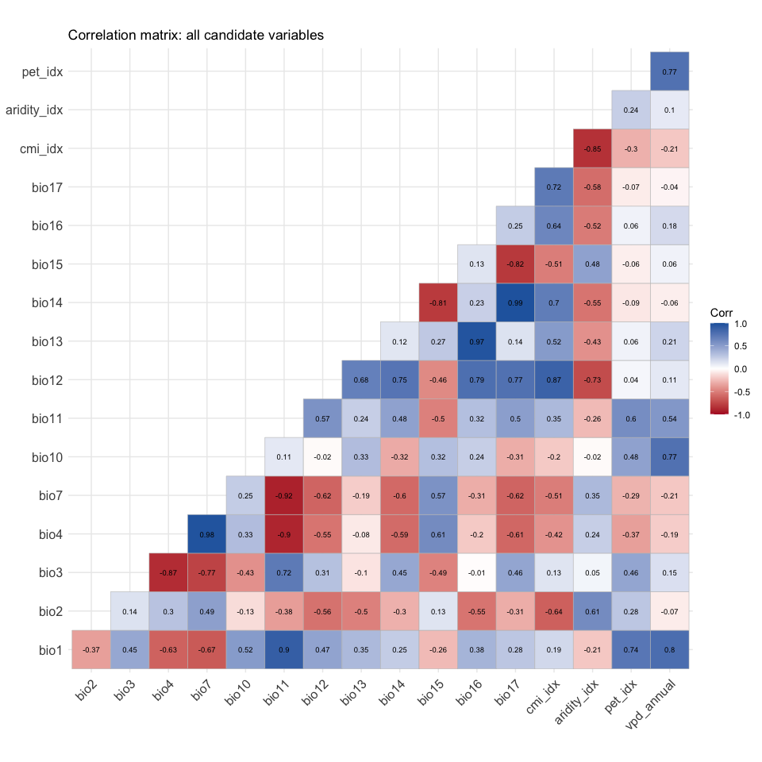
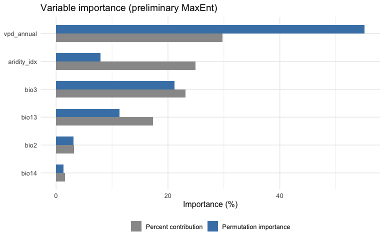
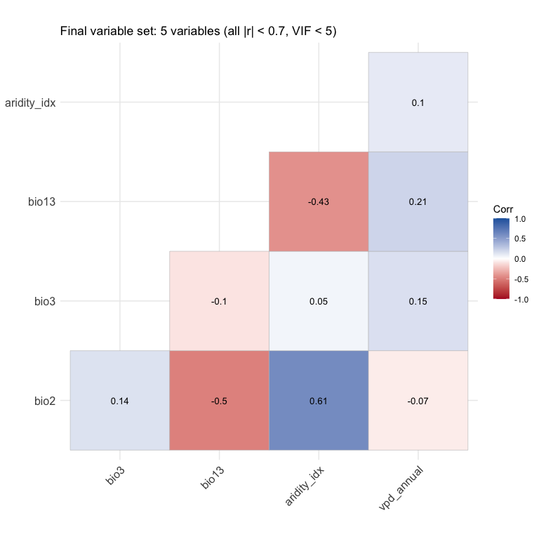
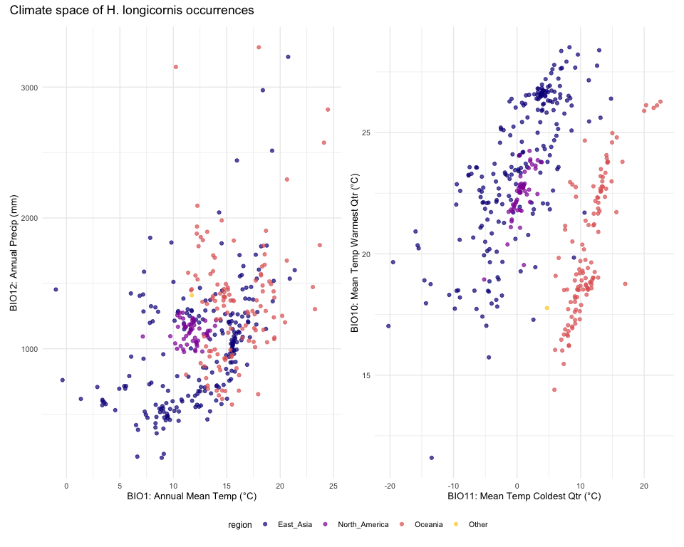

# Step 3: Data-Driven Variable Selection
Alexander W. Gofton
2026-02-13

- [Overview](#overview)
- [1. Load data from Steps 1–2](#1-load-data-from-steps-12)
- [2. Exclude problematic variables and apply
  swaps](#2-exclude-problematic-variables-and-apply-swaps)
- [3. Correlation analysis](#3-correlation-analysis)
  - [Identify highly correlated pairs (\|r\| \>
    0.7)](#identify-highly-correlated-pairs-r--07)
- [4. Initial VIF analysis](#4-initial-vif-analysis)
- [5. Correlation-based refinement](#5-correlation-based-refinement)
- [6. Preliminary MaxEnt for variable
  importance](#6-preliminary-maxent-for-variable-importance)
- [7. Drop low-importance variables](#7-drop-low-importance-variables)
- [8. Final VIF and correlation
  verification](#8-final-vif-and-correlation-verification)
- [9. Document the temperature range](#9-document-the-temperature-range)
- [10. Climate space visualisation](#10-climate-space-visualisation)
- [11. Prepare final raster stack and
  save](#11-prepare-final-raster-stack-and-save)
- [Summary](#summary)
- [Session Information](#session-information)

## Overview

This script performs systematic, data-driven variable selection for the
revised SDM. Key changes from v1:

- **Variable swaps:** BIO6 → BIO11 (Mean Temp Coldest Quarter), BIO5 →
  BIO10 (Mean Temp Warmest Quarter)
- **Expanded candidate pool:** includes ENVIREM (CMI, aridity, PET) and
  CHELSA (VPD) alongside WorldClim bioclimatic variables
- **Data-driven process:** correlation analysis → VIF filtering →
  preliminary MaxEnt jackknife → ecological interpretation → final VIF
  check
- **Stricter thresholds:** \|r\| \> 0.7 for correlation (was 0.8), VIF
  \< 5 for final set

Target: 5–8 uncorrelated, biologically relevant variables.

``` r
# Set Java memory for MaxEnt before loading rJava
options(java.parameters = "-Xmx8g")

library(tidyverse)
library(terra)
library(corrplot)
library(usdm)       # VIF analysis
library(predicts)    # MaxEnt via predicts package
library(rJava)
library(ggcorrplot)
```

``` r
base_dir <- "~/Library/CloudStorage/OneDrive-CSIRO/OneDrive - Docs/01_Projects/Hlongicornis_SDM/"
processed_v2 <- file.path(base_dir, "processed_data_2")
figures_dir  <- file.path(base_dir, "figures_2")
outputs_dir  <- file.path(base_dir, "outputs_2")
```

## 1. Load data from Steps 1–2

``` r
# Occurrence data with all climate values (from Step 2)
occ <- read_csv(file.path(processed_v2, "occurrences_with_climate.csv"),
                show_col_types = FALSE)

# Full environmental raster stack (from Step 2)
env_all <- readRDS(file.path(processed_v2, "env_all_global.rds"))

sprintf("Occurrence records: %d", nrow(occ))
```

    [1] "Occurrence records: 389"

``` r
sprintf("Environmental layers: %d (%s)", nlyr(env_all), paste(names(env_all), collapse = ", "))
```

    [1] "Environmental layers: 23 (bio1, bio2, bio3, bio4, bio5, bio6, bio7, bio8, bio9, bio10, bio11, bio12, bio13, bio14, bio15, bio16, bio17, bio18, bio19, pet_idx, aridity_idx, cmi_idx, vpd_annual)"

``` r
sprintf("Regions: %s", paste(unique(occ$region), collapse = ", "))
```

    [1] "Regions: East_Asia, North_America, Oceania, Other"

## 2. Exclude problematic variables and apply swaps

Remove BIO8, BIO9, BIO18, BIO19 (known WorldClim spatial artifacts), and
drop BIO5 and BIO6 in favour of BIO10 and BIO11.

``` r
# Variables to exclude entirely
drop_vars <- c("bio8", "bio9", "bio18", "bio19",  # spatial artifacts
               "bio5",                              # replaced by bio10
               "bio6")                              # replaced by bio11

# Define the candidate pool with ecological rationale
candidate_info <- tribble(
  ~variable,     ~source,    ~ecological_role,
  "bio1",        "WorldClim", "Annual mean temperature — overall thermal regime",
  "bio2",        "WorldClim", "Mean diurnal range — daily temp variability",
  "bio3",        "WorldClim", "Isothermality — ratio of diurnal to annual range",
  "bio4",        "WorldClim", "Temperature seasonality — thermal variability",
  "bio7",        "WorldClim", "Temperature annual range — thermal extremes",
  "bio10",       "WorldClim", "Mean temp warmest quarter — summer activity window",
  "bio11",       "WorldClim", "Mean temp coldest quarter — cold tolerance limit",
  "bio12",       "WorldClim", "Annual precipitation — total moisture input",
  "bio13",       "WorldClim", "Precipitation of wettest month — peak moisture",
  "bio14",       "WorldClim", "Precipitation of driest month — drought stress",
  "bio15",       "WorldClim", "Precipitation seasonality — temporal moisture pattern",
  "bio16",       "WorldClim", "Precipitation of wettest quarter — wet season total",
  "bio17",       "WorldClim", "Precipitation of driest quarter — dry season total",
  "cmi_idx",      "ENVIREM",   "Climatic moisture index — P/PET balance",
  "aridity_idx",  "ENVIREM",   "Thornthwaite aridity index — desiccation risk",
  "pet_idx",      "ENVIREM",   "Annual PET — evaporative demand"
)

# Add VPD if it was successfully downloaded
if ("vpd_annual" %in% names(occ)) {
  candidate_info <- candidate_info %>%
    add_row(variable = "vpd_annual", source = "CHELSA",
            ecological_role = "Vapor pressure deficit — atmospheric drying power")
}

candidate_vars <- candidate_info$variable

# Verify all candidates exist in the data
available <- candidate_vars[candidate_vars %in% names(occ)]
missing   <- candidate_vars[!candidate_vars %in% names(occ)]

if (length(missing) > 0) {
  warning(sprintf("Missing from data: %s", paste(missing, collapse = ", ")))
  candidate_vars <- available
}

candidate_info <- candidate_info %>% filter(variable %in% candidate_vars)
candidate_info
```

    # A tibble: 17 × 3
       variable    source    ecological_role                                      
       <chr>       <chr>     <chr>                                                
     1 bio1        WorldClim Annual mean temperature — overall thermal regime     
     2 bio2        WorldClim Mean diurnal range — daily temp variability          
     3 bio3        WorldClim Isothermality — ratio of diurnal to annual range     
     4 bio4        WorldClim Temperature seasonality — thermal variability        
     5 bio7        WorldClim Temperature annual range — thermal extremes          
     6 bio10       WorldClim Mean temp warmest quarter — summer activity window   
     7 bio11       WorldClim Mean temp coldest quarter — cold tolerance limit     
     8 bio12       WorldClim Annual precipitation — total moisture input          
     9 bio13       WorldClim Precipitation of wettest month — peak moisture       
    10 bio14       WorldClim Precipitation of driest month — drought stress       
    11 bio15       WorldClim Precipitation seasonality — temporal moisture pattern
    12 bio16       WorldClim Precipitation of wettest quarter — wet season total  
    13 bio17       WorldClim Precipitation of driest quarter — dry season total   
    14 cmi_idx     ENVIREM   Climatic moisture index — P/PET balance              
    15 aridity_idx ENVIREM   Thornthwaite aridity index — desiccation risk        
    16 pet_idx     ENVIREM   Annual PET — evaporative demand                      
    17 vpd_annual  CHELSA    Vapor pressure deficit — atmospheric drying power    

## 3. Correlation analysis

``` r
# Extract climate values at occurrence points for candidate variables
climate_matrix <- occ %>%
  select(all_of(candidate_vars)) %>%
  drop_na()

# Pearson correlation
cor_matrix <- cor(climate_matrix, use = "pairwise.complete.obs")
```

``` r
ggcorrplot(
  cor_matrix,
  type = "lower",
  lab = TRUE,
  lab_size = 2.5,
  colors = c("#B2182B", "white", "#2166AC"),
  title = "Correlation matrix: all candidate variables"
)

ggsave(file.path(figures_dir, "03_correlation_full_candidates.png"),
       width = 10, height = 10, dpi = 300)
```

<div id="fig-correlation-full">



Figure 1: Pairwise Pearson correlation among all candidate environmental
variables.

</div>

### Identify highly correlated pairs (\|r\| \> 0.7)

``` r
# Extract pairs with |r| > 0.7
cor_pairs <- as.data.frame(as.table(cor_matrix)) %>%
  rename(var1 = Var1, var2 = Var2, correlation = Freq) %>%
  filter(var1 != var2) %>%
  mutate(abs_cor = abs(correlation)) %>%
  filter(abs_cor > 0.7) %>%
  # Remove duplicate pairs (keep one direction)
  rowwise() %>%
  mutate(pair = paste(sort(c(as.character(var1), as.character(var2))), collapse = " - ")) %>%
  ungroup() %>%
  distinct(pair, .keep_all = TRUE) %>%
  arrange(desc(abs_cor)) %>%
  select(pair, correlation, abs_cor)

sprintf("Number of variable pairs with |r| > 0.7: %d", nrow(cor_pairs))
```

    [1] "Number of variable pairs with |r| > 0.7: 22"

``` r
cor_pairs
```

    # A tibble: 22 × 3
       pair                  correlation abs_cor
       <chr>                       <dbl>   <dbl>
     1 bio14 - bio17               0.993   0.993
     2 bio4 - bio7                 0.976   0.976
     3 bio13 - bio16               0.970   0.970
     4 bio11 - bio7               -0.916   0.916
     5 bio11 - bio4               -0.905   0.905
     6 bio1 - bio11                0.902   0.902
     7 bio3 - bio4                -0.874   0.874
     8 bio12 - cmi_idx             0.872   0.872
     9 aridity_idx - cmi_idx      -0.851   0.851
    10 bio15 - bio17              -0.819   0.819
    # ℹ 12 more rows

## 4. Initial VIF analysis

Variance Inflation Factor identifies multicollinearity issues. VIF \> 10
indicates severe problems; we use a stepwise procedure to iteratively
drop the highest-VIF variable.

``` r
# Run VIF on all candidate variables
# usdm::vifstep drops variables iteratively until all VIF < threshold
vif_initial <- vif(as.data.frame(climate_matrix))
vif_initial_df <- as.data.frame(vif_initial) %>% arrange(desc(VIF))
vif_initial_df
```

         Variables         VIF
    1         bio4 6342.492738
    2        bio11 5816.537624
    3        bio10 1473.062422
    4         bio1  781.275559
    5         bio7  751.991799
    6        bio17  132.142381
    7        bio14   89.392962
    8        bio16   84.626906
    9        bio12   66.913863
    10        bio2   57.284306
    11       bio13   39.328386
    12        bio3   25.889673
    13     cmi_idx   18.698105
    14       bio15   16.395466
    15     pet_idx   15.539292
    16  vpd_annual   10.681291
    17 aridity_idx    6.007142

``` r
# Stepwise VIF reduction with threshold = 10
vif_reduced <- vifstep(as.data.frame(climate_matrix), th = 10)

# Variables retained after VIF reduction
vars_after_vif <- vif_reduced@results$Variables
sprintf("Variables retained after VIF < 10: %d", length(vars_after_vif))
```

    [1] "Variables retained after VIF < 10: 7"

``` r
vars_after_vif
```

    [1] "bio2"        "bio3"        "bio13"       "bio14"       "aridity_idx"
    [6] "pet_idx"     "vpd_annual" 

``` r
# Variables removed by vifstep
vars_excluded_vif <- setdiff(candidate_vars, vars_after_vif)
sprintf("Variables removed by VIF: %s", paste(vars_excluded_vif, collapse = ", "))
```

    [1] "Variables removed by VIF: bio1, bio4, bio7, bio10, bio11, bio12, bio15, bio16, bio17, cmi_idx"

## 5. Correlation-based refinement

After VIF filtering, check remaining pairwise correlations. If any pair
still exceeds \|r\| \> 0.7, drop the less ecologically interpretable
one.

``` r
climate_reduced <- climate_matrix %>% select(all_of(vars_after_vif))
cor_reduced <- cor(climate_reduced, use = "pairwise.complete.obs")

# Check for remaining high correlations
high_cor_remaining <- as.data.frame(as.table(cor_reduced)) %>%
  rename(var1 = Var1, var2 = Var2, correlation = Freq) %>%
  filter(var1 != var2, abs(correlation) > 0.7) %>%
  rowwise() %>%
  mutate(pair = paste(sort(c(as.character(var1), as.character(var2))), collapse = " - ")) %>%
  ungroup() %>%
  distinct(pair, .keep_all = TRUE) %>%
  arrange(desc(abs(correlation)))

if (nrow(high_cor_remaining) > 0) {
  sprintf("WARNING: %d pairs still have |r| > 0.7 after VIF filtering:", nrow(high_cor_remaining))
  print(high_cor_remaining)

  # Ecological priority rules for resolving remaining correlations:
  # - Prefer broader-scale variables (quarterly > monthly)
  # - Prefer moisture-balance vars (CMI) over raw precipitation components
  # - Prefer temperature means over ranges
  # - Keep at least one variable from each ecological axis:
  #   (1) thermal regime, (2) cold tolerance, (3) heat/activity,
  #   (4) moisture amount, (5) moisture balance/desiccation

  # Build removal list based on ecological priority
  # This section handles common problematic pairs programmatically
  to_remove <- character(0)

  for (i in seq_len(nrow(high_cor_remaining))) {
    v1 <- as.character(high_cor_remaining$var1[i])
    v2 <- as.character(high_cor_remaining$var2[i])

    # Skip if one is already flagged for removal
    if (v1 %in% to_remove | v2 %in% to_remove) next

    # Priority rules: remove the less informative variable
    # Precipitation subsets are less useful than annual totals or CMI
    precip_subset <- c("bio13", "bio14", "bio16", "bio17")
    if (v1 %in% precip_subset & !(v2 %in% precip_subset)) {
      to_remove <- c(to_remove, v1)
    } else if (v2 %in% precip_subset & !(v1 %in% precip_subset)) {
      to_remove <- c(to_remove, v2)
    }
    # Range variables are less informative than direct measurements
    else if (v1 %in% c("bio2", "bio4", "bio7") & !(v2 %in% c("bio2", "bio4", "bio7"))) {
      to_remove <- c(to_remove, v1)
    } else if (v2 %in% c("bio2", "bio4", "bio7") & !(v1 %in% c("bio2", "bio4", "bio7"))) {
      to_remove <- c(to_remove, v2)
    }
    # If PET is correlated with aridity or CMI, keep the moisture balance variable
    else if ("pet_idx" %in% c(v1, v2) & any(c("cmi_idx", "aridity_idx") %in% c(v1, v2))) {
      to_remove <- c(to_remove, "pet_idx")
    }
    # Default: remove the one with higher mean VIF across all pairs
    else {
      vif_v1 <- vif_initial_df$VIF[vif_initial_df$Variables == v1]
      vif_v2 <- vif_initial_df$VIF[vif_initial_df$Variables == v2]
      if (length(vif_v1) > 0 & length(vif_v2) > 0) {
        to_remove <- c(to_remove, ifelse(vif_v1 > vif_v2, v1, v2))
      }
    }
  }

  to_remove <- unique(to_remove)
  if (length(to_remove) > 0) {
    sprintf("Removing based on ecological priority: %s", paste(to_remove, collapse = ", "))
    vars_after_cor <- setdiff(vars_after_vif, to_remove)
  } else {
    vars_after_cor <- vars_after_vif
  }

} else {
  message("All remaining pairs have |r| <= 0.7 — no further correlation-based removal needed.")
  vars_after_cor <- vars_after_vif
}
```

    # A tibble: 1 × 4
      var1       var2    correlation pair                
      <fct>      <fct>         <dbl> <chr>               
    1 vpd_annual pet_idx       0.770 pet_idx - vpd_annual

``` r
sprintf("Variables after correlation refinement: %d", length(vars_after_cor))
```

    [1] "Variables after correlation refinement: 6"

``` r
vars_after_cor
```

    [1] "bio2"        "bio3"        "bio13"       "bio14"       "aridity_idx"
    [6] "vpd_annual" 

## 6. Preliminary MaxEnt for variable importance

Run a quick MaxEnt model with the remaining variables to assess
permutation importance and jackknife contributions. Variables
contributing \< 2% will be flagged for potential removal (unless
ecologically critical).

``` r
# Prepare data for MaxEnt
# We need: presence coordinates + background coordinates + climate rasters

# Subset the environmental stack to remaining variables
env_subset <- env_all[[vars_after_cor]]

# Presence coordinates
presence_coords <- occ %>%
  filter(!is.na(lon), !is.na(lat)) %>%
  select(lon, lat) %>%
  as.data.frame()

# Generate temporary background points (10,000 random from global raster)
# NOTE: This is a preliminary model for variable selection only.
# The proper accessible-area background will be defined in Step 4.
set.seed(123)
bg_sample <- spatSample(env_subset, size = 10000, method = "random",
                        na.rm = TRUE, xy = TRUE, values = FALSE)
bg_coords <- as.data.frame(bg_sample) %>%
  rename(lon = x, lat = y)

# Fit a preliminary MaxEnt model with default settings
maxent_prelim <- MaxEnt(
  x = env_subset,
  p = as.matrix(presence_coords),
  a = as.matrix(bg_coords),
  args = c(
    "responsecurves=true",
    "jackknife=true",
    "outputformat=cloglog"
  )
)

sprintf("Preliminary MaxEnt fitted with %d variables", length(vars_after_cor))
```

    [1] "Preliminary MaxEnt fitted with 6 variables"

``` r
# Extract variable importance from the MaxEnt model
# MaxEnt reports both percent contribution and permutation importance
var_importance <- tibble(
  variable = vars_after_cor,
  contribution_pct = maxent_prelim@results[
    paste0(vars_after_cor, ".contribution"), ],
  permutation_pct = maxent_prelim@results[
    paste0(vars_after_cor, ".permutation.importance"), ]
) %>%
  arrange(desc(permutation_pct))

var_importance
```

    # A tibble: 6 × 3
      variable    contribution_pct permutation_pct
      <chr>                  <dbl>           <dbl>
    1 vpd_annual             29.7            55.2 
    2 bio3                   23.2            21.1 
    3 bio13                  17.4            11.3 
    4 aridity_idx            24.9             7.98
    5 bio2                    3.24            3.11
    6 bio14                   1.59            1.31

``` r
var_importance %>%
  pivot_longer(cols = c(contribution_pct, permutation_pct),
               names_to = "metric", values_to = "importance") %>%
  mutate(
    metric = ifelse(metric == "contribution_pct",
                    "Percent contribution", "Permutation importance"),
    variable = fct_reorder(variable, importance, .fun = max)
  ) %>%
  ggplot(aes(x = importance, y = variable, fill = metric)) +
  geom_col(position = "dodge", width = 0.6) +
  scale_fill_manual(values = c("Percent contribution" = "grey60",
                                "Permutation importance" = "steelblue")) +
  labs(
    title = "Variable importance (preliminary MaxEnt)",
    x = "Importance (%)", y = NULL, fill = NULL
  ) +
  theme_minimal(base_size = 12) +
  theme(legend.position = "bottom")

ggsave(file.path(figures_dir, "03_variable_importance_preliminary.png"),
       width = 8, height = 5, dpi = 300)
```

<div id="fig-variable-importance">



Figure 2: Variable importance from preliminary MaxEnt model (permutation
importance).

</div>

## 7. Drop low-importance variables

Remove variables with \< 2% permutation importance, unless they fill an
ecological axis not covered by other retained variables. The key axes
are:

1.  **Thermal regime** — overall temperature (bio1)
2.  **Cold tolerance** — winter cold (bio11)
3.  **Warm season activity** — summer heat (bio10)
4.  **Moisture amount** — total precipitation (bio12)
5.  **Moisture balance / desiccation** — CMI, aridity, or VPD

``` r
importance_threshold <- 2.0

# Ecological axis assignments
axis_assignments <- tribble(
  ~variable,     ~axis,
  "bio1",        "thermal_regime",
  "bio2",        "temp_variability",
  "bio3",        "temp_stability",
  "bio4",        "temp_variability",
  "bio7",        "temp_variability",
  "bio10",       "warm_season",
  "bio11",       "cold_tolerance",
  "bio12",       "moisture_amount",
  "bio13",       "moisture_amount",
  "bio14",       "moisture_amount",
  "bio15",       "moisture_seasonality",
  "bio16",       "moisture_amount",
  "bio17",       "moisture_amount",
  "cmi_idx",      "moisture_balance",
  "aridity_idx",  "moisture_balance",
  "pet_idx",      "moisture_balance",
  "vpd_annual",  "moisture_balance"
)

var_with_axes <- var_importance %>%
  left_join(axis_assignments, by = "variable")

# Identify low-importance variables
low_importance <- var_with_axes %>%
  filter(permutation_pct < importance_threshold)

# Check if removing them would leave any axis uncovered
axes_covered <- var_with_axes %>%
  filter(permutation_pct >= importance_threshold) %>%
  pull(axis) %>%
  unique()

# Protect variables whose axis would otherwise be lost
protected <- low_importance %>%
  filter(!axis %in% axes_covered)

if (nrow(protected) > 0) {
  sprintf("Protecting %d low-importance variable(s) that cover unique axes: %s",
          nrow(protected), paste(protected$variable, collapse = ", "))
}

# Remove unprotected low-importance variables
to_drop_importance <- low_importance %>%
  filter(axis %in% axes_covered) %>%
  pull(variable)

if (length(to_drop_importance) > 0) {
  sprintf("Dropping low-importance variables: %s", paste(to_drop_importance, collapse = ", "))
  vars_after_importance <- setdiff(vars_after_cor, to_drop_importance)
} else {
  message("No variables dropped by importance filter.")
  vars_after_importance <- vars_after_cor
}

sprintf("Variables after importance filter: %d", length(vars_after_importance))
```

    [1] "Variables after importance filter: 5"

``` r
vars_after_importance
```

    [1] "bio2"        "bio3"        "bio13"       "aridity_idx" "vpd_annual" 

## 8. Final VIF and correlation verification

Confirm the final variable set passes both VIF \< 5 and all pairwise
\|r\| \< 0.7.

``` r
climate_final <- climate_matrix %>% select(all_of(vars_after_importance))

# Final VIF
vif_final <- vif(as.data.frame(climate_final))
vif_final_df <- as.data.frame(vif_final) %>% arrange(desc(VIF))

all_vif_ok <- all(vif_final_df$VIF < 5)
sprintf("Final VIF check (all < 5): %s", all_vif_ok)
```

    [1] "Final VIF check (all < 5): TRUE"

``` r
vif_final_df
```

        Variables      VIF
    1        bio2 1.823842
    2 aridity_idx 1.735081
    3       bio13 1.471175
    4  vpd_annual 1.139024
    5        bio3 1.056356

``` r
cor_final <- cor(climate_final, use = "pairwise.complete.obs")

# Check max absolute correlation
max_cor_pairs <- as.data.frame(as.table(cor_final)) %>%
  filter(Var1 != Var2) %>%
  mutate(abs_cor = abs(Freq)) %>%
  arrange(desc(abs_cor)) %>%
  head(5)

all_cor_ok <- max(max_cor_pairs$abs_cor) < 0.7
sprintf("Final correlation check (all |r| < 0.7): %s (max = %.3f)",
        all_cor_ok, max(max_cor_pairs$abs_cor))
```

    [1] "Final correlation check (all |r| < 0.7): TRUE (max = 0.608)"

``` r
max_cor_pairs
```

             Var1        Var2       Freq   abs_cor
    1 aridity_idx        bio2  0.6081959 0.6081959
    2        bio2 aridity_idx  0.6081959 0.6081959
    3       bio13        bio2 -0.4986176 0.4986176
    4        bio2       bio13 -0.4986176 0.4986176
    5 aridity_idx       bio13 -0.4257469 0.4257469

``` r
ggcorrplot(
  cor_final,
  type = "lower",
  lab = TRUE,
  lab_size = 3.5,
  colors = c("#B2182B", "white", "#2166AC"),
  title = sprintf("Final variable set: %d variables (all |r| < 0.7, VIF < 5)",
                  length(vars_after_importance))
)

ggsave(file.path(figures_dir, "03_correlation_final_selected.png"),
       width = 8, height = 8, dpi = 300)
```

<div id="fig-correlation-final">



Figure 3: Correlation matrix of the final selected variable set.

</div>

## 9. Document the temperature range

Verify BIO1 values at occurrence points match expectations from the
literature (Heath 2016: optimum activity ~25–40°C; cold limit
approximately -2°C; Lawrence et al. 2017: mean annual temp \> 12°C as
habitat threshold).

``` r
temp_summary <- occ %>%
  summarise(
    bio1_min   = min(bio1, na.rm = TRUE),
    bio1_max   = max(bio1, na.rm = TRUE),
    bio1_mean  = mean(bio1, na.rm = TRUE),
    bio1_sd    = sd(bio1, na.rm = TRUE),
    bio11_min  = min(bio11, na.rm = TRUE),
    bio11_max  = max(bio11, na.rm = TRUE),
    bio10_min  = min(bio10, na.rm = TRUE),
    bio10_max  = max(bio10, na.rm = TRUE),
    pct_bio1_above_12C = round(100 * mean(bio1 > 12, na.rm = TRUE), 1)
  ) %>%
  pivot_longer(everything(), names_to = "Metric", values_to = "Value") %>%
  mutate(Value = round(Value, 2))

temp_summary
```

    # A tibble: 9 × 2
      Metric             Value
      <chr>              <dbl>
    1 bio1_min            -1  
    2 bio1_max            24.5
    3 bio1_mean           13.4
    4 bio1_sd              3.9
    5 bio11_min          -20.2
    6 bio11_max           22.6
    7 bio10_min           11.6
    8 bio10_max           28.5
    9 pct_bio1_above_12C  67.1

## 10. Climate space visualisation

``` r
# Select a few key pairs to visualise with a colorblind-friendly palette
p1 <- ggplot(occ, aes(x = bio1, y = bio12, colour = region)) +
  geom_point(alpha = 0.7, size = 1.5) +
  scale_colour_viridis_d(option = "plasma", end = 0.9) +  # Colorblind-friendly palette
  labs(x = "BIO1: Annual Mean Temp (°C)", y = "BIO12: Annual Precip (mm)") +
  theme_minimal(base_size = 10)

# CMI vs temperature (if cmi in final set)
# if ("cmi_idx" %in% vars_after_importance) {
#   p2 <- ggplot(occ, aes(x = bio1, y = cmi_idx, colour = region)) +
#     geom_point(alpha = 0.7, size = 1.5) +
#     scale_colour_viridis_d(option = "plasma", end = 0.9) +  # Colorblind-friendly palette
#     labs(x = "BIO1: Annual Mean Temp (°C)", y = "CMI: Climatic Moisture Index") +
#     theme_minimal(base_size = 10)
# } else {
#   p2 <- ggplot() + theme_void() + labs(title = "CMI not in final set")
# }

p3 <- ggplot(occ, aes(x = bio11, y = bio10, colour = region)) +
  geom_point(alpha = 0.7, size = 1.5) +
  scale_colour_viridis_d(option = "plasma", end = 0.9) +  # Colorblind-friendly palette
  labs(x = "BIO11: Mean Temp Coldest Qtr (°C)", y = "BIO10: Mean Temp Warmest Qtr (°C)") +
  theme_minimal(base_size = 10)

library(patchwork)
combined <- (p1 | p3) +
  plot_layout(guides = "collect") +
  plot_annotation(title = "Climate space of H. longicornis occurrences") &
  theme(
    legend.position = "bottom",
    legend.title = element_text(size = 9),
    legend.text = element_text(size = 8)
  )

combined

ggsave(file.path(figures_dir, "03_climate_space_selected.png"),
       width = 10, height = 8, dpi = 300)
```

<div id="fig-climate-space">



Figure 4: Climate space of occurrence points for selected variables,
coloured by region.

</div>

## 11. Prepare final raster stack and save

``` r
# Final selected variable names
final_vars <- vars_after_importance

# Create the reduced raster stack (global extent)
env_selected <- env_all[[final_vars]]
writeRaster(env_selected, file.path(processed_v2, "env_selected_global.tif"),
            overwrite = TRUE)
```


    |---------|---------|---------|---------|
    =========================================
                                              

``` r
saveRDS(env_selected, file.path(processed_v2, "env_selected_global.rds"))

# Australia/NZ crop
aus_nz_ext <- ext(110, 180, -48, -8)
env_selected_aus_nz <- crop(env_selected, aus_nz_ext)
writeRaster(env_selected_aus_nz, file.path(processed_v2, "env_selected_aus_nz.tif"),
            overwrite = TRUE)
saveRDS(env_selected_aus_nz, file.path(processed_v2, "env_selected_aus_nz.rds"))

# Save occurrence data with only the selected climate variables
occ_selected <- occ %>%
  select(species, lon, lat, ID, region, all_of(final_vars))
write_csv(occ_selected, file.path(processed_v2, "occurrences_selected_vars.csv"))
saveRDS(occ_selected, file.path(processed_v2, "occurrences_selected_vars.rds"))

# Save the variable selection summary
selection_summary <- candidate_info %>%
  mutate(
    retained = variable %in% final_vars,
    dropped_by = case_when(
      variable %in% vars_excluded_vif & !retained ~ "VIF > 10",
      variable %in% to_remove & !retained ~ "Correlation > 0.7",
      variable %in% to_drop_importance & !retained ~ "Permutation importance < 2%",
      !retained ~ "Other",
      TRUE ~ NA_character_
    )
  )

write_csv(selection_summary, file.path(processed_v2, "variable_selection_log.csv"))

# Save the selected variable list as a simple text reference
writeLines(final_vars, file.path(processed_v2, "selected_variables.txt"))

sprintf("Final variable set saved: %s", paste(final_vars, collapse = ", "))
```

    [1] "Final variable set saved: bio2, bio3, bio13, aridity_idx, vpd_annual"

## Summary

``` r
# Selection pipeline summary
tibble(
  Stage = c(
    "All candidate variables (excluding BIO5,6,8,9,18,19)",
    "After VIF stepwise (VIF < 10)",
    "After correlation refinement (|r| < 0.7)",
    "After importance filter (perm. imp. > 2%)",
    "FINAL"
  ),
  n_vars = c(
    length(candidate_vars),
    length(vars_after_vif),
    length(vars_after_cor),
    length(vars_after_importance),
    length(final_vars)
  ),
  variables = c(
    paste(candidate_vars, collapse = ", "),
    paste(vars_after_vif, collapse = ", "),
    paste(vars_after_cor, collapse = ", "),
    paste(vars_after_importance, collapse = ", "),
    paste(final_vars, collapse = ", ")
  )
)
```

    # A tibble: 5 × 3
      Stage                                                n_vars variables         
      <chr>                                                 <int> <chr>             
    1 All candidate variables (excluding BIO5,6,8,9,18,19)     17 bio1, bio2, bio3,…
    2 After VIF stepwise (VIF < 10)                             7 bio2, bio3, bio13…
    3 After correlation refinement (|r| < 0.7)                  6 bio2, bio3, bio13…
    4 After importance filter (perm. imp. > 2%)                 5 bio2, bio3, bio13…
    5 FINAL                                                     5 bio2, bio3, bio13…

``` r
# Final variable descriptions
candidate_info %>%
  filter(variable %in% final_vars) %>%
  left_join(
    var_importance %>% select(variable, permutation_pct),
    by = "variable"
  ) %>%
  left_join(
    vif_final_df %>% rename(variable = Variables),
    by = "variable"
  ) %>%
  arrange(desc(permutation_pct))
```

    # A tibble: 5 × 5
      variable    source    ecological_role                    permutation_pct   VIF
      <chr>       <chr>     <chr>                                        <dbl> <dbl>
    1 vpd_annual  CHELSA    Vapor pressure deficit — atmosphe…           55.2   1.14
    2 bio3        WorldClim Isothermality — ratio of diurnal …           21.1   1.06
    3 bio13       WorldClim Precipitation of wettest month — …           11.3   1.47
    4 aridity_idx ENVIREM   Thornthwaite aridity index — desi…            7.98  1.74
    5 bio2        WorldClim Mean diurnal range — daily temp v…            3.11  1.82

## Session Information

``` r
sessionInfo()
```

    R version 4.4.1 (2024-06-14)
    Platform: aarch64-apple-darwin20
    Running under: macOS 26.2

    Matrix products: default
    BLAS:   /Library/Frameworks/R.framework/Versions/4.4-arm64/Resources/lib/libRblas.0.dylib 
    LAPACK: /Library/Frameworks/R.framework/Versions/4.4-arm64/Resources/lib/libRlapack.dylib;  LAPACK version 3.12.0

    locale:
    [1] en_US.UTF-8/en_US.UTF-8/en_US.UTF-8/C/en_US.UTF-8/en_US.UTF-8

    time zone: Australia/Brisbane
    tzcode source: internal

    attached base packages:
    [1] stats     graphics  grDevices utils     datasets  methods   base     

    other attached packages:
     [1] patchwork_1.3.2    ggcorrplot_0.1.4.1 rJava_1.0-11       predicts_0.1-19   
     [5] usdm_2.1-7         corrplot_0.95      terra_1.8-93       lubridate_1.9.4   
     [9] forcats_1.0.0      stringr_1.5.1      dplyr_1.1.4        purrr_1.1.0       
    [13] readr_2.1.5        tidyr_1.3.1        tibble_3.3.0       ggplot2_4.0.0     
    [17] tidyverse_2.0.0   

    loaded via a namespace (and not attached):
     [1] utf8_1.2.6         generics_0.1.4     stringi_1.8.7      lattice_0.22-7    
     [5] hms_1.1.3          digest_0.6.37      magrittr_2.0.3     evaluate_1.0.5    
     [9] grid_4.4.1         timechange_0.3.0   RColorBrewer_1.1-3 fastmap_1.2.0     
    [13] plyr_1.8.9         jsonlite_2.0.0     viridisLite_0.4.2  scales_1.4.0      
    [17] textshaping_1.0.3  codetools_0.2-20   cli_3.6.5          crayon_1.5.3      
    [21] rlang_1.1.6        bit64_4.6.0-1      withr_3.0.2        yaml_2.3.10       
    [25] parallel_4.4.1     tools_4.4.1        raster_3.6-32      reshape2_1.4.4    
    [29] tzdb_0.5.0         vctrs_0.6.5        R6_2.6.1           lifecycle_1.0.4   
    [33] bit_4.6.0          vroom_1.6.5        ragg_1.5.0         archive_1.1.12.1  
    [37] pkgconfig_2.0.3    pillar_1.11.0      gtable_0.3.6       glue_1.8.0        
    [41] Rcpp_1.1.0         systemfonts_1.2.3  xfun_0.53          tidyselect_1.2.1  
    [45] knitr_1.50         farver_2.1.2       htmltools_0.5.8.1  labeling_0.4.3    
    [49] rmarkdown_2.29     compiler_4.4.1     S7_0.2.0           sp_2.2-0          
