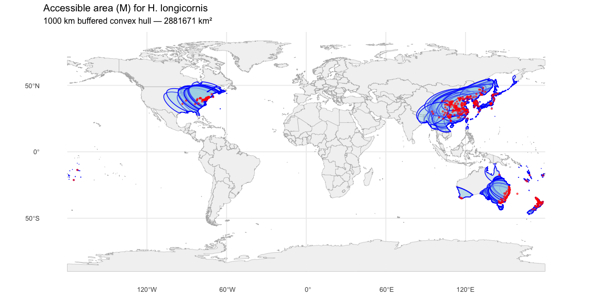
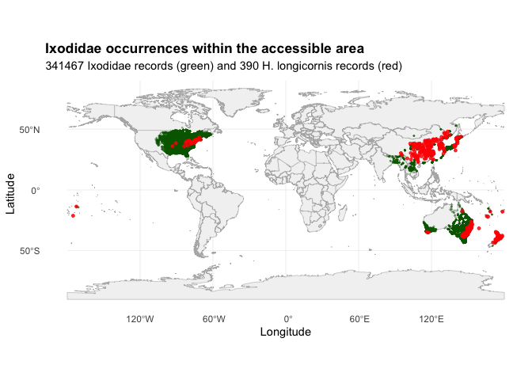
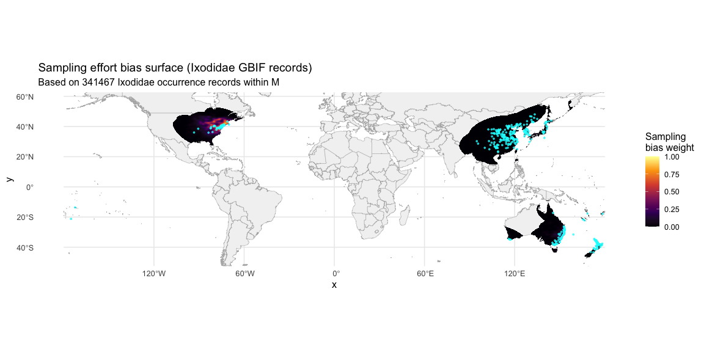
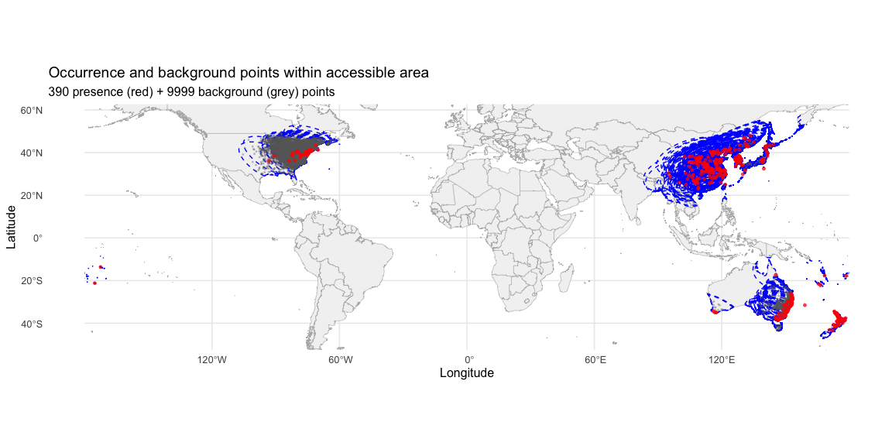
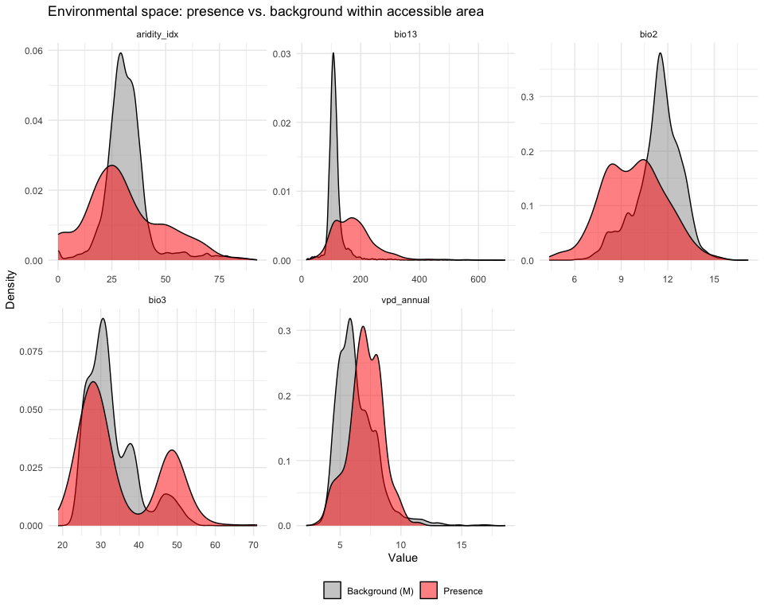

# Step 4: Accessible Area and Background Sampling
Alexander W. Gofton
2026-02-18

- [Overview](#overview)
- [1. Load occurrence data and environmental
  rasters](#1-load-occurrence-data-and-environmental-rasters)
- [2. Define the accessible area (M)](#2-define-the-accessible-area-m)
- [3. Mask environmental rasters to accessible
  area](#3-mask-environmental-rasters-to-accessible-area)
- [4. Target-group bias correction](#4-target-group-bias-correction)
  - [Create bias surface from Ixodidae
    records](#create-bias-surface-from-ixodidae-records)
- [5. Sample background points](#5-sample-background-points)
- [6. Compare background climate with global
  climate](#6-compare-background-climate-with-global-climate)
- [7. Save outputs](#7-save-outputs)
- [Summary](#summary)
- [Session Information](#session-information)

## Overview

This script defines the species’ accessible area (“M”) and generates
background points for MaxEnt modeling. Key changes from v1:

- **Accessible area defined as a 1000 km buffered convex hull** around
  all occurrence points, intersected with land polygons. This replaces
  the v1 approach of sampling background from the entire global land
  surface.
- **Target-group bias correction** using Ixodidae (tick family) GBIF
  records as a proxy for sampling effort. Background points are weighted
  toward areas where ticks have actually been surveyed.
- **10,000 background points** sampled within M, with bias weighting.

These changes address the most critical issue identified in the v1
critique: global background sampling was inflating AUC and distorting
variable importance.

``` r
library(tidyverse)
library(terra)
library(sf)
library(rnaturalearth)
library(rnaturalearthdata)
library(MASS)       # kde2d for bias surface
library(geodata)
```

``` r
base_dir <- "~/Library/CloudStorage/OneDrive-CSIRO/OneDrive - Docs/01_Projects/Hlongicornis_SDM/"
processed_v2 <- file.path(base_dir, "processed_data_2")
figures_dir  <- file.path(base_dir, "figures_2")
outputs_dir  <- file.path(base_dir, "outputs_2")
data_dir     <- file.path(base_dir, "data")
```

## 1. Load occurrence data and environmental rasters

``` r
# Stratified occurrence data from Step 1
occ <- read_csv(file.path(processed_v2, "occurrences_stratified.csv"),
                show_col_types = FALSE)

# Selected environmental raster stack from Step 3
# (only the final selected variables, global extent)

env_selected <- readRDS(file.path(processed_v2, "env_selected_global.rds"))
crs(env_selected) <- "EPSG:4326"  # Ensure consistent CRS
sprintf("Occurrence records: %d", nrow(occ))
sprintf("Environmental layers: %d (%s)", nlyr(env_selected),
        paste(names(env_selected), collapse = ", "))

# After loading
for (i in 1:nlyr(env_selected)) {
  crs(env_selected[[i]]) <- "EPSG:4326"
}
```

    [1] "Occurrence records: 390"
    [1] "Environmental layers: 5 (bio2, bio3, bio13, aridity_idx, vpd_annual)"

## 2. Define the accessible area (M)

Create a convex hull around all occurrence points, buffer by 1000 km,
and intersect with global land polygons to exclude ocean.

The 1000 km buffer was chosen because: - It captures the range of
dispersal pathways (livestock trade, migratory birds) within a
biologically plausible distance from known populations. - It includes
sufficient environmental variation for MaxEnt to distinguish suitable
from unsuitable habitat without being so large that the discrimination
task becomes trivially easy (as in the v1 global approach).

``` r
# Convert occurrence points to sf
occ_sf <- st_as_sf(occ, coords = c("lon", "lat"), crs = 4326)

# Create convex hull around all occurrence points
# We need to combine all points into one geometry first
occ_combined <- st_union(occ_sf)
convex_hull <- st_convex_hull(occ_sf)

# Buffer by 1000 km
hull_projected <- st_transform(convex_hull, crs = "+proj=moll")
buffer_1000km <- st_buffer(hull_projected, dist = 1000000)  # 1000 km in meters
buffer_wgs84 <- st_transform(buffer_1000km, crs = 4326)

# Make the buffer geometry valid before intersection
buffer_wgs84 <- st_make_valid(buffer_wgs84)

# Get global land polygons and intersect with buffer to exclude ocean
world_land <- ne_countries(scale = "medium", returnclass = "sf") |>
  st_union()  # Dissolve into a single polygon

world_land <- st_make_valid(world_land)

# Use st_intersection with prepared geometries
accessible_area <- st_intersection(buffer_wgs84, world_land)

# Calculate area of the accessible region
area_km2 <- as.numeric(st_area(accessible_area)) / 1e6
sprintf("Accessible area: %.0f km²", area_km2)
```

      [1] "Accessible area: 2881671 km²" "Accessible area: 1971359 km²"
      [3] "Accessible area: 2427028 km²" "Accessible area: 2728813 km²"
      [5] "Accessible area: 2466671 km²" "Accessible area: 2338665 km²"
      [7] "Accessible area: 1893287 km²" "Accessible area: 1439272 km²"
      [9] "Accessible area: 1981596 km²" "Accessible area: 2063519 km²"
     [11] "Accessible area: 3085132 km²" "Accessible area: 2205936 km²"
     [13] "Accessible area: 1387785 km²" "Accessible area: 2444679 km²"
     [15] "Accessible area: 2431990 km²" "Accessible area: 2672353 km²"
     [17] "Accessible area: 3123479 km²" "Accessible area: 651016 km²" 
     [19] "Accessible area: 1177282 km²" "Accessible area: 1055353 km²"
     [21] "Accessible area: 1447569 km²" "Accessible area: 2462523 km²"
     [23] "Accessible area: 2931508 km²" "Accessible area: 2525957 km²"
     [25] "Accessible area: 2824621 km²" "Accessible area: 1908225 km²"
     [27] "Accessible area: 2529911 km²" "Accessible area: 1337539 km²"
     [29] "Accessible area: 1200470 km²" "Accessible area: 1402020 km²"
     [31] "Accessible area: 2031675 km²" "Accessible area: 2511323 km²"
     [33] "Accessible area: 3133179 km²" "Accessible area: 2671931 km²"
     [35] "Accessible area: 2399277 km²" "Accessible area: 421872 km²" 
     [37] "Accessible area: 728918 km²"  "Accessible area: 1741308 km²"
     [39] "Accessible area: 2522596 km²" "Accessible area: 1931812 km²"
     [41] "Accessible area: 1440822 km²" "Accessible area: 451550 km²" 
     [43] "Accessible area: 489066 km²"  "Accessible area: 3053596 km²"
     [45] "Accessible area: 2242923 km²" "Accessible area: 2386724 km²"
     [47] "Accessible area: 1305067 km²" "Accessible area: 2185413 km²"
     [49] "Accessible area: 3133180 km²" "Accessible area: 2632089 km²"
     [51] "Accessible area: 1347563 km²" "Accessible area: 1798660 km²"
     [53] "Accessible area: 504317 km²"  "Accessible area: 2125356 km²"
     [55] "Accessible area: 751664 km²"  "Accessible area: 1435679 km²"
     [57] "Accessible area: 1306188 km²" "Accessible area: 3039024 km²"
     [59] "Accessible area: 2402898 km²" "Accessible area: 3000549 km²"
     [61] "Accessible area: 406709 km²"  "Accessible area: 2974837 km²"
     [63] "Accessible area: 2630423 km²" "Accessible area: 1388086 km²"
     [65] "Accessible area: 425405 km²"  "Accessible area: 1890529 km²"
     [67] "Accessible area: 2659239 km²" "Accessible area: 2756577 km²"
     [69] "Accessible area: 3019690 km²" "Accessible area: 2840507 km²"
     [71] "Accessible area: 2329764 km²" "Accessible area: 3128204 km²"
     [73] "Accessible area: 1414535 km²" "Accessible area: 2375345 km²"
     [75] "Accessible area: 3120138 km²" "Accessible area: 1929997 km²"
     [77] "Accessible area: 1922630 km²" "Accessible area: 574956 km²" 
     [79] "Accessible area: 2710196 km²" "Accessible area: 1312092 km²"
     [81] "Accessible area: 1469975 km²" "Accessible area: 2924742 km²"
     [83] "Accessible area: 2101809 km²" "Accessible area: 2851348 km²"
     [85] "Accessible area: 2966836 km²" "Accessible area: 667582 km²" 
     [87] "Accessible area: 2456543 km²" "Accessible area: 3128862 km²"
     [89] "Accessible area: 3045858 km²" "Accessible area: 2752416 km²"
     [91] "Accessible area: 1131535 km²" "Accessible area: 2538537 km²"
     [93] "Accessible area: 2554012 km²" "Accessible area: 794524 km²" 
     [95] "Accessible area: 2236456 km²" "Accessible area: 3001224 km²"
     [97] "Accessible area: 1506801 km²" "Accessible area: 2859469 km²"
     [99] "Accessible area: 1845469 km²" "Accessible area: 2875048 km²"
    [101] "Accessible area: 2803111 km²" "Accessible area: 1360302 km²"
    [103] "Accessible area: 3133187 km²" "Accessible area: 2100109 km²"
    [105] "Accessible area: 2996096 km²" "Accessible area: 2141911 km²"
    [107] "Accessible area: 385640 km²"  "Accessible area: 3063982 km²"
    [109] "Accessible area: 1843194 km²" "Accessible area: 1348229 km²"
    [111] "Accessible area: 2998943 km²" "Accessible area: 1565106 km²"
    [113] "Accessible area: 3090843 km²" "Accessible area: 3008561 km²"
    [115] "Accessible area: 3026808 km²" "Accessible area: 2903860 km²"
    [117] "Accessible area: 1186041 km²" "Accessible area: 2700067 km²"
    [119] "Accessible area: 1439122 km²" "Accessible area: 1841430 km²"
    [121] "Accessible area: 1163252 km²" "Accessible area: 1320810 km²"
    [123] "Accessible area: 2872536 km²" "Accessible area: 2516766 km²"
    [125] "Accessible area: 2429204 km²" "Accessible area: 2002552 km²"
    [127] "Accessible area: 2306249 km²" "Accessible area: 2513661 km²"
    [129] "Accessible area: 2756248 km²" "Accessible area: 2212650 km²"
    [131] "Accessible area: 3133179 km²" "Accessible area: 2929474 km²"
    [133] "Accessible area: 2904903 km²" "Accessible area: 3057268 km²"
    [135] "Accessible area: 1590399 km²" "Accessible area: 3114361 km²"
    [137] "Accessible area: 1628988 km²" "Accessible area: 3049871 km²"
    [139] "Accessible area: 2983378 km²" "Accessible area: 2766972 km²"
    [141] "Accessible area: 2025432 km²" "Accessible area: 2662040 km²"
    [143] "Accessible area: 2663834 km²" "Accessible area: 2551815 km²"
    [145] "Accessible area: 1993882 km²" "Accessible area: 2443833 km²"
    [147] "Accessible area: 2293747 km²" "Accessible area: 3011214 km²"
    [149] "Accessible area: 2730478 km²" "Accessible area: 409983 km²" 
    [151] "Accessible area: 3035506 km²" "Accessible area: 2471590 km²"
    [153] "Accessible area: 1073560 km²" "Accessible area: 2911376 km²"
    [155] "Accessible area: 523072 km²"  "Accessible area: 1477534 km²"
    [157] "Accessible area: 850896 km²"  "Accessible area: 2737490 km²"
    [159] "Accessible area: 1816016 km²" "Accessible area: 2653238 km²"
    [161] "Accessible area: 2634881 km²" "Accessible area: 1593619 km²"
    [163] "Accessible area: 3030524 km²" "Accessible area: 1827164 km²"
    [165] "Accessible area: 3127774 km²" "Accessible area: 3038981 km²"
    [167] "Accessible area: 3055365 km²" "Accessible area: 2493920 km²"
    [169] "Accessible area: 2426706 km²" "Accessible area: 687515 km²" 
    [171] "Accessible area: 2809800 km²" "Accessible area: 3032194 km²"
    [173] "Accessible area: 1830612 km²" "Accessible area: 343536 km²" 
    [175] "Accessible area: 2104121 km²" "Accessible area: 1632228 km²"
    [177] "Accessible area: 1767685 km²" "Accessible area: 1774809 km²"
    [179] "Accessible area: 1398379 km²" "Accessible area: 3133189 km²"
    [181] "Accessible area: 2271829 km²" "Accessible area: 2725939 km²"
    [183] "Accessible area: 367125 km²"  "Accessible area: 3033974 km²"
    [185] "Accessible area: 1993478 km²" "Accessible area: 1568268 km²"
    [187] "Accessible area: 2814751 km²" "Accessible area: 3132589 km²"
    [189] "Accessible area: 2907295 km²" "Accessible area: 2450707 km²"
    [191] "Accessible area: 263969 km²"  "Accessible area: 2906963 km²"
    [193] "Accessible area: 2929347 km²" "Accessible area: 2496785 km²"
    [195] "Accessible area: 2947158 km²" "Accessible area: 3047747 km²"
    [197] "Accessible area: 2947819 km²" "Accessible area: 3055801 km²"
    [199] "Accessible area: 2402603 km²" "Accessible area: 2954201 km²"
    [201] "Accessible area: 3086783 km²" "Accessible area: 3113059 km²"
    [203] "Accessible area: 2892088 km²" "Accessible area: 1412227 km²"
    [205] "Accessible area: 1813499 km²" "Accessible area: 432421 km²" 
    [207] "Accessible area: 1284252 km²" "Accessible area: 727309 km²" 
    [209] "Accessible area: 2567250 km²" "Accessible area: 2769729 km²"
    [211] "Accessible area: 2045517 km²" "Accessible area: 2885326 km²"
    [213] "Accessible area: 2184739 km²" "Accessible area: 2908321 km²"
    [215] "Accessible area: 1884970 km²" "Accessible area: 1790376 km²"
    [217] "Accessible area: 1949155 km²" "Accessible area: 2006876 km²"
    [219] "Accessible area: 2870851 km²" "Accessible area: 1710200 km²"
    [221] "Accessible area: 1754898 km²" "Accessible area: 1923700 km²"
    [223] "Accessible area: 2317992 km²" "Accessible area: 1427463 km²"
    [225] "Accessible area: 2324596 km²" "Accessible area: 1659039 km²"
    [227] "Accessible area: 1644098 km²" "Accessible area: 1861653 km²"
    [229] "Accessible area: 1846472 km²" "Accessible area: 1701239 km²"
    [231] "Accessible area: 2313086 km²" "Accessible area: 2094661 km²"
    [233] "Accessible area: 2320869 km²" "Accessible area: 1728097 km²"
    [235] "Accessible area: 1844129 km²" "Accessible area: 1804318 km²"
    [237] "Accessible area: 2229702 km²" "Accessible area: 3062789 km²"
    [239] "Accessible area: 1785878 km²" "Accessible area: 1771932 km²"
    [241] "Accessible area: 1980431 km²" "Accessible area: 1993193 km²"
    [243] "Accessible area: 1656974 km²" "Accessible area: 1864064 km²"
    [245] "Accessible area: 1789350 km²" "Accessible area: 1681989 km²"
    [247] "Accessible area: 1715200 km²" "Accessible area: 2452596 km²"
    [249] "Accessible area: 1810348 km²" "Accessible area: 1808976 km²"
    [251] "Accessible area: 1735145 km²" "Accessible area: 1660846 km²"
    [253] "Accessible area: 1801925 km²" "Accessible area: 1908393 km²"
    [255] "Accessible area: 1820353 km²" "Accessible area: 1745727 km²"
    [257] "Accessible area: 2399988 km²" "Accessible area: 2418518 km²"
    [259] "Accessible area: 1866873 km²" "Accessible area: 2000307 km²"
    [261] "Accessible area: 1732976 km²" "Accessible area: 1762130 km²"
    [263] "Accessible area: 1751759 km²" "Accessible area: 1967838 km²"
    [265] "Accessible area: 1732780 km²" "Accessible area: 1738458 km²"
    [267] "Accessible area: 1752797 km²" "Accessible area: 1781830 km²"
    [269] "Accessible area: 1447736 km²" "Accessible area: 1525614 km²"
    [271] "Accessible area: 1792974 km²" "Accessible area: 1579667 km²"
    [273] "Accessible area: 1460825 km²" "Accessible area: 1581277 km²"
    [275] "Accessible area: 1435184 km²" "Accessible area: 1424190 km²"
    [277] "Accessible area: 130190 km²"  "Accessible area: 138630 km²" 
    [279] "Accessible area: 3712 km²"    "Accessible area: 3849 km²"   
    [281] "Accessible area: 546781 km²"  "Accessible area: 525629 km²" 
    [283] "Accessible area: 558841 km²"  "Accessible area: 1363837 km²"
    [285] "Accessible area: 1223989 km²" "Accessible area: 1140515 km²"
    [287] "Accessible area: 1076707 km²" "Accessible area: 1099862 km²"
    [289] "Accessible area: 1195259 km²" "Accessible area: 1527802 km²"
    [291] "Accessible area: 1258574 km²" "Accessible area: 1234315 km²"
    [293] "Accessible area: 1221315 km²" "Accessible area: 1521430 km²"
    [295] "Accessible area: 1260055 km²" "Accessible area: 1406113 km²"
    [297] "Accessible area: 1377544 km²" "Accessible area: 1784788 km²"
    [299] "Accessible area: 1545418 km²" "Accessible area: 1488755 km²"
    [301] "Accessible area: 1483152 km²" "Accessible area: 1296855 km²"
    [303] "Accessible area: 1464914 km²" "Accessible area: 1453368 km²"
    [305] "Accessible area: 1307119 km²" "Accessible area: 1440115 km²"
    [307] "Accessible area: 1436824 km²" "Accessible area: 1269101 km²"
    [309] "Accessible area: 1331975 km²" "Accessible area: 1316129 km²"
    [311] "Accessible area: 1304902 km²" "Accessible area: 29371 km²"  
    [313] "Accessible area: 28721 km²"   "Accessible area: 45729 km²"  
    [315] "Accessible area: 180983 km²"  "Accessible area: 211198 km²" 
    [317] "Accessible area: 212578 km²"  "Accessible area: 111369 km²" 
    [319] "Accessible area: 213529 km²"  "Accessible area: 117471 km²" 
    [321] "Accessible area: 213439 km²"  "Accessible area: 116051 km²" 
    [323] "Accessible area: 114667 km²"  "Accessible area: 125055 km²" 
    [325] "Accessible area: 212572 km²"  "Accessible area: 121409 km²" 
    [327] "Accessible area: 114904 km²"  "Accessible area: 174466 km²" 
    [329] "Accessible area: 176904 km²"  "Accessible area: 124188 km²" 
    [331] "Accessible area: 181385 km²"  "Accessible area: 135710 km²" 
    [333] "Accessible area: 127351 km²"  "Accessible area: 162623 km²" 
    [335] "Accessible area: 168783 km²"  "Accessible area: 180882 km²" 
    [337] "Accessible area: 194770 km²"  "Accessible area: 193084 km²" 
    [339] "Accessible area: 130267 km²"  "Accessible area: 152456 km²" 
    [341] "Accessible area: 145574 km²"  "Accessible area: 141331 km²" 
    [343] "Accessible area: 147594 km²"  "Accessible area: 154310 km²" 
    [345] "Accessible area: 138665 km²"  "Accessible area: 144474 km²" 
    [347] "Accessible area: 139669 km²"  "Accessible area: 135016 km²" 
    [349] "Accessible area: 138560 km²"  "Accessible area: 119007 km²" 
    [351] "Accessible area: 19729 km²"   "Accessible area: 1406925 km²"
    [353] "Accessible area: 1556339 km²" "Accessible area: 1464996 km²"
    [355] "Accessible area: 1343270 km²" "Accessible area: 149558 km²" 
    [357] "Accessible area: 1439819 km²" "Accessible area: 133668 km²" 
    [359] "Accessible area: 1419765 km²" "Accessible area: 1558490 km²"
    [361] "Accessible area: 147615 km²"  "Accessible area: 168360 km²" 
    [363] "Accessible area: 1139980 km²" "Accessible area: 143575 km²" 
    [365] "Accessible area: 137880 km²"  "Accessible area: 115789 km²" 
    [367] "Accessible area: 193244 km²"  "Accessible area: 1419350 km²"
    [369] "Accessible area: 1612660 km²" "Accessible area: 1571715 km²"
    [371] "Accessible area: 1471689 km²" "Accessible area: 1395238 km²"
    [373] "Accessible area: 1543157 km²" "Accessible area: 132561 km²" 
    [375] "Accessible area: 1776181 km²" "Accessible area: 1914543 km²"
    [377] "Accessible area: 1598965 km²" "Accessible area: 1664088 km²"
    [379] "Accessible area: 133715 km²"  "Accessible area: 1530373 km²"
    [381] "Accessible area: 1558267 km²" "Accessible area: 1576480 km²"
    [383] "Accessible area: 648864 km²"  "Accessible area: 1421845 km²"
    [385] "Accessible area: 1541336 km²" "Accessible area: 1344373 km²"
    [387] "Accessible area: 1335772 km²" "Accessible area: 1546835 km²"
    [389] "Accessible area: 1693567 km²" "Accessible area: 3047718 km²"

``` r
world_map <- ne_countries(scale = "medium", returnclass = "sf")

ggplot() +
  geom_sf(data = world_map, fill = "grey95", colour = "grey70", linewidth = 0.2) +
  geom_sf(data = accessible_area, fill = "lightblue", alpha = 0.3,
          colour = "blue", linewidth = 0.5) +
  geom_sf(data = occ_sf, colour = "red", size = 0.8, alpha = 0.6) +
  labs(
    title = "Accessible area (M) for H. longicornis",
    subtitle = sprintf("1000 km buffered convex hull — %.0f km²", area_km2)
  ) +
  theme_minimal(base_size = 12)

ggsave(file.path(figures_dir, "04_accessible_area_map.png"),
       width = 12, height = 6, dpi = 300)
```

<div id="fig-accessible-area">



Figure 1: Accessible area (M) defined as a 1000 km buffered convex hull
around occurrence points, clipped to land.

</div>

## 3. Mask environmental rasters to accessible area

Crop and mask the environmental stack to the accessible area so that
background points are only sampled from within M.

``` r
# Convert accessible area sf to a terra SpatVector for masking
accessible_vect <- vect(accessible_area)

# Crop and mask the environmental rasters to the accessible area
env_M <- crop(env_selected, accessible_vect)
env_M <- mask(env_M, accessible_vect)

# Check how many valid (non-NA) cells exist within M
n_cells <- global(!is.na(env_M[[1]]), sum)[[1]]
sprintf("Valid raster cells within accessible area: %.0f", n_cells)
```


    |---------|---------|---------|---------|
    =========================================
                                              

    |---------|---------|---------|---------|
    =========================================
                                              
    [1] "Valid raster cells within accessible area: 1277489"

## 4. Target-group bias correction

Download Ixodidae (tick family) occurrence records from GBIF within the
accessible area. These records represent “where people have looked for
ticks” and serve as a proxy for sampling effort. We then create a kernel
density surface from these records and use it to weight background point
sampling.

This ensures the model compares tick presence against what’s available
in places people have actually surveyed, rather than random landscape.

``` r
ixodidae_all <- read.csv(
  paste0(
    data_dir,
    "/Ixodidae_background_points/0023290-260208012135463.csv"
  ),
  sep = "\t"
) |>
  dplyr::filter(!is.na(decimalLongitude), !is.na(decimalLatitude)) |>
  dplyr::select(lon = decimalLongitude, lat = decimalLatitude) |>
  dplyr::distinct()
```

``` r
# Simplifying Ixodidae records
# Split the accessible area into individual polygons
aa_parts <- st_cast(accessible_area, "POLYGON")

# Step 1: Thin to ~1 point per 0.1° grid cell (~10 km)
# This is fine because we only need a smooth KDE bias surface,
# not exact point locations.
ixodidae_thinned <- ixodidae_all %>%
  mutate(
    lon_bin = round(lon, 1),
    lat_bin = round(lat, 1)
  ) %>%
  distinct(lon_bin, lat_bin, .keep_all = TRUE) %>%
  dplyr::select(lon, lat)

sprintf("After spatial thinning (0.1°): %d of %d points",
        nrow(ixodidae_thinned), nrow(ixodidae_all))
```

    [1] "After spatial thinning (0.1°): 31173 of 78204 points"

``` r
# Step 2: Pre-filter by the union of per-polygon bounding boxes
# (much tighter than a single global bbox)
keep <- rep(FALSE, nrow(ixodidae_thinned))

for (k in seq_len(nrow(aa_parts))) {
  bb <- st_bbox(aa_parts[k, ])
  in_bb <- ixodidae_thinned$lon >= bb["xmin"] &
           ixodidae_thinned$lon <= bb["xmax"] &
           ixodidae_thinned$lat >= bb["ymin"] &
           ixodidae_thinned$lat <= bb["ymax"]
  keep <- keep | in_bb
}

ixodidae_bbox <- ixodidae_thinned[keep, ]
sprintf("After per-polygon bbox filter: %d points", nrow(ixodidae_bbox))
```

    [1] "After per-polygon bbox filter: 12754 points"

``` r
# Step 3: Now the precise intersection is fast
ixodidae_sf <- st_as_sf(ixodidae_bbox, coords = c("lon", "lat"), crs = 4326)
ixodidae_in_AA <- st_intersection(ixodidae_sf, accessible_area)

coords <- st_coordinates(ixodidae_in_AA)
ixodidae_points <- tibble(lon = coords[, 1], lat = coords[, 2])

sprintf("Final Ixodidae bias points within M: %d", nrow(ixodidae_points))

# Cache for future runs
write_csv(ixodidae_points, paste0(processed_v2, "/ixodidae_points.csv"))
```

    [1] "Final Ixodidae bias points within M: 341467"

``` r
# Create a map of Ixodidae occurrences
ggplot() +
  # Base map
  geom_sf(data = world_map, fill = "grey95", color = "grey70", linewidth = 0.2) +
  # Ixodidae points - convert regular coordinates to points
  geom_point(data = ixodidae_points,
             aes(x = lon, y = lat),
             color = "darkgreen", size = 0.3, alpha = 0.3) +
  # Add H. longicornis occurrence points for reference
  geom_sf(data = occ_sf, color = "red", size = 1, alpha = 0.8) +
  # Add labels and title
  labs(
    title = "Ixodidae occurrences within the accessible area",
    subtitle = sprintf("%d Ixodidae records (green) and %d H. longicornis records (red)",
                      nrow(ixodidae_points), nrow(occ_sf)),
    x = "Longitude",
    y = "Latitude"
  ) +
  # Apply minimal theme
  theme_minimal() +
  theme(
    plot.title = element_text(face = "bold"),
    panel.grid.major = element_line(color = "grey90", linewidth = 0.2)
  )
```



### Create bias surface from Ixodidae records

``` r
# Create a 2D kernel density estimate from Ixodidae records
# This produces a smooth surface representing sampling effort
# We'll rasterize this to match our environmental grid

# Use the extent of the environmental raster within M
ext_M <- ext(env_M)

# Create the KDE using MASS::kde2d
# n = number of grid points in each direction (match raster resolution roughly)
kde_result <- kde2d(
  x = ixodidae_points$lon,
  y = ixodidae_points$lat,
  n = 200,  # grid resolution for KDE
  lims = c(ext_M[1], ext_M[2], ext_M[3], ext_M[4])
)

# Convert KDE result to a SpatRaster
bias_rast <- rast(
  list(
    x = kde_result$x,
    y = kde_result$y,
    z = kde_result$z
  )
)
crs(bias_rast) <- "EPSG:4326"

# Resample to match the environmental grid exactly
bias_resampled <- resample(bias_rast, env_M[[1]], method = "bilinear")

# Mask to M (set ocean/outside-M cells to NA)
bias_resampled <- mask(bias_resampled, env_M[[1]])

# Add a small floor value so cells with zero bias density still have
# a non-zero chance of being selected (avoids excluding entire regions)
floor_val <- global(bias_resampled, quantile, probs = 0.01, na.rm = TRUE)[[1]]
bias_resampled <- max(bias_resampled, floor_val)

# Normalise to [0, 1] for use as sampling weights
bias_min <- global(bias_resampled, min, na.rm = TRUE)[[1]]
bias_max <- global(bias_resampled, max, na.rm = TRUE)[[1]]
bias_weights <- (bias_resampled - bias_min) / (bias_max - bias_min)

names(bias_weights) <- "bias_weight"

sprintf("Bias surface created: %.4f to %.4f (normalised)",
        global(bias_weights, min, na.rm = TRUE)[[1]],
        global(bias_weights, max, na.rm = TRUE)[[1]])
```

    [1] "Bias surface created: 0.0000 to 1.0000 (normalised)"

``` r
# Convert bias surface to a data frame for ggplot
bias_df <- as.data.frame(bias_weights, xy = TRUE) |>
  filter(!is.na(bias_weight))

ggplot() +
  geom_sf(data = world_map, fill = "grey95", colour = "grey70", linewidth = 0.2) +
  geom_raster(data = bias_df, aes(x = x, y = y, fill = bias_weight)) +
  scale_fill_viridis_c(name = "Sampling\nbias weight", option = "inferno") +
  geom_sf(data = occ_sf, colour = "cyan", size = 0.6, alpha = 0.7) +
  coord_sf(xlim = c(ext_M[1], ext_M[2]), ylim = c(ext_M[3], ext_M[4])) +
  labs(
    title = "Sampling effort bias surface (Ixodidae GBIF records)",
    subtitle = sprintf("Based on %d Ixodidae occurrence records within M",
                       nrow(ixodidae_points))
  ) +
  theme_minimal(base_size = 12) +
  theme(legend.position = "right")

ggsave(file.path(figures_dir, "04_bias_surface.png"),
       width = 12, height = 6, dpi = 300)
```

<div id="fig-bias-surface">



Figure 2: Sampling bias surface derived from Ixodidae GBIF records
(kernel density).

</div>

## 5. Sample background points

Generate 10,000 random background points within the accessible area,
weighted by the bias surface so that well-surveyed areas receive
proportionally more background points.

``` r
set.seed(7990)

n_bg <- 10000

# --- Bias-weighted background sampling ---
# 1. Get all valid (non-NA) cell indices and their coordinates
valid_cells <- which(!is.na(values(env_M[[1]])))
cell_coords <- xyFromCell(env_M, valid_cells)

# 2. Extract bias weights for valid cells
bias_vals <- values(bias_weights)[valid_cells]
bias_vals[is.na(bias_vals) | bias_vals <= 0] <- 1e-6  # floor at near-zero

# 3. Sample cell indices weighted by bias surface
sampled_idx <- sample(
  seq_along(valid_cells),
  size = n_bg,
  replace = FALSE,
  prob = bias_vals
)

# 4. Extract environmental values at sampled cells
sampled_cells <- valid_cells[sampled_idx]
bg_values <- extract(env_M, sampled_cells)

bg_points <- as.data.frame(cell_coords[sampled_idx, ]) |>
  rename(lon = x, lat = y) |>
  bind_cols(bg_values |> dplyr::select(-any_of("ID"))) |>
  filter(complete.cases(pick(everything())))

sprintf("Background points generated: %d", nrow(bg_points))
```

    [1] "Background points generated: 9999"

``` r
ggplot() +
  geom_sf(data = world_map, fill = "grey95", colour = "grey70", linewidth = 0.2) +
  geom_sf(data = accessible_area, fill = NA, colour = "blue",
          linewidth = 0.5, linetype = "dashed") +
  geom_point(data = bg_points, aes(x = lon, y = lat),
             colour = "grey40", size = 0.3, alpha = 0.3) +
  geom_sf(data = occ_sf, colour = "red", size = 1, alpha = 0.7) +
  coord_sf(xlim = c(ext_M[1], ext_M[2]), ylim = c(ext_M[3], ext_M[4])) +
  labs(
    title = "Occurrence and background points within accessible area",
    subtitle = sprintf("%d presence (red) + %d background (grey) points",
                       nrow(occ), nrow(bg_points)),
    x = "Longitude", y = "Latitude"
  ) +
  theme_minimal(base_size = 12)

ggsave(file.path(figures_dir, "04_occurrence_background_map.png"),
       width = 12, height = 6, dpi = 300)
```

<div id="fig-background-points">



Figure 3: Background points (n = 10,000) sampled within the accessible
area with bias correction.

</div>

## 6. Compare background climate with global climate

Verify that the restricted background captures the relevant
environmental gradients without spanning the entire global climate
space.

``` r
# Get climate values at occurrence points
occ_climate <- read_csv(
  file.path(processed_v2, "occurrences_selected_vars.csv"),
  show_col_types = FALSE
)

# bg_points already has environmental values from spatSample(..., values = TRUE)
bg_climate <- bg_points |>
  dplyr::select(-lon, -lat) |>
  filter(complete.cases(pick(everything())))

# Get matching variable names that exist in both datasets
selected_vars <- intersect(names(bg_climate), names(occ_climate))

# Subset occurrence climate data with the correct variables - use direct column selection
occ_climate_sub <- occ_climate[, selected_vars, drop = FALSE]

# Combine for plotting
bg_long <- bg_climate |>
  pivot_longer(cols = selected_vars, names_to = "variable", values_to = "value") |>
  mutate(source = "Background (M)")

occ_long <- occ_climate_sub |>
  pivot_longer(cols = selected_vars, names_to = "variable", values_to = "value") |>
  mutate(source = "Presence")

climate_comparison <- bind_rows(bg_long, occ_long)

ggplot(climate_comparison, aes(x = value, fill = source)) +
  geom_density(alpha = 0.5) +
  facet_wrap(~variable, scales = "free", ncol = 3) +
  scale_fill_manual(values = c("Background (M)" = "grey60", "Presence" = "red")) +
  labs(
    title = "Environmental space: presence vs. background within accessible area",
    x = "Value", y = "Density", fill = NULL
  ) +
  theme_minimal(base_size = 11) +
  theme(legend.position = "bottom")
```

<div id="fig-climate-comparison">



Figure 4: Climate space comparison: presence points vs. background
within M.

</div>

## 7. Save outputs

``` r
# Save the accessible area polygon
st_write(accessible_area,
         file.path(processed_v2, "accessible_area_M.gpkg"),
         delete_dsn = TRUE, quiet = TRUE)

# Save the bias surface raster
writeRaster(bias_weights,
            file.path(processed_v2, "bias_surface.tif"),
            overwrite = TRUE)

# Save the environmental stack cropped to M
writeRaster(env_M,
            file.path(processed_v2, "env_selected_M.tif"),
            overwrite = TRUE)
saveRDS(env_M, file.path(processed_v2, "env_selected_M.rds"))

# Save background points with climate values
write_csv(bg_points, file.path(processed_v2, "background_points.csv"))

# Save occurrence coordinates as a simple lon/lat dataframe
# (needed by ENMeval in Step 5)
occ_coords <- occ #|> select(lon, lat)
write_csv(occ_coords, file.path(processed_v2, "occurrence_coords.csv"))

# Save background coordinates
bg_coords <- bg_points #|> dplyr::select(lon, lat)
write_csv(bg_coords, file.path(processed_v2, "background_coords.csv"))

sprintf("Saved accessible area polygon, bias surface, %d background points",
        nrow(bg_points))
```

    [1] "Saved accessible area polygon, bias surface, 9999 background points"

## Summary

``` r
tibble(
  Item = c(
    "Accessible area (M)",
    "Buffer distance",
    "Area of M",
    "Bias correction source",
    "Ixodidae records for bias",
    "Background points",
    "Occurrence points",
    "Environmental variables"
  ),
  Value = c(
    "Convex hull + buffer, clipped to land",
    "1000 km",
    sprintf("%.0f km²", sum(area_km2)),  # Sum the area values
    "Ixodidae GBIF records (target-group)",
    as.character(nrow(ixodidae_points)),
    as.character(nrow(bg_points)),
    as.character(nrow(occ)),
    paste(names(env_selected), collapse = ", ")
  )
)
```

    # A tibble: 8 × 2
      Item                      Value                                     
      <chr>                     <chr>                                     
    1 Accessible area (M)       Convex hull + buffer, clipped to land     
    2 Buffer distance           1000 km                                   
    3 Area of M                 674893055 km²                             
    4 Bias correction source    Ixodidae GBIF records (target-group)      
    5 Ixodidae records for bias 341467                                    
    6 Background points         9999                                      
    7 Occurrence points         390                                       
    8 Environmental variables   bio2, bio3, bio13, aridity_idx, vpd_annual

## Session Information

``` r
sessionInfo()
```

    R version 4.4.1 (2024-06-14)
    Platform: aarch64-apple-darwin20
    Running under: macOS 26.2

    Matrix products: default
    BLAS:   /Library/Frameworks/R.framework/Versions/4.4-arm64/Resources/lib/libRblas.0.dylib 
    LAPACK: /Library/Frameworks/R.framework/Versions/4.4-arm64/Resources/lib/libRlapack.dylib;  LAPACK version 3.12.0

    locale:
    [1] en_US.UTF-8/en_US.UTF-8/en_US.UTF-8/C/en_US.UTF-8/en_US.UTF-8

    time zone: Australia/Brisbane
    tzcode source: internal

    attached base packages:
    [1] stats     graphics  grDevices utils     datasets  methods   base     

    other attached packages:
     [1] geodata_0.6-2           MASS_7.3-65             rnaturalearthdata_1.0.0
     [4] rnaturalearth_1.1.0     sf_1.0-21               terra_1.8-93           
     [7] lubridate_1.9.4         forcats_1.0.0           stringr_1.5.1          
    [10] dplyr_1.1.4             purrr_1.1.0             readr_2.1.5            
    [13] tidyr_1.3.1             tibble_3.3.0            ggplot2_4.0.0          
    [16] tidyverse_2.0.0        

    loaded via a namespace (and not attached):
     [1] gtable_0.3.6       xfun_0.53          tzdb_0.5.0         vctrs_0.6.5       
     [5] tools_4.4.1        generics_0.1.4     parallel_4.4.1     proxy_0.4-27      
     [9] pkgconfig_2.0.3    KernSmooth_2.23-26 RColorBrewer_1.1-3 S7_0.2.0          
    [13] lifecycle_1.0.4    compiler_4.4.1     farver_2.1.2       textshaping_1.0.3 
    [17] codetools_0.2-20   htmltools_0.5.8.1  class_7.3-23       yaml_2.3.10       
    [21] pillar_1.11.0      crayon_1.5.3       classInt_0.4-11    wk_0.9.4          
    [25] tidyselect_1.2.1   digest_0.6.37      stringi_1.8.7      labeling_0.4.3    
    [29] fastmap_1.2.0      grid_4.4.1         archive_1.1.12.1   cli_3.6.5         
    [33] magrittr_2.0.3     utf8_1.2.6         e1071_1.7-16       withr_3.0.2       
    [37] scales_1.4.0       bit64_4.6.0-1      timechange_0.3.0   rmarkdown_2.29    
    [41] bit_4.6.0          ragg_1.5.0         hms_1.1.3          evaluate_1.0.5    
    [45] knitr_1.50         viridisLite_0.4.2  s2_1.1.9           rlang_1.1.6       
    [49] Rcpp_1.1.0         glue_1.8.0         DBI_1.2.3          vroom_1.6.5       
    [53] jsonlite_2.0.0     R6_2.6.1           systemfonts_1.2.3  units_0.8-7       
